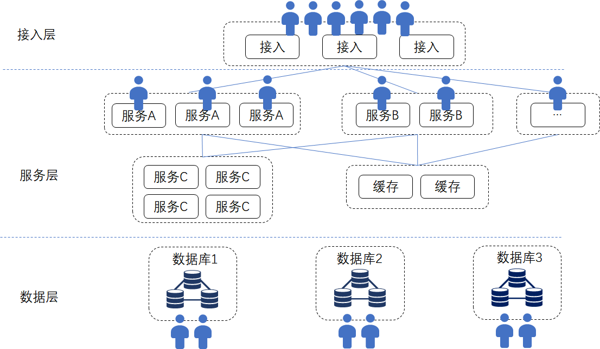
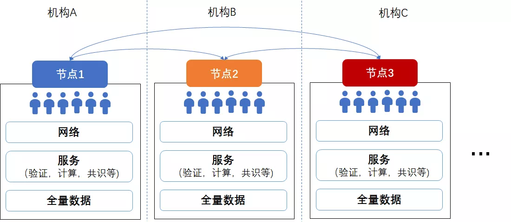

# 反常理，反直觉，区块链是怎样的一种“分布式系统”

作者：张开翔｜FISCO BCOS 首席架构师

我们经常看到“区块链是分布式系统”的说法，并推论出区块链先天具备分布式系统的优势，仿佛作为分布式系统，规模就该足够大，数据就该足够分散。
事实上，典型区块链有很多特征和常见的分布式系统不同，甚至是相悖的，为此，区块链曾被戏称为“最慢的分布式数据库”。
**其实区块链之所以难以理解，其中一个原因是其设计哲学的“反常理、反直觉”**。笔者本人曾多年在互联网海量服务领域里踩坑，然后转向区块链领域深入研究，也经历过一阵子的观念切换期。

本文不打算全面讲述分布式系统原理和历史，那能写几本书。这里打算从常见的、被人广泛认知的互联网分布式系统出发，聊聊“分布式系统”和区块链有什么异同，对技术和设计的要求有哪些路径分支。

经典的分布式著作《分布式系统概念与设计》中，对“分布式系统”给出的定义其实很笼统：**分布式系统是一个硬件或软件组件分布在不同的网络计算机上，彼此之间仅仅通过消息传递进行通信和协调的系统。**

简而言之，只要不是运行在一台机器上或一个进程里的系统，都可以是分布式系统。
比如，大型网站、APP、全民IM社交软件的支撑系统，基于X86体系的新型金融基础设施，都可以是分布式系统。
至于这个分布式系统是属于一个机构的，还是属于多个不同机构维护的，并不是这个定义的重点。

## 互联网海量服务系统之道

提示：已经比较熟悉互联网海量设计的读者，可以直接跳过本节

如果要求一个互联网服务的架构师，在面对山呼海啸的请求量、保存无限增长的数据的同时，提供良好的用户体验，保证延时很短的响应表现，这位架构师脑子里蹦出来的通常是“分层设计”、“冷热分离”、“平行扩展”、“并行处理”、“分库分表”等等关键字。
互联网海量服务的架构通常是分层的，比如接入层、服务层、数据层等。在接入层根据各种策略进行负载均衡和灵活的路由分发，服务可以按功能分组。比如：
用户要改个人资料，请求发给资料服务；
用户浏览网页，请求查询服务吐数据；
用户要发帖了，转给内容服务；
用户要下单，该交易服务器接手了，每个服务只处理一部分业务逻辑，互相之间通过远程接口互相调用，且本身通常是“无状态”的，不受自身和其他服务处理状态的牵制，这种高内聚和松耦合的设计，利于针对不同服务的特性和负载，进行特定优化和灵活部署；
最后，数据存储是“分片”的，俗称“分库分表”，根据用户标识、业务类型等规则，将数据分摊在不同的数据库实例中，每个数据库实例上只有“部分”数据，仅仅是数据的“子集”。

以UGC、社交、富文本、视频内容为主的互联网服务，对“交易事务性”要求并不那么强，其“分布式”更多的是追求将计算和数据均匀分散在多台服务器上，利用更多的CPU、更大的带宽、更大的内存、更大的磁盘空间来处理请求。
一组服务器不够了，立刻增加一组，平行扩容和多活特性表现得淋漓尽致。整个体系会有一些主备和冗余，更多是为了满足服务质量、可用性、备份方面的要求。
电商以及一些和金融、支付相关的流程会强调ACID事务性，采用的分布式一致性算法，如Raft、Paxos等，主要是追求多模块之间的最终一致性和系统稳定性。

毕竟在同一个机构里的系统，对抗欺诈的要求并不会太苛刻，而且可以根据特定的业务流程将交易分类，将单个事务控制在有限的范围内（如只有用户向商户单向转账），事务和事务之间进行清晰地隔离，这样也比较容易进行平行扩展。

如上图所示，一个典型的多层结构的互联网服务，模块众多，计算和存储分布都比较均匀，哪个模块成为瓶颈，就去增加哪个模块的硬件资源，进行业务路由配置和必要的数据迁移就是了。

像分布式数据库、大数据集群、或者BT网络、CDN这些“分布式系统”，大多也是遵循“**将用户和数据分散到不同的物理设备上**”这个原则，达到简单的“堆硬件”即可平行扩展的效果。
硬件越多，技术上的“规模效应”越显著，即存储量更大、计算能力更强、总带宽越多，能服务的用户就越多。
最重要的是，整个服务大部分是在同一个机构里，由同一个公司的团队维护，服务和服务之间并不需要解决“信任”的问题，默认信任其他服务的接口给出的结果，简单校验后立刻继续处理，整个系统就是要“快”，要“稳”。
如果有一些合作类的接口暴露给外部公司，只需要确保接口层的性能、安全、稳定，以及满足合作规则即可。

## “带着锁链跳舞”的区块链

再看区块链，首先**整个网络并不是只有一个机构参与，节点都可能归属不同的机构**，大家一起共同维护网络，共同对交易达成共识。
区块链的使命是突破机构边界，解决机构之间的信任和博弈问题，如果只在一个机构内“家养”一个区块链系统，固然可以运作，但收效未必最佳。
区块链体系里，为了保证数据可追溯和可验证，避免少数节点篡改数据影响全网，**每个节点保存全部数据**，而不是像互联网服务这样“分库分表”。

让我们算一下，如果有一千万个用户，在互联网系统里分成10个数据库实例保存，则每个数据库实例只保存100万用户的数据。
即使每个数据库实例都是“一主两备”，那么总的数据开销也只是原始数据的3倍。
而经典的区块链设计是，每个节点都如数保存一千万用户的所有数据，且全网节点越多，保存的数据副本就越多。
如全网有100个节点，则全网总的数据存储开销是原始数据的100倍；如有200个节点，全网总的数据存储则达到原始数据的200倍……以此类推，挺触目惊心。
极端情况下，如果把整个地球的数据都上链，链上有1万个节点，那么相当于我们有了1万个地球......然而我们并没有这么多资源吧。

区块链的数据结构本身也是很有意思的一个环节。区块之间是链式关系，新的区块必须基于旧的区块生成。
智能合约生成状态数据是全局性的，常常用类似帕特里夏树、merkle树这种复杂的数据结构进行维护，以便全网追溯、验证和计算。
数据环环相扣，仿佛“铁板一块”，使得按冷热特征、时间和用户等维度切分数据有相当的挑战性，既要使数据可以分布到不同的存储里，又要保证可以快速访问，保证盘根错节的追溯验证。工程难度很大。

交易层面，在一个互相没有强信任关系的网络里，且处理的是大概率和“价值”有关系的交易，**区块链尤其强调交易的全局事务性，保证全网一致性，且为了避免有作恶节点伪造假数据，所有的交易都会在共识机制和网络同步驱动下，在所有的节点上进行排序、运算和校验。**
在支持智能合约的区块链上，每个智能合约被交易调用时，都会在所有节点上把合约代码跑一遍，以确保在每个节点上生成数据的过程是公认的、运行结果是一致的。

可见，区块链并不能把计算量分摊到不同的服务器上，所有的节点都是“复读机”，这就意味着增加节点，也不会增加全网并行计算能力，就算是全网有一万台计算机，速度也跟只有一台是一样的。
如果把这种区块链称为“世界计算机”，可算是全世界步骤最统一、冗余度最高、速度最慢的世界计算机了。

**区块链系统的核心是共识算法。**

POW挖矿是矿工用算力解一个难题，以争到记账权，再进行记账，并期盼自己的记账结果成为最长链。
POW算法是出了名的又慢又耗电；
POS权益类共识，由一批“富翁”抵押资产以获得记账权，轮流记账，不需要算力竞争，性能表现好一些，但依旧是有轮流打包出块然后全网最终确认的过程；
PBFT（实用性拜占庭）共识，需要记账者多次往返交互，大多数人参与到多阶段的确认，才能达到最终状态。
总的来说，和互联网服务追求的“无状态”不同，共识服务是“有状态”的，每种共识算法都需要参照网络、数据、记账者参与度、链当前状态（如“区块高度”和“共识阶段”）等等多维度的信息进行决策。

记账节点越多，协作成本越高，尤其是典型的PBFT算法，在节点增多时，共识会越来越慢，交易延迟会越来越高。
如果让节点内部也“集群化”，采用“多层分布式架构”，是否可以实现类似互联网海量服务系统这样的可平行扩展呢？比如，将虚拟机改为多实例，并行计算交易，这样就可以解决计算瓶颈问题。
但计算越快，单位时间可以产生的数据越多，这样也要求硬盘存储更多的数据，而硬盘的容量和IO速度是有限的。
同时，计算快了，节点也会向网络广播更多的数据，节点公网互联的带宽通常不会太大，延时一般也比较明显（几十毫秒起）。
于是，节点和节点之间交互又会命中网络速度的瓶颈，共识时延和数据同步时间变长，节点们就像一串绑在绳子上的蚂蚱，谁也蹦不高。由于存储和网络这些硬条件的天花板存在，集群化的计算再快也没有用了。
最后，节点集群化确实可以使以节点为单位的服务处理能力有一定上升，同时也会带来的架构上的额外复杂性和部署运维成本。

还是引用一个数钱的例子：
有一大堆钱让十个人数，有两种方法。
方法一，可以把钱分成十份，每个人数一份，这样很快就数完了，人越多，数得越快，但是如果里面有人数错了，或者甚至偷钱，那就有问题了。
于是，为了资金安全，改成方法二，让一个人整理出一叠钱，先数一遍，然后让其他九个人也数一遍，每个人都验算记账后，再换个人整理出下一叠钱，重复上述节奏去数，这样结果肯定是不会错的，且能得到大家的公认。但参与数钱的人增加，并不会加速计数，反而有可能因为人多手杂导致更慢。
方法一就是常见的互联网分布式系统的做法，方法二是区块链。
可见，目的不同，导致设计哲学、系统结构、最终效果都不同。

## 如何把“好钢用到刀刃上”

综上所述，区块链这种“分布式系统”，存储成本和节点数同比线性增加，而计算效率不升反降，使整个系统显得“贵”和“重”，这和互联网服务的“轻快灵”相背而驰。最要命的是，难以通过增加硬件、带宽、节点数来显著提升并行处理能力和存储量。
但区块链的“网络规模效应”并不体现在硬件和计算上，而是体现在因为“共识”和“信任”上。
区块链通过复杂的算法和博弈，构建了一种可信网络，使得更多人愿意参与到网络里，共同贡献数据和维护网络，体现“协作共赢”这个价值效应。
这样也给我们一个重要启示：既然区块链的计算和存储成本是很高的，其目的是为了达到共识，那么，我们应该让区块链干最该干的事情。

### 1、哪些数据可以“上链”？

**只有多方要在交易过程中用到的、必须共享的关键数据要上链，比如公共账本的账目。**

视频、文件、图片、大规模的业务数据，可以生成摘要与交易数据关联，其本体通过其他渠道（如FTP、分布式文件系统等）进行交换。
比如下棋，只需要把棋局结果放到链上，或者把每一步的数据算个摘要放到链上，并不需要每一步都记录到链上（除非认为这也是非常关键的信息）。
毕竟每一笔放到“链上”的数据，都会占用所有节点的硬盘。

### 2、合约里写什么逻辑？

应该是**写多方共同参与、协作记账、必须全局共识的关键逻辑，而不是牵涉密集计算的逻辑**。
比如，进行复杂查询或建模分析，可以把链上的数据导出来放在链下去做，而不是写在合约里。要清楚，你写的每一行代码，再不是只在自己的服务上跑一次了，而是会在链上所有参与者的节点上跑起来，多写一行代码就会多消耗大家的一点CPU。
所以，区块链上会有类似“Gas上限”这样的机制，来控制合约的代码规模。新一代的合约引擎，更是考虑只提供有限的、可以定制化的商业规则实现，而不是完全的开放式编程。 
作为开发者，是面向“自己的电脑”编程，还是面向“大家的电脑”编程，这就是互联网海量服务系统和区块链最大的不同。
开发者必须切换思维模式，切忌滥用区块链上宝贵的计算、存储、网络资源，避免有意或无意的“公地悲剧”，而是精打细算，从全局权衡，找出协作模式和数据共享里的“最大公约数”，把好钢用到刀刃上。

## 性能也不是什么大问题

区块链的规模化、并发能力，依旧是业界非常关注的研究方向。互联网海量分布式系统的一些思想，对区块链的优化也有很重要的参考意义，包括平行扩展、分库分表、冷热分离、服务集群、负载均衡等等。
现在我们在研究区块链优化时，常常有一种感觉，就是把之前在互联网业里解决经典“C1000K问题（应对百万级的并发量）”的过程再来一遍。
技术优化方案百花齐放，诸如FISCO BCOS的多群组和并行多链架构，基于DAG的交易并发模型，以及行业热议的交易分片、Layer1/2多层网络、链外通道如闪电网络等。
因为要满足区块链苛刻的信任和安全要求，实施这些方案成为“带着锁链跳舞”的艰辛工作。在不远的未来，在力求保证“信任”、“一致性”、“事务性”、“安全”等大前提下，区块链系统也可以具备可观的可扩展性，突破或逼近“不可能三角”的极限并不是梦。

**目前，在保证金融级业务的正确性、稳定性的前提下，FISCO BCOS已经做到在PBFT共识、16个节点规模、采用智能合约实现业务逻辑的条件下，达到单链2万多的TPS（硬件条件比较理想的压测环境）**。
如果开启多群组、多链跨链、点对点通道等模式，更有显著的平行扩展效果，满足当前的业务需求已经没什么问题了，只要有足够的硬件资源投入，进行合理的调度，百万千万TPS也不是梦。

最后总结一下，我们认为区块链是一种特殊的“分布式系统”，要透彻地理解区块链，应该清晰地、就事论事地与其他类型分布式系统进行区分，理清各自的本质和设计哲学，避免混淆和迷惑。
说到底，“分布式系统”本身就是一门博大精深的学科，包罗万象，并不能从一而论，而是有太多的精彩和技术路径需要去学习和发掘。

