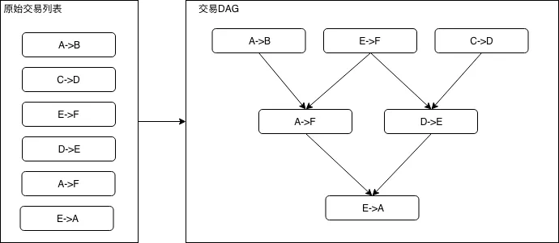
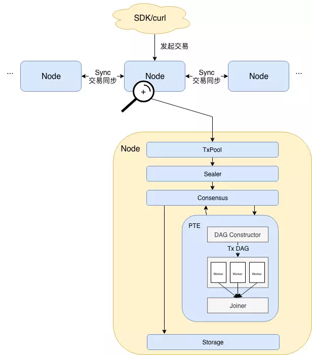
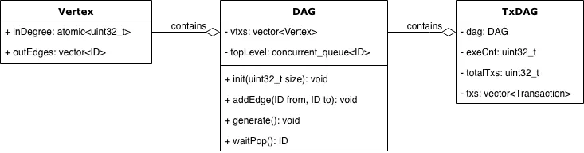
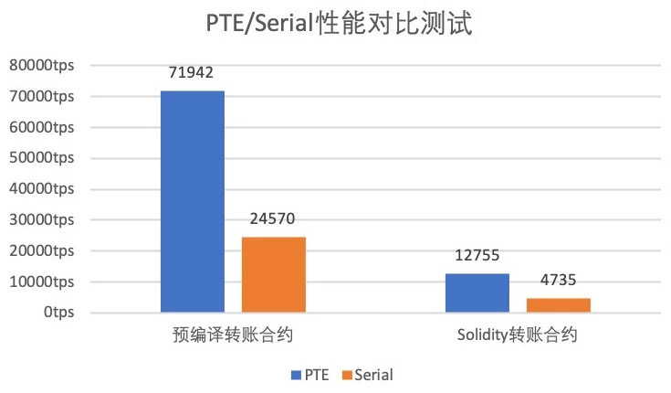
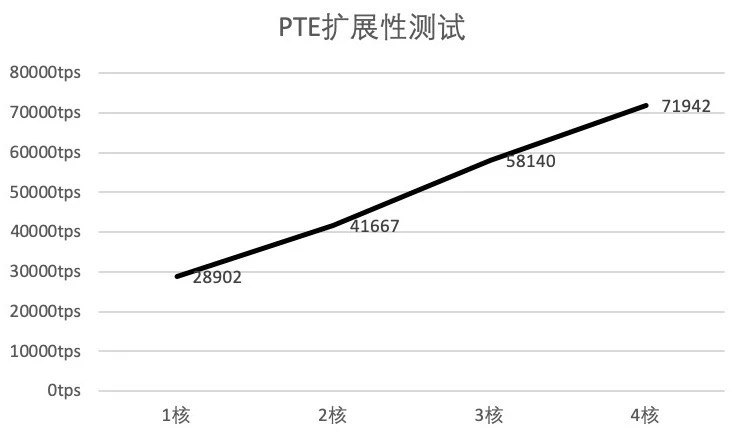

# 区块链性能腾飞：基于DAG的并行交易执行引擎

作者：李陈希｜FISCO BCOS 核心开发者

在区块链世界中，交易是组成事务的基本单元。交易吞吐量很大程度上能限制或拓宽区块链业务的适用场景，愈高的吞吐量，意味着区块链能够支持愈广的适用范围和愈大的用户规模。当前，反映交易吞吐量的TPS（Transaction per Second，每秒交易数量）是评估性能的热点指标。为了提高TPS，业界提出了层出不穷的优化方案，殊途同归，各种优化手段的最终聚焦点，均是尽可能提高交易的并行处理能力，降低交易全流程的处理时间。

在多核处理器架构已经成为主流的今天，利用并行化技术充分挖掘CPU潜力是行之有效的方案。FISCO BCOS 2.0 中设计了一种基于DAG模型的并行交易执行器（PTE，Parallel Transaction Executor）。

PTE能充分发挥多核处理器优势，使区块中的交易能够尽可能并行执行；同时对用户提供简单友好的编程接口，使用户不必关心繁琐的并行实现细节。基准测试程序的实验结果表明：相较于传统的串行交易执行方案，理想状况下4核处理器上运行的PTE能够实现约200%~300%的性能提升，且计算方面的提升跟核数成正比，核数越多性能越高。

PTE为助力FISCO BCOS性能腾飞奠定了坚实基础，本文将全面介绍PTE的设计思路及实现方案，主要包括以下内容：

- **背景**：传统方案的性能瓶颈与DAG并行模型的介绍
- **设计思路**：PTE应用到FISCO BCOS中时遇到的问题以及解决方案
- **架构设计**：应用PTE后FISCO BCOS的架构及核心流程
- **核心算法**：介绍主要用到的数据结构与主要算法
- **性能测评**：分别给出PTE的性能与可扩展性测试结果

## 背景

FISCO BCOS交易处理模块可以被抽象为一个基于交易的状态机。在FISCO BCOS中，『状态』即是指区块链中所有账户的状态，而『基于交易』即是指FISCO BCOS将交易作为状态迁移函数，并根据交易内容从旧的状态更新为新的状态。FISCO BCOS从创世块状态开始，不断收集网络上发生的交易并打包为区块，并在所有参与共识的节点间执行区块中的交易。当一个区块内的交易在多个共识节点上执行完成且状态一致，则我们称在该块上达成了共识，并将该区块永久记录在区块链中。

从上述区块链的打包→共识→存储过程中可以看到，执行区块中的所有交易是区块上链的必经之路。传统交易执行方案是：执行单元从待共识的区块逐条读出交易，执行完每一笔交易后，状态机都会迁移至下一个状态，直到所有交易都被串行执行完成，如下图所示：


显而易见，这种交易执行方式对性能并不友好。即使两笔交易没有交集，也只能按照先后顺序依次执行。就交易间的关系而言，既然一维的『线』结构有这般痛点，那何不把目光投向二维的『图』结构呢？

在实际应用中，根据每笔交易执行时需要使用的互斥资源（互斥意味着对资源的排他性使用，比如在上述转账问题互斥资源中，指的就是各个账户的余额状态）， 我们可以组织出一张交易依赖关系图，为防止交易依赖关系在图中成环，我们可以规定交易列表中牵涉到相同的互斥资源，且排序靠后的交易，必须等待靠前的交易完成后才被执行，由此得到的输出便是一张反映交易依赖关系的有向无环图，即交易DAG。

如下图所示，左侧的6笔转账交易可以组织为右侧的DAG形式：




在交易DAG中，入度为0的交易是没有任何依赖项、可以被立即投入运行的就绪交易。当就绪交易的数量大于1时，就绪交易可以被分散至多个CPU核心上并行执行。当一笔交易执行完，依赖于该交易的所有交易的入度减1，随着交易不断被执行，就绪交易也源源不断被产生。在极限情况下，假如构造出的交易DAG层数为1 （即所有交易均是没有依赖项的独立交易），则交易整体执行速度的提升倍数将直接取决于处理器的核心数量n，此时若n大于区块内的交易数，则区块内所有交易的执行时间与单笔交易执行的时间相同。

理论上拥有如此让人无法拒绝的优美特性的交易DAG模型，该如何应用至FISCO BCOS中？

## 设计思路

**要应用交易DAG模型，我们面临的首要问题便是：对于同一个区块，如何确保所有节点执行完后能够达到同一状态，这是一个关乎到区块链能否正常出块的关键问题。**

FISCO BCOS采用验证(state root, transaction root, receipt root)三元组是否相等的方式，来判断状态是否达成一致。transaction root是根据区块内的所有交易算出的一个哈希值，只要所有共识节点处理的区块数据相同，则transaction root必定相同，这点比较容易保证，因此重点在于如何保证交易执行后生成的state和receipt root也相同。

众所周知，对于在不同CPU核心上并行执行的指令，指令间的执行顺序无法提前预测，并行执行的交易也存在同样情况。在传统的交易执行方案中，每执行一笔交易，state root便发生一次变迁，同时将变迁后的state root写入交易回执中，所有交易执行完后，最终的state root就代表了当前区块链的状态，同时再根据所有交易回执计算出一个receipt root。

可以看出，在传统的执行方案中，state root扮演着一个类似全局共享变量的角色。当交易被并行且乱序执行后，传统计算state root的方式显然不再适用，这是因为在不同的机器上，交易的执行顺序一般不同，此时无法保证最后的state root能够一致，同理，receipt root也无法保证一致。

在FISCO BCOS中，我们采用的解决方案是先执行交易，将每笔交易对状态的改变历史记录下来，待所有交易执行完后，再根据这些历史记录再算出一个state root，同时，交易回执中的state root，也全部变为所有交易执行完后最终的state root，由此就可以保证即使并行执行交易，最后共识节点仍然能够达成一致。

**搞定状态问题后，下一个问题便是：如何判断两笔交易之间是否存在依赖关系？**

若两笔交易本来无依赖关系但被判定为有，则会导致不必要的性能损失；反之，如果这两笔交易会改写同一个账户的状态却被并行执行了，则该账户最后的状态可能是不确定的。因此，依赖关系的判定是影响性能甚至能决定区块链能否正常工作的重要问题。

在简单的转账交易中，我们可以根据转账的发送者和接受者的地址，来判断两笔交易是否有依赖关系，比如如下3笔转账交易：A→B，C→D，D→E，可以很容易看出，交易D→E依赖于交易C→D的结果，但是交易A→B和其他两笔交易没有什么关系，因此可以并行执行。

这种分析在只支持简单转账的区块链中是正确的，但是一旦放到图灵完备、运行智能合约的区块链中，则可能不那么准确，因为我们无法准确知道用户编写的转账合约中到底有什么操作，可能出现的情况是：A->B的交易看似与C、D的账户状态无关，但是在用户的底层实现中，A是特殊账户，通过A账户每转出每一笔钱必须要先从C账户中扣除一定手续费。在这种场景下，3笔交易均有关联，则它们之间无法使用并行的方式执行，若还按照先前的依赖分析方法对交易进行划分，则必定会掉坑。

我们能否做到根据用户的合约内容自动推导出交易中实际存在哪些依赖项？答案是不太靠谱。我们很难去追踪用户合约中到底操作了什么数据，即使做到也需要花费不小的成本，这和我们优化性能的目标相去甚远。

综上，我们决定在FISCO BCOS中，将交易依赖关系的指定工作交给更熟悉合约内容的开发者。具体地说，交易依赖的互斥资源可以由一组字符串表示，FISCO BCOS暴露接口给到开发者，开发者以字符串形式定义交易依赖的资源，告知链上执行器，执行器则会根据开发者指定的交易依赖项，自动将区块中的所有交易排列为交易DAG。比如在简单转账合约中，开发者仅需指定每笔转账交易的依赖项是｛发送者地址+接收者地址｝。进一步地，如开发者在转账逻辑中引入了另一个第三方地址，那么依赖项就需要定义为｛发送者地址+接受者地址+第三方地址｝了。

这种方式实现起来较为直观简单，也比较通用，适用于所有智能合约，但也相应增加了开发者肩上的责任，开发者在指定交易依赖项时必须十分小心，如果依赖项没有写正确，后果无法预料。指定依赖项的相关接口会在后续文章中给出使用教程，本文暂且假定所有谈论到的交易依赖项都是明确无误的。

**解决完上面两个比较重要的问题后，还剩下一些较为细节的工程问题：比如并行交易能否和非并行交易混合到一起执行？怎么保证资源字符串的全局唯一性？**

答案也不复杂，前者可通过将非并行交易作为屏障（barrier）插入到交易DAG中——即我们认为，它即依赖于它的所有前序交易，同时又被它的所有后序交易依赖——来实现；后者可以通过在开发者指定的交易依赖项中，加入标识合约的特殊标志位解决。由于这些问题并不影响PTE的根本设计，本文暂不展开。

万事俱备，带着全新交易执行引擎PTE的FISCO BCOS已经呼之欲出。

## 架构设计

**搭载PTE的FISCO BCOS架构图：**



**整个架构的核心流程如下：**

用户通过SDK等客户端将交易发送至节点，此处的交易既可以是可并行执行的交易，也可以是不能并行执行的交易。随后交易在节点间同步，同时拥有打包权的节点调用打包器（Sealer），从交易池（Tx Pool）中取出一定量交易并将其打包成一个区块。此后，区块被发送至共识单元（Consensus）准备进行节点间共识。

共识前需要执行区块中的交易，此处便是PTE施展威力之处。从架构图中可以看到，PTE首先按序读取区块中的交易，并输入到DAG构造器（DAG Constructor）中，DAG构造器会根据每笔交易的依赖项，构造出一个包含所有交易的交易DAG，PTE随后唤醒工作线程池，使用多个线程并行执行交易DAG。汇合器（Joiner）负责挂起主线程，直到工作线程池中所有线程将DAG执行完毕，此时Joiner负责根据各个交易对状态的修改记录计算state root及receipt root，并将执行结果返回至上层调用者。

在交易执行完成后，若各个节点状态一致，则达成共识，区块随即写入底层存储（Storage），被永久记录于区块链上。

## 核心算法

### 1.交易DAG的数据结构

交易DAG的数据结构如下图所示：



**Vertex类**为最基础里的类型，在交易DAG中，每一个Vertex实例都表征一笔交易。Vertex类包含：

- **inDegree**：表示该顶点的入度
- **outEdges**：用于存储该节点的出边信息，即所有出边所连顶点的ID列表

**DAG类**用于对DAG的顶点与边关系进行封装，并提供操作DAG的接口，其包含：

- **vtxs**：Vertex数组
- **topLevel**：包含所有入度为0的顶点的队列，由于在执行过程中topLevel会动态变化且会被多个线程访问，因此其需要一个能够支持线程安全访问的容器
- **void init(int32_t size)接口**：根据传入的size初始化一个包含相应数量顶点的DAG结构
- **addEdge(ID from, ID to)接口**：用于在顶点from和顶点to之间建立边关系，具体地说，将顶点to的ID加入顶点from的outEdges中
- **void generate()接口**：当所有的边关系录入完毕后，调用该方法以初始化topLevel成员
- **ID waitPop()接口**：从topLevel中获取一个入度为0的顶点ID

**TxDAG类**是DAG类更上一层的封装，是DAG与交易之间建立联系的桥梁，其包含：

- **dag**：持有的DAG类实例
- **exeCnt**：已执行过的交易总数
- **totalTxs**：交易总数
- **txs**：区块中的交易列表

### 2. 交易DAG的构造流程

DAG构造器在构造交易DAG时，会首先将totalTxs成员的值设置为区块中的交易总数，并依据交易总数对dag对象进行初始化，dag会在vtxs中为每笔交易生成一个位置关系一一对应的顶点实例。随后，初始化一个空的资源映射表criticalFields，并按序逐个扫描每笔交易。

对于某笔交易tx，DAG构造器会在其解析出该交易的所有依赖项，对于每个依赖项均会去criticalFields中查询，如果对于某个依赖项d，有前序交易也依赖于该依赖项，则在这两笔交易间建边，并更新criticalFields中d的映射项为tx的ID。

交易DAG构造流程的伪代码如下所示：

```
criticalFields ← map<string, ID>();
totalTxs ← txs.size();
dag.init(txs.size());
for id ← 0 to txs.size() by 1 do
  tx ← txs[id];
  dependencies ← 解析出tx的依赖项;
  for d in dependencies do
    if d in criticalFields then
        dag.addEdge(id, criticalFields[d]);
      end
    criticalFields[d] = id;
    end
  end
end
dag.generate();
```

### 3.交易DAG的执行流程

PTE在被创建时，会根据配置生成一个用于执行交易DAG的工作线程池，线程池的大小默认等于CPU的逻辑核心数，此线程池的生命周期与PTE的生命周期相同。工作线程会不断调用dag对象的waitPop方法以取出入度为0的就绪交易并执行，执行后该交易的所有后序依赖任务的入度减1，若有交易的入度被减至0，则将该交易加入到topLevel中。循环上述过程，直到交易DAG执行完毕。

交易DAG执行流程的伪代码如下所示：

```
while exeCnt < totalTxs do
  id ← dag.waitPop();
  tx ← txs[id];
  执行tx;
  exeCnt ← exeCnt + 1;
  for txID in dag.vtxs[id].outEdges do
    dag.vtxs[txID].inDegree ← dag.vtxs[txID].inDegree - 1;
    if dag.vtxs[txID].inDegree == 0 then
      dag.topLevel.push(txID)
    end
  end
end    
```

## 性能测评

我们选用了2个基准测试程序，用以测试PTE给FISCO BCOS的性能带来了怎样的变化，它们分别是基于预编译框架实现的转账合约和基于Solidity语言编写的转账合约，两份合约代码的路径分别为：

FISCO-BCOS/libprecompiled/extension/DagTransferPrecompiled.cpp

web3sdk/src/test/resources/contract/ParallelOk.sol

我们使用一条单节点链进行测试，因为我们主要关注PTE的交易处理性能，因此并不考虑网络、存储的延迟带来的影响。

**测试环境的基本硬件信息如下表所示**：


### 1.性能测试



性能测试部分，我们主要测试PTE和串行交易执行方式（Serial）在各个测试程序下的交易处理能力。可以看到，相对于串行执行方式，PTE从左至右分别实现了2.91和2.69倍的加速比。无论是对于预编译合约还是Solidity合约，PTE均有着不俗的性能表现。

### 2.可扩展性测试



可扩展性测试部分，我们主要测试PTE在不同CPU核心数下的交易处理能力，使用的基准测试程序是基于预编译框架实现的转账合约。可以看到，随着核数增加，PTE的交易吞吐量呈近似线性递增。但是同时也能看到，随着核数在增加，性能增长的幅度在放缓，这是因为随着核数增加线程间调度及同步的开销也会增大。

#### 写在最后

从列表到DAG，PTE赋予了FISCO BCOS新的进化。更高的TPS会将FISCO BCOS带至更加广阔的舞台。予以长袖，FISCO BCOS必能善舞！