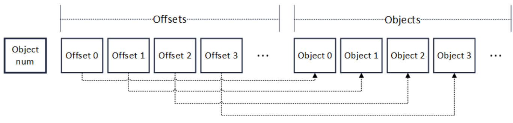

# 让木桶没有短板，FISCO BCOS全面推进并行化改造

作者：李陈希｜FISCO BCOS 核心开发者

## 背景

PTE（Parallel Transaction Executor，一种基于DAG模型的并行交易执行器）的引入，使FISCO BCOS具备了并行执行交易的能力，显著提升了节点交易处理的效率。对这个阶段性结果，我们并不满足，继续深入挖掘发现，FISCO BCOS的整体TPS仍有较大提升空间。 用木桶打个比方：如果参与节点的交易处理所有模块构成木桶，交易执行只是组成整个木桶的一块木板，根据短板理论，一只木桶能盛多少水取决于桶壁上最矮的那块，同理，**FISCO BCOS的性能也由速度最慢的组件决定**。 尽管PTE取得了理论上极高的性能容量，但是FISCO BCOS的整体性能仍然会被其他模块较慢的交易处理速度所掣肘。**为了能够最大化利用计算资源以进一步提高交易处理能力，在FISCO BCOS中全面推进并行化改造势在必行。** 

## 数据分析

根据并行程序设计的『分析→分解→设计→验证』四步走原则，首先需定位出系统中仍存在的性能瓶颈的精确位置，才能更深入地对任务进行分解，并设计相应的并行化策略。**使用自顶向下分析法，我们将交易处理流程分为四个模块进行性能分析**，这四个模块分别是：

**区块解码（decode）**：区块在节点间共识或同步时需要从一个节点发送至另一个节点，这个过程中，区块以RLP编码的形式在网络间传输。节点收到区块编码后，需要先进行解码，将区块还原为内存中的二进制对象，然后才能做进一步处理。

**交易验签（verify）**：交易在发送之前由发送者进行签名，签名得到的数据可以分为(v, r, s)三部分，验签的主要工作便是在收到交易或交易执行前，从(v, r, s)数据中还原出交易发送者的公钥，以验证交易发送者的身份。

**交易执行（execute）**：执行区块中的所有交易，更新区块链状态。

**数据落盘（commit）**：区块执行完成后，需要将区块及相关数据写入磁盘中，进行持久化保存。

以包含2500笔预编译转账合约交易的区块为测试对象，在我们的测试环境中，各阶段的平均耗时分布如下图所示：


从图中可以看出，2500笔交易的执行时间已经被缩短到了50毫秒以内，可以证明PTE对FISCO BCOS交易执行阶段的优化是行之有效的。但图中也暴露出了非常明显的问题：其他阶段的用时远远高于交易执行的用时，导致交易执行带来的性能优势被严重抵消，PTE无法发挥出其应有的价值。

早在1967年，计算机体系结构领域的元老Amdahl提出的以他名字命名的定律，便已经向我们阐明了衡量处理器并行计算后效率提升能力的经验法则：


其中，SpeedUp为加速比，Ws是程序的串行分量，Wp是程序中的并行分量，N为CPU数量。可以看出，在工作总量恒定的情况下，可并行部分代码占比越多，系统的整体性能越高。我们需要把思维从线性模型中抽离出来，继续细分整个处理流程，找出执行时间最长的程序热点，对这些代码段进行并行化从而将所有瓶颈逐个击破，这才是使通过并行化获得最大性能提升的最好办法。

## 根因拆解

### 1.串行的区块解码 

区块解码主要性能问题出在RLP编码方法本身。RLP全称是递归的长度前缀编码，是一种用长度作为前缀标明编码对象中元素个数的编码方法。如下图所示，RLP编码的开头即是此编码中的对象个数（Object num）。在个数后，是相应个数的对象（Object）。递归地，每个对象，也是RLP编码，其格式也与下图相同。

需要特别注意的是，在RLP编码中。每个Object的字节大小是不固定的，Object num只表示Object的个数，不表示Object的字节长度。


RLP通过一种长度前缀与递归结合的方式，理论上可编码任意个数的对象。下图是一个区块的RLP编码，在对区块进行编码时，先递归至最底层，对多个sealer进行编码，多个sealer被编码并加上长度前缀后，编码成为一串RLP编码（sealerList），此编码又作为一个对象，被编入上层的一串RLP编码（blockHeader）中。此后层层递归，最后编码成为区块的RLP编码。由于RLP编码是递归的，在编码前，无法获知编码后的长度。


解码时，由于RLP编码中每个对象的长度不确定，且RLP编码只记录了对象的个数，没记录对象的字节长度，若要获取其中的一个编码对象，必须递归解码其前序的所有对象，在解码前序的对象后，才能访问到需要访问的编码对象的字节位置。例如在上图中，若需要访问区块中的第0笔交易，即tx0，必须先将blockHeader解码，而blockHeader的解码，需要再次递归，把parentHash，stateRoot直至sealerList都解码出来。

解码区块最重要的目的是解码出包含在区块中的交易，而交易的编码都是互相独立的，但在RLP特殊的编码方式下，解码一笔交易的必要条件是解码出上一笔交易，交易的解码任务之间环环相扣，形成了一种链式的依赖关系。需要指出的是，这种解码方式并不是RLP的缺陷，RLP的设计目标之一本就是尽量减少空间占用，充分利用好每一个字节，虽然编解码变得低效了些，但编码的紧凑度却是有目共睹，因此这种编码方式本质上还是一种时间换空间的权衡结果。

由于历史原因，FISCO BCOS中使用了RLP编码作为多处信息交换协议，贸然换用其他并行化友好的序列化方案可能会带来较大的开发负担。基于这一考虑，我们决定在原有的RLP编解码方案稍作修改，通过为每个被编码的元素添加额外的位置偏移信息，便可以做到并行解码RLP的同时不会改动大量原有代码。

### 2.交易验签&数据落盘开销大

通过对交易验签和数据落盘部分的代码进行拆解，我们发现两者的主要功能都集中在一个耗时巨大的for循环。交易验签负责按序取出交易，然后从交易的签名数据中取出(v, r, s)数据，并从中还原出交易发送者的公钥，其中，还原公钥这一步，由于涉及密码学算法，因此耗时不少；数据落盘负责从缓存中逐个取出交易相关数据，将其编码为JSON字符串后写入磁盘，由于JSON编码过程本身效率比较低，因此也是性能损失的重灾区。

两者代码分别如下所示：

```
// 交易验签
for(int i = 0; i < transactions.size(); ++i)
{
  tx = transactions[i];
  v, r, s = tx.getSignature();
  publicKey = recover(v, r, s);  // 从(v, r, s)中复原出发送者公钥
  ...
}
```

```
// 数据落盘
for(int i = 0; i < datas.size(); ++i)
{
  data = datas[i];
  jsonStr = jsonEncode(data);  // 将数据编码为JSON字符串进行存储
  db.commit(jsonStr);
  ...
}
```

两个过程共有的特点是，它们均是将同样的操作应用到数据结构中不同的部分，对于这种类型的问题，可以直接使用数据级并行进行改造。所谓数据级并行，即是将数据作为划分对象，通过将数据划分为大小近似相等的片段，通过在多个线程上对不同的数据片段上进行操作，达到并行处理数据集的目的。

数据级并行唯一的附加要求是任务之间彼此独立，毫无疑问，在FISCO BCOS的实现中，交易验签和数据落盘均满足这一要求。

## 优化实践

### 1.区块解码并行化

改造过程中，我们在系统中使用的普通RLP编码的基础上，加入了offset字段，用以索引每个Object的位置。如下图所示，改造后编码格式的开头，仍然是对象的个数（Object num），但是在个数字段后，是一个记录对象偏移量的数组（Offsets）。



数组中的每个元素有着固定的长度。因此要读取某个Offset的值，只需向访问数组一样，根据Offset的序号直接索引便可以进行随机访问。在Offsets后，是与RLP编码相同的对象列表。相应序号的Offset，指向相应序号的对象的RLP编码字节位置。因此，任意解码一个对象，只需要根据对象的序号，找到其偏移量，再根据偏移量，就可定位到相应对象的RLP编码字节位置。

编码流程也进行了重新设计。流程本身仍然基于递归的思路，对于输入的对象数组，首先将对象数组的大小编码在输出编码的开头处，若数组大小超过1，则按序逐个取出待编码对象并缓存其递归编码，并在Offsets数组中记录该对象的偏移位置，待数组遍历完后，将缓存的对象编码第一次性取出并附加至输出编码末尾；若数组大小为1，则递归对其编码并写入输出编码的末尾，结束递归。

**编码流程的伪代码如下：**

```
Rlps = RLP();  // Output，初始时为空
void encode(objs)  //Input: objs = 待编码对象的数组
{
  offset = 0;
  codes = [];
  
  objNum = objs.size()
  Rlps.push(objNum)
  if objNum > 1
  {
    for obj in objs
    {
      rlp = encode(obj);  // 递归调用编码方法
      Rlps.push(offset);
      offset += rlp.size();
      codes.add(rlp);  // 缓存递归编码的结果
    }
    for x in codes
    {
      Rlps.push(x);
    }
  }
  else
  {
    rlp = encode(objs[0]);
    Rlps.push(rlp);
  }
}
```

偏移量的引入使解码模块能够对元素编码进行随机访问。Offsets的数组范围可以在多个线程间均摊，从而每个线程可以并行访问对象数组的不同部分，分别进行解码。由于是只读访问，这种并行方式是线程安全的，仅需最后再对输出进行汇总即可。

**解码流程的伪代码如下：**

```
Objs decode(RLP Rlps)
{
  objNum = Rlps.objNum；  // 获取对象个数
  outputs = []  // 输出的对象数组
  if objNum > 1
  {
    parallel for i = 0 to objNum
    {
      offset = Rlps.offsets[i];
      code = Rlps.objs[offset];
      x = decode(code);
      outputs.add(x);   // 有序插入outputs
    }
  }
  else
  {
    outputs.add(decode(Rlps.objs[0]));
  }
  return outputs;
}
```

## 2.交易验签 & 数据落盘并行化

对于数据级并行，业内已有多种成熟的多线程编程模型。虽然Pthread这类显式的多线程编程模型能够提供对线程进行更精细的控制，但是需要我们对线程通信、同步拥有娴熟的驾驭技巧。实现的复杂度越高，犯错的几率越大，日后代码维护的难度也相应增加。我们的主要目标仅仅对密集型循环进行并行化，因此在满足需求的前提下，Keep It Simple & Stupid才是我们的编码原则，因此我们使用隐式的编程模型来达成我们的目的。

经过再三权衡，我们在市面上众多隐式多线程编程模型中，选择了来自Intel的线程构建块（Thread Building Blocks，TBB）开源库。在数据级并行方面，TBB算是老手，TBB运行时系统不仅屏蔽了底层工作线程的实现细节，还能够根据任务量自动在处理器间平衡工作负载，从而充分利用底层CPU资源。

**使用TBB后，交易验签和数据落盘的代码如下所示：**

```
// 并行交易验签
tbb::parallel_for(tbb::blocked_range<size_t>(0, transactions.size()),
[&](const tbb::blocked_range<size_t>& _range)
{
  for(int i = _range.begin(); i != _range.end(); ++i)
  {
    tx = transactions[i];
    v, r, s = tx.getSignature();
    publicKey = recover(v, r, s);  // 从(v, r, s)中复原出发送者公钥
    ...
  }
});
```

```
// 并行数据落盘
tbb::parallel_for(tbb::blocked_range<size_t>(0, transactions.size()),
[&](const tbb::blocked_range<size_t>& _range)
{
  for(int i = _range.begin(); i != _range.end(); ++i)
  {
    data = datas[i];
    jsonStr = jsonEncode(data);  // 将数据编码为JSON字符串进行存储
    db.commit(jsonStr);
    ...
  }
});
```

可以看到，除了使用TBB提供的tbb::parallel_for进行并行循环和tbb::blocked_range引用数据分片外，循环体内的代码几乎没有任何变化，接近C++原生语法正是TBB的特点。TBB提供了抽象层级较高的并行接口，如parallel_for、parallel_for_each这类泛型并行算法，从而使得改造能够较为容易地进行。同时，TBB不依赖任何语言或编译器，只要有能支持ISO C++标准的编译器，便有TBB的用武之地。

当然，使用TBB并不是完全没有额外负担，比如线程间安全还是需要开发人员的仔细分析来保证，但TBB考虑周到，提供了一套方便的工具来辅助我们解决线程间互斥的问题，如原子变量、线程局部存储和并行容器等，这些并行工具同样被广泛地应用在FISCO BCOS中，为FISCO BCOS的稳定运行保驾护航。

#### 写在最后

经过一套并行优化的组合拳，FISCO BCOS的性能表现更上层楼。压力测试的结果表明，FISCO BCOS的交易处理能力，相较于并行化改造之前，成功提升了1.74倍，基本达到了这个环节的预期效果。

但是我们也深深明白，性能优化之路漫漫，木桶最短的一板总是交替出现，并行之道在于，通过反复的分析、拆解、量化和优化，使得各模块互相配合齐头并进，整个系统达到优雅的平衡，而最优解总是在“跳一跳”才能够得着的地方。

