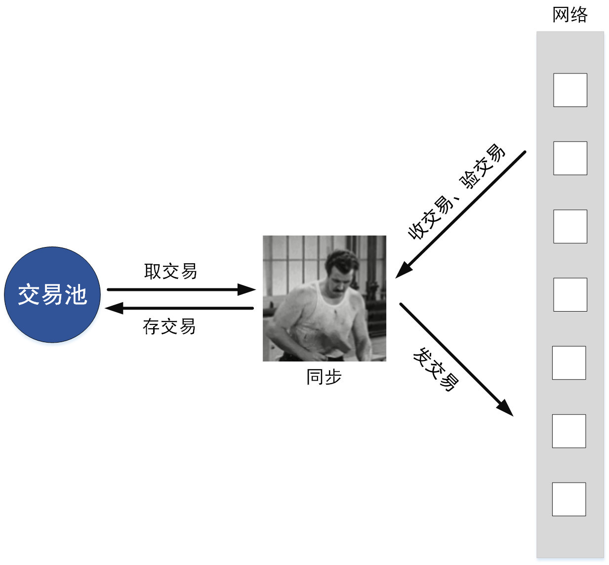
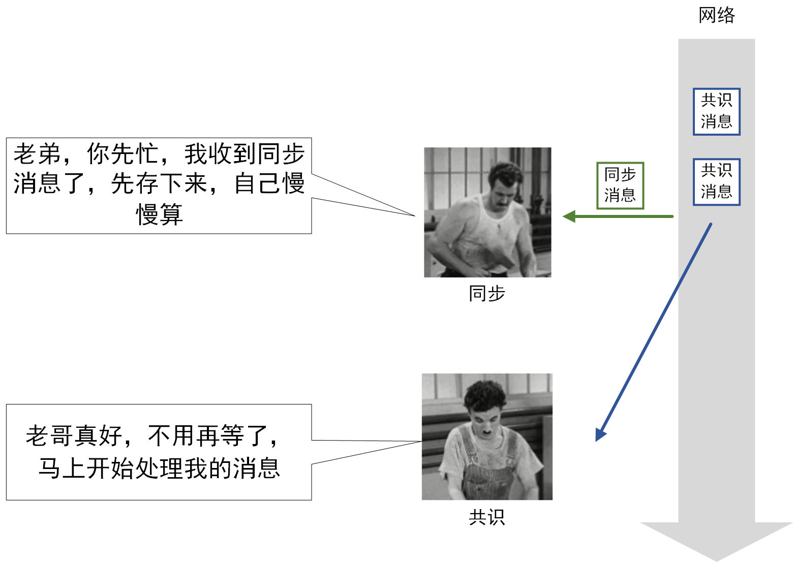
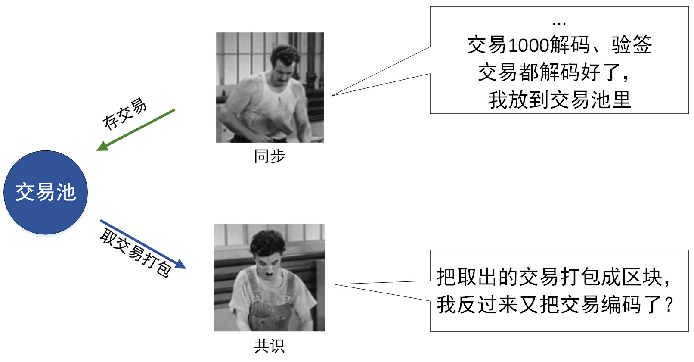
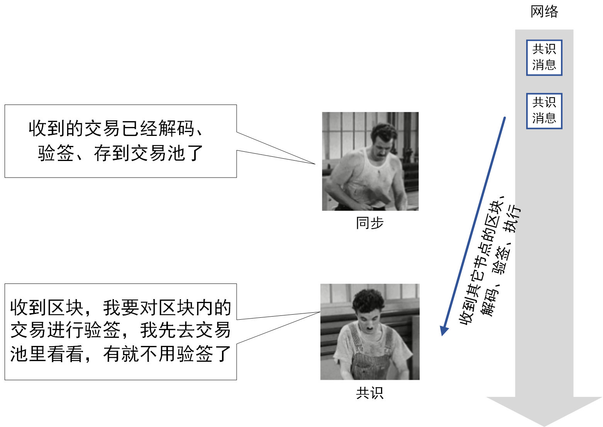

# 《新摩登时代》：卓别林演绎共识与同步流程优化

作者：石翔｜FISCO BCOS 核心开发者

共识与同步的流程优化，是FISCO BCOS性能优化迈开的第一步。**仅依靠这一流程优化，就给系统TPS带来可观的1.75倍提升。**但这不是目的，其目的在于**确定了共识的主导地位，排除了同步给共识带来的性能影响，让之后的性能分析更好地聚焦在共识流程中。**

## 基础讲解

在卓别林的电影《摩登时代》里，卓别林扮演一个工人，日复一日地重复着拧螺丝的动作：提起扳手，找到零件，对准螺丝，拧紧，再提起扳手，再找到下一个零件，再对准螺丝，再拧紧...... 在FISCO BCOS的设计里，共识和同步也在干着这样重复的事情。

## 共识与同步是个啥？

共识与同步，是FISCO BCOS节点中的两个核心流程。它们相互配合，实现了区块链的核心功能：生产出一条在每个节点上都一致的区块链。在FISCO BCOS节点的实现里，共识和同步的实体，我们称为共识模块和同步模块。

- **共识模块**：负责生产区块，让节点产生的区块都是一模一样的

- **同步模块**：负责广播交易，让用户发出的交易尽可能地到达每个节点

## 共识与同步在干啥？

我们来看看共识模块和同步模块的工作环境：
- **交易池**：节点中缓存未被处理交易的容器
- **网络模块**：接收其它节点发来的消息包，也可向其它节点发送消息包 那么，共识模块与同步模块在干啥？ 

### 共识模块

不断进行共识消息的处理和发送，让所有节点上的区块达到一致，此处以PBFT的共识为例。

1. **打包区块**：从交易池拿取出交易，打包成区块广播出去，或处理从网络模块拿到的其它节点的区块
2. **执行区块**：解码区块，验证区块，执行区块，将区块的执行结果签个名广播出去
3. **收集签名**：收集其它节点执行结果的签名，如果收集到的签名达到一定数量，就向其它节点广播“commit消息”
4. **收集commit**：收集其它节点的commit消息，当收集到的commit消息达到一定数量，说明区块已经一致，可以落盘了
5. **落盘**：把区块连接到现有区块链的末端，形成区块链，存储到DB中

### 同步模块

不断进行交易的收发，让每一笔交易尽可能地到达每个节点。

1. **取交易**：从交易池中取出未发送的交易
2. **发交易**：把未发送的交易广播给其它节点
3. **收交易**：从网络模块收取其它节点的交易
4. **验交易**：对交易进行解码和验签
5. **存交易**：把验签通过的交易存到交易池中

## 问题与优化

卓别林和他的伙伴各司其职，井然有序，看似非常和谐。可当工厂落后的生产力跟不上旺盛的市场需求，即便是卓别林这种熟练工，加班加点也干不完。这个时候，卓别林不得不开始思考自己和伙伴在生产关系上的问题。

在以往的设计中，共识模块和同步模块并没有优先级的区分，导致它们在争夺资源时浪费了大量的时间。同时，共识模块和同步模块中还有很多重复的操作，也浪费了时间。因此，应该将共识模块和同步模块的执行流程一并考虑，优化流程，提高效率。在经过详细分析和缜密验证后，FISCO BCOS将共识模块和同步模块流程进行了优化。优化基于以下思想：

**共识模块负责主导整个区块链出块的节奏，应让共识模块先行。而同步模块，理应扮演好配合的角色，辅佐共识模块更快出块。**

基于上述思想，我们来看看其中几个问题的优化方法。

### 问题1：工作阻塞

共识模块与同步模块都是从网络模块中获取消息包，再根据相应消息包进行下一步操作。但是，由于网络回调线程数量的限制，同步模块在处理消息包时，占用了网络的回调线程，导致共识模块无法及时处理其它节点发来的共识消息，共识流程被阻塞。

### 如何解决？——将同步消息的处理操作从网络回调线程中剥离

基于共识模块先行的思想，应让共识模块更及时地收到共识消息，不能让同步模块占用网络回调线程太久。因此，同步模块在拿到消息时，不是直接在回调线程中对交易进行解码和验签，而是将同步消息包缓存起来，用另外一个线程“私下”慢慢处理。这样一来，同步消息的处理不会长时间占用网络回调线程，能让共识消息响应得更快。

### 问题2：编解码冗余

同步模块收到同步消息中的交易，是经过编码的，同步模块需将其解码成节点代码中的数据结构，再存入交易池中。共识模块打包区块时，把交易从交易池中取出，将交易进行编码，打包成区块，再将区块发送出去。在这个过程中，交易先被解码，又被编码，操作存在冗余。

### 如何解决？——交易编码缓存

共识优先级高于同步，应尽量减少共识模块中不必要的操作。因此，在同步模块存交易时，一并将交易的编码存入交易池。共识模块取交易时，直接从交易池中拿出编码好的交易，免去了编码操作。

### 问题3：重复验签

同步模块在收到交易后，需对交易的签名进行验证（简称“验签”），共识模块在收到区块后，也需要对区块中的交易进行验签。同步模块和共识模块所验签的交易，有很大概率是重复的。验签是一个非常耗时的操作，每进行一次额外的验签，都会消耗大量的时间。

### 如何解决？——验签去重

无论是同步模块还是共识模块，在验签前，都去交易池里查询该笔交易是否存在。如果存在，就省略验签操作。如此一来，一笔交易只验签一次，减少了不必要的验签开销。

### 解决方案可否更优？——尽量让同步验签，减少共识模块验签的次数

仍然是共识模块优先的思想，尽量减少共识模块验签的操作。因此，同步模块必须比共识模块跑得快，在共识模块处理一笔交易前，同步模块先拿到交易，优先对交易验签。

FISCO BCOS在此处对同步模块采取的策略是：**对交易进行全量的广播**。

在一个打包节点拿到交易时，其它节点的同步模块也收到了相应的交易。在其它节点收到打包节点发过去的区块时，区块中所包含的交易早已被同步模块验签后写入交易池中。同时，为了让同步模块在相同操作的处理速度上不低于共识模块，同步模块的交易编解码，也采用了和共识模块一样的“并行编解码”和“交易编码缓存”。

## 结果如何？

共识与同步的流程优化，一定程度上也提高了交易处理的TPS。经测试，交易处理的TPS提高至原来的1.75倍！更重要的是，通过流程优化，确定了共识的主导地位，排除了同步给共识带来的性能影响，让之后的性能分析更好地聚焦在共识流程中！

消除了阻塞，消除了编码冗余，消除了重复验签，卓别林和他的伙伴工作得更轻松，更顺畅了！

下篇文章，我们将集中阐述并行优化，让可并行的操作都并行起来！敬请期待《**全方位的并行处理**》。