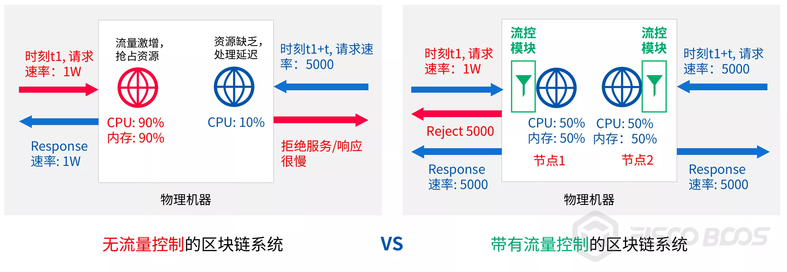
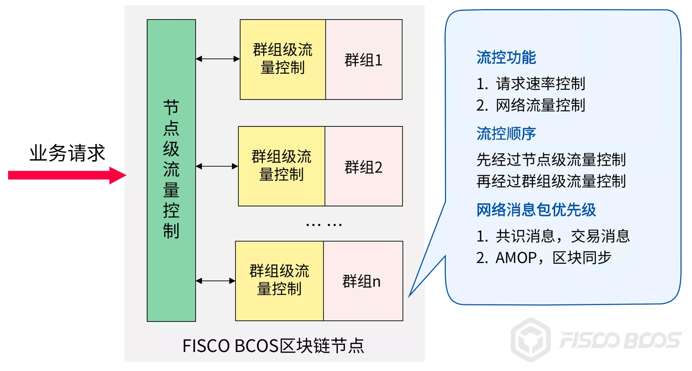

# FISCO BCOS流量控制实现

作者：陈宇杰｜FISCO BCOS 核心开发者

## 引言

区块链系统作为分布式系统，面对大数据量突发请求场景，暴涨的请求容易引起区块链服务或接口不可用，严重时可能导致整个区块链系统陷入雪崩状态。

为了提供更稳定可靠、柔性可用的服务，FISCO BCOS v2.5版本引入了流量控制功能，从节点和群组两个维度进行限流，一方面，面对大数据量突发请求时对区块链系统进行保护，保证系统能正常运行，提升系统可用性；另一方面降低区块链节点间、群组间的资源干扰，提升区块链系统的服务质量。

## 为什么引入流量控制

FISCO BCOS引入流量控制，旨在：

- 应对大数据量突发请求
- 降低区块链节点间、群组间的资源干扰
- 降低模块间的相互影响

### 应对大数据量突发请求


上图对比了**无流量控制功能**和**带有流量控制功能**的区块链系统面对大数据量突发请求时的处理情况。

假设该区块链系统处理能力为2W，当业务以20W请求速率访问区块链节点时：

- **无流量控制**的场景下，系统对业务请求**照单全收**，导致内部积压的请求数目越来越多，区块链节点响应速度越来越慢，若业务持续以高于系统处理能力的速率发起请求，最终整个系统可能会陷入雪崩状态，无法响应任何业务请求。
- 加入了**流量控制功能**后，流量控制模块会**根据****系统处理能力过滤业务请求**。在业务请求速率超出系统处理能力时，流量控制模块会拒绝剩余的处理请求，使系统维持"收支平衡"的健康状态；并将请求过载的信息返回给业务，业务可根据该信息自适应地调整请求速率，对区块链系统进行保护。

简而言之，引入流量控制模块就是给区块链系统加上一层安全保护罩，让系统在接收大数据量突发请求的场景下可以健壮工作，正常响应业务请求。

### 降低区块链节点间/群组间资源干扰



注：图中两个节点属于两条不同的链，接入了两个不同服务

如上图，当多个区块链节点部署于同一台机器时，会出现资源竞争的问题，某些节点占用过多系统资源会影响到其他节点的正常服务。

- t1时刻，业务1持续以1W的请求速率请求左边节点，该节点流量激增，系统接收并处理请求后，使用了90%的CPU
- 经过t时间间隔，业务2以5000的请求速率请求右边节点，该节点资源匮乏，只能抢占到10%的CPU，响应速度很慢

上述场景中，左边节点因占用过多系统资源影响了右边节点的服务质量。引入流量控制后，可限制每个节点接收请求的速率，控制每个区块链节点的资源占用，避免因区块链节点资源竞争导致的服务质量下降或服务不可用问题。

仍以上图为例：

- t1时刻，业务1持续以1W的请求速率请求节点1，节点1流量控制模块根据配置的请求阈值拒绝多余的请求(这里设阈值为5000)，机器CPU占用率维持在50%
- 业务1收到"流量过载"的响应后，可将其请求速率调整到5000
- 经过t时间间隔，业务2以5000的请求速率请求节点2，此时机器还剩余50%的 CPU，足以处理5000个请求，业务2的请求得到正常响应

类似于一台机器上运行多个区块链节点时会发生资源竞争，多群组架构下，群组间也存在资源竞争，某个群组占用过多资源同样会影响到其他群组的服务质量，采用群组级别的流量控制是解决群组间资源竞争的良方。

### 降低模块间相互影响

同一个节点或群组内的不同模块，也存在资源竞争问题，主要是网络资源竞争，存在网络资源竞争的模块包括：

- 共识模块
- 交易同步模块
- 区块同步模块
- AMOP模块

其中共识模块、交易同步模块是决定区块链系统服务质量的关键模块，其他模块过多占用网络资源，会影响这些关键模块，进而影响系统可用性。FISCO BCOS实现了模块级别的流量控制，通过控制非关键的网络流量，优先保证关键模块服务质量，提升系统健壮性。

## 流量控制的功能

FISCO BCOS从节点和群组两个维度实现了业务到节点的请求速率限制和模块粒度的网络流量限制。前者限制业务到节点的请求速率，以应对大数据量突发请求，保证区块链节点的柔性服务；后者通过限制区块同步、AMOP等非关键模块的网络流量，优先保证共识、交易同步等关键模块的性能和稳定性。



- **节点级别请求速率限制**：限制业务到节点的总请求速率，当请求速率超过指定阈值后，节点会拒绝业务请求，避免节点过载，防止过多的请求导致节点异常；控制节点资源使用量，降低区块链节点之间的资源竞争 
- **节点级别的流量控制**：限制节点的平均出带宽，当节点平均出带宽超过设置阈值后，节点收到区块同步请求后会暂缓发送区块、拒绝收到的AMOP请求，避免区块同步、AMOP消息包发送对节点共识的影响

群组维度上，主要功能包括：

- **群组级别请求速率限制**：限制业务到群组的请求速率，当请求速率超过阈值后，群组会拒绝业务请求，该功能可在大数据量突发请求的场景下保护区块链节点，控制群组资源使用量，降低群组间的资源竞争
- **群组级别的流量控制**：限制每个群组的平均出带宽，当群组平均出带宽流量超过设置阈值后，该群组会暂停区块发送和AMOP请求包转发逻辑，优先将网络流量提供给共识模块使用

**当节点和群组都开启请求速率限制时：**

节点收到业务发送的请求包时，首先调用节点级别请求速率限制模块判断是否接收该请求，如请求被接收，则进入群组级别请求速率限制模块，通过该模块检查后的请求才会被转发到相应群组，进行处理。

**当节点和群组都开启网络流量控制功能时：**

1、节点收到客户端AMOP请求，首先调用节点级流量控制模块判断是否接收该AMOP请求

2、当某个群组收到其他节点对应群组的区块请求后，群组在回复区块之前，需要：

- 调用节点级流量控制模块，判断节点平均出带宽是否超过设置阈值
- 调用群组级流量控制模块，判断群组出带宽是否超过设置阈值，当且仅当节点级和群组级平均出带宽均未超过设置阈值时，该群组才会回复区块请求

## 如何使用流量控制功能

流量控制配置分别位于config.ini和group.i.ini配置文件的[flow_control]配置项中，分别对应为节点级别流量控制配置和群组级别流量控制。这里向大家介绍如何启用、关闭、配置流量控制。

### 节点级流量控制

节点级别的网络流量控制配置项均位于config.ini配置文件中，主要包括：

### 请求速率限制

节点级别的请求速率限制位于配置项[flow_control].limit_req中，用于限制业务每秒到节点的最大请求数目，当请求数目超过设置阈值时，请求会被拒绝。**该配置项默认关闭**，若要开启，请将limit_req配置项前面的;去掉。

打开请求速率限制并设计节点每秒可接受2000个业务请求的示例如下：

```
[flow_control]
  ; restrict QPS of the node
  limit_req=2000
```

### 网络流量限制

- [flow_control].outgoing_bandwidth_limit：节点出带宽限制，单位为Mbit/s，当节点出带宽超过该值时，会暂缓区块发送，也会拒绝客户端发送的AMOP请求，但不会限制区块共识和交易广播的流量。**该配置项默认关闭**，若要开启，请将outgoing_bandwidth_limit配置项前面的;去掉。

打开节点出带宽流量限制，并将其设置为5MBit/s的配置示例如下：

```
[flow_control]
  ; Mb, can be a decimal
  ; when the outgoing bandwidth exceeds the limit, the block synchronization operation will not proceed
  outgoing_bandwidth_limit=5
```

### 群组级流量控制

群组级别的网络流量控制配置项均位于group.i.ini配置文件中，主要包括：

### 请求速率限制

群组i的请求速率限制位于group.i.ini的配置项[flow_control].limit_req中，限制业务每秒到群组的最大请求数目，当请求数目超过配置项的值时，请求会被拒绝。该配置项默认关闭，若要开启，请将limit_req配置项前面的;去掉。

打开请求速率限制并配置群组每秒可接受1000个业务请求的示例如下：

```
[flow_control]
  ; restrict QPS of the group
  limit_req=1000
```

### 群组内网络流量限制

[flow_control].outgoing_bandwidth_limit：群组出带宽限制，单位为Mbit/s，当群组出带宽超过该值时，会暂缓发送区块，但不会限制区块共识和交易广播的流量。**该配置项默认关闭**，若要开启，请将outgoing_bandwidth_limit配置项前面的;去掉。

打开群组出带宽流量限制，并将其设置为2MBit/s的配置示例如下：

```
[flow_control]
  ; Mb, can be a decimal
  ; when the outgoing bandwidth exceeds the limit, the block synchronization operation will not proceed
  outgoing_bandwidth_limit=2
```

## 总结

随着区块链技术的发展，越来越多应用部署于区块链系统中，对区块链系统服务质量的要求也日渐提升，区块链系统的柔性可用、稳定健壮变得更加重要。

FISCO BCOS v2.5引入流量控制功能，是FISCO BCOS对区块链柔性服务探索的重要一步。

社区将持续打磨，优化区块链系统服务质量，希望未来能为海量业务场景提供更好的、高可用的柔性服务。如何做好流量控制的同时，又不影响原本系统性能？敬请关注社区后续文章，为您详解流量控制策略的具体实现原理。欢迎大家共同探讨交流，积极反馈使用的体验与改进建议。