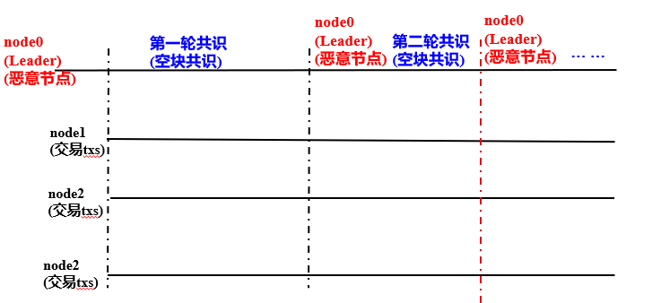
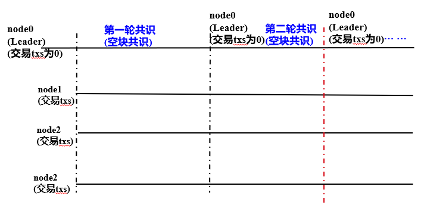
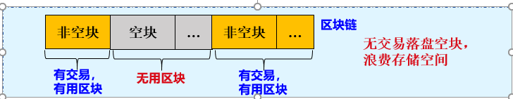
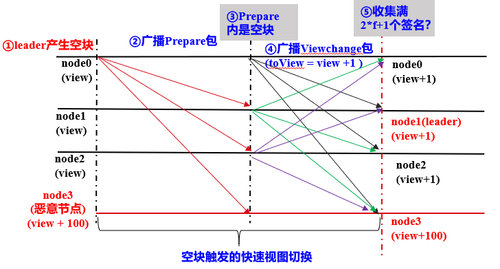

# FISCO BCOS的PBFT空块处理

作者：陈宇杰｜FISCO BCOS 核心开发者

**作者语**

为了保障系统正常运行、确认Leader可用、防止Leader故意作恶，基于PBFT共识算法的区块链系统 (如Algorand) 在没有交易时，会产生空块。

在常见的区块链网络里，记账者通常根据算法持续出块，目的是为了保障系统正常运行、防止作恶等，即使区块里不包含交易，空区块也会被共识确认和落盘存储。

虽然对空块进行共识有一定作用，但空块落盘会耗费存储空间、降低硬盘利用率 (可存储的交易数)，并一定程度上影响面向区块数据的回溯和检索效率。

所以，FISCO BCOS基于PBFT共识算法，实现了高效的空块处理方法，保证每个区块都参与PBFT共识流程的同时，不落盘空块，提升了磁盘利用效率，也确保了系统的安全性、健壮性。

## 名词解释

### 节点类型

- **Leader/Primary**: 共识节点，负责将交易打包成区块和区块共识，每轮共识过程中有且仅有一个Leader，为防止Leader伪造区块，每轮PBFT共识后，均会切换Leader；
- **Replica**: 副本节点，负责区块共识，每轮共识过程中有多个Replica节点，每个Replica节点的处理过程类似；
- **Observer**: 观察者节点，负责从共识节点或副本节点获取最新区块，执行并验证区块执行结果后，将产生的区块上链。

其中Leader和Replica统称为共识节点。

### 视图(view)

PBFT共识算法使用**视图view记录每个节点的共识阶段，相同视图节点维护相同的Leader和Replica节点列表**。当Leader出现故障，会发生视图切换，并根据新视图选出新Leader。

FISCO BCOS系统中，Leader计算公式如下：

```
leader_idx = (view + block_number) % node_num
```

## 为什么共识空块须切换Leader

### 防止Leader故意作恶



如上图，node0是不可信的当前Leader，若共识空块后不切换Leader，该节点一直向其他节点广播空块，使得Leader一直是node0，导致系统无法处理正常交易。共识空块后，切换Leader，可切换Leader为可信节点，有效防止Leader作恶问题。

### 防止切换到无交易Leader导致的系统异常



如上图，node0是可信的当前Leader，但其交易池内可打包的交易数为0，共识空块后不切换Leader会导致该节点一直向其他节点广播空块，系统Leader一直是node0，无法处理正常交易。共识空块后，切换Leader，可切换Leader为有交易的节点，保障了系统正常运行。

## 落盘空块存在的问题

### 浪费存储空间

有些业务在一天中有忙闲的时段之分，比如，在半夜里，可能有大段的时间并没有用户在交易，这个时候如果持续出块，会持续有空块生成。

例：某区块链系统1s出一个块，1天有50%的时间没有交易，每个空块大小为1KB，若这些空块都落盘，则一天空块占据的磁盘空间为：3600s/h * 24h * 50% * 1KB ≈ 43.2MB，1年空块占据约为15.7GB磁盘空间。假设平均每个交易大小为1KB，这15.7GB磁盘空间可用于存储15.7GB/1KB=15,700笔交易。



## FISCO BCOS PBFT空块处理方案

如下图所示，FISCO BCOS PBFT共识算法，通过空块触发快速视图切换的方法，达到切换Leader目的，同时不落盘空块。



### 核心流程

结合上图，下面介绍FISCO BCOS PBFT空块处理算法的主要流程：

1. Leader(node0)节点在指定时间间隔(当前是1秒)没有打包到交易，则基于最高块构造一个空块，内含0笔交易；
2. Leader将空块封装在Prepare包内，并广播给所有其他共识节点；
3. 其他共识节点收到Prepare包后，取出区块，若区块是空块，则将节点即将切换的视图toView设置为当前视图加一，并相互间广播视图切换请求viewchange_request，viewchange_request中的视图为toView，即视图增加当前view；
4. 共识节点收集视图切换包：节点收集满n- f (n是共识节点数，至少为3*f+1；f是系统可容错的节点数目) 个来自不同节点、视图与节点toView值一致的视图切换请求后，触发视图切换，将当前视图view切换为toView；
5. 由于视图切换，下一轮共识的Leader切换为下一个节点(即node1)。

## 总结

综上可知，FISCO BCOS PBFT共识算法，通过空块触发快速视图切换，并切换Leader优化了空块处理流程，解决了共识空块不切换Leader导致的系统异常，实现了空块不落盘存储，提升了磁盘利用效率，加快了数据追溯的效率，减少了数据分析的复杂度。