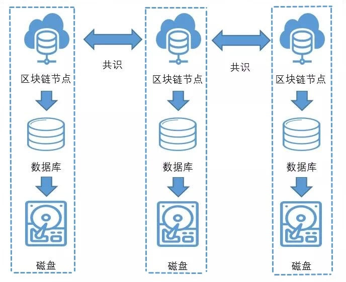

# 区块链数据是存在链上还是数据库里？

作者：莫楠｜FISCO BCOS 高级架构师

在回答这个问题之前，首先要理清“**区块链数据**”和“**链上数据**”的概念。

## 区块链数据

“区块链数据”广义上包括区块链的**区块数据**和区块链的**状态数据：**

- 区块数据记录了区块链上发生的每一笔交易，譬如小明给小王转账了50元、小王充值了20元等类似这样的交易数据；
- 状态数据记录了区块链上每个账户或智能合约的当前状态，比如小明当前的余额是50元、小王当前的余额是100元。

无论区块数据还是状态数据，它们都是由区块链节点使用和存储的。区块链节点是一个程序，运行在我们的个人电脑、虚拟机或服务器上。多个分布在不同电脑或服务器上的区块链节点，通过网络互相连接，组成了完整的区块链网络。

区块链节点通常会把区块链数据存储在个人电脑、虚拟机或服务器上，存储区块链数据最常见的介质，就是磁盘。

区块链节点不会直接访问磁盘，它们会通过特定的数据库，如LevelDB、RocksDB或MySQL等单机或分布式数据库来操作数据。相比于直接操作磁盘，数据库抽象了特定的数据访问模型，对区块链节点更为友好。

因此，当我们说：“区块链数据保存在数据库”时，可以认为区块链节点将区块链数据保存在MySQL（或其它数据库），MySQL将区块链数据保存在磁盘。



数据库有**独立式**与**嵌入式**之分：

- 独立式数据库，如MySQL、Oracle是通常理解的数据库，独立式数据库作为独立的进程运行，需要单独部署和启停。独立式数据库可以与区块链节点部署在同一台服务器，或者部署在不同的服务器，还支持分布式、集群化的部署。无论何种部署方式，独立式数据库都是区块链节点的存储组件，隶属于区块链节点，与区块链网络无关。
- 嵌入式数据库如LevelDB、RocksDB，它们以动态依赖库或静态依赖库的方式，与区块链节点整合在同一个进程中，同时启停，用户不会明显感受到它们的存在。

## 链上数据

区块链数据的区块数据和状态数据并不是凭空产生的。区块数据中的交易，是由区块链的用户生成，用户把交易发送到区块链节点，区块链节点将多个交易打包进区块，区块会在区块链网络上广播和共识，区块链网络对区块达成共识后，认同区块中的交易，将交易的执行结果保存到状态数据中。

假设区块链原本的状态数据是：小明当前的余额是50元、小王当前的余额是100元，那么执行了“小明给小王转账了50元”的交易后，状态数据会发生变化，小明当前的余额会变为0元，小王当前的余额变为150元。

区块需要进行区块链共识，状态数据是通过执行区块中的交易生成的，这两类数据都直接或间接跟区块链共识有关系，可以将其称为“链上数据”。那么，“链上数据”的明确定义，就是：链上数据是直接或间接由区块链共识产生的数据。

**回到最初的问题**

很显然，“链上数据”和“数据库”不是同一个层面的概念，“区块链数据是存在链上还是存在数据库？”这个问题不成立，区块链数据无论是存储在LevelDB、RocksDB、MySQL数据库或直接存储在磁盘，只要是直接或间接由区块链共识产生，都可以视为链上数据。

## FISCO BCOS的链上数据

FISCO BCOS的区块链数据，默认是通过RocksDB保存在磁盘中。如果希望把数据保存到MySQL数据库，可以先自行部署一个MySQL数据库，然后修改区块链节点下的群组配置文件，群组配置文件通常位于区块链节点的配置目录下：conf/group.1.ini

```
[storage]
    type=mysql
    db_ip=127.0.0.1
    db_port=3306
    db_username=root
    db_name=db_Group1_A
    db_passwd=******
```

其中：

- type为区块链节点的存储类型，配置为mysql，表示使用MySQL来存储区块链数据；
- db_ip为MySQL数据库的IP地址，如果部署在本机，就是127.0.0.1；
- db_port为MySQL数据库的端口，默认为3306；
- db_username是MySQL数据库的登陆用户名；
- db_name是MySQL数据库中用于存储区块链数据的数据库名，无需先行创建；
- db_passwd是MySQL数据库的登陆密码。

其它未提及的配置项，可保留默认值不修改，完成这些信息的填写以后，确保数据库运行正常，然后重启区块链节点，区块链节点就会将区块链数据保存到MySQL数据库中。FISCO BCOS的区块链，无论是保存在RocksDB还是MySQL中，都可视为链上数据。使用MySQL，可以方便地查看链上数据的大小、结构等信息，如区块的大小、账户的大小等等。

## 总结

FISCO BCOS提供了灵活的数据存储机制，对于追求便利与性能的场景，可以使用默认的RocksDB；对于偏重审计和治理的场景，可以使用MySQL，满足不同的需求。

**关于FISCO BCOS存储，请参考[FISCO BCOS分布式存储文档](../../../manual/distributed_storage.html)**

------

#### 「群聊互动」

【Q】 **什么的小世界**：区块链上的数据都是增加在上面的，不能删除是么，那么长时间使用，会不会节点的效率不断下降？

【A】 **中大刘忠楠**：节点header存储的交易、状态数据，是限定长度的根哈希值。

【A】**莫楠**：区块链确实会随着使用不断增长，但区块链的数据访问模型通常是kv的，kv模型的查询效率受数据量的影响很小，因此不会明显影响性能。

【Q】 **什么的小世界**：如果在区块链网络之中增加一个节点，该节点会从其他节点通过广播自动拷贝数据过来是么？

【A】**莫楠**：在区块链网络中增加一个节点，这个节点会自动同步其它节点的数据。