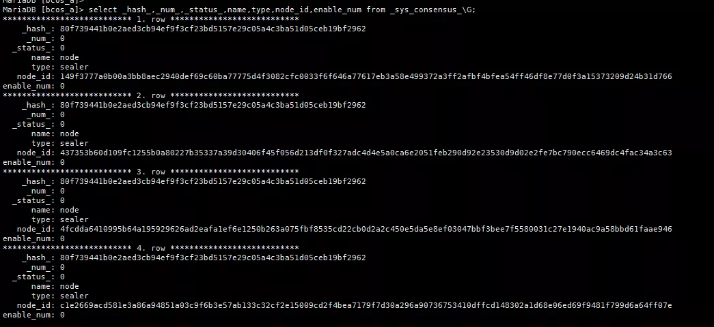
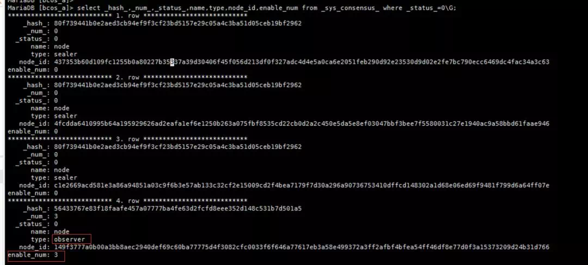
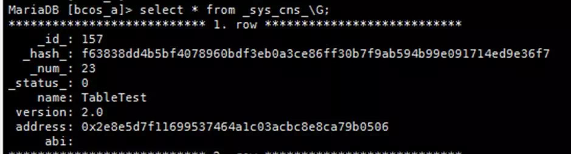
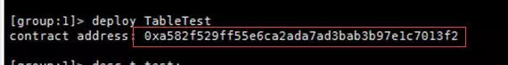
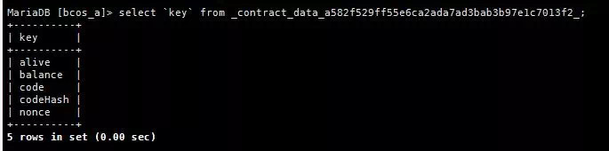

# FISCO BCOS基于表的存储结构

作者：尹强文｜FISCO BCOS 核心开发者

FISCO BCOS底层的存储数据结构，并没有采用传统的MPT存储结构，而是用了基于表结构的方式。一方面，避免了世界状态急剧膨胀而导致的性能下降问题；另一方面，表结构能够兼容各种存储引擎，使得业务开发更加方便。

## FISCO BCOS表的分类

FISCO BCOS每张表都有一个主key字段，1个或者多个value字段，表分为系统表（以_sys_开头），用户表（以_user_开头）和StorageState账户表（以_contract_data_开头）。
表结构的所有记录，都会有`_id_`,`_status_`,`_num_`,`_hash_`内置字段。用户表和StorageState账户表key字段的类型是varchar(255)，value的类型为mediumtext。

## 系统表

系统表默认存在，由节点进程或者amdb-proxy进程启动时，保证系统表的创建，每张表的说明如下。

- **_sys_tables_**

存储所有表的结构，每一张表都会在这张表中有一条记录，记录表的结构，包括表的key和field字段。表结构如下：

| 字段 | table_name | key_field | value_field              |
| ---- | ---------- | --------- | ------------------------ |
| 说明 | 表名       | 主key名称 | value名称列表，以“,”分隔 |

以表名为_sys_tx_hash_2_block_为例，_sys_tables_中各个字段数据为：

```
table_name=_sys_tx_hash_2_block_key_field=hashvalue_field=value,index
```

底层创建表和读取结构表，是基于_sys_tables_这张表，从创建好的_sys_tx_hash_2_block_表中可以看到，这张表包含3个字段，分别是主key字段hash，value字段有2个分别是value和index。

- **_sys_consensus_**

存储共识节点和观察节点的列表。表结构如下：

| 字段 | name             | type                                           | node_id | enable_num |
| ---- | ---------------- | ---------------------------------------------- | ------- | ---------- |
| 说明 | 主key,固定为node | 节点类型，sealer为共识节点，observer为观察节点 | 节点id  | 生效块高   |

例如，某个链包括4个节点，初始化都是共识节点，可以看到四个节点都是sealer（共识节点），生效块高都是0，如图：



通过控制台将`149f3777a0...`这个节点移除并加入到观察者列表，查询_sys_consensus_表的数据，发现该条记录的type已经修改为observer，生效块高已经修改为3。如图：



- **_sys_current_state_**

存储当前区块链最新的状态，每次有区块数据存储，这个表都会去更新信息，包括当前分配出去的自增id，当前块高，交易失败数，交易总数。表结构如下：

| 字段 | key  | value |
| ---- | ---- | ----- |
|      |      |       |

存储的信息如下：

| key                            | 含义                 |
| ------------------------------ | -------------------- |
| current_id                     | 当前分配出去的自增id |
| current_number                 | 当前块高             |
| total_failed_transaction_count | 交易失败数           |
| total_transaction_count        | 交易总数             |

- **_sys_config_**

存储需要共识的群组配置项，表结构同_sys_current_state_，当前配置了2个数值项，分别是一个区块包含的最大交易数及gas值。写入创世块的时候，会从group.[groupid].genesis文件中读取consensus.max_trans_num和tx.gas_limit两个配置项并写入表中。存储的信息如下：

| key            | 含义                     |
| -------------- | ------------------------ |
| tx_count_limit | 一个区块包含的最大交易数 |
| tx_gas_limit   | gas值                    |

- **_sys_table_access_**

存储含有写入权限的外部账户地址。表结构如下：

| 字段 | table_name | address              | enable_num |
| ---- | ---------- | -------------------- | ---------- |
| 说明 | 表名       | 有写入权限的外部地址 | 生效块高   |

默认这个表是没有数据的，表示所有外部账户都有读写权限，通过控制台使用`grantDeployAndCreateManager`命令为某个账号授权，会在`_sys_table_access_`这张表中新增一条Entry。


同时可以看到，除了被授权的外部账号可以部署合约之外，其他账户部署合约会提示没有权限。


- **_sys_number_2_hash_**

存储区块号到区块hash映射，可以根据区块号映射到区块hash值。表结构如下：

| 字段 | number | value      |
| ---- | ------ | ---------- |
| 说明 | 区块号 | 区块hash值 |

- **_sys_hash_2_block_**

存储hash到序列化的区块数据映射，可以根据区块hash值映射到区块值。表结构如下：

| 字段 | hash       | value  |
| ---- | ---------- | ------ |
| 说明 | 区块hash值 | 区块值 |

- **_sys_block_2_nonces_**

存储区块中交易的nonces，可以根据区块号，映射到该区块生成时所用到的nonces值。表结构如下：

| 字段 | number | value                    |
| ---- | ------ | ------------------------ |
| 说明 | 区块号 | 生成区块时用到的nonces值 |

- **_sys_tx_hash_2_block_**

存储交易hash到区块号的映射，表结构如下：

| 字段 | hash     | value  | index                |
| ---- | -------- | ------ | -------------------- |
| 说明 | 交易hash | 区块号 | 该交易在区块中的编号 |

一个区块可能包括多个交易，因此，区块hash和交易hash是一对多的关系，所以一个区块会在这个表里生成多条数据。

- **_sys_cns_**

存储合约名到合约地址的映射，表结构如下：

| 字段 | name          | version    | address  | abi                                                          |
| ---- | ------------- | ---------- | -------- | ------------------------------------------------------------ |
| 说明 | 主key，合约名 | 合约版本号 | 合约地址 | 合约的接口说明，描述了合约字段名称、字段类型、方法名称、参数名称、参数类型、方法返回值类型 |

用CNS部署的合约，可以通过合约名去调用，具体方式是根据合约名，找到包括多个版本号的合约地址列表，筛选出版本号正确的合约地址，再使用`_contract_data_`+`Address`+`_`作为表名，去查询code的值，执行合约代码。

例如，通过CNS部署的TableTest合约，可以在`_sys_cns_`表中查询到如下数据：



## 用户表

用户调用CRUD接口所创建的表，以`_user_<TableName>`为表名，底层自动添加`_user_`前缀。

表名和表结构由合约决定，例如创建表的合约代码为：

```
 TableFactory tf = TableFactory(0x1001); int count = tf.createTable("t_test", "name", "item_id,item_name"); return count;
```

创建出来的表名为`_user_t_test`，包括3个字段，分别是主key字段`name`，类型为varchar(255)；value包含两个字段，分别是`item_id`，`item_name`；如图：


## StorageState账户表

`_contract_data_`+`Address`+`_`作为表名。表中存储外部账户相关的信息。存储信息如下：

| key      | value |
| -------- | ----- |
| alive    |       |
| balance  |       |
| code     |       |
| codeHash |       |
| nonce    |       |

以部署`TableTest`合约为例，`deploy TableTest`会返回一个地址，如图：





同时，可以看到数据库中生成了一个表名为`_contract_data_a582f529ff55e6ca2ada7ad3bab3b97e1c7013f2_`的表，存储信息如下（和上述表述一致）：



## 总结

基于表的存储方式，抽象了区块链的底层存储模型，实现了类SQL的抽象存储接口，支持多种后端数据库。
引入基于表的存储方式后，数据读写请求不经过MPT，直接访问存储，结合缓存机制，存储性能相比基于MPT的存储有大幅提升。MPT数据结构作为可选方案仍然保留。

### 「群提问」

**Q**：腾龙(何直群)：table 和 智能合约内部存储有优缺点对比吗？

**A**：Wheat：table是类似传统数据库使用方式的设计，可以让写业务逻辑的开发比较容易上手。数据基于table存储，管理也更方便。相比合约mpt格式存储数据，table格式性能也更高。

**Q**：王先生：有点疑惑，表存储不就和传统的数据库存储一样了吗，那区块链还有什么用？

**A**：尹强文：使用什么存储结构，本质上不会改变区块链具有去中心化、不可篡改、不可逆、匿名等特性。只是使用基于表的存储，有一些优势，一是数据基于表存储，管理更方便。相比合约mpt格式存储数据，表格式性能也更高，同时表结构能够兼容各种存储引擎，使得业务开发更加方便。