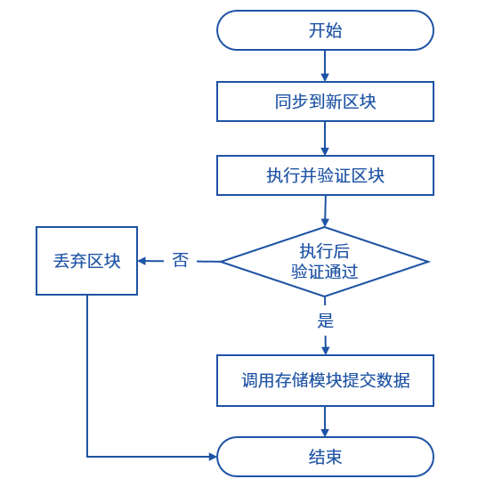
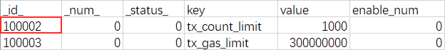

# 为什么从LevelDB切换到RocksDB？

作者：白兴强｜FISCO BCOS 核心开发者

存储模块是区块链底层平台中的核心之一，负责将区块链中所有需要持久化的数据存储到磁盘上。一个优秀的区块链底层平台，必然要有一个强大的存储模块支持。FISCO BCOS存储模块经过多次重构和优化，为性能突破提供了有力支撑。目前，FISCO BCOS单链TPS达到2万+，且支持平行多链的并行扩展。

2.0.0-rc3版本以前，FISCO BCOS支持使用LevelDB和MySQL作为数据存储引擎，rc3之后开始将嵌入式存储引擎从LevelDB切换到RocksDB。为什么要做切换？切换RocksDB之后能带来什么？本文将带大家一起回顾我们作出这个决定时的考虑。

## FISCO BCOS存储模块概览

### 数据提交流程

FISCO BCOS中需要存储的数据可以分为两部分，一部分是经过共识的链上数据，包括交易、收据、区块和合约数据等；另一部分是各节点维持区块链运行所需的数据，包括当前块高、链上交易数和一些交易区块相关的索引信息。区块链上的新区块来自于同步模块和共识模块。以同步模块为例，当拿到新的区块之后，同步模块会调用BlockVerifier模块执行和验证区块，如果验证通过则调用BlockChain模块将区块和执行区块产生的数据提交给存储模块，由存储模块负责将数据序列化写入数据库。

### 存储模块概览

数据提交到存储模块之后，是一种抽象的表结构，存储模块首先将提交的数据加入缓存层，以提高查询性能。完成缓存的更新之后，需要提交的数据会加入提交队列，由缓存层负责异步提交到适配层，如果关闭了缓存设置，则同步提交到适配层。

适配层需要把提交的数据从FISCO BCOS的抽象表结构组织形式转换为后端对应存储的组织形式，对于MySQL这种关系型数据库，则直接将存储模块的表结构对应到数据库表结构即可，例如_sys_config_这个表在MySQL中如下图所示。

对于RocksDB或LevelDB这种KV的存储模式，将表名和插入时设置的主key拼起来作为数据库的KEY，对应的数据则序列化为VALUE。对应于_sys_config_这个表，以及tx_conut_limit这个主key的数据，其在KV数据库中的KEY为_sys_config__tx_conut_limit，VALUE为对应的数据序列化后的字符串。

## 为什么选择RocksDB？

FISCO BCOS从1.0版本开始就使用LevelDB作为底层数据存储引擎，在使用过程中我们也碰到一些小问题，例如内存占用高、文件描述符超限导致进程被干掉、节点被kill后可能导致的DB损坏等。

重构2.0版本时，为了更高的性能，我们需要一个更优秀的存储引擎，这个存储引擎应该满足下面这些条件：

1. 开源且有持续地维护；

2. 读写性能要比LevelDB更高；

3. 嵌入式KV数据库，能够支持大数据量场景下的读写；

4. 与LevelDB类似的接口，降低迁移成本。 

基于上述条件，RocksDB进入了我们的视野。

RocksDB fork自LevelDB，开源且由fackbook维护，相比于LevelDB有较明显的性能提升，保持了与LevelDB一致的接口，极低的迁移成本。从资料上看非常符合我们的需求。 

### LevelDB与RocksDB性能对比

下面的测试数据是在一台4 vCPU E5-26xx 2.4GHz 8G 500GB腾讯云硬盘的机器上获取的，由FISCO BCOS核心开发者尹强文提供。

该测试KEY的长度为16字节，VALUE的长度为100字节，压缩算法使用Snappy，其他参数使用默认值，在1千万条数据和1亿条数据的情况下，可看出LevelDB和RocksDB的性能对比：在两种数据量下，各个场景RocksDB都取得了不比LevelDB差或者更好的表现。

### FISCO BCOS中使用RocksDB

在RocksDB的官方wiki上有一个页面叫做Features Not in LevelDB，这个页面中描述了RocksDB中所有新增的功能，例如对列族的支持，允许我们在逻辑上对数据库分区，对backup和checkpoint的支持，支持备份到HDFS，两种compaction方式允许用户在读放大、写放大、空间放大之间取舍，自带统计模块便于调优，支持了ZSTD等更新的压缩算法等。

官方wiki中也提到RocksDB为提升性能所做的优化，包括多线程Compaction、多线程memtable插入、降低DB锁的持有时间、写锁的优化、跳表搜索时更少的比较操作等。官方文档中指出，在插入key是有序的场景下，RocksDB使用多线程Compaction，使得RocksDB的性能大幅度高于LevelDB。

FISCO BCOS使用RocksDB时只使用了默认参数和与LevelDB兼容的读写接口，并没有做进一步的参数调优，RocksDB在官方文档中有指出，默认参数已经可以达到很好的性能，更进一步的调参并不能带来大幅的性能提升，而用户的业务场景是多种多样的，针对业务场景优化的参数修改对于FISCO BCOS不一定合适。

日后，随着对RocksDB的深入了解，如果发现更优的参数设置，我们也会采用。

## 总结

为什么换RocksDB，其实就一句话，RocksDB性能更高！凡是能够让FISCO BCOS更加优秀的事情，我们都愿意去做。最近，FISCO BCOS发布了v2.2.0版本，在性能方面作了进一步的优化，每一次的性能提升都是FISCO BCOS的开发者不停死磕的结果，这种死磕我们会一直进行下去，希望社区的同学们也一起参与进来，初学者点个star，进一步了解后可以提一些修复PR或者issue，大家一起让FISCO BCOS更加优秀！

------

#### 参考链接

[Features Not in LevelDB](https://github.com/facebook/rocksdb/wiki/Features-Not-in-LevelDB)

[RocksDB官方wiki](https://github.com/facebook/rocksdb/wiki/Performance-Benchmarks)

[Benchmarking LevelDB vs. Rocks DB vs. HyperLevel DB vs. LMDB Performance for Influx DB](https://www.influxdata.com/blog/benchmarking-leveldb-vs-rocksdb-vs-hyperleveldb-vs-lmdb-performance-for-influxdb/)