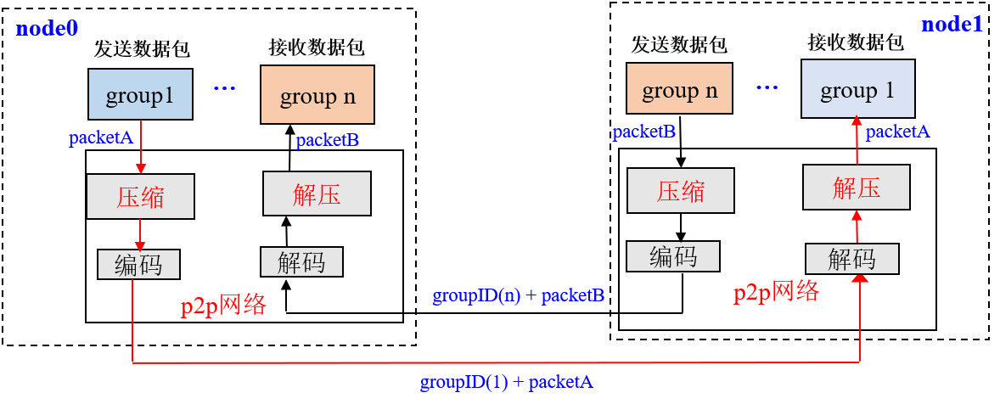
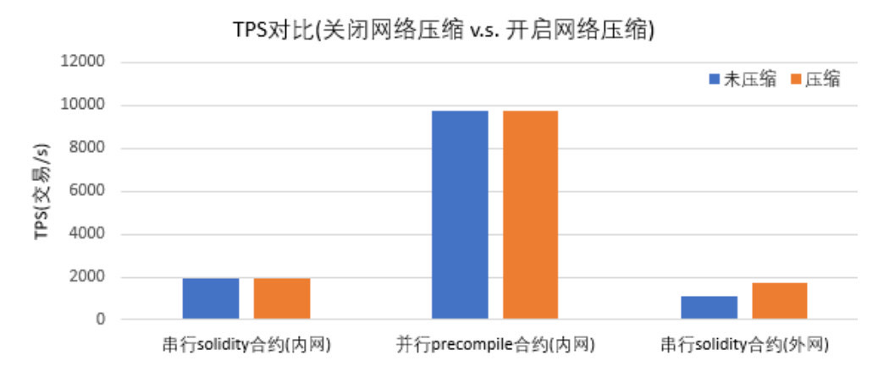

# FISCO BCOS的网络压缩功能如何？

作者：陈宇杰｜FISCO BCOS 核心开发者

**作者语**

外网环境下，区块链系统性能受限于网络带宽，为了尽量减少网络带宽对系统性能的影响，FISCO BCOS从relase-2.0.0-rc2开始支持网络压缩功能，该功能主要在发送端进行网络数据包压缩，在接收端将解包数据，并将解包后的数据传递给上层模块。

本期文章讲的就是FISCO BCOS的网络压缩功能，作者从FISCO BCOS的系统框架、核心实现、处理流程、测试结果等角度进行了解析。

## Part 1. 系统框架

网络压缩主要在P2P网络层实现，系统框架如下： 

网络压缩主要包括两个过程：
- **发送端压缩数据包**：群组层通过P2P层发送数据时，若数据包大小超过1KB，则压缩数据包后，将其发送到目标节点；
- **接收端解压数据包**：节点收到数据包后，首先判断收到的数据包是否被压缩，若数据包是压缩后的数据包，则将其解压后传递给指定群组，否则直接将数据传递给对应群组。 

## Part 2. 核心实现

综合考虑性能、压缩效率等，我们选取了**Snappy**来实现数据包压缩和解压功能。

### 数据压缩标记位

FISCO BCOS的网络数据包结构如下图：

网络数据包主要包括包头和数据两部分，包头占了16个字节，各个字段含义如下：

- Length: 数据包长度
- Version: 扩展位，用于扩展网络模块功能
- ProtocolID: 存储了数据包目的群组ID和模块ID，用于**多群组数据包路由，目前最多支持32767个群组**
- PaketType: 标记了数据包类型
- Seq: 数据包序列号

**网络压缩模块仅压缩网络数据，不压缩数据包头。**

考虑到压缩、解压小数据包无法节省数据空间，而且浪费性能，在数据压缩过程中，不压缩过小的数据包，仅压缩数据包大于`c_compressThreshold`的数据包`.c_compressThreshold`默认是1024(1KB)。我们扩展了Version的最高位，作为数据包压缩标志：

- Version最高位为0，表明数据包对应的数据Data是未压缩的数据；
- Version最高位为1，表明数据包对应的数据Data是压缩后的数据。

## Part 3. 处理流程

下面以群组1的一个节点向群组内其他节点发送网络消息包packetA为例（比如发送交易、区块、共识消息包等），详细说明网络压缩模块的关键处理流程。

#### 发送端处理流程：

- 群组1的群组模块将packetA传入到P2P层;
- P2P判断packetA的数据包大于`c_compressThreshold`，则调用压缩接口，对packetA进行压缩，否则直接将packetA传递给编码模块；
- 编码模块给packetA加上包头，附带上数据压缩信息，即：若packetA是压缩后的数据包，将包头Version的最高位置为1，否则置为0；
- P2P将编码后的数据包传送到目的节点。

#### 接收端处理流程：

- 目标机器收到数据包后，解码模块分离出包头，通过包头Version字段的最高位是否为1，判断网络数据是否被压缩；
- 若网络数据包被压缩过，则调用解压接口，对Data部分数据进行解压，并根据数据包头附带的GID和PID，将解压后的数据传递给指定群组的指定模块；否则直接将数据包传递给上层模块。

## Part 4. 配置与兼容

#### 配置说明

- 开启压缩：2.0.0-rc2及其以上版本 支持网络压缩功能，配置 `config.ini`的`[p2p].enable_compresss=true`
- 关闭压缩：`config.ini`的`[p2p].enable_compresss=false`

#### 兼容性说明

- **数据兼容**：不涉及存储数据的变更；
- **网络兼容rc1**：向前兼容，目前仅**release-2.0.0-rc2及其以上版本**有网络压缩功能

## Part 5. 测试结果

为测试网络压缩效果，分别在**内网和外网**环境下，以**同样的压测程序和QPS**压测**开启网络压缩和没开启网络压缩**的四节点区块链，测试结果如下。

通过测试结果可看出：

- **内网环境下**：**开启压缩对区块链系统性能影响不大**，运行**串行solidity压测合约**时，网络带宽消耗降低为未开压缩时的**三分之二**；运行**并行precompile压测合约**，网络带宽消耗降低到未开压缩时的**三分之一**；
- **外网环境下**：开启压缩可提升区块链系统性能

### 图一：带宽对比
（关闭压缩和开启压缩情况下，压测并行solidity合约和串行Precompile合约）

通过图一可看出，执行**串行solidity合约**，开启压缩可**节省三分之一带宽**；执行**并行Precompile合约可节省三分 之二带宽**。 

### 图二：TPS对比
(内网和外网环境下，关闭压缩和开启压缩情况下TPS)

通过图二可看出，**内网环境下，开启压缩对区块链系统性能影响不大**；外网环境下，因为在有限带宽限制下，开启 压缩可处理更多交易，区块链性能提升了约三分之一。

### 图三：详细数据

#### 内网环境测试结果

| 串行solidity合约(PerformanceOk) |   压缩前    | Snappy压缩后 |
| :------------------------------ | :---------: | :----------: |
| TPS                             |   1961.5    |    1939.4    |
| 入带宽                          | 10.88MBit/s |  6.93MBit/s  |
| 出带宽                          | 9.08MBit/s  |  5.70MBit/s  |

| 并行Precompile合约(PerformanceDT) |   压缩前    | Snappy压缩后 |
| :-------------------------------- | :---------: | :----------: |
| TPS                               |    9725     |     9741     |
| 入带宽                            | 76.06MBit/s | 22.72MBit/s  |
| 出带宽                            | 80.48MBit/s | 24.17MBit/s  |

#### 外网环境测试结果

| 压测场景                                 |  压缩前  | Snappy压缩后 |
| :--------------------------------------- | :------: | :----------: |
| 四节点，串行solidity合约(PerformanceOk)  |  1125.8  |     1740     |
| 四节点, 串行solidity合约(PerformanceOkD) | 低于1000 |     1407     |

------

#### 群友问答

**@無名**：测试带宽是用什么软件测的呢？

**@陈宇杰**：当时测试带宽的时候，是独占的机器，直接用的nload，当然，在多进程环境下，还可以用nethogs等。

**@elikong**：提两个问题：

1、为啥选snappy，有没有做过压缩性能分析对比，包括压缩率，cpu时间，典型消息等方面。

2、内网情况压缩前后带宽变化很大，但tps提升不明显的原因是什么？

**@陈宇杰**

1、是有前期调研的，当时调研了各种压缩库的压缩比、压缩和解压速度、license等。初选的是lz4和snappy，并实现了同时支持两种库压缩算法的版本，并且进行了压测，压测结果显示两种库测试结果相差不大。由于我们的系统里已经集成了snappy，为了避免引入额外的库，所以最终选用了snappy 。

2、内网情况下，性能瓶颈是CPU(包括交易执行速度、验签性能等)、IO等，网络不是瓶颈，因此即使开启了压缩，节省了网络资源，对性能影响也不大。当然这也表明压缩、解压本身对性能损耗不大；外网环境下，网络是瓶颈，这个时候大部分时间是耗费在网络上的，开启压缩，节省了很多网络带宽，使得在相同时间内，节点间可传输更多数据包，因而性能有提升。

