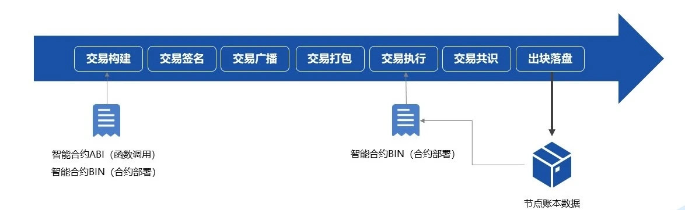
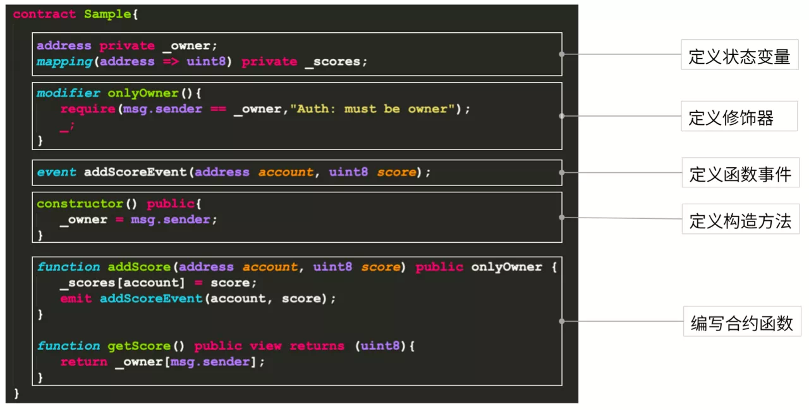
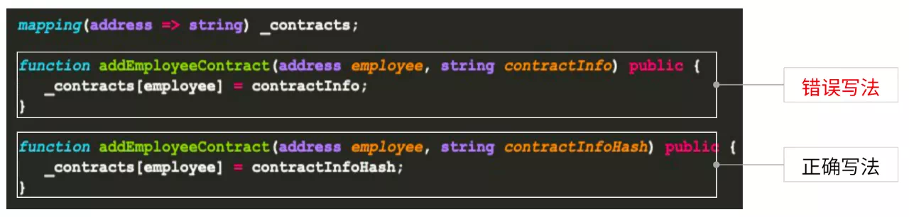
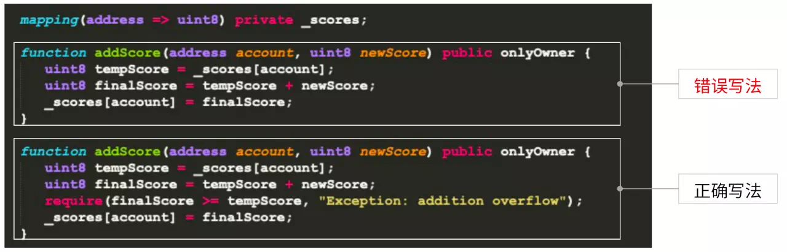
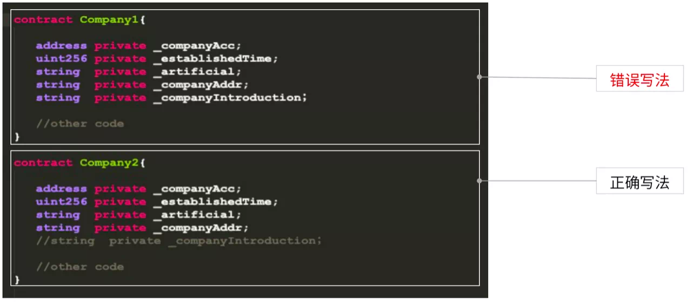
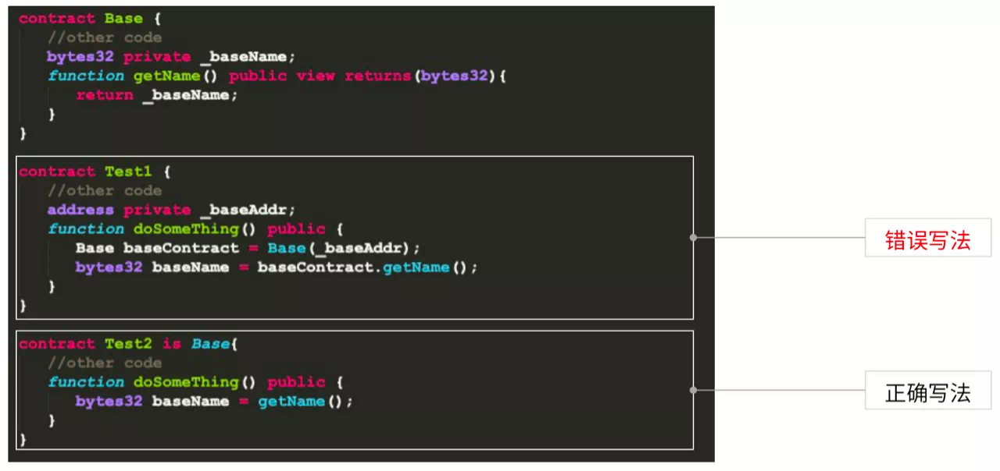
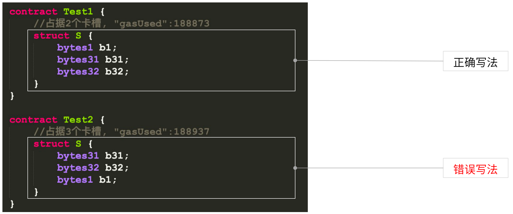
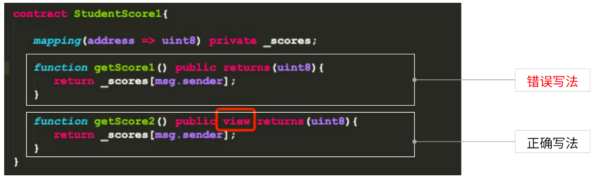
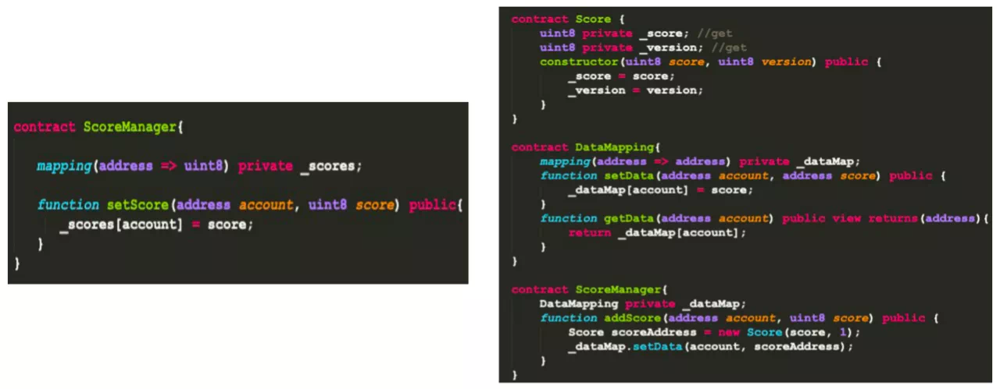
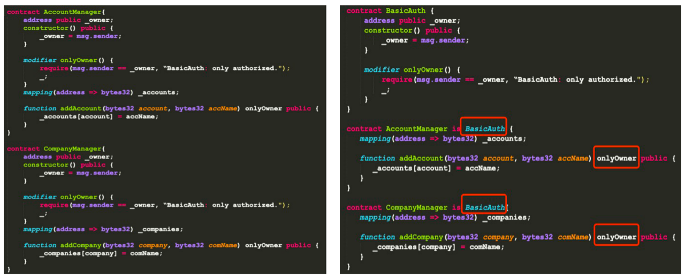

# 16大技巧快速实现高水准智能合约

作者：张龙｜FISCO BCOS 核心开发者

## 什么是智能合约？

智能合约是指把合同/协议条款以代码的形式电子化地放到区块链网络上，通过调用相关条款的接口实现执行，也可以把它当成是一种可自动执行的程序片段。作为区块链的参与者，智能合约既可以接收和存储价值，也可以向外发送信息和价值。
在区块链中，智能合约非常重要，其贯穿了区块链应用开发全流程。

从另一个角度，我们再来看下智能合约在交易执行过程中的重要性。
首先，在交易构建中，我们会进行合约部署与函数调用，合约部署依赖于智能合约的二进制编码。函数调用则依赖智能合约的ABI，这里的ABI是在智能合约编译阶段产生。
交易签名是对构建好的交易进行签名，然后将其在网络上进行交易广播与交易打包。
在交易执行前，需要完成合约部署，把智能合约的二进制编码存放到区块链网络上。交易执行阶段，也会回调获取整个智能合约的二进制编码，根据构建的交易解析相应二进制片段，二进制片段对应交易的执行指令集，交易会按照指令集执行。

由此可见，智能合约在整个交易流程中也非常重要。

## **FISCO BCOS平台的智能合约类型**

FISCO BCOS平台目前主要支持两种智能合约类型：Solidity智能合约与预编译智能合约。
预编译合约主要用于区块链底层平台，比如系统合约的实现。在应用开发层面，我们推荐使用Solidity合约和基于CRUD接口的预编译合约。
两者最大的区别在于，Solidity合约采用的是EVM引擎，预编译合约以及基于CRUD合约接口开发的预编译合约都是采用预编译引擎。这两个引擎在执行效力上有非常大的差异，后续会给大家详细介绍。
Solidity合约源自以太坊，现在许多平台都支持该合约。与其他开发语言类似，写Solidity合约需要先写合约名称，再去定义其状态变量，这里的状态变量类似java语言的成员变量，区别之处在于定义修饰符，修饰符用于条件或权限校验。

在这之后，是定义函数事件，函数事件重点记录了方法调用过程中的执行情况，以方便对智能合约的交易执行环节做业务层面的监控。定义构造方法的用法和创建类的实例化对象一样。
最后，我们会对定义的状态变量做一些操作或者业务上的处理，需要再去编写一些合约函数。以上就是Solidity合约的结构。
Solidity合约的优点在于覆盖用户与应用范围广泛，其功能强大，且经过多年发展，已逐步成熟稳定。

但相比原生合约，Solidity语言对开发者而言具备一定学习门槛；同时，在执行过程中需要使用EVM，性能有局限，EVM对象对内存开销较大；最后，智能合约的数据和逻辑是相对耦合的，不便于合约升级和存储扩容。
针对Solidity合约的缺点，FISCO BCOS设计了预编译合约。

预编译合约也有一些不足，比如，分配一些固定的合约地址、对底层源码进行编译。为了解决这些问题，我们开发了CRUD合约接口，开发过程中用户只要继承Table合约，通过引入抽象的接口文件Table.sol就可以开发基于CRUD接口的预编译合约。

基于CRUD接口的预编译合约本质上与Solidity合约并没有特别多差异。主要区别有三个：

1. 需要引入Table.sol合约接口。
2. 进行上链交易时，首先用接口提供的功能创建一张表，只有这样数据和逻辑才能做到分离。
3. 对合约相关状态变量的操作过程中，借助Table合约相关接口操作合约数据。比如，通过Table.insert接入口进行insert操作。

基于CRUD接口的预编译合约优点非常明显：

1. 类似于数据库的操作，面向接口的编程，降低学习门槛与成本。
2. 底层通过预约引擎执行，可并行执行，所以其性能非常高。
3. 底层以表的形式存储数据，做到数据和逻辑分离，便于合约升级和存储扩容。

但是其也有一些不足。

1. 基于FISCO BCOS平台，无法跨平台。
2. 适用一些业务逻辑简单的场景，例如存证业务。

## 16个小技巧快速写好智能合约

在智能合约开发过程中，我们往往面对三座大山。

1. 合约安全。安全是智能合约、区块链应用的基础和命脉。在整个区块链发展历史中出现过多次因为智能合约漏洞给用户、平台带来重大损失的事件。
2. 合约性能。性能是衡量区块链应用可用性的重要指标，决定系统的负载能力和用户体验。
3. 可扩展性。可扩展性是智能合约及区块链应用系统应对业务变更和升级的有效手段，可以确保系统升级的时效性和成本。

针对这三座大山，我们整理了16大技巧，帮助大家快速上手智能合约开发。

### 合约安全篇

这里，我们总结了几个智能合约安全问题。

- 程序错误：初始化方式错误，变量隐藏造成混用
- 检查不足：权限和边界检查不足
- 逻辑缺陷：出块者可操纵、重入攻击
- 恶意合约：骗取tx.origin， RTLO字符攻击

针对智能合约开发过程中的安全问题，给大家几个建议。

#### 技巧1：做好隐私数据的加密上链

智能合约上的数据是完全透明，所以需要一些数据隐私保护方案来确保数据安全。比如说通过哈希、同态加密或者零知识证明的方式对链上数据进行加密处理。

这份合约里的两个方法都很简单，就是添加一个雇员。在上面的写法中直接把合同相关信息写入，而下面的方法把合同哈希写入。为了确保用户隐私对合同进行加密处理。我们推荐第二种写法。

#### 技巧2：合理的设置状态变量和函数的可见范围

这里有两个modifyScore，一个使用的是public，另一个使用的是internal。两者区别在于，下面的Test合约里继承了Base合约，在testFunction里利用onlyOwner调用modifyScore。
如果直接采用public修饰符，在这里并不起作用，它不会去校验onlyOwner，因为public函数方法是对外暴露的，用户无需通过testFunction去调用onlyOwner，而是直接调用。所以一定要注意状态变量和函数的可见范围。

#### 技巧3：函数权限及变量边界检查

关于变量边界检查这里举一个例子：

我们要给学生成绩进行加分，假设其类型是uint8，在Solidity里uint8按数据换算是0到255的数据区间，如果不做校验将两个相加，可能会造成finalScore直接溢出，导致结果不正确。
所以我们在加法或者类似的变量操作之后，需要进行合法性的校验。如果在这里加一个require条件判断，就可以及时检查，确保业务逻辑的正确性。

#### 技巧4：学会利用安全工具

运用Securify，Mythx，Slither等工具对智能合约进行安全扫描，这样的工具非常多，有一些是完全免费的，大家可以了解并尝试使用自己感兴趣的工具。其他智能合约安全实现技巧这里就不过多赘述。

### 合约性能篇

保证智能合约的性能非常关键，如果系统的性能达不到要求，将影响整个系统的可用性。
而性能取决于代码运行期间对机器资源的占用。机器资源主要包括CPU、内存、网络等。
与中心化系统不同，区块链在共识阶段需要每个节点对每笔交易进行执行，每个节点的机器配置可能都不一样，而最短板的机器会影响整个区块链网络的性能。所以在一定的机器配置下可以通过智能合约节省一些资源消耗。
这里我们也给到大家一些优化建议。

#### 技巧5：减少不必要的计算和验证逻辑，减少CPU开销

这两个方法都是对一个数组进行平方求和，在errorMethod里对每个数进行平方计算。
下面的方法没有计算而直接输出结果，由于大量复杂计算会对区块链网络以及性能造成很大影响，建议像这样的复杂计算和验证逻辑无需在区块链智能合约里出现，而放到链下或者业务系统中实现。

#### 技巧6：减少不必要的数据，减少内存、网络和存储的开销

这里定义了两个公司的状态变量，在Company1中companyInduction变量存放公司的简介。这在Company2里被注释掉了。这是因为公司简介对链上交易逻辑没有多大影响，但从性能角度，其占据大量区块链网络节点内存、网络和存储开销，从而对整个网络性能造成极大压力。
所以建议大家只需把跟业务关联的核心数据、轻量化数据上链。

#### 技巧7：利用不同的数据组装形式，减少跨合约调用

跨合约调用中，区块链网络节点会重新建一个EVM，这个过程需要消耗时间，对内存开销与区块链网络性能影响都非常大。
因此，推荐灵活使用不同的数据组装形式，例如，使用结构体避免跨合约调用，从而节省区块链节点内存、网络以及时间开销。

#### 技巧8：通过智能合约提供的高级特性，比如继承，减少跨合约调用

上面两个例子，一个是通过合约引入直接调用，另一个是通过继承去调用合约里getName。
在智能合约里的继承指的是在编译阶段，把父合约代码全部Copy到子合约中进行编译。也就是说，在最终合约里，父合约融入到了子合约里。当调用父合约时，就不是跨合约调用。

#### 技巧9：改变数据类型，学会用空间换时间

上述例子通过mapping避免了数组的使用，提升查询时的性能。但是，按照以往经验，mapping所占用空间是数组的4倍，是否使用还要看业务具体需求：如果出于性能考虑，可以通过mapping改变数据类型，提升智能合约的执行效率。

#### **技巧10：紧凑状态变量打包，减少内存和存储开销**

什么是紧凑状态变量？智能合约在EVM中的执行基于栈，栈里有相应卡槽，每个卡槽是32位左右。如果不注意变量顺序，会占用更多卡槽，消耗更多资源。下面的gasUsed就是计算机资源的开销。

在上面示例中，如果定义了一个bytes1、bytes31、bytes32，同样占据的是64个byte，这里因为bytes1和bytes31在同一位置，EVM自动打入一个卡槽。而错误写法里，EVM放到了两个不同卡槽。因此上面的结构体占据两个卡槽，下面的占据三个卡槽，它们使用资源的情况也不同，在实际操作中，需要注意这些细节。

#### 技巧11：注意函数修饰符，减少不必要的执行

函数修饰符一般包括pure、view等，如果不加这些修饰符，区块链网络会自动把智能合约理解为一笔交易。按照以太坊黄皮书定义，查询操作为调用，对状态数据产生变更的就可以理解为交易。
交易需要经过执行、共识过程，调用则不用。在智能合约中，如果设置了view修饰符，就是一次调用，不需要执行共识、进入EVM，而是直接查询本地节点数据，因此性能会得到很大提升。

### 可拓展性篇

在智能合约开发过程中，上链部署之后，对智能合约的升级是非常复杂的事情。智能合约可扩展性的价值就在于以下几点：

- 最小化成本（时间+人力）进行业务升级
- 作为系统异常的应急处理方式
- 便于其他人的接手和维护

以下一些技巧，可帮助大家提升智能合约可扩展性。

#### 技巧12：逻辑和数据的分离：采用经典三层架构

左边的智能合约通过setScore对成绩做管理，但如果要对学生成绩增加其他属性，那整个合约需要重新定义、部署，导致之前链上的数据没法使用。
采用三层架构就能解决这个问题。
首先，我们把数据单独放在Score合约里，通过datamap管理，然后通过ScoreManager对数据操作。这就是经典三层架构，确保逻辑和数据分离。
如果Score里要新增其他字段，比如studentid，我们只需更新Score合约与ScoreManager合约，就可做到兼容。由于datamap里的数据完全不能变，我们只需在Manage合约里对不同数据实体进行不同逻辑处理就可以确保合约的可扩展性。

#### 技巧13：抽象通用逻辑

在左边合约里，每个合约都有onlyOwner修饰符，如果10个合约同时使用这个修饰符，维护成本将非常高。因此，建议大家重构出Base合约，在具体业务合约中继承，就可以进行复用了。这就是抽象通用逻辑实现合约的可扩展性。当下次合约升级时，只需修改Base合约即可。

#### 技巧14：模块化编程：单一职责模式

单一职责模式是一种编码规范。

左上的Rolemanager里包括两种角色account和company，也包括对两者的操作，其中显然违背了单一职责模式。一旦修改对账户的操作，对公司的操作也会随之改变，造成较大影响。
通过右下的方式把不同实体的操作分离。当修改account操作时，company操作不会受影响，从而减少了智能合约的维护成本。

#### 技巧15：尽量复用成熟库

尽量复用成熟库的第一个好处是提升智能合约开发效率；第二个是减少智能合约编写中的漏洞，毕竟成熟库是经过前人大量业务实践总结出来的，其安全性有保证。

#### 技巧16：适当预留空闲字段

在上面的ScoreManager合约里，Score结构体包括两个字段score本身与status成绩状态。如果需要增加studentid或其他备注信息，则需重新部署升级智能合约。因此，可以通过添加resever的保留字段的方式提升其可用性。但其实这样的方式也会对安全和性能造成影响。

今天主要跟大家分享了FISCO BCOS的两种智能合约。同时，针对智能合约安全、性能以及可扩展性，为大家提供了相应的开发技巧。智能合约的开发过程是安全、性能、可扩展性三者的博弈。开发者应根据实际业务需要选择适用的技巧与方案。

------

### Q&A

 **Q** ：合约升级重新部署，怎么让数据可以重用？两个合约地址，我的SDK层需要修改适配。

 **A** ：合约通过三层模式进行逻辑和数据分离后，如果需要合约升级，需要在数据处理层对不同的合约数据做不同的处理，SDK层面也需要进行适配。

 **Q** ：请问在uint256的话，在EVM栈中是占几个卡槽呢？

 **A** ：占用一个卡槽。

 **Q** ：智能合约能模糊查询吗？溯源如何处理？

 **A** ：在区块链上模糊查询、历史数据查询等是不建议做的，因为区块链不适合做大数据处理。目前我们提供数据导出工具，已开源，可以助力业务快速进行大数据处理。

 **Q** ：请问智能合约中怎么安全的处理百分比呢？

 **A** ：智能合约没有小数类型,在上链前可以按照精度乘100或1000，链下处理在除一下就可以了.

 **Q** ：能否绑定智能合约在某个节点上运行？同一个智能合约在某个节点上可否开多个实例？

 **A** ：不行的，智能合约的部署及交易的执行，都会进行全网共识，在所有共识节点执行，并在所有节点落盘（或同步账本）。智能合约部署相当于创建一个智能合约实例，多次部署会产生多个实例。