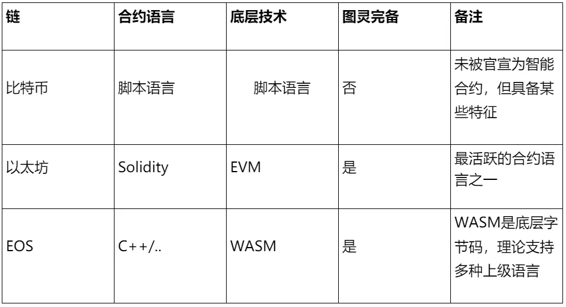
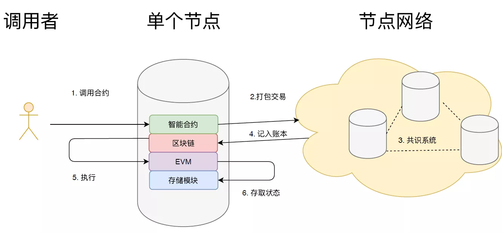

# 智能合约初探：概念与演变

作者：储雨知｜FISCO BCOS 核心开发者

## 前言

自2009年比特币开启区块链时代以来，近10年里，随着技术与生态的发展，基于区块链的分布式应用（dapp）呈现出井喷的趋势，而支撑着dapp的底层技术就是“区块链+智能合约”。
智能合约与区块链的结合，普遍被认为是区块链世界中一次里程碑式的升级。第一个结合了区块链与智能合约技术的平台--以太坊的诞生，被认为是开启了"区块链2.0"时代。

## 什么是智能合约

1996年，Nick Szabo在文章《Smart Contracts: Building Blocks For Digital Markets》中提出了智能合约的概念。
所谓“合约”，就是条文、合同一类的东西，里面记录了发生的条件与对应执行的条款，以支持确权等操作；所谓"智能"，就意味着自动化、可编程。

所以，智能合约就是可编程的合同，也可以理解为一段自动执行的条文合同，在计算机中，就是一段自动执行的程序片段。它更易于合约保存，并且由确定的算法运行，给定输入，就得到对应的输出，极大保障了合约的执行力。
以自动售货机做类比，可以帮助我们更好地理解智能合约的核心特征。
当使用者选择好要购买的货物并完成支付，出货逻辑就会被触发，用户就能得到想要的货物，而这个过程不需要人工介入，节省了售卖货物的人力成本。如果要破坏这个合约，就得物理破坏售卖机。像POS刷卡机、EDI（电子数据交换）等，也可作此种类比。

## 智能合约与区块链

智能合约在上世纪被提出，而区块链2009年才诞生，就定义而言，智能合约与区块链关系不大。
那为什么在这10年中，智能合约与区块链却产生了如此紧密的关联？因为区块链可以保证智能合约的不可篡改，不仅合约内容不可篡改，每次调用记录亦不可篡改。
智能合约产生价值的最基本前提是有一个强有力的底层介质用于储存，让其不可被物理破坏。

然而，智能合约的本体是一份代码，非常容易被篡改，如何为其提供强力的存储介质就成了问题。这正好是区块链擅长解决的——通过比特币的实践，证明了区块链可以在分布式环境下让电子记录不可被篡改。
与此同时，智能合约也在反哺着区块链，它极大地扩展了区块链的业务场景。

与智能合约结合后，区块链不再服务于单一的货币支付，可以延申到生活中的方方面面。丰富的应用场景也对区块链的能力产生了新的挑战。

## 区块链2.0：以太坊的诞生

2009年诞生的比特币，运用区块链等技术来保证生态，开创了区块链1.0时代。
用户可以通过脚本代码来定制一些内容，例如如何解锁一笔资金。这些脚本代码会随着交易一起保存，从而享有不可篡改的特质，并且是确定性的。所以从某种角度来说，这些脚本也可看作智能合约。可是它们并不好用。
首先，这些脚本代码不是图灵完备的，这限制了实现的功能；其次，开发门槛较高，编写复杂逻辑的体验会很差，好比用JVM字节码来写程序。

2013年，一个青年V神提出了以太坊，其核心是通过世界状态对区块链数据进行更新和验证。以太坊与比特币最大的不同在于可通过智能合约执行复杂的逻辑操作。
在以太坊上，智能合约的语言是Solidity，它是图灵完备且较为上层的语言，极大地扩展了智能合约的能力范畴，降低了智能合约编写难度。
正因为此，以太坊的诞生，也标志着区块链2.0时代开启。随后，智能合约技术逐步渗透了溯源、存证、供应链等多个业务场景。

## 智能合约的现状与前景

从编程角度而言，智能合约就是一段代码。相比常规代码，智能合约具有许多差别与限制，例如：

- 单线程执行
- 代码执行会消耗资源，不能超出资源限制
- 目前难以获取链外数据，例如取得天气信息、比赛结果等
- 其他限制，如TPS

这些特点使得目前智能合约生态以链上资源的治理为核心。就像以太坊上各式各样的ERC标准与治理方案；EOS上有各种资源模型，比如CPU、RAM、兼经济模型、Rex、Bancor协议等。
显然，就目前的生态而言，智能合约对现实世界的影响力有限。
但事物总是在发展的。目前，已有许多致力于突破这些限制的研究，典型的有Oracle（谕言机，但常被称为预言机），它允许智能合约和链外进行交互，这样就能大大提高智能合约的使用场景，彷佛一台电脑通上了网；再比如那些突破链自身性能瓶颈的尝试，例如支付通道、跨链、plasma、rollup，它们都从不同角度打破安全与性能的枷锁。
毋庸置疑，智能合约将扮演着越来越重要的角色，将来随着以太坊2.0的落地，也许会开启新一个区块链时代。

## 智能合约技术

以太坊采用了Solidity作为智能合约语言，Solidity 是一门为实现智能合约而创建的高级编程语言，能在允许以太坊程序的节点上运行。该语言吸收了C++、JavaScript的一些特性，例如它是静态类型语言，支持继承、库等。
除了Solidity，每个平台的智能合约技术也有所不同，接下来将从公有链、联盟链作为切入，介绍其他平台所采用的技术。

### 公有链

首先，不妨先认识三大公链的智能合约技术。



### 联盟链

除了公链，联盟链也是重要的区块链类型。比之公链，联盟链共识的复杂度被大大缩减，因此具有更高的执行效率。
联盟链受企业级机构青睐，一般而言，相关机构之间会形成联盟，通过联盟链来共享数据。联盟链可覆盖供应链金融、司法存证、溯源等多种场景，未来还会与IOT、AI等技术结合。
在当今联盟链生态中，除去采用chaincode的Fabric，大部分平台都采用Solidity作为智能合约语言，FISCO BCOS即是如此。

时下，Solidity可谓占据了智能合约的C位，掌握Solidity是学习智能合约和区块链的重要一环。后面系列也将对如何用Solidity编写、运行以及测试智能合约作深入介绍解析，敬请关注。
除了Solidity，WebAssembly、Libra的Move等一些智能合约语言也在发展中，可以保持关注。

## 智能合约运行分析

下面将分享一个基础的智能合约：HelloWorld。

```
pragma solidity 0.4.22;

contract HelloWorld{

    uint private _num;
    function store(uint256 num) public {
        _num = num;   
    }

    function get() public view returns (uint256){
        return _num;
    }
}
```

这段Solidity代码的功能是存取_num字段。该字段被称为“状态变量”，会由区块链持久存储。
用户可以将这段代码部署在以太坊或类似的区块链上，部署成功就意味着该智能合约不可再被修改，只要底层区块链不被销毁，这段合约就一直存在。任何人都可通过“合约地址”来调用该合约接口，每次调用信息都会被记录在链上。
在讲解这段代码如何运行之前，我们先回顾下传统java程序的运行方式。

首先，用户编译完java代码后，会以字节码的形式保存在磁盘上；然后用户会调用程序，这由JVM来托管执行；程序执行期间可能会通过日志来记录调用参数，也可能会和磁盘进行IO。
Solidity的执行与此类似。不同的是介质由硬盘换成了区块链，由单机变为分布式。
代码部署后，以字节码的形式存储在每一个节点上。当用户要求调用某个函数时，调用请求将会被囊括在交易中，并被打包到某个区块上，一旦全网对该区块形成共识，就意味着调用是合法的。
接下来，EVM会来调用字节码，它负责存取底层的状态变量，好比传统编程的IO。



光从代码来看，合约开发似乎不过如此，单个合约只需要围绕着字段进行操作，对于很多简单业务而言，不过是CRUD而已。
但其复杂性也恰恰在于此，合约在区块链环境上执行，是不可修改的。
所以如果出现了bug，就必须部署新的合约，这对于合约的可维护性提出了挑战。并且，一旦业务复杂起来，容易出现安全漏洞，导致链上资产损失。同时，还要考虑完成代码编写、逻辑执行、数据存储的成本问题。 
综上所述，写合约不难，但写好合约，却需要一定功底。

## 结语

本文介绍了智能合约的概念与历史演变。
智能合约是上世纪提出的技术，在区块链浪潮下焕发出了新的生机。反之，智能合约广泛的应用场景，又极大的促进了区块链发展。

学习智能合约，推荐选择Solidity语言，因为其具备一些传统语言的特征，同时，执行环境完全基于区块链，实际业务开发的体验与以往的编程体验会有所差别。
读者可以尝试基于FISCO BCOS快速搭建区块链环境，部署一个最简单的合约，熟悉部署、调用方式，再进一步走入Solidity的世界。

