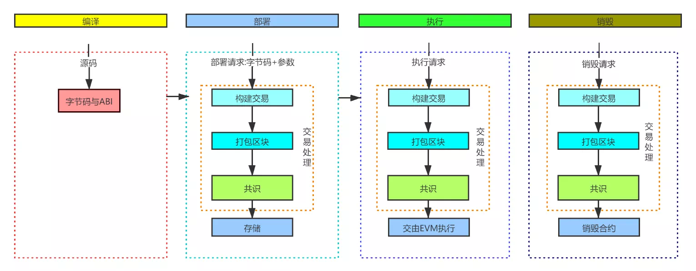
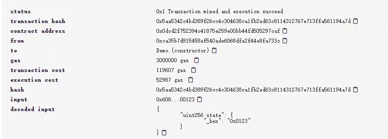
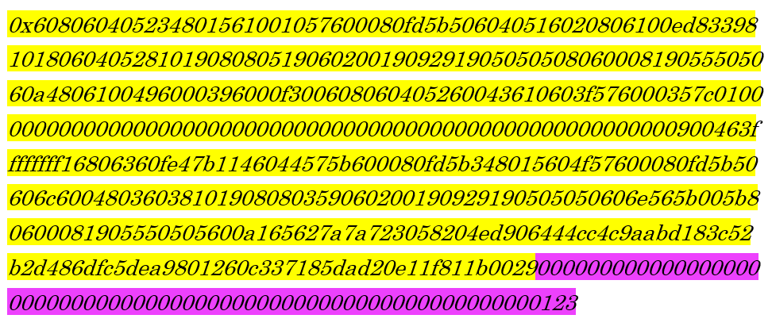
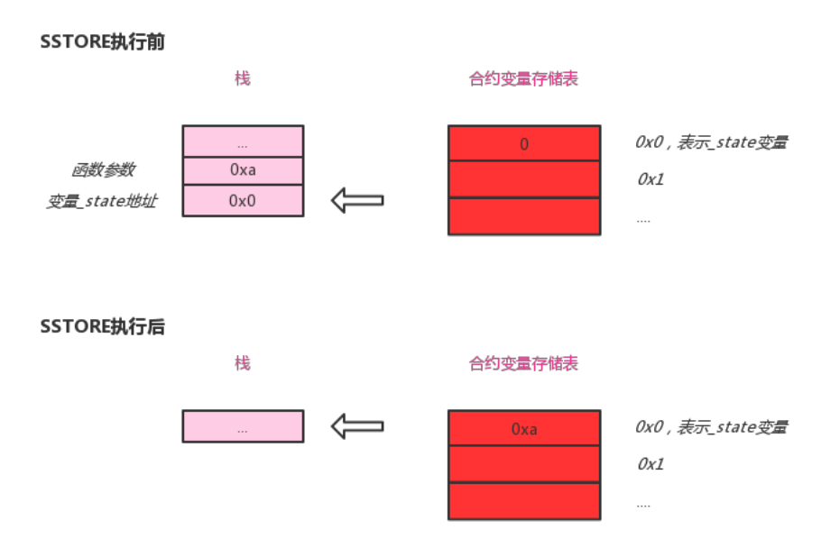
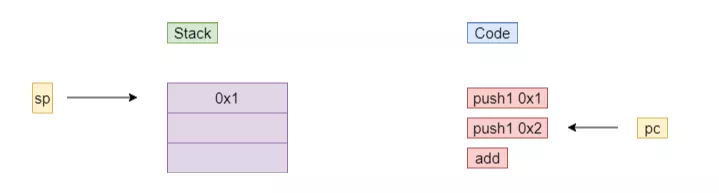
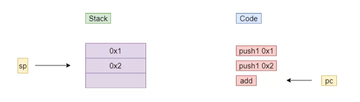
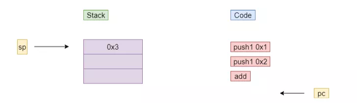
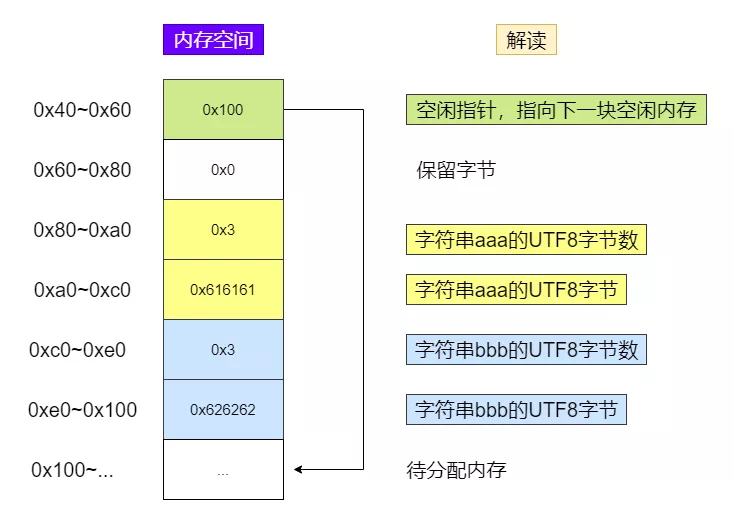

# 智能合约编写之Solidity运行原理

作者：储雨知｜FISCO BCOS 核心开发者

## 引 言

作为一门面向智能合约的语言，Solidity与其他经典语言既有差异也有相似之处。一方面，服务于区块链的属性使其与其他语言存在差异。例如，合约的部署与调用均要经过区块链网络确认；执行成本需要被严格控制，以防止恶意代码消耗节点资源。另一方面，身为编程语言，Solidity的实现并未脱离经典语言，比如Solidity中包含类似栈、堆的设计，采用栈式虚拟机来进行字节码处理。本系列前几篇文章介绍了如何开发Solidity程序，为了让读者知其然更知其所以然，本文将进一步介绍Solidity的内部运行原理，聚焦于Solidity程序的生命周期和EVM工作机制。

## Solidity的生命周期

与其他语言一样，Solidity的代码生命周期离不开编译、部署、执行、销毁这四个阶段。下图整理展现了Solidity程序的完整生命周期：



经编译后，Solidity文件会生成字节码。这是一种类似jvm字节码的代码。部署时，字节码与构造参数会被构建成交易，这笔交易会被打包到区块中，经由网络共识过程，最后在各区块链节点上构建合约，并将合约地址返还用户。当用户准备调用该合约上的函数时，调用请求同样也会经历交易、区块、共识的过程，最终在各节点上由EVM虚拟机来执行。

下面是一个示例程序，我们通过remix探索它的生命周期。

```
pragma solidity ^0.4.25;

contract Demo{
    uint private _state;
    constructor(uint state){
        _state = state;
    }
    function set(uint state) public {
        _state = state;
    }
}
```

### 编译

源代码编译完后，可以通过ByteCode按钮得到它的二进制：

```
608060405234801561001057600080fd5b506040516020806100ed83398101806040528101908080519060200190929190505050806000819055505060a4806100496000396000f300608060405260043610603f576000357c0100000000000000000000000000000000000000000000000000000000900463ffffffff16806360fe47b1146044575b600080fd5b348015604f57600080fd5b50606c60048036038101908080359060200190929190505050606e565b005b80600081905550505600a165627a7a723058204ed906444cc4c9aabd183c52b2d486dfc5dea9801260c337185dad20e11f811b0029
```

还可以得到对应的字节码（OpCode）：

```
PUSH1 0x80 PUSH1 0x40 MSTORE CALLVALUE DUP1 ISZERO PUSH2 0x10 JUMPI PUSH1 0x0 DUP1 REVERT JUMPDEST POP PUSH1 0x40 MLOAD PUSH1 0x20 DUP1 PUSH2 0xED DUP4 CODECOPY DUP2 ADD DUP1 PUSH1 0x40 MSTORE DUP2 ADD SWAP1 DUP1 DUP1 MLOAD SWAP1 PUSH1 0x20 ADD SWAP1 SWAP3 SWAP2 SWAP1 POP POP POP DUP1 PUSH1 0x0 DUP2 SWAP1 SSTORE POP POP PUSH1 0xA4 DUP1 PUSH2 0x49 PUSH1 0x0 CODECOPY PUSH1 0x0 RETURN STOP PUSH1 0x80 PUSH1 0x40 MSTORE PUSH1 0x4 CALLDATASIZE LT PUSH1 0x3F JUMPI PUSH1 0x0 CALLDATALOAD PUSH29 0x100000000000000000000000000000000000000000000000000000000 SWAP1 DIV PUSH4 0xFFFFFFFF AND DUP1 PUSH4 0x60FE47B1 EQ PUSH1 0x44 JUMPI JUMPDEST PUSH1 0x0 DUP1 REVERT JUMPDEST CALLVALUE DUP1 ISZERO PUSH1 0x4F JUMPI PUSH1 0x0 DUP1 REVERT JUMPDEST POP PUSH1 0x6C PUSH1 0x4 DUP1 CALLDATASIZE SUB DUP2 ADD SWAP1 DUP1 DUP1 CALLDATALOAD SWAP1 PUSH1 0x20 ADD SWAP1 SWAP3 SWAP2 SWAP1 POP POP POP PUSH1 0x6E JUMP JUMPDEST STOP JUMPDEST DUP1 PUSH1 0x0 DUP2 SWAP1 SSTORE POP POP JUMP STOP LOG1 PUSH6 0x627A7A723058 KECCAK256 0x4e 0xd9 MOD DIFFICULTY 0x4c 0xc4 0xc9 0xaa 0xbd XOR EXTCODECOPY MSTORE 0xb2 0xd4 DUP7 0xdf 0xc5 0xde 0xa9 DUP1 SLT PUSH1 0xC3 CALLDATACOPY XOR 0x5d 0xad KECCAK256 0xe1 0x1f DUP2 SHL STOP 0x29 
```

其中下述指令集为set函数对应的代码，后面会解释set函数如何运行。

```
JUMPDEST DUP1 PUSH1 0x0 DUP2 SWAP1 SSTORE POP POP JUMP STOP
```

### 部署

编译完后，即可在remix上对代码进行部署，构造参数传入0x123:


部署成功后，可得到一条交易回执：



点开input，可以看到具体的交易输入数据：



上面这段数据中，标黄的部分正好是前文中的合约二进制；而标紫的部分，则对应了传入的构造参数0x123。这些都表明，合约部署以交易作为介质。结合区块链交易知识，我们可以还原出整个部署过程：

- 客户端将部署请求(合约二进制，构造参数)作为交易的输入数据，以此构造出一笔交易
- 交易经过rlp编码，然后由发送者进行私钥签名
- 已签名的交易被推送到区块链上的节点
- 区块链节点验证交易后，存入交易池
- 轮到该节点出块时，打包交易构建区块，广播给其他节点
- 其他节点验证区块并取得共识。不同区块链可能采用不同共识算法，FISCO BCOS中采用PBFT取得共识，这要求经历三阶段提交（pre-prepare，prepare, commit）
- 节点执行交易，结果就是智能合约Demo被创建，状态字段_state的存储空间被分配，并被初始化为0x123

### 执行

根据是否带有修饰符view，我们可将函数分为两类：调用与交易。由于在编译期就确定了调用不会引起合约状态的变更，故对于这类函数调用，节点直接提供查询即可，无需与其他区块链节点确认。而由于交易可能引起状态变更，故会在网络间确认。下面将以用户调用了set(0x10)为假设，看看具体的运行过程。首先，函数set没有配置view/pure修饰符，这意味着其可能更改合约状态。所以这个调用信息会被放入一笔交易，经由交易编码、交易签名、交易推送、交易池缓存、打包出块、网络共识等过程，最终被交由各节点的EVM执行。在EVM中，由SSTORE字节码将参数0xa存储到合约字段_state中。该字节码先从栈上拿到状态字段_state的地址与新值0xa，随后完成实际存储。下图展示了运行过程：



这里仅粗略介绍了set(0xa)是如何运行，下节将进一步展开介绍EVM的工作机制以及数据存储机制。

### 销毁

由于合约上链后就无法篡改，所以合约生命可持续到底层区块链被彻底关停。若要手动销毁合约，可通过字节码selfdestruct。销毁合约也需要进行交易确认，在此不多作赘述。

## EVM原理

在前文中，我们介绍了Solidity程序的运行原理。经过交易确认后，最终由EVM执行字节码。对EVM，上文只是一笔带过，这一节将具体介绍其工作机制。

### 运行原理

EVM是栈式虚拟机，其核心特征就是所有操作数都会被存储在栈上。下面我们将通过一段简单的Solidity语句代码看看其运行原理：

```
uint a = 1;
uint b = 2;
uint c = a + b;
```

这段代码经过编译后，得到的字节码如下：

```
PUSH1 0x1
PUSH1 0x2
ADD
```

为了读者更好了解其概念，这里精简为上述3条语句，但实际的字节码可能更复杂，且会掺杂SWAP和DUP之类的语句。我们可以看到，在上述代码中，包含两个指令：PUSH1和ADD，它们的含义如下：

- PUSH1：将数据压入栈顶。
- ADD：POP两个栈顶元素，将它们相加，并压回栈顶。

这里用半动画的方式解释其执行过程。下图中，sp表示栈顶指针，pc表示程序计数器。当执行完push1 0x1后，pc和sp均往下移：



类似地，执行push1 0x2后，pc和sp状态如下：



最后，当add执行完后，栈顶的两个操作数都被弹出作为add指令的输入，两者的和则会被压入栈：




### 存储探究

在开发过程中，我们常会遇到令人迷惑的memory修饰符；阅读开源代码时，也会看到各种直接针对内存进行的assembly操作。不了解存储机制的开发者遇到这些情况就会一头雾水，所以，这节将探究EVM的存储原理。在前文《[智能合约编写之Solidity的基础特性](http://mp.weixin.qq.com/s?__biz=MzA3MTI5Njg4Mw==&mid=2247485625&idx=1&sn=9af6032cbf0ad0a3f7f8b7e85faebc77&chksm=9f2efaa5a85973b3fb118b3f1a6e2cd6aef8c1852ee97e93d98afeae71975c3cffc24a0b28fd&scene=21#wechat_redirect)》中我们介绍过，一段Solidity代码，通常会涉及到局部变量、合约状态变量。而这些变量的存储方式存在差别，下面代码表明了变量与存储方式之间的关系。

```
contract Demo{
    //状态存储
    uint private _state;

    function set(uint state) public {
        //栈存储
        uint i = 0;
        //内存存储
        string memory str = "aaa";
    }
}
```

#### 栈

栈用于存储字节码指令的操作数。在Solidity中，局部变量若是整型、定长字节数组等类型，就会随着指令的运行入栈、出栈。例如，在下面这条简单的语句中，变量值1会被读出，通过PUSH操作压入栈顶：

```
uint i = 1;
```

对于这类变量，无法强行改变它们的存储方式，如果在它们之前放置memory修饰符，编译会报错。

#### 内存

内存类似java中的堆，它用于储存"对象"。在Solidity编程中，如果一个局部变量属于变长字节数组、字符串、结构体等类型，其通常会被memory修饰符修饰，以表明存储在内存中。

本节中，我们将以字符串为例，分析内存如何存储这些对象。

##### 1. 对象存储结构

下面将用assembly语句对复杂对象的存储方式进行分析。assembly语句用于调用字节码操作。mload指令将被用于对这些字节码进行调用。mload(p)表示从地址p读取32字节的数据。开发者可将对象变量看作指针直接传入mload。在下面代码中，经过mload调用，data变量保存了字符串str在内存中的前32字节。

```
string memory str = "aaa";
bytes32 data;
assembly{
    data := mload(str)
}  
```

掌握mload，即可用此分析string变量是如何存储的。下面的代码将揭示字符串数据的存储方式：

```
function strStorage() public view returns(bytes32, bytes32){
    string memory str = "你好";
    bytes32 data;
    bytes32 data2;
    assembly{
        data := mload(str)
        data2 := mload(add(str, 0x20))
    }   
    return (data, data2);
}
```

data变量表示str的0~31字节，data2表示str的32~63字节。运行strStorage函数的结果如下：

```
0: bytes32: 0x0000000000000000000000000000000000000000000000000000000000000006
1: bytes32: 0xe4bda0e5a5bd0000000000000000000000000000000000000000000000000000
```

可以看到，第一个数据字得到的值为6，正好是字符串"你好"经UTF-8编码后的字节数。第二个数据字则保存的是"你好"本身的UTF-8编码。熟练掌握了字符串的存储格式之后，我们就可以运用assembly修改、拷贝、拼接字符串。读者可搜索Solidity的字符串库，了解如何实现string的concat。

##### 2. 内存分配方式

既然内存用于存储对象，就必然涉及到内存分配方式。memory的分配方式非常简单，就是顺序分配。下面我们将分配两个对象，并查看它们的地址：

```
function memAlloc() public view returns(bytes32, bytes32){
    string memory str = "aaa";
    string memory str2 = "bbb";
    bytes32 p1;
    bytes32 p2;
    assembly{
        p1 := str
        p2 := str2
    }   
    return (p1, p2);
}
```

运行此函数后，返回结果将包含两个数据字：

```
0: bytes32: 0x0000000000000000000000000000000000000000000000000000000000000080
1: bytes32: 0x00000000000000000000000000000000000000000000000000000000000000c0
```

这说明，第一个字符串str1的起始地址是0x80，第二个字符串str2的起始地址是0xc0，之间64字节，正好是str1本身占据的空间。此时的内存布局如下，其中一格表示32字节（一个数据字，EVM采用32字节作为一个数据字，而非4字节）：



- 0x40~0x60：空闲指针，保存可用地址，本例中是0x100，说明新的对象将从0x100处分配。可以用mload(0x40)获取到新对象的分配地址。
- 0x80~0xc0：对象分配的起始地址。这里分配了字符串aaa
- 0xc0~0x100：分配了字符串bbb
- 0x100~...：因为是顺序分配，新的对象将会分配到这里。

#### 状态存储

顾名思义，状态存储用于存储合约的状态字段。从模型而言，存储由多个32字节的存储槽构成。在前文中，我们介绍了Demo合约的set函数，里面0x0表示的是状态变量_state的存储槽。所有固定长度变量会依序放到这组存储槽中。对于mapping和数组，存储会更复杂，其自身会占据1槽，所包含数据则会按相应规则占据其他槽，比如mapping中，数据项的存储槽位由键值k、mapping自身槽位p经keccak计算得来。从实现而言，不同的链可能采用不同实现，比较经典的是以太坊所采用的MPT树。由于MPT树性能、扩展性等问题，FISCO BCOS放弃了这一结构，而采用了分布式存储，通过rocksdb或mysql来存储状态数据，使存储的性能、可扩展性得到提高。

## 结语

本文介绍了Solidity的运行原理，运行原理总结如下。首先，Solidity源码会被编译为字节码，部署时，字节码会以交易为载体在网络间确认，并在节点上形成合约；合约函数调用，如果是交易类型，会经过网络确认，最终由EVM执行。EVM是栈式虚拟机，它会读取合约的字节码并执行。在执行过程中，会与栈、内存、合约存储进行交互。其中，栈用于存储普通的局部变量，这些局部变量就是字节码的操作数；内存用于存储对象，采用length+body进行存储，顺序分配方式进行内存分配；状态存储用于存储状态变量。理解Solidity的运行方式及其背后原理，是成为Solidity编程高手必经之路。