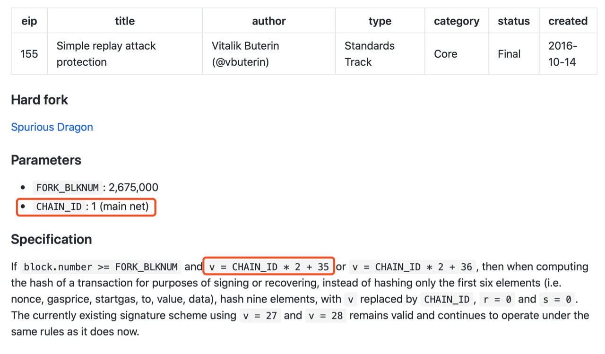

# 一个数字引发的探索——ECDSA解析

作者：李辉忠｜FISCO BCOS 高级架构师

FISCO BCOS交易签名算法基于ECDSA原理进行设计，ECDSA也是比特币和以太坊采用的交易签名算法。本文介绍ECDSA及椭圆曲线加密（ECC）相关知识、ECDSA的Recover机制和实现方式、FISCO BCOS交易签名和验签的底层原理。内容偏硬（shu）核（xue），欢迎对密码学原理、区块链底层原理感兴趣的开发者一起交流。

## 故事开始

故事要从以太坊中一个神奇的魔数开始说起。

以太坊黄皮书中，关于交易签名的阐述讲到两个特殊的数「27，28」，实际上是从「0，1」通过加了一个27演变得到「27，28」，所以本质上是一个特殊的数27。这个特殊的数字27代表了什么含义呢？一次侦探之旅开始了…

## **这像是一个bug**

搜索发现此前已有许多关于该问题的讨论，其中，Stack Exchange的一篇帖子指出这是一个设计bug。以太坊源码github上，也有一个相关issue，该issue被打上了「type:bug」的标签。

Stack Exchange帖子中有一个链接给出了修复该Bug的代码，请看下面截图（红框）。在注释说明和代码可见，fromRpcSig函数对27这个魔数进行了特殊处理。从RPC过来的签名中，v值如果小于27（可能是0-3），则直接加上27作为新v值，fromRpcSig函数通过这个方式兼容ECDSA原始v值（也就是recoveryID）和以太坊v值。

这真是以太坊设计的一个bug吗？回到刚才那个fromRpcSig的源代码文件，详细看其各接口实现，我们发现有这样一行代码「v: chainId ? recovery + (chainId * 2 + 35) : recovery + 27」，这行为v赋值的代码透露了三个信息，分别是魔数27、魔数35和ChainID。

于是，疑问更多了，魔数35是什么？ChainID又是什么？

## 这不像是一个Bug

带着这些疑问，再一次查阅相关设计材料，我们看到，以太坊EIP155中描述了有关ChainID的设计。基于以太坊源码构建的网络，实际运行的链有很多，为了防止一条链的交易被提交上链到另一条链，造成重放攻击，引入了ChainID的设计，在块高2,675,000的位置进行分叉实现。

明白了ChainID的作用，另一个疑问又产生了——以太坊中，有NetworkID来区分不同网络，为什么还需要ChainID？这要从NetworkID和ChainID的作用范围来解释。NetworkID主要在网络层面进行链的隔离，节点在建立相互连接的时候需要交换NetworkID，拥有一致的NetworkID才能完成握手连接。ChainID是交易层面，防止不同网络的交易被交叉重复攻击。以太坊（ETH）和经典以太坊（ETC）的主网NetworkID都是1，需要通过 ChainID机制才能防止交易在ETH和ETC网络之间交叉重放，ETH主网的ChainID是1，ETC主网的ChainID是61。说到这里其实还是没有搞清楚为什么是27，为什么是35？我们在EIP github的Issue#155中看到Jan和Buterin的交流记录，看来27是来自比特币的产物。

顺藤摸瓜，打开electrum的github，我们在electrum/electrum/ecc.py中找到如下代码

从代码中可见，electrum在签名时，为原本只有0-3之间的recid（recoveryID），加上了27，还有一个压缩标记，如果有压缩则再加上4，recid的值范围在27-34。至此可知，27和35大概来源于此，以太坊继承比特币的设计，在比特币源码bitcoin/src/key.cpp的CKey::SignCompact函数中也确定了该实现方式，但是比特币为什么如此设计，仍未可知。

## **ECDSA才是“bug”**

故事到这里，我们对以太坊代码中那个魔数27的前世今生有大概了解，但这仅仅是故事的开端，由此引发我们进一步思考一个问题：recoveryID是什么？为了解释清楚这个问题，我们需要从ECDSA算法着手，从数学角度理解其背后的原理。ECDSA是FISCO BCOS采用的交易签名算法，由此我们会发现，ECDSA算法有一种Recover机制，它才是真正“bug”级别的功能。

ECDSA（Elliptic Curve Digital Signature Algorithm）是基于椭圆曲线的数字签名算法。数字签名算法是采用公私钥体系实现类似写在纸上的普通签名，用于鉴别数字信息的方法，常见的数字签名算法包括DSA、RSA和ECDSA等。椭圆曲线密码（ECC）是基于椭圆曲线数学的公钥加密算法，建立在椭圆曲线离散对数困难问题之上，常用的协议有ECDH、ECDSA和ECIES等。椭圆曲线的参数可以有多种配置方式，也就存在多种不同的曲线，例如secp256k1、secp256r1、Curve25519等，不同曲线的安全性存在一些区别，在SafeCurves中有相关对比描述。

ECDSA算法主要包括以下四个关键功能：

### 产生密钥GenKey

- 选择一条椭圆曲线E_P(a,b)，选择基点G，G的阶数为n
- 选择随机数d ∈n为私钥，计算公钥Q = d⋅G

### 签名算法Sign

- 对消息m使用消息摘要算法，得到z=hash(m)
- 生成随机数k∈n，计算点(x, y)=k⋅G
- 取r=x mod n，若r=0则重新选择随机数k
- 计算s = k^−1(z+rd) mod n，若s=0则重新选择随机数k
- 上述(r,s)即为ECDSA签名

### 验证算法Verify

使用公钥Q和消息m，对签名(r,s)进行验证。

- 验证r,s∈n
- 计算z = hash(m)
- 计算u_1 =zs^−1 mod n和u_2 = rs^−1 mod n
- 计算(x, y) = u1⋅G+u2⋅Q mod n
- 判断r == x，若相等则签名验证成功

### 恢复算法Recover

已知消息m和签名(r,s)，恢复计算出公钥Q。

- 验证r, s∈n
- 计算R=(x, y)，其中x=r,r+n,r+2n...，代入椭圆曲线方程计算获得R
- 计算z = hash(m)
- 计算u_1 = −zr^−1 mod n和u_2 = sr^−1 mod n
- 计算公钥Q= (x’, y’)=u_1⋅G+u_2⋅R

为了回答recoveryID的问题，我们重点关注「恢复算法Recover」。在计算R的步骤可以看到，存在多个x的取值可能性，导致存在多个R的可能性，因此计算得到的Q也存在多个可能的结果，需要通过和已知的公钥对比，确定哪一个Q是正确的。如果遍历x的所有可能都未找到正确的Q，说明该消息和签名是不对应的，或者是一个未知的公钥。

为了确定正确的Q，需要遍历x的所有可能取值，跑多轮Recover算法，这个时间开销是比较大的。**为了提高Recover的时间效率，采用空间换时间的思路，在签名中增加一个v值，用于快速确定x，避免遍历查找试探，这个v值就是recoveryID。**

在区块链系统中，客户端对每笔交易进行签名，节点对交易签名进行验证。如果采用「验证算法Verify」，那节点必须首先知道签发该交易所对应的公钥，因此需要在每笔交易中携带公钥，这需要消耗很大带宽和存储。如果采用「恢复算法Recover」，并且在生成的签名中携带recoveryID，就可以快速恢复出签发该交易对应的公钥，根据公钥计算出用户地址，然后在用户地址空间执行相应操作。

这里潜藏了一个区块链设计哲学，区块链上的资源（资产、合约）都是归属某个用户的，如果能够构造出符合该用户地址的签名，等同于掌握了该用户的私钥，因此节点无需事先确定用户公钥，仅从签名恢复出公钥，进而计算出用户地址，就可以执行这个用户地址空间的相应操作。**FISCO BCOS基于这个原理设计实现了交易签名和验签**。

## **recoveryID的计算**

关于JavaSDK性能优化的文章（[记一次JavaSDK性能从8000提升至30000的过程](http://mp.weixin.qq.com/s?__biz=MzA3MTI5Njg4Mw==&mid=2247485438&idx=1&sn=2d68d0f051dd42a0c68dc9da39538ea9&chksm=9f2ef5e2a8597cf4a96620f95b16b734b0efd55d7463c4d0bf04b46b51acce4cf68794a480af&scene=21#wechat_redirect)）中提到一个关键优化点——recoveryID的计算，这里仔细展开讨论。

ECDSA签名（r,s），其中r是椭圆曲线上一个点kG (x, y)对应的x mod n，相当于签名信息中只留下了X轴坐标相关的值，丢弃了Y轴相关的值。在「恢复算法Recover」中尝试找回Y轴对应的值构造R，进而恢复出公钥。

由于r = x mod n，因此r,r+n,r+2n…都可能是合法的原始x值，不同的椭圆曲线存在不同数量这样合法的x值，FISCO BCOS采用的secp256k1曲线存在两个可能r, r+n。

每一个X轴坐标对应两个可能的Y坐标，因此FISCO BCOS中具备四种可能的R，(r, y) (r, -y) (r+n, y’) (r+n, -y’)。但是，对于一个r值存在两个X轴坐标的概率极低，低到几乎可以忽略，以太坊中就忽略了这两种小概率事件。

那这个小概率事件的概率具体有多小呢？这要从secp256k1曲线的参数说起，通常描述一个椭圆曲线的点（x,y）的时候，x和y的值是 mod p 的结果，p是曲线的参数，它是一个大素数，之前提到的n也是曲线的参数，等于这条曲线上点的数量（曲线上点的数量为n*h，h也是曲线参数，该曲线h=1），在secp256k1中，n和p的值非常接近，具体可见下图。

由于r = x mod n，x是mod p的结果，r是mod n的结果，x值的范围是[0, p-1]，r值的范围是[0, n-1]。如果r+n也是曲线上的点，则r的值必须小于p-n，概率为 (p-n) / p，大约为3.73*10^-39，这个概率是非常小的。

基于签名结果（r, s）和签名过程中生成的随机点（x, y）的y值，recoveryID的计算方式如下：

1. id = y & 1;  //「签名算法Sign」中kG点的y坐标，根据奇偶性设置id值，因为y是mod p的结果，其奇偶性与坐标轴的正负性是完全对应的
2. id |= (x != r ? 2 : 0);  // 小概率事件，如前文解释
3. if (s > n / 2) id = id ^ 1;  // 签名计算得出的s如果大于n/2就会取n-s作为s值，因此这里做相应转换，这两个转换是同时发生的

[JavaSDK性能优化](http://mp.weixin.qq.com/s?__biz=MzA3MTI5Njg4Mw==&mid=2247485438&idx=1&sn=2d68d0f051dd42a0c68dc9da39538ea9&chksm=9f2ef5e2a8597cf4a96620f95b16b734b0efd55d7463c4d0bf04b46b51acce4cf68794a480af&scene=21#wechat_redirect)的文章就是基于这个计算公式，将遍历探寻recoveryID改为计算获得，大幅提升了性能。

## 后话

从一个神奇的数字开始，查阅相关资料，了解设计原理，进而闯入ECDSA的世界，在一堆数学公式中迷茫、游荡，问题一个接着一个。一开始雾里看花，似懂非懂，靠着处女座的洁癖精神，总算把心中疑问一一化解。精妙绝伦的密码协议，高深莫测的数学理论，做一个区块链码农，要学习的东西还很多。唯有苦其心志，劳其筋骨，善待每一个疑点，不放过每一处细节。总会有一天，那时拨开云雾见天日，守得云开见月明。

------

#### 参考资料

- [Ethereum yellow paper](https://ethereum.github.io/yellowpaper/paper.pdf)
- [Stack Exchange](https://ethereum.stackexchange.com/questions/78929/whats-the-magic-numbers-meaning-of-27-or-28-in-vrs-use-to-ecrover-the-sender/78930?newreg=a613981e27424bc4b1c2c0e00d939327)
- [ISSUE](https://github.com/ethereum/go-ethereum/issues/2053)
- [EIP155](https://github.com/ethereum/EIPs/blob/master/EIPS/eip-155.md)
- [EIP155 Issue](https://github.com/ethereum/eips/issues/155)
- [ChainID](https://chainid.network)
- [ECC wiki](https://en.wikipedia.org/wiki/Elliptic-curve_cryptography)
- [ECDSA wiki](https://en.wikipedia.org/wiki/Elliptic_Curve_Digital_Signature_Algorithm)
- [Curve25519 wiki](https://en.wikipedia.org/wiki/Curve25519)
- [SafeCurves](https://safecurves.cr.yp.to/index.html)
- [ECC SEC1](http://www.secg.org/sec1-v2.pdf)
- [ECC SEC2](https://www.secg.org/sec2-v2.pdf)

