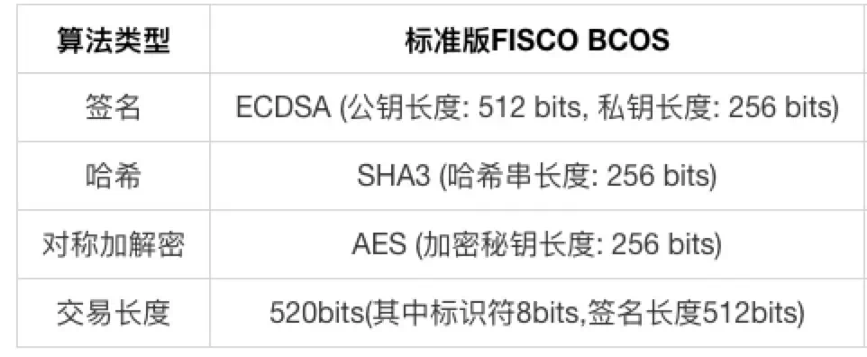

# FISCO BCOS证书说明

作者：李昊轩｜FISCO BCOS 核心开发者

联盟链中，链上的多方参与是一种协作关系；联盟链向授权的组织或机构开放，有准入机制。在准入机制中，证书是各参与方互相认证身份的重要凭证；可以说，**证书机制是联盟链网络安全的基石**。

## Part1：FISCO BCOS 证书结构

FISCO BCOS网络采用面向CA的准入机制，使用x509协议的证书格式，支持任意多级的证书结构，保障信息保密性、认证性、完整性及不可抵赖性。根据现有业务场景，FISCO BCOS默认采用三级的证书结构，自上而下分别为链证书、机构证书、节点证书。


▲ 图：x509协议的证书格式

证书内容包括了证书版本号、序列号、证书的签名算法、消息摘要算法等生成信息；同时包括了证书的颁发者、有效期、使用者、公钥信息、SSL通信需要用到的密码套件等信息。节点通过加载证书，在接受数据包时，根据证书规定的密码套件和其消息字段，对数据包中携带的证书进行验证。

## Part2：角色定义

FISCO BCOS的证书结构中有４种角色，分别是联盟链委员会、联盟链成员机构、联盟链参与方（节点和SDK）。

### 1. 联盟链委员会

联盟链委员会拥有联盟链的根证书ca.crt和私钥ca.key，通过使用ca.key对联盟链成员机构签发机构证书，负责完成联盟链成员机构的准入、剔除等操作。

### 2. 联盟链成员机构

联盟链成员机构为经过联盟链委员会许可，加入到联盟链的机构。联盟链成员机构拥有机构私钥agency.key和经过根私钥ca.key签发的机构证书agency.crt。联盟链成员机构可以通过机构私钥签发节点证书，从而配置本机构的节点和SDK。

### 3. 联盟链参与方

联盟链参与方可以通过运行节点或SDK联盟链交互，拥有与其他节点进行通信的节点证书node.crt和私钥node.key。联盟链参与方运行节点或SDK时，需要加载根证书ca.crt和相应的节点证书node.crt和私钥node.key；与其他成员进行网络通信时，使用预先加载的证书进行身份认证。

## Part3：证书生成流程

### 1. 联盟链委员会初始化根证书ca.crt

- 本地生成私钥ca.key；自签生成根证书ca.crt。


### 2.联盟链成员机构获取机构证书agency.crt

- 本地生成私钥agency.key；
- 由本地私钥生成证书请求文件agency.csr；
- 将证书请求文件agency.csr发送至联盟链委员会；
- 联盟链委员会使用ca.key对证书请求文件agency.csr进行签发，得到联盟链成员机构证书agency.crt；
- 联盟链委员会将联盟链成员机构证书agency.crt发送至对应成员。


### 3.节点/SDK获取证书node.crt


- 本地生成私钥node.key；

- 由本地私钥生成证书请求文件node.csr；

- 将证书请求文件node.csr发送至联盟链成员机构；

- 联盟链成员机构使用agency.key对证书请求文件node.csr进行签发，得到节点/SDK证书node.crt；

- 联盟链成员机构将节点证书node.crt发送至对应实体。

  

▲ 图：节点私钥相关说明

## Part4：证书生成实例

以生成联盟链成员机构机构证书为例：

1.机构首先在本地使用机构私钥agency.key生成证书请求文件agency.csr；

```
openssl req -new -sha256 -subj "/CN=$name/O=fisco-bcos/OU=agency" -key ./agency.key -config ./cert.cnf -out ./agency.csr
```

2.联盟链委员会根据证书请求文件生成机构证书agency.crt；

```
openssl x509 -req -days 3650 -sha256 -CA ./ca.crt -CAkey ./ca.key -CAcreateserial -in ./agency.csr -out ./agency.crt  -extensions v4_req -extfile ./cert.cnf
```

上述过程中的cert.cnf为证书信息配置项，可以采用默认设置。

## Part5：小结及参考文档

本文介绍了FISCO BCOS采用的相关证书说明和其对应的层级架构；在后续文章中，我们会具体讲解SSL握手过程中如何使用这些数字证书。 

------

#### 参考资料

- [证书说明](https://fisco-bcos-documentation.readthedocs.io/zh_CN/latest/docs/manual/certificates.html)
- [权限控制](https://fisco-bcos-documentation.readthedocs.io/zh_CN/latest/docs/manual/permission_control.html)
- [节点准入](https://fisco-bcos-documentation.readthedocs.io/zh_CN/latest/docs/manual/node_management.html)

