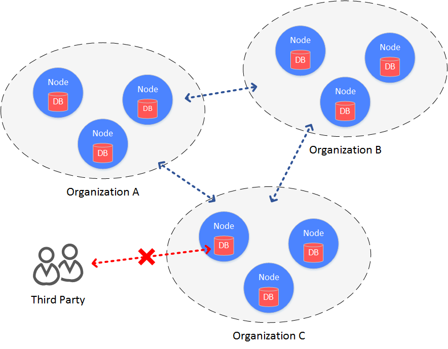
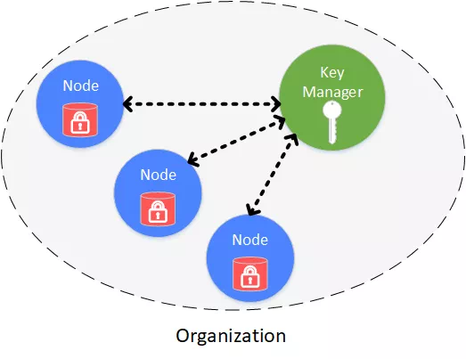

# FISCO BCOS的落盘加密

作者：石翔｜FISCO BCOS 核心开发者

区块链部署是多方参与的，为了简化多方协作环境的搭建，通常会使用公有云部署区块链。机构将自己的节点部署到云上，让服务与云上的节点进行交互，实现多方协作。在这个架构中，机构内部的安全性是很高的，尤其是在金融机构。
虽然通过网络的隔离机制，将节点限制在“内网”中，通过网络不能轻易地盗取数据，但是数据全部托管在云上，由于所有参与者都会保存一份数据，在网络和系统安全措施有疏漏或操作不当等极端情况下，可能出现某一份数据被越权访问的情况。
为了防止数据盘被攻破或者盗取，避免数据泄露情况的发生，FISCO BCOS引入了“落盘加密”的功能。

## 背景架构

在联盟链的架构中，机构和机构之间搭建一条区块链，数据在联盟链的各个机构内是可见的。
在某些数据安全性要求较高的场景下，联盟内部的成员并不希望联盟之外的机构能够获取联盟链上的数据。此时，就需要对联盟链上的数据进行访问控制。

联盟链数据的访问控制，主要分为两个方面：

- 链上通信数据的访问控制
- 节点存储数据的访问控制

对于链上通信数据的访问控制，FISCO BCOS是通过节点证书和SSL来完成。此处主要介绍节点存储数据的访问控制，即落盘加密。



## 主要思想

落盘加密是在机构内部进行的。在机构的内网环境中，每个机构独立地对节点的硬盘数据进行加密。
当节点所在机器的硬盘被带离机构，并让节点在机构内网之外的网络启动，硬盘数据将无法解密，节点无法启动，进而无法盗取联盟链上的数据。

## 方案架构



落盘加密是在机构内部进行的，每个机构独立管理自己硬盘数据的安全。内网中，每个节点的硬盘数据是被加密的。所有加密数据的访问权限，通过Key Manager来管理。
Key Manager部署在机构内网里，是专门管理节点硬盘数据访问秘钥的服务，外网无法访问。当内网的节点启动时，从Key Manager处获取加密数据的访问秘钥，来对自身的加密数据进行访问。

加密保护的对象包括：

- 节点本地存储的数据库：rocksdb或leveldb
- 节点私钥：node.key，gmnode.key（国密）

## 实现原理

具体的实现过程，是通过节点自身持有的秘钥（dataKey）和Key Manager管理的全局秘钥（superKey）来完成的。

### 节点

- 节点用自己的dataKey，对自身加密的数据（Encrypted Space）进行加解密。
- 节点本身不会在本地磁盘中存储dataKey，而是存储dataKey被加密后的cipherDataKey。
- 节点启动时，拿cipherDataKey向Key Manager请求，获取dataKey。
- dataKey只在节点的内存中，当节点关闭后，dataKey自动丢弃。

### Key Manager

持有全局的superKey，负责对所有节点启动时的授权请求进行响应。

- Key Manager在节点启动时必须在线，响应节点的启动请求。
- 当节点启动时，发来cipherDataKey，Key Manager用superKey对cipherDataKey进行解密，若解密成功，就将节点的dataK返回给节点。
- Key Manager只能在内网访问，机构外的外网无法访问Key Manager。


## 相关操作

### Key Manager操作

在每个机构上启动一个key-manger程序，用如下命令启动，指定Key Manager：

```
# 参数：端口，superkey
./key-manager 31443 123xyz
```

### 节点操作

#### （1）配置新节点dataKey

```
# 参数：Key Manager IP，端口，dataKey
bash key-manager/scripts/gen_data_secure_key.sh 127.0.0.1 31443 12345
```

得到cipherDataKey，脚本自动打印出落盘加密所需要的ini配置(如下)。此时得到节点的cipherDataKey：cipher_data_key=ed157f4588b86d61a2e1745efe71e6ea。

```
[storage_security]
enable=true
key_manager_ip=127.0.0.1
key_manager_port=31443
cipher_data_key=ed157f4588b86d61a2e1745efe71e6ea
```

将得到的落盘加密的ini配置，写入节点配置文件（config.ini）中。

#### （2）加密新节点的私钥

执行脚本，加密节点私钥：

```
# 参数：ip port 节点私钥文件 cipherDataKey
bash key-manager/scripts/encrypt_node_key.sh 127.0.0.1 31443 
nodes/127.0.0.1/node_127.0.0.1_0/conf/node.key 
ed157f4588b86d61a2e1745efe71e6ea
```

执行后，节点私钥自动被加密，加密前的文件备份到了文件node.key.bak.xxxxxx中，请将备份私钥妥善保管，并删除节点上生成的备份私钥。

**注意**：

国密版比非国密版需要多加密一个文件：

- 非国密版：conf/node.key
- 国密版：conf/gmnode.key和conf/origin_cert/node.key

#### （3）启动节点

直接启动节点即可。如果这个节点所在的硬盘被带出机房（内网），将无法访问Key Manager。节点拿不到自己的dataKey，无法解密硬盘数据，也无法解密自己的私钥，因而无法启动。

## 注意事项

- Key Manager是一个demo版本，目前superKey是通过命令行在启动的时候指定，在实际应用中，需要根据安全要求，自己定制加载superKey的方式，比如使用加密机进行管理。
- 落盘加密的配置只针对新生成的节点，节点一旦启动，将无法转换成带落盘加密的节点。
- 国密版的落盘加密比非国密版多加密一个私钥。

------

#### 参考链接

[Key Manager源码](https://github.com/FISCO-BCOS/key-manager)

[Key Manager源码gitee地址](https://gitee.com/FISCO-BCOS/key-manager)
