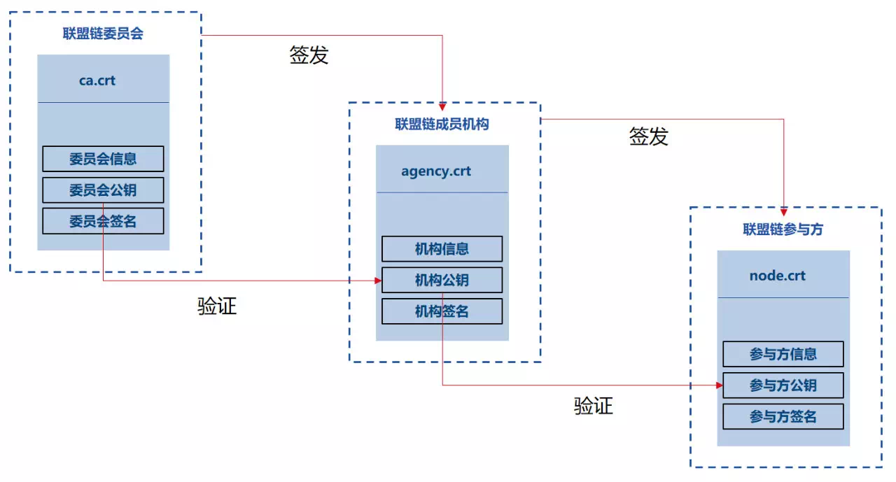
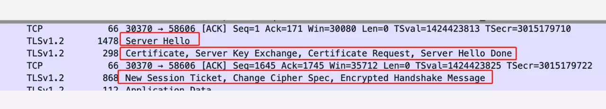
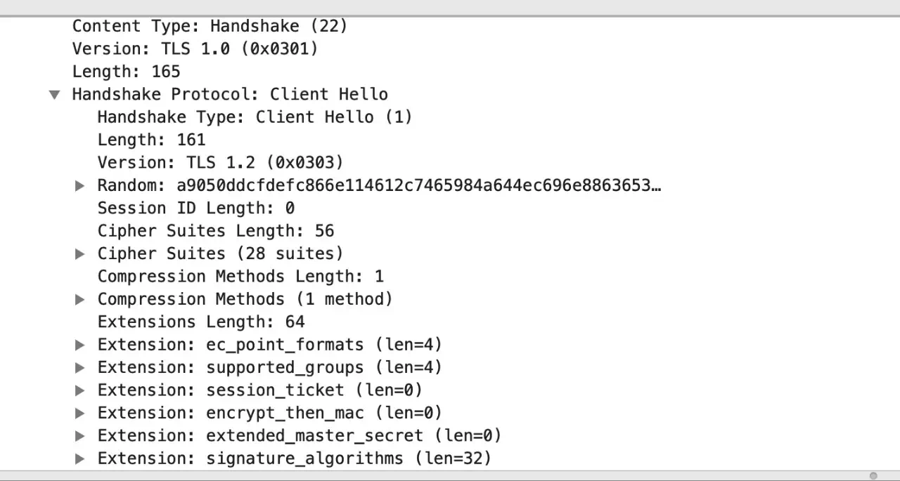
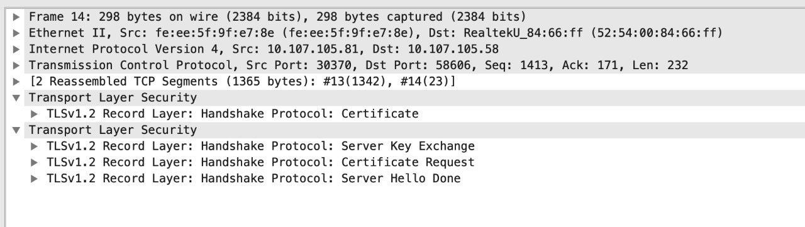
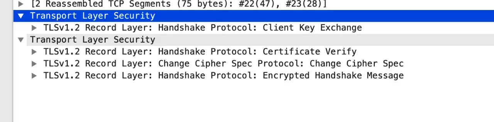

# FISCO BCOS的TLS1.2握手流程

作者：李昊轩｜FISCO BCOS 核心开发者

### 写在前面

之前我们说过，互联网上应该质疑一切，因此采用传统明文方式发送数据包无疑是非常不安全的。因此https协议中要求需要加密，那么加密前需要做什么，本文将对握手建立前，通信双方的具体流程进行分析。

SSL通信过程是TLS1.2 **[1]** 的内容。最终目的是安全的传输数据包。SSL通信的核心是通过证书验证身份，之后通过"握手"交互生成一个本次通信的非对称会话主密钥。然后在本轮通信过程中，通过这个会话主密钥对数据包进行加解密，并在网络上只传递密文。

本文将以FISCO BCOS节点通信双向认证为例，讲解通信双方如何加载、使用、验证证书，并如何生成会话主密钥。

## Part 1 主密钥设置

网络压缩主要在P2P网络层实现，系统框架如下：  TLS中的主密钥是一个对称密钥，即client端和server端使用的密钥是相通的，握手的过程也就是双方通过交互一些随机数，来完成主密钥的设置。 

我们以DH密钥交换算法x协商主密钥为例，设攻击者为Eve，Eve可以获取他们传输的中间值：

1. Alice和Bob先协商公平一个大素数p，和生成元g，Eve可以获取p和g；
2. Alice选择随机整数a∈Zp，计算A=g^a modp，将A发送给Bob，Eve可以获取A
3. Bob选择随机整数b∈Zp，计算B=g^b modp，将B发送给Alice，Eve可以获取B
4. Alice计算S=B^a = g^(ab) modp
5. Bob计算S=A^b = g^(ab) modp

通过上述过程，Alice和Bob协商出了一个密钥S，虽然Eve获取了中间值A，B，p，g，根据离散对数问题，Eve无法获取S具体的值。

## Part 2 证书验证

之前的文章中我们讲到 [证书的签发流程](https://mp.weixin.qq.com/s?__biz=MzU5NTg0MjA4MA==&mid=2247484692&idx=1&sn=3163aec2574ce0bf7d4f64e899e9bb6d&chksm=fe6a805bc91d094df15ed5c5988897d307ed519efbb0b26c2056ad35df3a491cea1e556ee70e&token=951660177&lang=zh_CN&scene=21#wechat_redirect)（点击阅读），在本节中将以三级证书为例，讲解证书的验证过程。TLS握手中的证书验证，即通过加载双方预先都信任的根证书，从而认证对方的身份。



▲感谢社区核心开发者黎连文贡献的图

- 在程序启动时，会首先加载本地的ca.crt和node.crt；
- 当节点验证对方的证书时，会首先使用对方node.crt中的公钥验证附带的签名，当验证通过时，可以确认对应节点拥有当前node.crt对应的node.key；
- 之后节点会使用agency.crt中的信息验证node.crt是否为合法的agency签发；
- 最后节点会使用本地加载ca.crt中的信息验证agency.crt是否为联盟链委员会签发；
- 当两者都验证通过时，表示节点接收到的node.crt是由本地加载的ca.crt签发的。

## Part 3 TLS握手流程

下图是我们采用对两台服务器进行抓包得到了TLS握手流程：


▲Client端



▲server端

**在流程中我们一共看到了6个数据包，分别为：**

- client向server发送的client hello
- server向client发送的server hello，发送server证书，进行参数协商
- client向server发送的client证书，进行参数协商
- server向client发送的结束标志，握手完成

### (1) client hello

在这步中，client向server发起建连请求，并告知server以下信息：

```
{
client端支持的TLS协议
支持xxx加密算法
密钥协商过程需要的随机数
}
```




### (2) server hello



server端接收到client的请求后，对其进行回应，包括：

```
{
我本次使用的TLS协议
这是我的随机数
本次会话我们的session id
本次我们使用的加密算法
}
```

### (3) server communicate


如图所示，共包含四个部分:

```
{
server端证书certificate
密钥交换参数server key exchange
验证client端的请求 certificate request
server端 发送完毕 server hello done
}
```

(2)(3)两步的操作可以总结为：server端对client端做出了“我们使用xx算法协商会话主密钥，这是我的证书，这是我的协商参数，请把你的证书发给我”的回应。

### (4) client certificate

client端收到server的certificate request后，会将自己的证书发送给对方。

### (5) client communicate



在这步中，client会先使用本地加载的ca.crt 验证server证书，之后进行参数协商操作，数据包中内容有：

```
{
client 密钥交换参数
client 对server端证书的验证结果
使用会话主密钥的密文传输内容
client对(1)(2)(3)过程的签名
}
```

### (6) server handshake established


server端接收到数据包后，会开始使用会话主密钥对数据包进行加密传输。

------

#### 参考资料

[【1】TLS(Transport Layer Security)](https://baike.baidu.com/item/TLS/2979545?fr=aladdin)：安全传输层协议用于在两个通信应用程序之间提供保密性和数据完整性。该协议由两层组成： TLS 记录协议（TLS Record）和 TLS 握手协议（TLS Handshake）。

[【2】Discrete Logarithm Problem](https://www.doc.ic.ac.uk/~mrh/330tutor/ch06s02.html)


