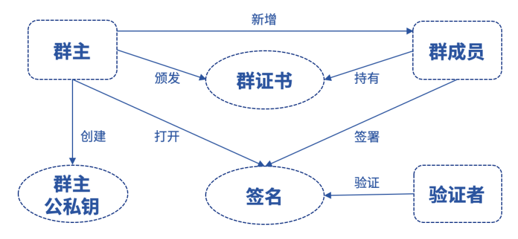
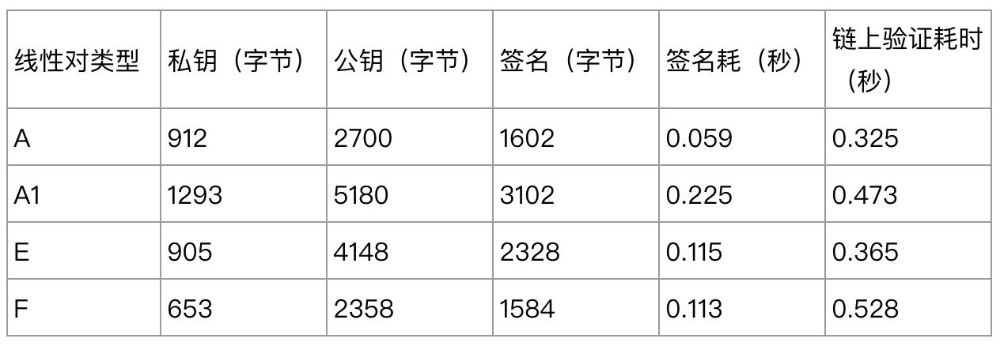
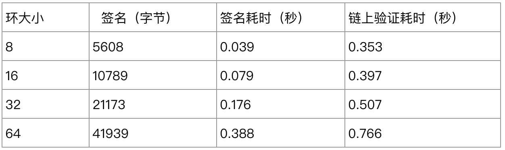
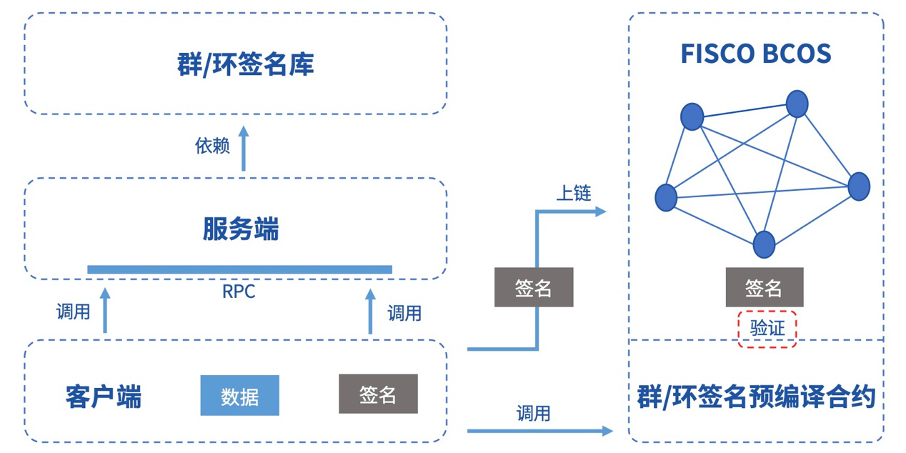

# FISCO BCOS隐私特性：群/环签名技术实现

作者：贺双洪｜FISCO BCOS 核心开发者

## 前言

安全与隐私一直是区块链领域的热点话题，也是各大主流区块链平台必争的战略高地。FISCO BCOS从底层到应用、架构到协议、存储到网络等多方面针对安全和隐私作出较大努力，目前已实现账户管理、落盘加密、安全通讯、权限控制等功能模块。本文将对FISCO BCOS隐私特性之一群环签名展开介绍。

群/环签名是一种特殊的签名算法，最初是为了实现隐匿支付而应用在区块链领域。其能很好地隐藏签名者身份，既能让节点验证交易签名的正确性，又不会暴露交易发起者的公钥信息。这一特性在联盟链中有着广阔的应用前景。

## 什么是群/环签名

了解群/环签名，得从匿名性说起。

在现实世界，匿名性是指主体的行为不会暴露主体的身份，这几乎是人类文明诞生伊始便存在的需求。

从密码学的角度，匿名性有两种含义：

1. 给定一个密文，无法还原其公钥，主要用于密码算法的安全性分析；
2.  用户使用密码方案过程中不会发生身份信息的泄露，更符合现实世界的语义。

密码学中最早隐含身份概念的是电子签名，签名者通过私钥对消息签名，验证者可以使用签名者的公钥验证签名的合法性。在实际应用中，公钥往往和证书绑定（基于身份加密除外，因为身份即公钥，所以没有证书），证书的属性天然揭露属主的身份信息，所以传统的签名方案缺少匿名性。

上世纪九十年代初，Chaum和van Heyst在欧密会(EUROCRYPT)上提出了群签名的概念，有效解决了电子签名的身份隐私问题。

群签名中的“群”可以理解成一个组织。组织里有一个leader即群主，负责成员管理，组织里的每个成员都可以**匿名**地代表组织进行签名。群签名方案主要算法包括：

- 创建群，由群主执行，生成群主私钥和群公钥；
- 新增群成员，由群主执行，生成群成员私钥和证书，证书用于证明群成员身份；
- 生成群签名，群成员通过私钥对信息签名；
- 验证群签名，验证者可通过群公钥验证签名的合法性，验证者可以判定这个签名确实来自这个群，但无法确定是哪一个群成员的签名；
- 打开群签名，群主可通过签名信息获取签名者证书，从而追踪到签名者身份。



由于群签名存在一个拥有绝对权限的群主角色，所以群签名的匿名性是相对的。这种特性适用于需要监管介入的场景。

为了追求完全匿名性，Rivest于2001年提出了一种无群主方案，任何成员可自发地加入组织。该方案中签名隐含的某个参数按照一定规则组成环状，因而被命名成环签名。本质上“群”和“环”都可理解为多个成员组成的组织，区别在于是否存在一个能打开签名的leader。
环签名算法流程如下：

- 初始化环，由环成员执行，生成环参数，环参数就好比微信面对面建群的密码，任何知道该参数的成员都可以加入该环；
- 加入环，由环成员执行，通过环参数获得公私钥对；
- 生成环签名，环成员使用私钥和随意多个环公钥对信息签名；
- 验证环签名，验证者可通过环参数验证签名的合法性。

环签名方案将签名者公钥隐藏在了签名使用的公钥列表中，公钥列表越大，匿名性越高，适用于对隐私要求较高的多方协作场景。

## FISCO BCOS的技术选型

目前，群/环签名主要应用在投票、竞标、竞拍等场景以保障参与者身份隐私。对联盟链而言，同一联盟内的多个机构有协作也有博弈，在某些场景下，保护用户身份是非常必要的。

FISCO BCOS集成的群/环签名方案，为用户提供一种能够保证身份匿名性的工具。基于对方案复杂度和链上计算成本的考量，链上只保留了最有必要的步骤，即签名验证，其他算法则以独立功能组件形式提供给应用层。

应用于区块链的群签名方案需要满足以下两点：

1. 为了方便成员管理，需要支持群成员的撤销；
2. 考虑到区块链存储资源有限，因此签名数据不能太大，可对齐标准的RSA签名。

因此，我们选择了首个兼具上述特性的群签名方案BBS04《Short Group Signatures》，该方案由Boneh于2004年在美密会（CRYPTO）上提出。

环签名不存在能够打开签名的第三方，为了方便追责，防止签名者被诬陷，需要一种具备指责关联性和抗诽谤性的方案，即基于相同公钥列表生成的两个环签名可判断是否来自同一个签名者。基于这层考虑，我们选择了Joseph在04年提出的首个可链接的环签名方案LSAG《Linkable Spontaneous Anonymous Group Signature for Ad Hoc Groups》。

BBS04方案基于双线性对构造，群管理员可根据不同的线性对初始化群。不同线性对类型下的群签名存储和计算开销如下：



其中各个线性对的群阶数可自由配置，上述实验使用了默认值。可以看到，链上验证的时间开销差距并不大，用户可根据自己安全性和性能需求，选择合适的线性对类型以及群阶数。

LSAG方案中，不同环大小的环签名存储和计算开销如下：



由于环签名长度、签名和验证时间与环成员数目呈线性关系，为防止超gas，环成员数量建议不超过32个。

## 如何在FISCO BCOS中使用群/环签名

FISCO BCOS 2.3版本开始以预编译合约的形式集成了BBSO4方案和LSAG方案的签名验证算法。由于这些隐私保护特性默认不开启，要启用这些功能需要打开CRYPTO_EXTENSION编译选项，并重新编译源码。**2.5及以上版本默认开启，不再需要用户编译源码**。

群/环签名预编译合约地址分配如下：


要完成预编译合约的调用，首先需要以solidity合约方式声明合约接口。

- ### 群签名

```
// GroupSigPrecompiled.sol
pragma solidity ^0.4.24;
contract GroupSigPrecompiled {
     function groupSigVerify(string signature, string message, string gpkInfo, string paramInfo) public constant returns(bool);
}
```

- ### 环签名

```
// RingSigPrecompiled.sol
pragma solidity ^0.4.24;
contract RingSigPrecompiled {
     function ringSigVerify(string signature, string message, string paramInfo) public constant returns(bool);
}
```

以验证环签名为例（请确保同级目录下已有上述的接口声明合约），在业务合约中通过地址实例化预编译合约对象以完成验证接口的调用：

```
// TestRingSig.sol
pragma solidity ^0.4.24;
import "./RingSigPrecompiled.sol";

contract TestRingSig {
    RingSigPrecompiled ringSig;
    function TestRingSig()
    {
        // 实例化RingSigPrecompiled合约
        ringSig = RingSigPrecompiled(0x5005);
    }
    function verify(string signature, string message, string paramInfo) public constant returns(bool)
    {
        return ringSig.ringSigVerify(signature, message, paramInfo);
    }
}
```

除了预编译合约接口，FISCO BCOS还额外提供了两个核心模块供用户使用，分别是一个完整的群/环签名库以及一个群/环签名RPC服务端。签名库和服务端独立于区块链平台，用户也可以基于签名库定制化地开发自己的服务端。签名信息可在链上进行存储，然后通过在合约中调用验证接口，完成签名合法性的验证。

FISCO BCOS为用户提供了一个群/环签名的开发示例，以客户端为操作入口，示例架构如下图所示：



群/环签名客户端调用服务端的RPC接口完成群/环的创建、成员的加入以及签名的生成；同时客户端与区块链平台交互，将签名信息上链；最后客户端调用预编译合约验证链上的签名。更多的操作步骤和技术细节，请参阅群/环签名客户端指南。参考链接如下：https://github.com/FISCO-BCOS/group-signature-client/tree/master-2.0

## 改进的方向

在学术界，群/环签名的发展已经比较成熟，基于不同场景诞生了很多新的方案。

例如，支持群成员主动加入的方案能有效抵抗群主作恶的陷害行为；可撤销匿名性的环签名方案支持签名者在特定场合将环签名转换成一个普通签名，以证明自己的签署者身份；支持前项安全的方案能保证用户私钥泄露不对之前签名的匿名性产生影响。

目前，FISCO BCOS集成的群/环签名方案各有一种，未来对于更复杂的需求，会增加更多支持方案，为用户提供更多选择。同时，针对现有客户端示例可移植性不佳的情况，未来会考虑以插件的方式提供，方便业务快速接入。

## 结语

安全与隐私是一个复杂、广阔、充满挑战的领域。

群/环签名模块只是为用户身份提供了匿名性保护，如何结合其它密码协议构建更加可靠、健全的安全区块链平台？如何降低用户的使用成本和开销，提供多维度、高可用的隐私保护服务？以上问题需要我们不断研究探索。

最后，欢迎有志之士加入FISCO BCOS安全性建设，为构建牢不可破的隐私之墙添砖加瓦。