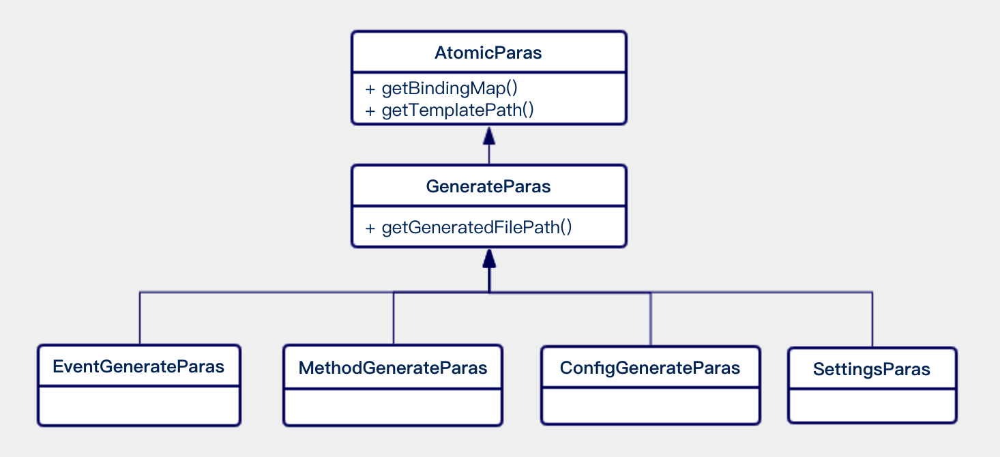

# 在WeBASE的动物园漫步

作者：毛嘉宇｜FISCO BCOS 核心开发者

**作者语**：开源软件，是大师心目中商业化大潮之外的伊甸园；是极客们聚集出没的大教堂和集市；是技术爱好者挚爱的隽永诗篇；但在我眼里，开源软件的世界就是一座动物园。

开源机构酷爱拿动物来命名软件或制作LOGO，这些名字早已似春雨般深入人心。比如一脸严肃，身手敏捷，酷似狮子的Tomcat。还有Python，两条肥胖蠢萌的蟒蛇形象火遍了全世界。而Linux用一个叫Tux的企鹅作为吉祥物，Tux 现在已经开始拍游戏视频、广告了，甚至还有个叫Gown的女朋友。开源社区动物园里的风景异彩纷呈，受此启发，我们将WeBASE中的两个数据导出相关组件分别取名为Monkey和Bee。

本文就为您介绍神通广大的Monkey和专注如一的Bee。**WeBASE是在区块链应用和FISCO BCOS节点之间搭建的中间件平台**，对技术和业务架构中的共性进行抽象，形成通用化且体验友好的组件，简化区块链应用开发流程。

## WeBASE-Codegen-Monkey之美猴王

WeBASE-Codegen-Monkey（以下简称Monkey）是WeBASE数据导出工具的代码生成组件。可帮助用户自动生成数据导出组件，更进一步地提升研发效率，帮助开发者减负。我们开发的Monkey，其命名灵感来自于美猴王——齐天大圣孙悟空。

Monkey提供可执行的shell脚本：generate_bee.sh。只需简单的配置，同时按要求提供智能合约文件，便可自动生成WeBASE-Collect-Bee。在执行完脚本后，Monkey会自动退出，仿佛化生变幻的美猴王，腾云而来，驾雾而去。Monkey的启动脚本，会自动下载代码、装载合约、构建生成业务代码、编译数据导出组件代码、启动数据导出的应用。generate_bee.sh的主要执行步骤如下图：

其中，步骤3，脚本会自动将开发者的配置文件，放置到指定的配置路径。 步骤5，Monkey在启动后，会根据次序，生成日志、函数代码、配置和设置文件，并放置到Bee所需的路径上。步骤8，Bee在启动时，可随心所欲地加载所需的代码和配置文件。开发者也可以在预先约定的路径下，获得所需的各类脚本或参数的文件。

generate_bee.sh的执行过程，就如同《西游记》所述：『见他凶猛（数据导出定制化开发需求复杂），即使身外身法（读取环境和合约的配置），拔一把毫毛（下载代码、装配配置和编译Monkey代码），丢在口中嚼碎（运行monkey代码，自动生成Bee的配置和代码），望空喷去（编译Bee的代码），叫一声‘变！’（开始执行Bee的代码）即变做三二百个小猴，周围攒簇（自动建库建表并成功开始导出数据）。』

美猴王有七十二变的神通，Monkey有自动生成所需代码的功能，真正做到让数据导出系统开箱可用Monkey生成的代码等文件，可分为四大类：

1. 基于合约和配置生成的具体日志解析的代码；
2. 基于合约和配置生成的具体函数解析的代码；
3. 基于配置生成的配置文件；
4. 基于合约和配置生成的设置文件。

上图中，不同类型的Paras会生成不同的代码文件。其中：

- EventGenerateParas：包含了日志（Event）相关代码和脚本的生成。

  如合约文件中解析的日志entity和repository的定义、以及每个不同日志解析的代码、日志的BO类和日志的数据库建表语句。

- MethodGenerateParas：包含了函数（Method）相关代码和脚本的生成。

  如合约文件中解析的函数hibernate entity和repository的定义、以及每个不同函数解析的代码、函数的BO类和函数的数据库建表语句。

- ConfigGenerateParas: 包含了Bee工程的数据库建表脚本和数据库配置文件。
- SettingsParas：包含了grafana dashboard和table_panel的json导入设置文件。

如上所述，为了开发者方便易用，一次配置。Monkey除了生成执行代码外，相关的区块链软件和数据导出组件的通用配置，也被放到了Monkey系统的配置中，并自动传递到Bee的配置文件中。Monkey系统集成了Beetl作为模板引擎，无论多么复杂的合约，多么繁琐的配置，都能化繁为简，快速生成。Monkey通过载入开发者编译后的solidy对应的Java文件，利用反射技术，获取合约文件的Class信息。

Monkey启动后，会创建一个代码生成的模板引擎，上述的AtomicParas则是引擎启动所必须的原料。如上图，通过这三个核心的调用步骤：

1. 引擎通过调用getTemplateFilePath()方法，获得渲染模板的文件路径；
2. 通过getBindingMap()方法获得渲染所需的所有参数；
3. 通过getGeneratedFilePath()获得生成文件的具体路径。

代码生成引擎便可飞速启动，执行渲染，最终完成所需文件的自动生成。

当然，美猴王的传奇不会终结，Monkey系统提供了很多强大而灵活的配置，来满足拥有独特个性化需求的开发者。美猴王的征途也不会仅仅局限于数据导出，未来还将会涉足更多的领域，为大家带来更多的惊喜……

## WeBASE-Collect-Bee之蜜蜂

WeBASE-Collect-Bee（以下简称Bee） 是WeBASE中一个基于FISCO BCOS平台的数据导出组件，支持将区块链的数据导出到Mysql等数据库中。

为何取名『Bee』呢？古往今来，文人墨客留下了诸多歌咏蜜蜂的诗文：穿花度柳飞如箭， 粘絮寻香似落星。小小微躯能负重， 器器薄翅会乘风。——吴承恩

Bee系统恰如蜂群一般，专注如一，辛勤劳作。服务不停，数据导出的任务就不会停止。小蜜蜂们在区块链的花丛之中，来回穿行，在区块之间，寻找香甜、漂浮的业务数据，将海量的区块链数据，稳定高效地导出到存储之中，供开发者执行分析、计算和查询。小小微躯的蜜蜂是轻盈的，契合了Bee系统设计『轻』的气质。

在Monkey的协助下，遵循『契约优于配置』的原则，开发者只需修改极少的配置，辅以搭链后自带的证书和开发编译后的合约文件，执行脚本后就可以快速获得已打包的可执行Jar包，甚至可以直接启动运行。蜜蜂的轻盈还体现在，系统地提取和抽象了大量的配置项。按照开发者的个性化需求，灵活配置，按需而动。

系统架构图如下所示，除了核心的模块，Bee系统的模块都是可插拔的。例如是否需要引入可视化数据分析、集成测试界面、监控和Supervisor进程管理等增强功能模块。

为了让蜜蜂器器薄翅能够舞动地更加轻盈，我们在最新的V1.1.0中进行重构，将原有的单工程按照功能粒度进一步拆分。这样，开发者既可以选择直接部署一个可执行的Jar包。还可以按需引入Jar包，将指定功能模块嵌入到自己的工程中。上述的模块均基于Springboot2开发，支持个性化配置。

如上图所示，各个Jar的功能正如其名：

- core：打包为一个可执行的BootJar包，内置开箱即用的Restful API，使得开发者更加便捷地获得数据导出的服务。同时，core自身也是一个示例，向开发者展示了，如何组合利用各个功能模块的Jar包，来开发一个功能完整的数据导出系统。
- parser：封装了区块解析的功能。入口的方法签名可以传入一个区块Block，获得完整解析后的BlockInfoBO的Bean对象，其中包含了解析后的数据。
- extractor：进一步封装了web3j的SDK的逻辑，可以便利地调用上链功能和获取区块链的数据。
- db：封装了数据存储的逻辑，理论上支持各类主流的数据库，实际严格测试支持将数据存储到Mysql 5.6及以上社区版。
- common：封装了一些公用的数据结构、工具类和公共参数等。

蜜蜂的微躯虽然轻盈，可是蜂群的协作却可以负重。

为了应对海量数据的存储，例如单表数据超过1KW条，单库容量超过1T的场景，Bee 集成了sharding-jdbc，支持可配置的多数据源存储、读写分离和分库分表。

为了加快数据导出的速度，Bee系统进行了多轮的性能优化，大幅提升了单机部署下数据导出的效率。同时，依托集成Elastic-Job后，获得分布式任务协调服务的能力，Bee支持实例多活部署，横向扩展，灵活伸缩。

蜜蜂的工作是三型分工，Bee系统的任务执行者也分为三类：任务的调度者、区块的采集者和区块的处理者。

如上图所示，具体的三类任务执行者的说明如下：

**蜂王（Dispatcher）**：

通过分布式协调服务，保证只有唯一的一个线程运行，负责检测区块链当前的块高和已拉取任务的明细，准备任务，检测区块的分叉状态，检测任务的超时状态和错误状态，并基于预先定义的策略执行重拉等。准备任务是指Dispatcher会基于区块的维度在数据库进行维护：为每个区块创建一条状态记录，并插入到block_task_pool的系统表中。

**雄蜂（Extractor）**：

与Depot共用相同的线程，线程的总数可以通过配置文件来指定，但任务执行的分片由分布式协调服务自动调度。Extractor执行的任务职责是：从Dispatcher维护的block_task_pool系统表中拉取对应分片序号的区块任务，然后从区块链下载指定区块高度的Block数据，并修改block_task_pool系统表的任务执行状态。

**工蜂（Depot）**：

与Extractor共用相同的线程，线程的总数可通过配置文件来指定，但任务执行的分片由分布式协调服务自动调度。Depot可以直接从Extractor获取到Block内容，然后执行数据导出的任务，先后执行区块解析、内容转换处理、存储数据库，最后修改block_task_pool系统表的任务执行状态。

这样设计的优点是隔离了不同区块在不同线程间切换的数据交换开销，大大提升了处理的效率。同时，可以通过增加部署实例、增加处理线程集合的数量，来提升数据导出的速度。如果把内容转换和内容存储比作花蜜的酿造和存储，那么区块解析就似花粉的采集——这项使工蜂日夜辛劳的工作任务，最能诠释『穿花度柳飞如箭， 粘絮寻香似落星』。

如上图所示，区块解析的结果共分为四类：区块基本信息、账户信息、函数信息、日志信息。以下为解析的简要思路：

1、 合约加载：解析器在执行前，会加载合约的BIN、ABI和配置信息，并计算所有合约函数的MethodId。

2、 账户解析：根据Block可以获取区块的合约地址，根据合约地址获取runcode，再通过预先加载的合约BIN信息，识别账户的类型，最终解析出账户。

3、 函数解析：如果函数为构造函数，如1所述，可以解析出函数的值。

如果函数非构造函数，则transaction中的to字段即为合约地址。如2所述，根据合约地址可以获得函数所属的合约。再根据transaction中附带的input和预先加载的methodId进行比对，可获得函数名。

在精准定位了函数所属合约和函数名以后，会自动触发transactionHandler，并执行对应的解析工作。

4、 事件解析:基于步骤2已解析的transactionHash与合约名的映射，可以获取合约名称。根据特定的合约名称，会自动触发该合约下的eventHandler，并执行对应的解析工作。

5、 区块解析:根据获得的Block对象的属性解析，获得区块的概要信息。

所有的这些解析步骤，相同的区块都由一个工蜂来负责完成，每个工蜂为一个线程。这些线程通过线程集合，由分布式协调服务来统一分配和管理，从而达到『飞如箭』和『似落星』的效果。Bee系统严格遵循了『技能专一』的原则，致力于为FISCO BCOS提供数据导出服务，因为专一，所以极致。

## 总结

WeBASE的社区还在蓬勃发展中，欢迎来到WeBASE的动物园漫步，和我们一起发现和探索更多有趣的故事，期待未来动物园的故事里有你。

------

#### 链接指引

- [区块链底层平台FISCO BCOS代码仓库](https://github.com/FISCO-BCOS/FISCO-BCOS/tree/master-2.0)

- [FISCO BCOS技术文档](https://fisco-bcos-documentation.readthedocs.io/zh_CN/latest/)

- [WeBASE代码仓库](https://github.com/WeBankFinTech/WeBASE)

- [WeBASE技术文档](https://webasedoc.readthedocs.io/zh_CN/latest/index.html)

