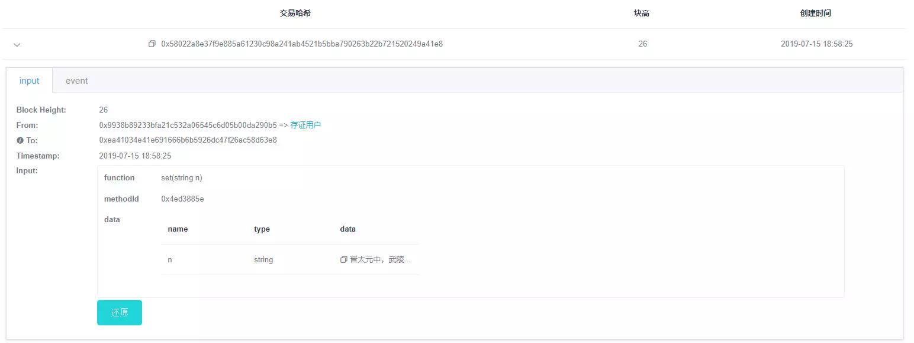

# 漫谈WeBASE之交易两三事

作者：刘明臻｜FISCO BCOS 核心开发者

2019年7月2日，区块链中间件平台WeBASE正式对外开源，大家首先会想到的就是：WeBASE是什么，有什么用？WeBASE是WeBank Blockchain Application Software Extension的简写，是在区块链应用和FISCO BCOS节点之间搭建的一套通用组件。开发这套通用组件的目的是为了屏蔽区块链底层的复杂度，降低开发者的门槛，提高区块链应用的开发效率。WeBASE主要包含：节点前置、节点管理、交易链路，数据导出，Web管理平台等子系统。其完整部署架构如下图：

详细了解WeBASE请点击前往：《[FISCO BCOS迎来区块链中间件平台WeBASE，应用落地提速](https://mp.weixin.qq.com/s?__biz=MzA3MTI5Njg4Mw==&mid=2247485307&idx=1&sn=40b0002d3d261be7c2daadd73697a131&chksm=9f2ef567a8597c719225f87a490ea3307a537518cbbcd04a1c5881828a3d4ba1ae7714609522&token=773706277&lang=zh_CN#rd)》。我们计划推送WeBASE系列文章，与你一道体验WeBASE的“简约而不简单”。本文是系列文章第一篇《漫谈WeBASE之交易两三事》，打算谈谈WeBASE在交易相关方面做的一些工作。

## 交易的概念、基本数据结构及过程

交易可认为是一段发往区块链系统的请求数据，用于部署合约，调用合约接口,以求达到维护合约的生命周期，管理资产，进行价值交换等目标。交易的基本数据结构包括发送者，接受者，交易数据等。

一个完整的交易过程可分为交易构建并**链上执行、交易展示、交易审计**三步：

- 首先用户可以构建一个交易，用自己的私钥给交易签名，发送到链上（通过sendRawTransaction等接口）；然后链收到交易并交由多个节点机制处理，执行相关的智能合约代码，生成交易指定的状态数据；最后将交易打包到区块里，和状态数据一起落盘存储。落盘交易即为被确认，被确认的交易通常被认为具备了事务性和一致性。
- 随着交易确认，相应的还会有交易回执（receipt）产生，和交易一一对应且保存在区块里，用于保存一些交易执行过程中生成的信息，如：结果码、日志、消耗的gas量等。用户可以使用交易hash查询交易，交易回执展示给用户。
- 随时间推移，链上交易越来越多，需要对链上交易进行分析，辅助监管和审计链上的行为，确保链的合理、合规运行。

大家对交易有了初步的了解，接下来我们就从交易的三步曲中，详细探讨WeBASE在其中充当的角色和发挥的作用。

## 交易上链

通过WeBASE有多种发送交易上链的方式,比较常见的有WeBASE管理平台和交易上链代理子系统等两种，前者由WeBAS管理平台提供一个合约IDE，可以部署和调用合约接口，这里就不赘述了。今天我们重点介绍下**交易上链代理子系统（[WeBASE-Transaction](https://webasedoc.readthedocs.io/zh_CN/latest/docs/WeBASE-Transaction/index.html)）**。

目前，区块链开发者主要面临以下几个痛点：

- 区块链学习成本高--不想关注区块链细节，想用传统的方式调用区块链服务。

- 现实业务的峰值可能超过区块链的处理能力--需要一套缓存系统来削峰平谷。

为了解决这些痛点，WeBASE-Transaction应运而生。WeBASE-Transaction是从很多区块链存证类型项目中总结出来的一套服务系统，以帮助大家快速搭建区块链应用，其功能主要是接收无状态交易请求，缓存到数据库中，再异步上链，服务支持分布式任务，多活部署，异地容灾。部署架构如下图：

从部署结构图可以看到，WeBASE-Transaction具有以下几大特性：

- **异步上链，过载保护**：区块链请求先缓存数据库，削峰平谷，由服务使用合理速度异步上链。

- **多活部署，分布式任务**：使用Zookeeper做分布式任务协调，将上链分为多个分布式任务，多活部署，异地容灾。

- **错误重试，实时对齐**：服务自动查验上链状态，错误重试，达到数据库和链上状态的实时对齐。

## 交易展示

交易上链代表着终于把数据写入区块链了。兴冲冲地跑去给老板汇报：我们数据上链啦！老板听了既高兴，也很好奇。区块链这么高深，写入区块链的数据如何展示出来？区块链交易长啥样？

此时你可以搭建一套WeBASE管理平台。搭建方法可以查看《[安装部署文档](https://webasedoc.readthedocs.io/zh_CN/latest/docs/WeBASE-Install/index.html)》。使用方法可以查看《[WeBASE管理平台使用手册](https://webasedoc.readthedocs.io/zh_CN/latest/docs/WeBASE-Console-Suit/index.html#webase)》。搭建完成后，打开WeBASE管理平台，你会发现交易是这样的：发送者、接受者、交易输入数据等。交易执行后，会产生交易回执。交易回执里面有event，记录了交易执行过程中的事件日志。

老板看后第一感觉，肯定是五味杂陈。此时你轻点“解码”按钮，把交易从一串“0x的天书”翻译成人类能读懂的模样。哪个用户通过哪个合约方法上链的，一目了然。老板看后必投来赞许的目光。此时你想必会有一种普天之下，舍我其谁的感觉。

## 交易审计

交易上链了，也展示了，但这还不够。联盟链中各个机构，按照联盟链委员会制定的规章，在链上共享和流转数据。这些规章往往是字面的，大家是否遵守，缺乏监管和审计。因此为了规范大家的使用方式，避免链的计算资源和存储资源被某些机构滥用，急需一套服务来辅助监管和审计链上的行为。WeBASE管理平台提供的交易审计，就是一套辅助监管和审计链上行为的服务。它结合区块链数据、WeBASE管理平台的私钥管理和合约管理三者的数据，以区块链数据为原材料，以私钥管理和合约管理为依据，做成的一个综合性的数据分析功能。

交易审计主要指标：

| 用户交易数量统计     | 监控链上各个外部交易账号的每日交易量                         |
| -------------------- | ------------------------------------------------------------ |
| 用户子类交易数量统计 | 监控链上各个外部交易账号的每种类型的每日交易量               |
| 异常交易用户监控     | 监控链上出现的异常交易用户（没在区块链中间件平台登记的交易用户） |
| 异常合约部署监控     | 监控链上合约部署情况，非白名单合约（没在区块链中间件平台登记的合约） |

交易审计界面如下

WeBASE管理平台提供可视化的去中心化合约部署、交易监控、审计功能，方便识别异常的用户、异常的合约，还有异常的交易量，为联盟链治理提供依据。

## 回归初心

到这里，我们可以看到一条交易，从组装发到区块链节点，然后节点执行落盘成交易回执，交易和state，再到交易展示，交易事后审计和监管。WeBASE参与了其中的组装上链、交易展示、交易审计，基本上可以说WeBASE参与了交易的全过程。

在组装上链过程中提供了交易上链代理子系统，其有效屏蔽了区块链底层的复杂度，降低了开发者的门槛，助力开发者高速搭建联盟链应用。在交易展示过程中，WeBASE搭建了可视化的管理平台，对交易进行了立体化展示，方便开发者实时监控和查看交易数据。在交易事后审计和监管过程中，还提供了综合的数据分析功能，辅助监管和审计链上的行为，高效治理联盟链。

------

#### 链接指引

- [区块链底层平台FISCO BCOS代码仓库](https://github.com/FISCO-BCOS/FISCO-BCOS/tree/master-2.0)

- [FISCO BCOS技术文档](https://fisco-bcos-documentation.readthedocs.io/zh_CN/latest/)

- [WeBASE代码仓库](https://github.com/WeBankFinTech/WeBASE)

- [WeBASE技术文档](https://webasedoc.readthedocs.io/zh_CN/latest/index.html)

