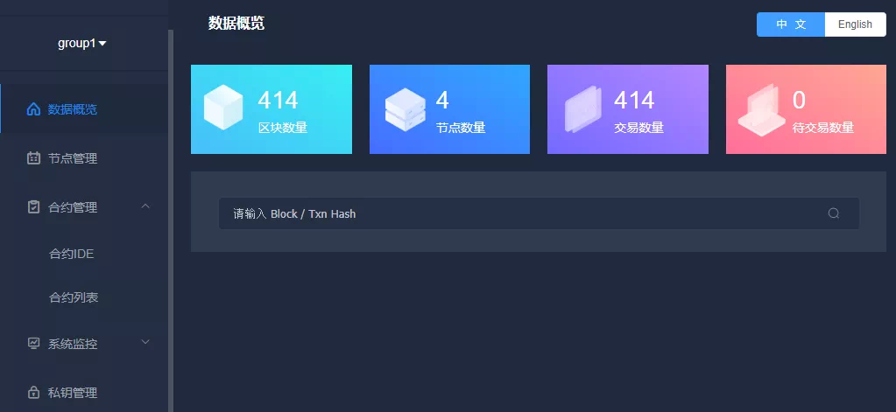

# WeBASE节点前置组件功能解析

作者：何硕彦｜FISCO BCOS 核心开发者

FISCO BCOS搭链脚本已经让开发者有极致的搭链体验，怎样能快速搭建一个区块链可视化界面，以便跟区块链交互，WeBASE-Front就是可以最快满足这个期望的组件。WeBASE-Front为开发者提供区块链交互最小功能的子集，安装轻量便捷，无需安装任何第三方组件。在搭完节点之后搭建WeBASE-Front，可以在浏览器打开界面，快速开启区块链体验之旅。

WeBASE-Front还提供了很多友好且实用的功能：

- 在WeBASE-Front首页界面，开发者可以查看到区块链的区块信息、交易信息、群组信息、节点数量、节点状态等，**对区块链网络的核心信息一目了然**。
- WeBASE-Front提供了合约开发IDE，方便开发者在上面编写调试智能合约，**快速开发自己的区块链应用**。
- WeBASE-Front集成了Web3SDK，并对Web3SDK接口进行了封装，开发者可通过HTTP请求，调用WeBASE-Front接口和区块链节点进行交互。这种方式屏蔽了SDK语言的限制，**任意语言的开发者都可以通过调用WeBASE-Front的接口与区块链交互**。

当然，WeBASE-Front的功能不限于此。作为WeBASE家族成员之一，该组件配合WeBASE-Node-Manager和WeBASE-Web一起使用，作为节点前置，对区块链网络的全方位监控，实现企业级区块链监控功能。

## 功能介绍

WeBASE-Front主要有以下五大功能：

### 一、数据概览

显示开发者关心的常用数据：**区块块高、节点数量、交易总数、待交易数量，**并支持区块信息和交易信息的查询。

### 二、节点管理

显示区块链网络的**节点数量、节点ID、块高、pbftview和节点运行状态**，并支持区块链群组的动态切换。

### 三、合约管理

此为WeBASE-Front的核心功能，开发者可以在上面**编写、编译、调试合约**，以及**一键生成合约的JAVA类**，已部署合约会存在H2嵌入式数据库里，可以在合约列表里查询历史合约。

### 四、系统监控

系统监控分为两方面监控：

1. 节点服务器的性能指标监控，包括**CPU、硬盘、内存、上行带宽、下行带宽**；
2. 区块链节点的性能指标监控，包括**区块高度、pbftview、待打包交易数**。

节点长久运行后，可以通过此功能查看服务器的性能。

### 五、私钥管理

生成椭圆曲线公私钥对，支持**导入导出私钥**，并支持给地址取别名，方便地址记忆。部署合约前需要先创建公私钥对。

## 技术剖析

WeBASE-Front是基于FISCO BCOS提供的**spring-boot-starter**（请参考文末链接）项目的一个开发实例。**Web3SDK接口封装、动态切换群组、部署调用合约（无需生成JAVA类）、公私钥对产生，**这些通用功能请参考WeBASE-Front代码，开发者可以借鉴并编写自己的springboot应用。 

为了方便安装和使用，WeBASE-Front采用了轻量级的**H2嵌入式数据库**，后端使用SSH框架，使用JPA访问数据库；前端采用**VUE**框架开发，前端资源内置在后端springboot服务中，无需安装配置nginx和mysql这些步骤，直接启动JAVA服务即可访问界面。

产生的公私钥和已部署的合约都会存储在H2数据库中，方便查询历史记录。性能监控功能采用的是**sigar**数据收集组件。采集的数据也会存在H2数据库中，但只保存最近一周的监控数据。

## 部署方式

作为节点前置，WeBASE-Front需要跟节点同机部署。一台机器部署多个节点时，建议只部署一个WeBASE-Front服务即可。

WeBASE-Front部署方式有以下三种：

1. 单独部署作为独立控制台使用，并配有界面，部署简单快捷，只需下载WeBASE-Front应用，替换节点证书即可启动。推荐初学者和开发者使用此种部署方式，使用此组件查询区块链的相关信息和开发调试智能合约。（安装请参考文末链接）

2. 方式1中，WeBASE-Front作为可视化控制台使用，私钥默认加密存储在H2数据库中，如果需要更安全的私钥保护方案，可以结合WeBASE-Sign服务一起部署使用，私钥保存在WeBASE-Sign中，WeBASE-Sign服务负责对交易数据进行签名，提供更安全的私钥保护方案。

   此方式在方式1的基础上再部署WeBASE-Sign服务，如果对私钥安全性要求较高，请采用此种部署方式。（WeBASE-Sign服务请参考文末链接）

3. 结合WeBASE-Node-Manager和WeBASE-Web服务一起部署使用，这里WeBASE-Front只作为节点前置，多个节点前置统一由WeBASE-Node-Manager管理，WeBASE-Node-Manager有一套spring security实现的鉴权登录系统，并会拉取链上的区块信息和交易信息，存储在Mysql数据库中。生产环境下建议使用此种方式，架构图如下所示。（WeBASE安装部署请参考文末链接）  

## 总结

WeBASE-Front作为一个搭建便捷、功能强大的区块链组件，既可以独立使用，作为可视化控制台，方便开发者与区块链交互，也可以配合WeBASE-Node-Manager和WeBASE-Web一起使用，实现生产环境的区块链监控功能。

WeBASE-Front还在持续优化开发中，未来会增加越来越丰富的功能，如联盟链增删节点的系统管理功能、交易解析功能等。当然，持续迭代升级中也会保持它的易用性和便捷性。欢迎社区朋友提PR和ISSUE，一起参与优化。

------

#### 链接指引

- [Spring-boot-starter](https://github.com/FISCO-BCOS/spring-boot-starter/tree/master-2.0)

- [Sigar数据收集组件](https://www.jianshu.com/p/c3d88dd617bf)

- [WeBASE-Front单独安装部署说明](https://webasedoc.readthedocs.io/zh_CN/latest/docs/WeBASE-Install/developer.html#)

- [WeBASE-Sign服务](https://webasedoc.readthedocs.io/zh_CN/latest/docs/WeBASE-Sign/index.html)

- [WeBASE安装部署](https://webasedoc.readthedocs.io/zh_CN/latest/docs/WeBASE-Install/enterprise.html)

