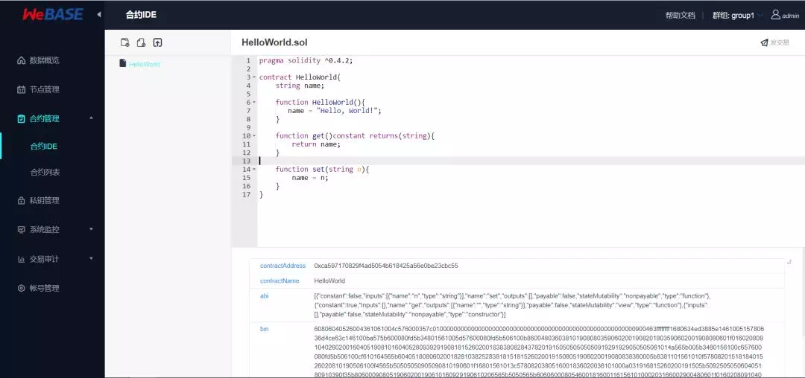

# FISCO BCOS迎来区块链中间件平台WeBASE，应用落地提速

随着区块链技术的发展，越来越多的开发者基于稳定和高效的区块链底层平台，结合智能合约和链上接口，开发各种丰富的应用，随之而来的是对区块链系统的易用性、应用开发速度、业务组件丰富性产生了更多的需求。

直面底层平台，“裸写”智能合约和底层代码，在技术上是可行的，而进一步提供“所见即所得”、“开箱即用”这种无门槛体验的动力，则来自社区开发者的反馈，比如：

- 缺乏好用的智能合约开发工具，合约的开发和调试效率不高，难以便捷地管理链上各节点配置信息，观察其运行状态。

- 区块链上的区块、交易、回执等数据的呈现方式不够友好，对链上的海量数据难以进行灵活和多维度的分析。

- 针对参与到业务的各账号及其进行的交易行为，需要通用的审计工具，以便及时发现和杜绝异常。

为响应开源社区里持续的需求，同时将自身长期探索的成果开放分享， FISCO BCOS开源工作组成员单位——微众银行，为社区贡献一条从区块链底层通往应用落地的高速通道。

**7月2日，微众银行正式开源自研的区块链中间件平台——WeBASE，该平台适配支持FISCO BCOS底层平台**，面向多种对象，如开发者、运营者，并根据不同的场景，包括开发、调试、部署、审计等，打造丰富的功能组件和实用工具，提供友好的、可视化的可操作环境。

基于FISCO BCOS底层平台，部署WeBASE，可以简化区块链应用开发流程，大大降低企业搭建区块链应用，以及进行运营分析的时间成本、人力成本，使开发者可得心应手的操控区块链网络，更专注投入到应用开发和业务落地中。

**WeBASE代码仓库地址**：https://github.com/WeBankFinTech/WeBASE

## WeBASE简介

**WeBASE（WeBank Blockchain Application Software Extension） 是在区块链应用和FISCO BCOS节点之间搭建的中间件平台，**如下图所示，开发者可在区块链节点上层部署WeBASE的可交互模块如浏览器、管理台和其他工具等，也可以基于WeBASE内置的组件和API，进行应用的开发。

WeBASE的“**简约而不简单**”，体现在以下几个方面：

一 、提供友好的智能合约开发平台，支持在线编译、调试、测试、部署智能合约，具有高效的编辑环境，率先支持Solidity智能合约语言。

二、在SDK基础上封装Restful风格的API接口，Restful接口更直观，有良好的可扩展性，可轻松适配多种编程语言。通过接口可对交易数据进行编解码，可在包括网页、手机终端等设备上全方位、多维度展示链上数据细节。

三、区块链管理平台是运营管理员的首选工作台，可查看链上的数据统计、每个区块的详情、各个节点多维度的统计数据，对节点的健康度做到全方位监控。

四、数据导出组件可配置式的导出链上数据到关系型数据库、大数据处理等系统，以便对链上数据进行多元化处理，如进行数据挖掘，构建商业模型等。

## WeBASE的整体架构和设计原则

WeBASE的完整架构如下图所示：

WeBASE的设计理念是一个子系统解决一个问题，无需部署所有子系统就能跑起来，因此在设计之初就遵循如下原则：

**按需部署**：WeBASE抽象对应用开发通用共性进行抽象，形成各类服务组件，如业务接入、私钥管理、交易队列、合约开发、数据导出、审计等，开发者根据需要部署所需组件。

**微服务架构**：WeBASE采用微服务架构，基于spring-boot框架，提供Restful风格接口。

**零耦合**：WeBASE所有子系统独立存在，均可独立部署，独立运行，面向不同的场景提供服务，避免出现“全家桶”式的冗余负担。

**可定制**：前端体验往往带有开发者自身的业务表现，如不同的样式、不同的交互风格、不同的品牌表现等，因此WeBASE采用前后端分离的设计，后端接口保持稳定和可扩展，前端页面则由开发者自由定制。

## 基于WeBASE的应用开发流程

基于WeBASE的应用开发流程有全新的体验，下图直观比对两种开发流程的不同：

显然，基于WeBASE的应用开发，流程大大简化。智能合约开发工具、完善的数据可视化平台、简易的交易上链方式，降低了开发门槛，使得开发效率大幅提升。而且对于应用上线后的交易审计、数据导出、立体监控等方面的管理，WeBASE为其提供一系列完善的组件，能有效避免开发者和企业重复破荒造路。

## WeBASE的下一步

今天，**WeBASE开源只是一小步，未来，WeBASE将有计划地开放更多功能**：

- 提供更多直面商业领域的、经过业务验证的组件，便于集成到有共通模式的应用中，建立区块链应用开发最佳实践和标准架构；
- 提供各类行业解决方案和参考实现；
- 为云厂商提供更友好的接入方式。

## 社区开发者体验

- **网络技术总监 林冬艺** 广州市品高软件股份有限公司

> 品高软件是一家云计算公司，正在探索云计算与区块链的融合创新。WeBASE具有友好的界面设计、便捷的管理以及云生态的良好融合等特点，使得区块链上云变得更轻松，我们得以更专注于区块链与云计算的业务场景。

- **架构师 魏巍** 宝付网络科技（上海）有限公司

> WeBASE操作简便，社区文档非常完善，涵盖企业所需的各类组件，可插拔式的架构设计，根据所需组合使用，帮助我们解决区块链技术的后顾之忧，缩短业务数据化进程，快速实现业务价值。

- **CTO 金兆康** 杭州亦笔科技有限公司

> WeBASE的联盟治理、前置管理功能使得管理区块链就像管理聊天群一样简单。社区的及时响应、功能的快速迭代，处处体现出国内顶级区块链服务提供商的实力。

- **区块链架构师 孙耀普** 全链通有限公司

> WeBASE各系统模块都提供了丰富的部署文档，明确的部署步骤，按照部署文档就可以很快部署和使用，系统的UI设计和布局也非常合理。
>
> 注册和登录功能，满足了客户关于区块链信息查询权限管理需求，减少了开发的工作量；系统集成了FISCO BCOS的java接口，提供了丰富的调用接口，减轻了开发工作量，降低了区块链的使用难度。
>
> 系统提供智能合约的编辑和编译和部署功能，使智能合约开发更加便捷。

- **创始人 张泷** 聚滴成海(广州)信息技术有限公司

> 聚滴成海是一家专注区块链深层次挖掘的中间件提供服务商，我们需要直接对客户提供封装好的接口，来降低他们的开发工作量。由于我们产品性质的特殊，需要兼容多种生态、包容多种共识机制，因而我们的开发工作量非常庞大！
>
> 但是WeBASE将各种接口已经封装的非常完善，只需稍作暴露就可以快速连接！希望WeBASE可以继续坚持对开源社区的支持，我们也愿意为之不断付出和贡献。

