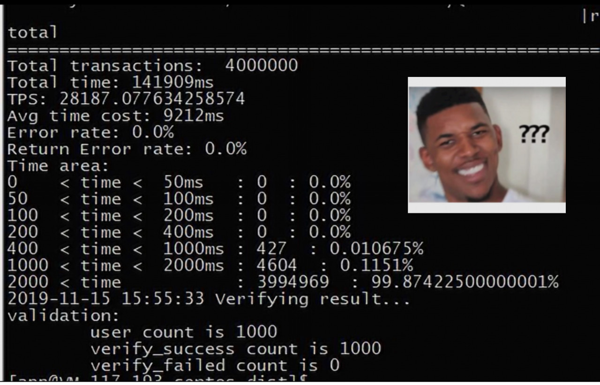
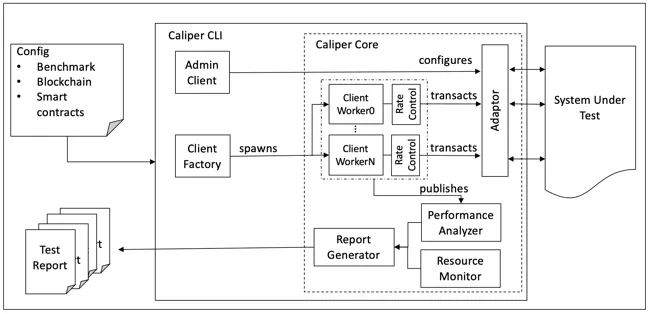
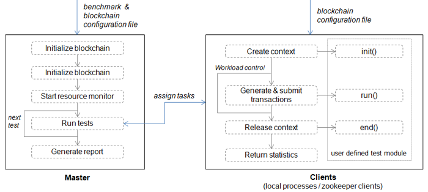

# 性能压测工具Caliper在FISCO BCOS平台中的实践

作者：李陈希｜FISCO BCOS 核心开发者

**Hyperledger Caliper在发布的0.2.0版本中，正式宣布支持FISCO BCOS平台**。

关于如何使用Caliper对FISCO BCOS进行压测，开发小哥已经呕心沥血对如何部署Caliper及如何自定义测试用例进行了全面总结，欢迎猛戳[FISCO BCOS官方文档](https://fisco-bcos-documentation.readthedocs.io/zh_CN/latest/docs/tutorial/stress_testing.html)学习如何使用：

本文将深入解析Caliper，以便大家更好使用Caliper压测FISCO BCOS。

## 为何要适配Caliper？

对于区块链开发者和用户而言，性能是评价一个区块链平台重要的考量条件。一直以来，FISCO BCOS都是通过Java SDK中自带的压力测试程序及压测脚本来对FISCO BCOS进行持续的性能追踪。

虽然这些压测手段已经完全能够胜任FISCO BCOS底层开发人员评估性能的需求，但是当压测需求从底层开发人员向需要对自定义的合约及场景进行测试的外部用户延伸时，传统的压测方法则会有些力不从心，需要改善的地方主要集中在以下几点。

### 扩展测试场景的方式需要精简

目前压测程序直接支持的测试场景是具有代表性的转账场景及增删改查数据表的模拟，如果用户想对自定义的合约及场景进行测试，则需要按照模板自行编写测试程序。
SDK自身已经提供了丰富的API来帮助用户编写这类程序，但是仍然需要用户自己处理合约编译及API转换、压力线程池等细节。
尽管一个用户可能只会有一个测试需求点，但是千人千面，当不同用户的需求累积起来时，重复的工作量就变得相当可观。

**因此，我们希望有一套测试框架帮助我们处理这些琐碎的细节，从而使我们的精力能更加聚焦在构造压测场景本身**。

### 性能指标的定义需要统一

对于性能指标如何计算的问题，FISCO BCOS内部已经形成了一套规范的计算方法，但是当用户自行编写测试程序时，由于测试程序本身的灵活性，用户可以自己定义性能指标该如何计算。
以交易处理能力指标TPS为例，有的用户可能会觉得交易的本地签名时间不应该归到远端节点处理交易的耗时中，也有用户可能会认为总交易量/总时间的计算方式不够精确，而倾向于使用在压测过程中多次采样最后计算平均值的方式。
可以看出，灵活性带来的负面效应是导致各方缺少性能的统一度量衡。
**因此，我们希望能有一套自带标准性能指标定义的测试体系，且最好用户无法直接干预性能指标的计算流程**。

### 结果的展示方式需要优化

基于命令行的压测程序在编写时更多是面向FISCO BCOS的底层开发人员，因此在使用方式上也显得较为『底层』。当外部用户想使用Java SDK中自带的压力测试程进行测试时，可能会看到如下测试结果：

尽管理解每项统计数据的含义并不难，但是如果是向外界进行展示和介绍的话，仍然会显得有一些笨拙和不便。
**因此，我们希望有一个测试工具能在测试完成后输出直观的测试报告，方便用户理解和传播** 。
秉承『不要重复造轮子』的精神，我们将目光投向了开源社区，以期能有现成的工具解决FISCO BCOS测试工具的痛点。在经过充分调研后，我们发现了Hyperledger Caliper项目。

Caliper是一个通用区块链性能测试工具。"Caliper"一词的原意就是标尺，Caliper旨在为区块链平台的测试提供一个公共的基准线。Caliper完全开源，因此用户不需要担心由于测试工具不开源导致无法对压测结果进行验证的问题。
同时，Hyperledger项目下设了性能及可扩展性工作组（PWSG），专门负责对各种性能指标（TPS、延迟、资源利用率等）进行形式化、规范化的定义，Caliper在设计也采用这一套性能指标体系并内嵌进了框架中。
Caliper能够方便地对接多种区块链平台并屏蔽了底层细节，用户只需要负责设计具体的测试流程，即可获取Caliper输出的可视化性能测试报告。可以看出，拥有这些特点的Caliper，能恰好满足FISCO BCOS对压测工具的需求。

FISCO BCOS对Caliper框架的适配工作随即展开，回顾来看，整体工作量并不算繁重，最主要的时间开销反倒是花在开发小哥因为不熟悉Node.js（Caliper主要使用Node.js进行开发）而学习了一段时间，这也从侧面也印证了Caliper易于集成的特点。

## Caliper长啥样？

Caliper的架构图如上图所示。在Caliper中，Caliper CLI负责为内部的Caliper Core（接口及核心层）提供方便易用的命令行工具。接口及核心层包含区块链适配接口、资源监控模块、性能分析模块及报告生成模块。

### 区块链适配API

包含诸如在后端区块链上部署智能合约、调用合约、从账本查询状态等操作的接口，这些接口主要由区块链支配器提供。每个区块链适配器使用相应的区块链SDK或RESTful API来实现这些接口，Caliper也正是通过这些适配器提供的接口实现将区块链系统集成进Caliper框架中，目前除FISCO BCOS外，Caliper还支持Fabric、Iroha等区块链系统。

### 资源监控模块

提供启动/停止监视器和获取后端区块链系统资源消耗状态的支持，资源监控的范围包括CPU、内存、网络IO等。目前Caliper提供两种监视器，一种是监视本地/远程docker容器，另一种则是监控本地进程。

### 性能分析模块

提供读取预定义性能统计信息（包括TPS、延迟、成功交易数等）和打印基准测试结果等操作的支持。在调用区块链适配接口时，每个交易的关键指标（如创建交易的时间、交易提交时间、交易返回结果等）都会被记录下来，并用于生成最终的预定义性能指标统计信息。

### 报告生成模块

主要负责对从性能分析模块获取到的性能数据进行美化加工，生成HTML格式测试报告。
Caliper的上层便是应用层，负责对区块链系统实施测试。每次测试都需要设置对应的测试配置文件以及定义后端区块链网络信息的测试参数。基于这些配置，Caliper便可以完成区块链系统的性能测试。
Caliper预置了一个默认的基准测试引擎以帮助测试人员快速理解框架并实施自己的测试，下一节将介绍如何使用基准测试引擎。当然，测试人员也可以不使用测试框架，直接使用区块链适配API完成自有区块链系统的测试。

## 测试流程

Caliper默认的基准测试引擎采用Master/Client模式来实施测试流程。 

整个测试流程由Master进程负责驱动，包含以下三个阶段。

- **准备阶段**：在此阶段，Master进程使用区块链配置文件创建并初始化内部区块链对象，按照配置中指定的参数部署智能合约，并启动监控对象以监控后端区块链系统的资源消耗；

- **测试阶段**：在此阶段，Master进程根据配置文件执行测试，将根据定义的负载生成任务并将其分配给客户端子进程。最后将存储各个客户端返回的性能统计信息以供后续分析。

- **报告阶段**：分析每个测试轮次的所有Client进程的统计数据，并自动生成HTML格式报告。

Client进程主要负责与后端区块链系统进行具体的交互。在Local模式下，Master进程使用Node.js集群模块启动多个本地Client（子进程）来执行实际的测试工作。

由于Node.js本质上是单线程的，因此本地Client子进程集群用来提高Client在多核机器上的性能。在实际使用中，Client子进程的数量越多（在CPU核数能够支持的情况下），Caliper的交易发送及处理能力越高。

在此模式下，总工作负载被平均分配给子进程，每个子进程相当于区块链客户端，子进程拥有临时生成的上下文，可以独立地后端区块链系统交互。子进程上下文通常包含客户端的标识和加密信息，在测试结束后上下文将被自动释放，这些细节并不需要用户关心。

Client进程在第一轮测试时启动，并在完成所有测试后被销毁。

图中最右侧的用户自定义测试模块用于实现交易生成和上链的功能。通过这种方式，测试人员可以实现自己的测试逻辑并将其与基准测试引擎集成。测试模块主要实现3个函数，所有这些函数都应该返回一个Promise对象：

- **init**：将在每个测试轮次开始时由Client调用。所需参数包括当前区块链对象、上下文以及从基准配置文件中读取的用户定义的参数。在该函数内可以保存区块链对象和上下文供以后使用，其他初始化工作也可在此处实现；

- **run**：使用Caliper的区块链适配API处生成交易并将交易上链。Client将根据工作负载重复调用此函数；

- **end**：用于在每轮测试结束时调用，任何结束时需要清理环境的工作都在此处执行。

Caliper使得压测FISCO BCOS的方式变得优雅，同时，FISCO BCOS在适配Caliper的过程中也对Caliper的一些bug和性能问题进行了修复和改进。

Caliper目前仍然在不断地进化中，后续还会陆续添加友好的GUI界面、分布式测试框架、Prometheus监控系统等功能，FISCO BCOS也会持续迭代优化测试工具，以满足用户性能测试的需求。