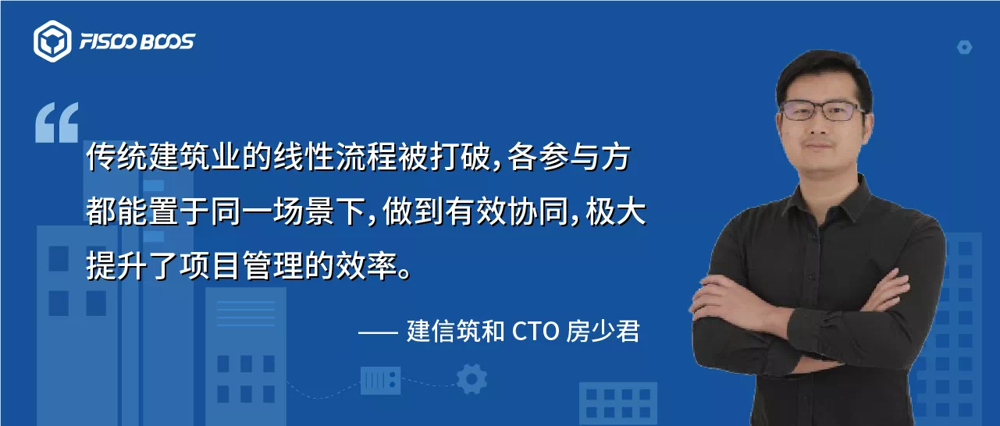
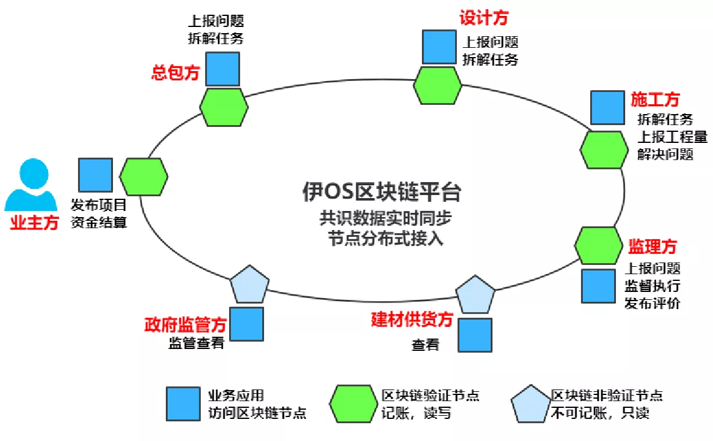
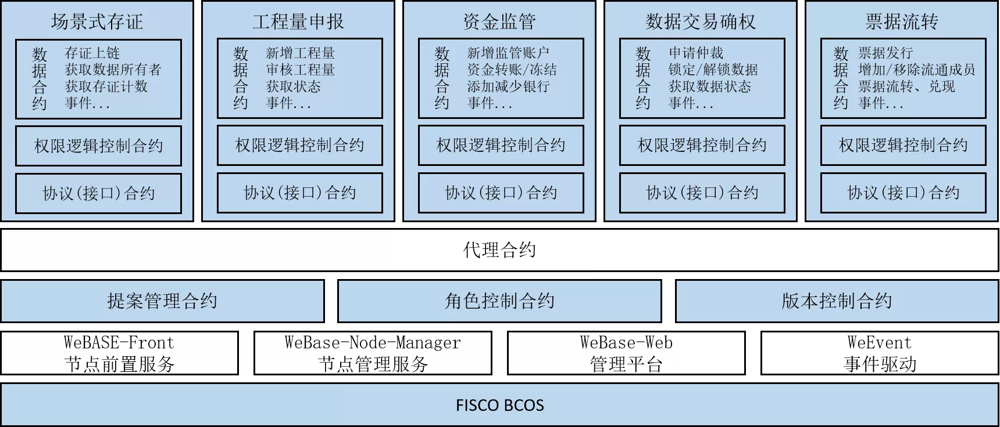

# 打造全场景透明管理，建信筑和联手FISCO BCOS助力建造业数字化

作者：房少君｜建信筑和 CTO

公众号对话框回复【建信筑和】获取方案PDF

随着工业4.0时代持续推进，区块链逐渐挥别纯粹的技术自赏和金融标签，渗透进各类实体产业。

在传统建造场景下，行业信息不透明、管理协同性差、信息化水平不高等“痼疾”，使得建造项目的推进过程存在管理难、追责难、监管难、信任难的问题。“区块链+建造”的结合，利用区块链技术，瞄准这些行业痛点，提出了应用层面的切实解决方案。

深圳市建信筑和科技有限公司（以下简称：建信筑和）基于FISCO BCOS区块链平台开发的“伊OS透明建造解决方案”，正是区块链技术在建造行业场景化应用的典型代表。

该方案凭借全场景管理模式的领先优势，入选区块链服务网络BSN首批官方指定应用，并在工信部中国电子技术标准化研究院主办的2020年第四届中国区块链开发大赛上，斩获桂冠。

## 信息不对称+管理难协同，建造业痛点待破局

在传统建造业中，“信息不对称+管理难协同”是制约行业发展的重要因素。建造业上下游链条很长，如果产业链上每个环节的参与者之间信息不透明，无形中提高了工作协同的沟通、管理成本。诸如施工方和设计方对于设计方案的扯皮、各主体间款项账期的节点把控模糊等问题层出不穷，拖慢整体工程进度。同时，信息不透明也使甲方难以实现全流程式管理穿透，管理不及时、不到位为项目埋下了违规风险，进一步推高信任成本，反过来又加重了工作协同难度。

在传统行业中，建造业信息化程度一直处于较低水平，建设过程中涉及业主投资方、监管方、代建方、咨询方、设计方、施工方、监理方、运营方等众多单位，同时随着当前各类工程项目投资规模的不断扩大，项目管理和资金监管方面压力大，这些问题制约着建造业生态的健康成长。因此，传统建造业的破局路径之一，就是尽快打破现状，利用信息化手段推动建造业实现项目管理“全场景、全主体、全流程透明协同”，而区块链，则是加速技术化进程的独特手段。

在此背景下，建信筑和加入FISCO BCOS区块链开源生态，基于FISCO BCOS区块链技术打造了面向建造行业的全生命周期管理系统——“伊OS透明建造解决方案”，以推进建造行业实现“全场景透明化管理”。该解决方案运用区块链分布式存储/共享、智能合约等技术，与建造行业已有成熟的IT工具如设计软件、造价系统、智慧工地、BIM系统等进行整合，同时结合大数据和人工智能等先进技术，有效破除了行业痛点，构建了一个具有管理穿透、公开透明、信息共享、信用评价的全过程透明建设平台。

## 区块链技术助力，建造实现全场景穿透管理

“伊OS透明建造解决方案”采取了场景式存证、数字签名、加密算法、智能合约等区块链技术，打破了原有单线任务框架，实现了去中心化的任务协同和数据流转。将原有项目链条（产业链条）上的参与者，例如项目方、设计、施工、勘察、总包、分包、监理、班组等，置于同一任务场景中，不再具有严格的上下游流程关系，原来极易形成彼此掣肘的“物流、资金流、信息流”也能做到有机协同。

同时由于智能合约触发机制的存在，工程资金流向有了明确的监管方向，资金流转的每一步都可透明，这将进一步确保资金使用的合理、合规、合法。同时，工程资金透明也使得工程质量和安全更有保障，形成建造产业良性循环。

“伊OS透明建造解决方案”不仅能够实现单项目多标段管理，还可以实现多项目管理，目前已被广泛运用在建造行业，有效提升项目运行效率。截止2020年5月底，伊OS平台上运行项目超300个，参建单位达400多家。在某集团在建的100+个管网项目中，伊OS系统协助项目负责人全面的管理现场施工的过程、进度、质量、安全进行，通过奖惩机制成功落地执行，让项目问题解决率从60%提升到80%。

建信筑和CTO房少君表示，区块链技术遇见建造行业，不仅可以对项目全过程实施文件共享、资金监管、工程量申报、质量安全、绩效考核等全场景“俯瞰”，而且能有效点亮原先项目管理、工程结算及资金监管上的“盲区”，“事前任务分布-事中实时监督-事后责任追溯”自此形成了高效协同的有机闭环。

## 万字报告选定FISCO BCOS，携手重塑建造信用生态

为了有效地打造“伊OS透明建造解决方案”，建信筑和选择了FISCO BCOS。“为了甄选区块链底层平台，我们团队专门做了一份过万字的研究报告，最终选定FISCO BCOS，主要是因为它拥有不可多得的语言优势，生态组件、节点部署和技术支持等都非常丰富、易用和高效。”房少君介绍，在FISCO BCOS技术底层上，建信筑和有效地完成了五大业务场景的系统化构建：场景式存证、工程量申报、资金监管、数据交易确权和票据流转。

基于FISCO BCOS区块链技术的“伊OS透明建造解决方案”能够确保项目实施过程中物流流转和信息流转一一对应、资金流向透明监管、物流全程可追溯和资金到账的高度匹配，不仅是区块链在建造行业中的项目管理流程再造，更是新型“全场景”式管理模式下的信用生态重塑。

------

**社区长期征集基于FISCO BCOS研发的区块链应用，如果您有正在研发或已经上线的应用，欢迎点击“阅读原文”告诉我们，您的应用值得被更多人看见。**