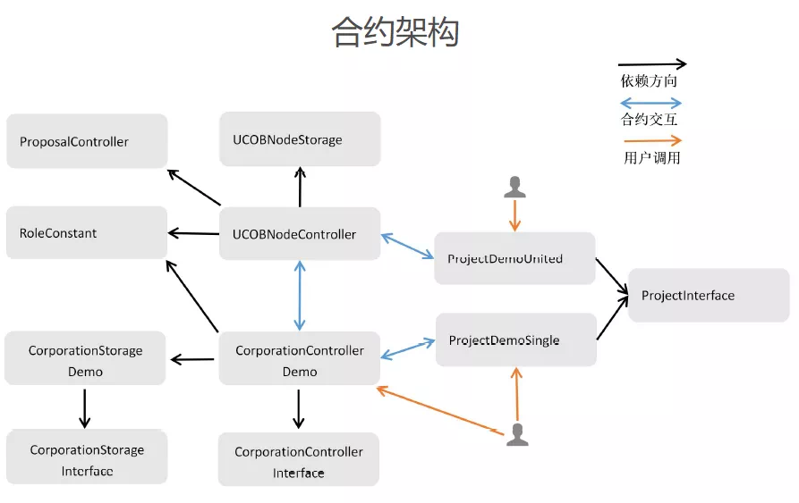

# 多企业间如何实现 “链上协同与治理”

作者：朱立派｜区块链资深开发者（深圳市建信筑和科技有限公司 ）

## 为什么选择企业间多方协同治理场景？

很多朋友可能会好奇，为什么会有“区块链上的联合公司”这样看起来天马行空的想法？首先，区块链技术很适用于“多方协同治理”场景。多中心化自治组织开放式治理能力体现在任何人只要有相应的凭证，就可以公开行使治理。受此启发，我想基于联盟链实现类似功能：联盟各方都具备事先约定的治理能力，通过区块链技术保证治理过程的公平、公正、公开、可追溯和不可抵赖。其次，公司实际业务往来之间对“多方协同治理”存在真实场景需求。

比如一般公司间的业务往来常涉及项目、资金两大类，如果多家公司需要联合管理某个项目，且有资金往来，就可以考虑使用区块链技术实现“链上协同与治理”。大家可保持对项目进展的全局视野一致，同时，任何签字确认的流程都由对应私钥签名后触发，更容易实现责任到人。

## 链上协同与治理实现思路

各家公司在区块链上以单独的“公司合约”形式存在，只要实现了“公司合约接口”便可自定义公司内部业务逻辑与内部组织关系。公司想要加入联合公司时，首先提出申请，部署自己的“公司合约”；然后由已在联合公司中的成员以新部署的“公司合约地址”作为参数发起提案；在得到联合公司中大多数成员投票通过后，便可以正式成为联合公司中的一员。各家公司参与的项目将单独以“联合项目合约”的形式存在，联合公司内任一家成员公司都可以发起联合项目。

首先依据“项目合约接口”开发“联合项目合约”，部署到区块链上；并以“联合项目合约的地址”作为提案中的参数，发起提案；联合公司中每一家公司可以根据提案中的合约地址查看合约，决定是否投票该提案；当得到联合公司中大多数成员公司投票通过后，即成为“联合项目合约”。

## 区块链智能合约设计思路与关键逻辑

### 合约设计思路

在合约设计上，参考了 FISCO BCOS开源社区《[智能合约编写之Solidity的编程攻略](http://mp.weixin.qq.com/s?__biz=MzA3MTI5Njg4Mw==&mid=2247485719&idx=1&sn=2466598f695c56d2865388b7db423196&chksm=9f2efb0ba859721d757cd12f9ff19b3f2af21c00781f31970b1fa156de73d72ca49b12fc0200&scene=21#wechat_redirect)》文章里的思路，采用“数据、管理、控制”分层的设计方法。本智能合约方案主要有三大模块：联合治理模块、公司模块、项目模块，合约交互主要发生在这三大模块的合约之间。



- **联合治理模块**：提案与投票系统，联合公司成员管理系统，联合公司间资金流转系统；
- **公司模块**：单个公司管理系统，单个公司内部资金流转系统；
- **项目模块**：多个公司的联合项目管理，单个公司的内部项目管理。

其中，“联盟管理模块”集中管理“公司模块”合约和“项目模块”合约，管理机制主要为“投票-注册”；公司合约、项目合约在实现对应接口合约方法的基础上自定义业务逻辑，并以单独合约的形式上链。

合约功能上，主要有以下几点：

- 投票注册功能，只有投票数超过一定比率，新公司才能成为联合公司一员，新项目才能认定为联合项目；
- 项目管理功能，如项目管理员的设置；
- 基于角色的权限控制，自定义角色和权限；
- 资金流转，包括公司之间的资金流转（涉及跨合约调用）和公司内部的资金流转；
- 资金发行功能，依据投票决定是否发行资金。

### 关键逻辑的合约代码实现

这里介绍项目中一些关键逻辑的合约代码实现，以“存储类智能合约”的所有权转移为例。本项目采取了“存储、逻辑、控制”分层设计的思路，部署者在部署“存储类智能合约”后必须转移合约所有权关系给控制器类智能合约，存储类合约方法如下：

```
function transferOwnership(address newOwner) public onlyOwner {
require(newOwner != address(0), "Ownable: new owner is the zero address");
emit OwnershipTransferred(_owner, newOwner);
_owner = newOwner;
}
```

上述“newOwner”参数必须为对应的“控制器合约”地址。这样，“存储类智能合约”通过修饰器“modifier onlyOwner()”保证了只有对应的“控制器智能合约”才可以修改“存储类智能合约”的数据。部署完成后在“控制器合约”中通过如下方法可验证是否已具备“存储类合约”的所有权。

```

function checkUCOBNodeStorageSafety() public view returns (bool) {
return ucobNodeStorage.owner()==address(this);
}
```

控制器类智能合约的代码逻辑可以升级，通过投票来决定是否升级。

```

function changeUCOBNodeStorageOwner(bytes32 proposalId) public {
require(proposalPassed(proposalId,...));
...
ucobNodeStorage.transferOwnership(UCOBNodeControllerAddress);
...
}
```

当投票通过后，“存储类智能合约”的所有权关系会转移到新的“控制器合约”地址上，数据不变，但是业务逻辑“升级”了。
