## fisco-bcos适配达梦数据库

作者：dyy8888(董耀宇)|北京邮电大学

### 为什么需要达梦数据库？

达梦数据库作为一款国产数据库软件，拥有自主产权，满足国内要求自主产权、安全和国产化等要求。

目前`fisco-bcos`支持的数据库有：`mysql`、`rocksdb`，并不支持国产数据库达梦数据库，本次改造在`fisco-bcos2.9.1`版本的源代码基础上，对其中`mysql`的源码`zdbStorage`部分进行修改以适配达梦数据库。目前改造版本将暂不支持`mysql`数据库。

我们成功在搭载鲲鹏`CPU`，麒麟`os`的系统上运行了达梦区块链节点，实现了`CPU`、操作系统和数据库的国产化适配。

### 达梦FISCO改造思路

首先明确一点，我们的改造基于源码是`FISCO-BCOS 2.9.1`版本。

达梦数据库与`mysql`数据库都属于关系型数据库，就此次改造而言，两者主要区别包含两点：

1. `SQL`语句和数据类型不同
2. 数据库结构不同：`mysql`数据库有库和表的概念，可以建立多个数据库，每个数据库中包含多个表，数据库之间彼此独立。所以在使用`mysql`存储引擎时，需要为每一个节点配置一个数据库；然而达梦数据库中并不是这样的架构，其架构更类似于`oracle`数据库，不存在可以配置多个数据库的情况。所以对于一个达梦节点而言，就需要配置一个达梦数据的实例。

由于达梦和`mysql`具有一定的相似性，所以我们的改造也是基于`mysql`源码部分。那么首先我们需要了解一下`fisco`是如何实现`mysql`存储的。

#### fisco如何使用mysql数据库

有关于`mysql`部分的源码位于源码文件的`libStorage`文件夹中的`ZdbStorage`文件中。通过阅读源码我们发现在`fisco`与`mysql`的连接上使用了一款叫做`libzdb`的插件。这款插件提供了一系列数据库操作的接口，比如连接池、URL连接、`SQL`语句执行封装等接口，并且是线程安全的。目前这款插件支持的数据库包括支持`Mysql` `Oracle` `SQLite` `PostgreSQL`。

所以这给适配达梦提供了思路，如果想使用这些接口的话，那么就需要让达梦和`libzdb`进行适配，然后就可以直接使用这些接口了。

#### fisco如何使用达梦数据库

由于`libzdb`官方给出的说明中并不支持达梦数据库，所以我们有必要让两者进行适配，才可以进行与`fisco`的结合。

在达梦数据库给出的驱动方面，其提供的`OCI`驱动包是按照`oracle`进行书写的，所以与`oracle`天然适配，这无疑给我们的改造提供了极大的便利。所以此次改造我们使用了`libzdb oracle`部分的代码，进行修改后使其适配达梦数据库。

在完成`libzdb`适配后，我们修改了`fisco zdb`部分的代码，主要是针对`sql`语句的改造，成功实现`fisco`与达梦数据库的结合。

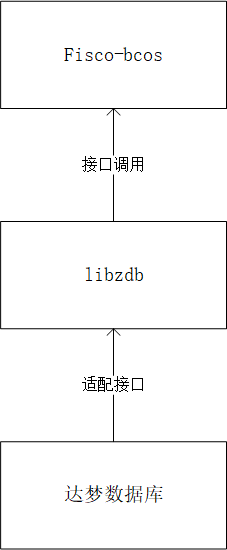

#### 对于源码编译的改造

说完了适配的整体思路，继续说一下关于编译环节的改造。

首先说一下`fisco`在源码编译部分的处理。`fisco`是用`cmake`进行组织编译的，在源码的`cmake`文件夹中存放着需要拉取依赖的地址和操作方式，文件目录如下图所示

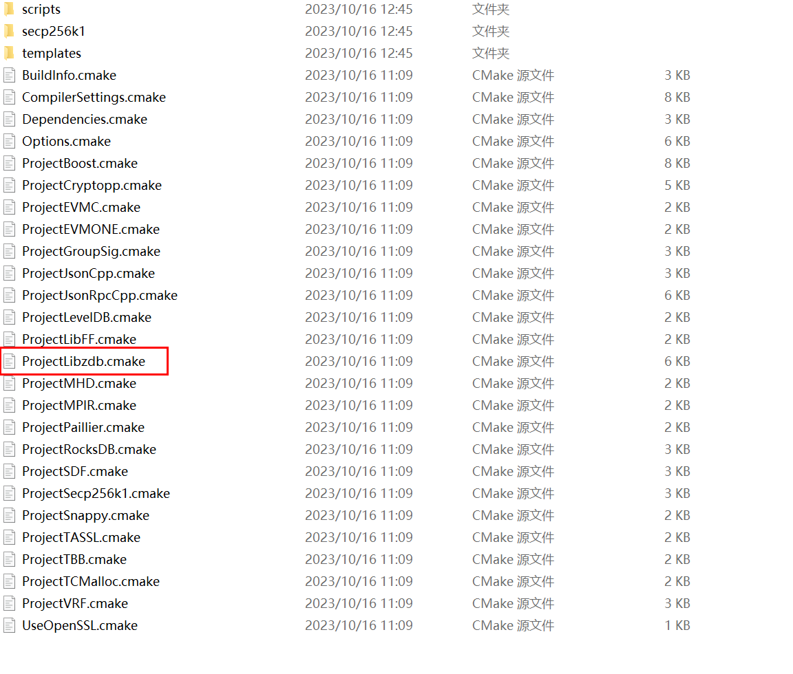

其中我们可以发现一个叫`ProjectLibzdb.cmake`的文件，我们进去看一下

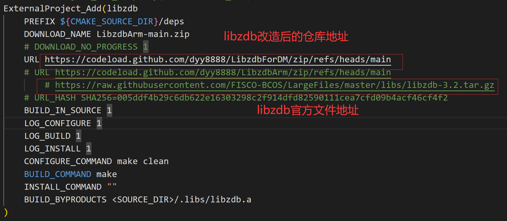

这是修改后文件，其主要作用就是根据URL地址拉取第三方依赖包。由于我们对`libzdb`进行了自己的适配改造，所以我们将改造后的`libzdb`代码上传到了自己的仓库中，以便进行下载。

所以我们对`cmake`文件也进行了修改

### fisco-dm源码编译

本章节将针对如何从源码编译出适配达梦的`fisco-bcos`程序。当然，我们在文末也提供了直接编译好的`fisco-bcos`程序，您可以跳过这一章节，直接使用编译好的程序也可以。

#### 相关依赖

`fisco-bcos`:2.9.1版本

`达梦数据库`:DM8

`达梦驱动包`:dmoci

操作系统：centos7+，ubuntu20.04，麒麟osV10；支持ARM，不支持windows系统

#### libzdb适配教程

由于开发周期较短，所以`libzdb`适配达梦数据库的一键配置的脚本并没有完成，所以需要进行人工手动适配，过程略有繁琐。

1. 首先请准备一台装有`mysql`的电脑/服务器，将l`ibzdb-dm`代码拉取到本地，代码仓库地址：https://github.com/dyy8888/LibzdbForDM.git 此仓库提供的就是改造好的`libzdb-dm`代码

2. 在`libzdbForDM`文件夹中，执行自动检测脚本，这一步会自动检测所拥有的数据库

   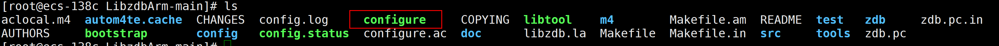

   ```shell
   ./configure
   ```

   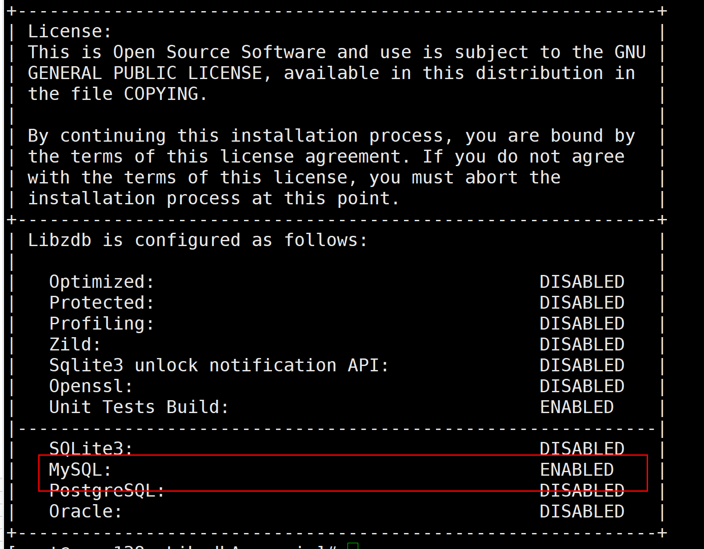

   可以发现检测到了`Mysql`的环境，同时会生成`MakeFile`文件

   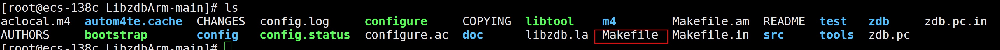

3. 编辑`MakeFile`文件，修改其中的配置信息。

   修改前：

   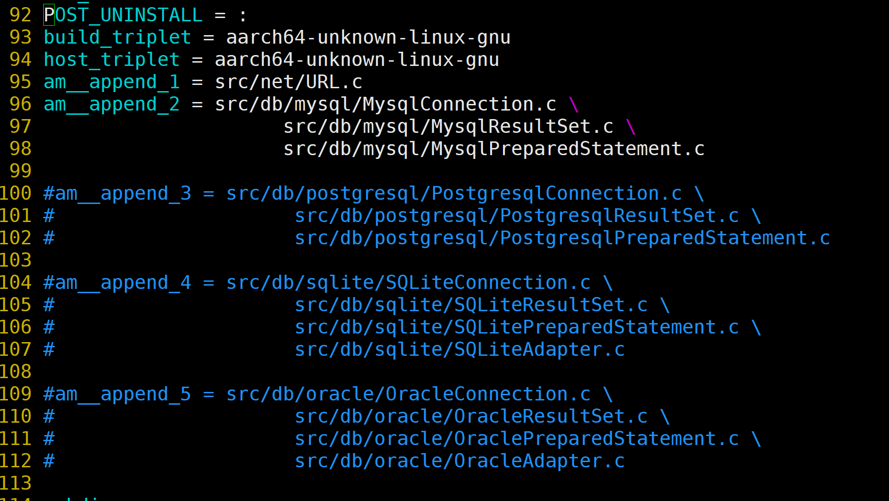

   修改后：

   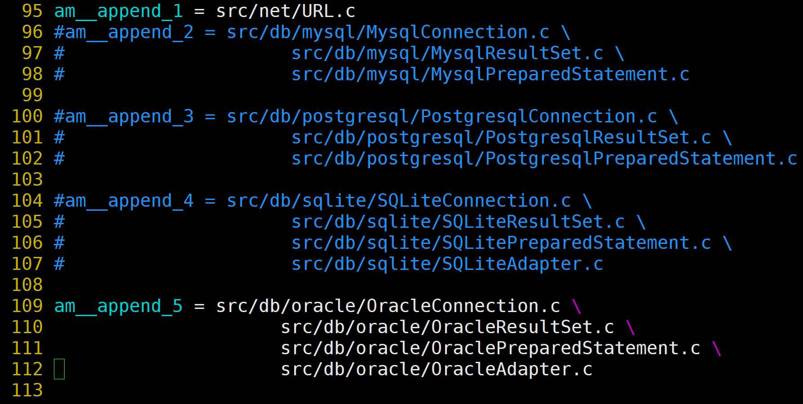

   修改前：

   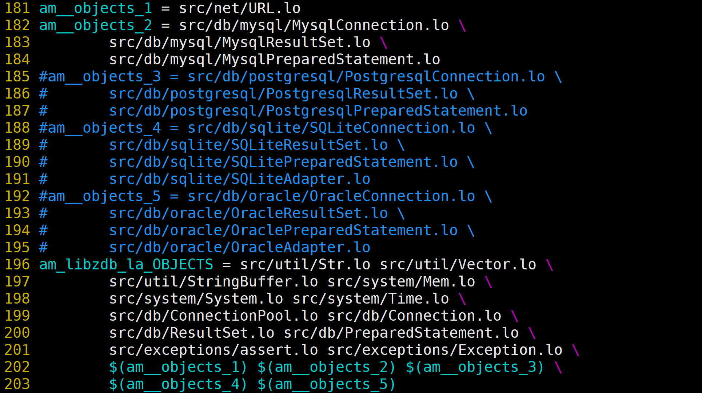

   修改后：

   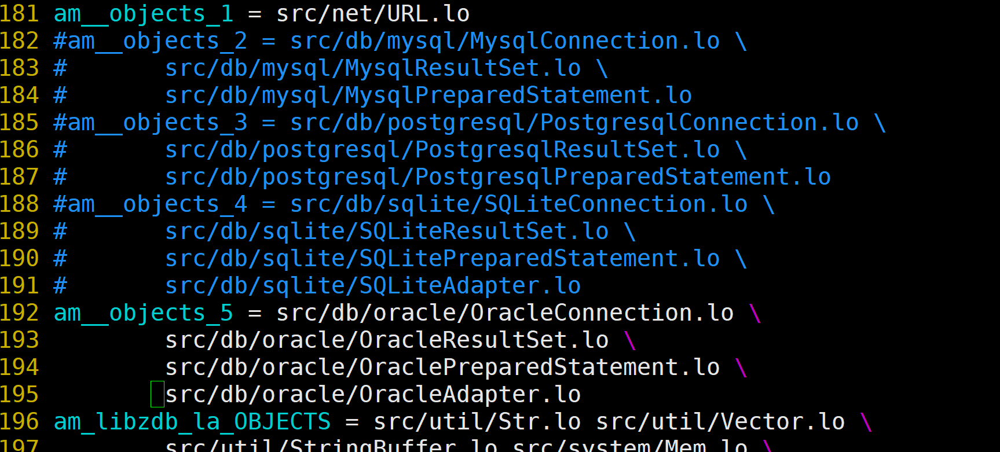

   因为自动检测到的是`mysql`环境，所以需要注释掉`mysql`相关的信息，打开`oracle`相关的

   修改前：

   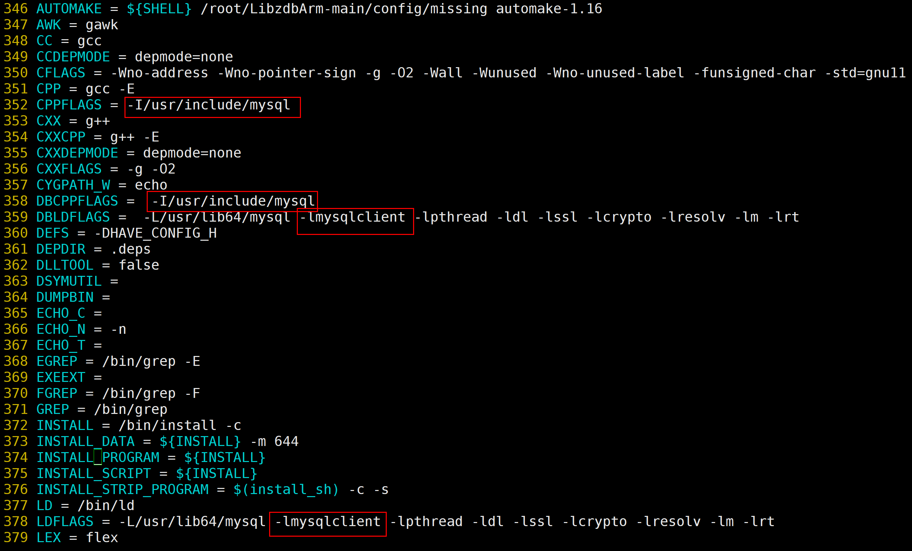

   修改后：

   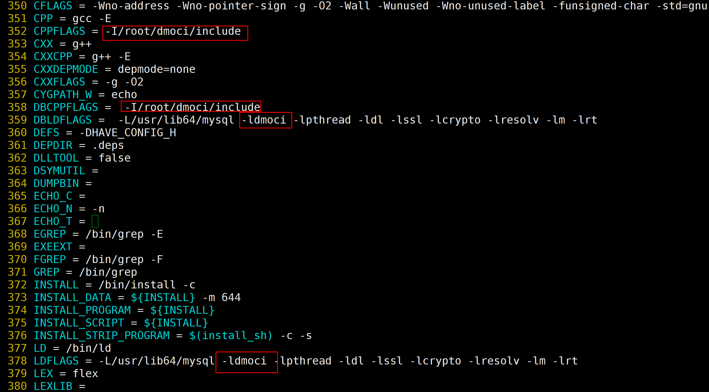

   这两步的作用是将达梦给的`dmoci`的驱动和`DCI.h`的头文件导入`libzdb`项目中。驱动和头文件会在文末的百度网盘链接中给出。下图给出`dmoci`驱动包的文件结构。可以发现其中包含驱动`dmoci.a dmoci.so`和依赖的头文件`DCI.h DCI1.h oci.h`

   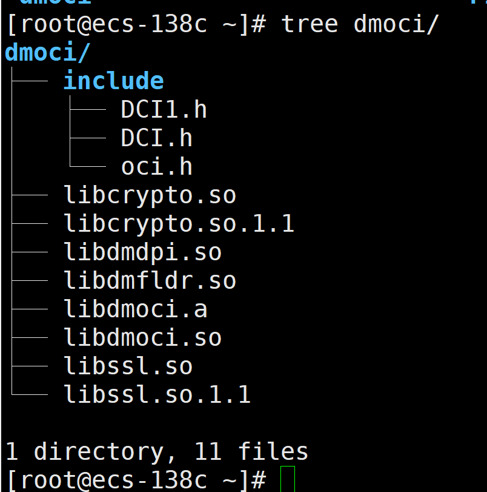

   其中：`/root/dmoci/include`其中包含`DCI.h`头文件，此路径需根据实际情况进行修改

   `dmoci`为驱动，需要将达梦提供的`oci`驱动包中的`libdmoci`文件复制到系统目录下，这个目录可以参考359行前面给出路径。比如此图片中，需要将`dmoci`复制到`/usr/lib64`中

   保存退出`MakeFile`文件

4. 进入src文件夹，修改其中的xconfig.h文件

   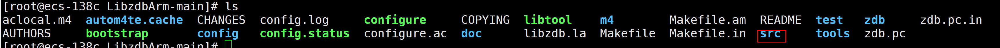

   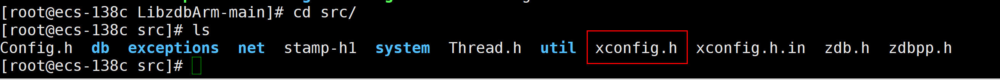

   修改前：

   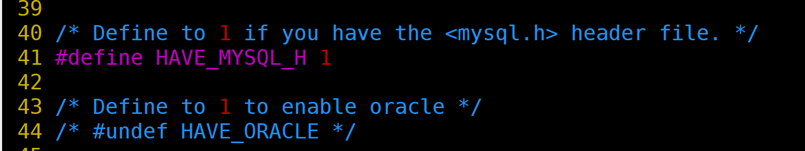

   修改后：

   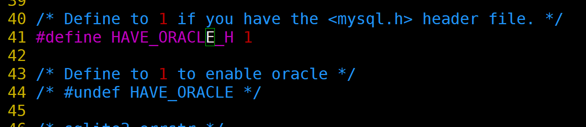

   这一步的目的是关闭`mysql`，打开`oracle`

5. 返回与Makefile同级目录中，如下图所示，执行编译安装步骤

   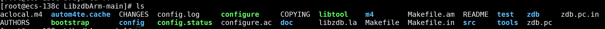

   ```shell
   make -j4
   sudo make install
   ```

6. 安装成功后说明适配成功，执行清除指令

   ```shell
   sudo make clean
   ```

7. 将上述适配好的代码上传到个人的仓库中，这一步的目的是`fisco`在源码编译的时候需要根据依赖的地址去下载，所以请将此代码上传一个可以进行拉取下载的仓库中。同时可能会有疑问，为什么不直接拉取作者改造好的代码呢？这是因为我自己改造的代码相关配置路径是在执行`./configure`后根据我自己服务器的相关信息产生的。所以对于用户来说，肯定和我的服务器路径不相同，所以需要您手动拉取代码后进行配置。

#### fisco适配

##### **源码编译**

修改后的fisco代码仓库位于：https://github.com/dyy8888/FISCO-BCOS-2.9.1.git

请先拉取代码到本地。

```shell
#进入cmake目录下，修改ProjectLibzdb.cmake
将下载地址设置为上一步中适配好的libzdb代码地址，也就是您自己上传的github仓库，其他仓库也可以，只要确保可以通过URL下载下来就行
```

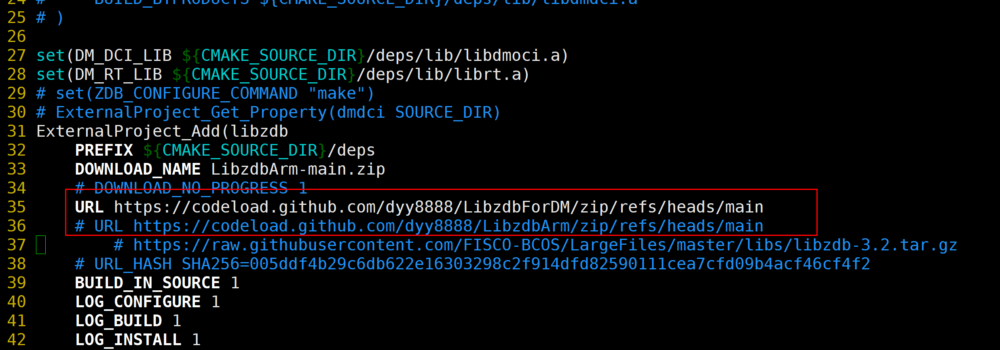

```shell
#返回上一级目录，新建文件夹build
mkdir build
#执行cmake指令
cmake ..
#如果是arm64架构，执行。x86不需要
cmake -DARCH_NATIVE=on ..
#进行编译
make -j4
```

在编译过程中，会自动将依赖拉取到deps目录下

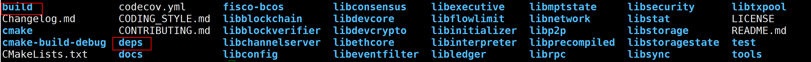

```shell
#需要手动复制rt和oci驱动至deps/libs文件夹中，如下图所示，其余的依赖会在编译中自动放入。这两个依赖，#libdmoci.a在网盘提供的包里有。librt.a请在您的系统目录下寻找。也可以使用命令查找
whereis librt.a 
```

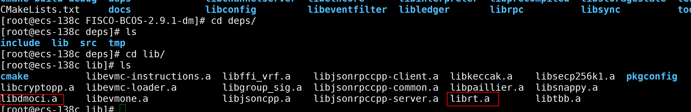

最后，可在build/bin目录下得到`fisco-bcos`可执行程序

### 具体使用教程

文末的百度网盘包中提供了编译好的`fisco-bcos`可执行程序，如果您跳过了源码编译环节，您可以直接看本章节进行部署使用

由于测试环境仅包含一台达梦实例，所以本教程将搭建三个`mysql`节点和一个达梦节点

首先根据官网文档教程搭建本地四节点的`fisco-bcos`链

```shell
## 创建操作目录
cd ~ && mkdir -p fisco && cd fisco

## 下载脚本
curl -#LO https://github.com/FISCO-BCOS/FISCO-BCOS/releases/download/v2.9.1/build_chain.sh && chmod u+x build_chain.sh
## 执行建链脚本
bash build_chain.sh -l 127.0.0.1:4 -p 30300,20200,8545
```

可以得到以下的目录结构，其中包含着四个节点

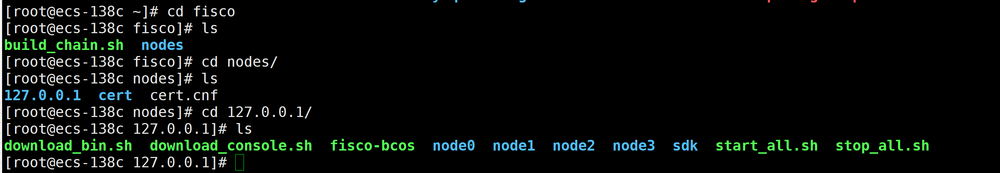

```shell
## 返回主目录，新建文件夹fisco-DM
cd ~ && mkdir -p fisco-DM
## 复制刚才的fisco文件夹到fisco-DM中
cp -r fisco fisco-DM/
```

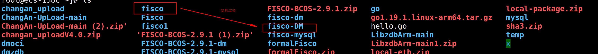

```shell
## 我们将node0设置为达梦节点，其他节点为mysql节点。
## 所以删除fisco文件夹中的node0文件夹，删除fisco-DM中的node1,node2,node3文件夹
## 处理完毕后的目录结构为
```

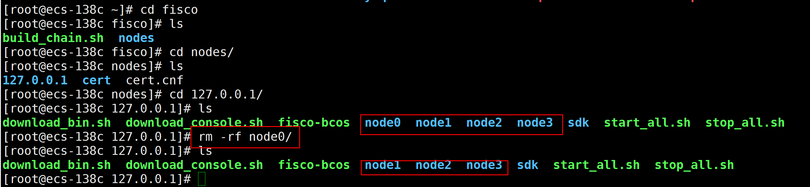

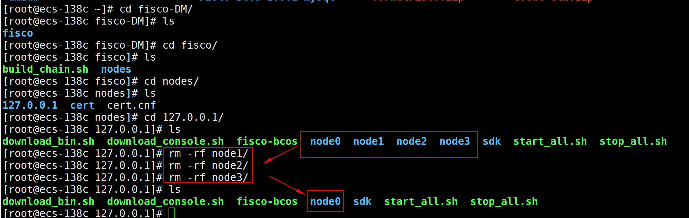

将`fisco-DM`文件夹中的`fisco-bcos`程序，换成达梦版本的程序（源码编译而来，或者直接使用链接包中的程序）

修改达梦节点（node0）下，conf/group.1.ini

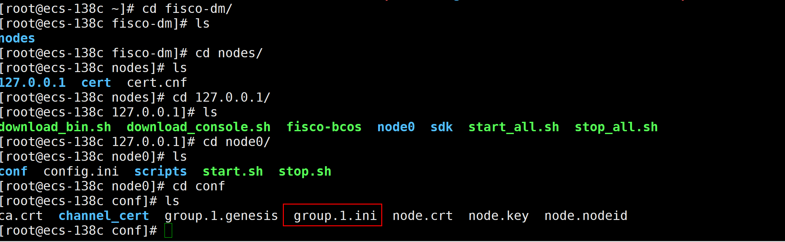

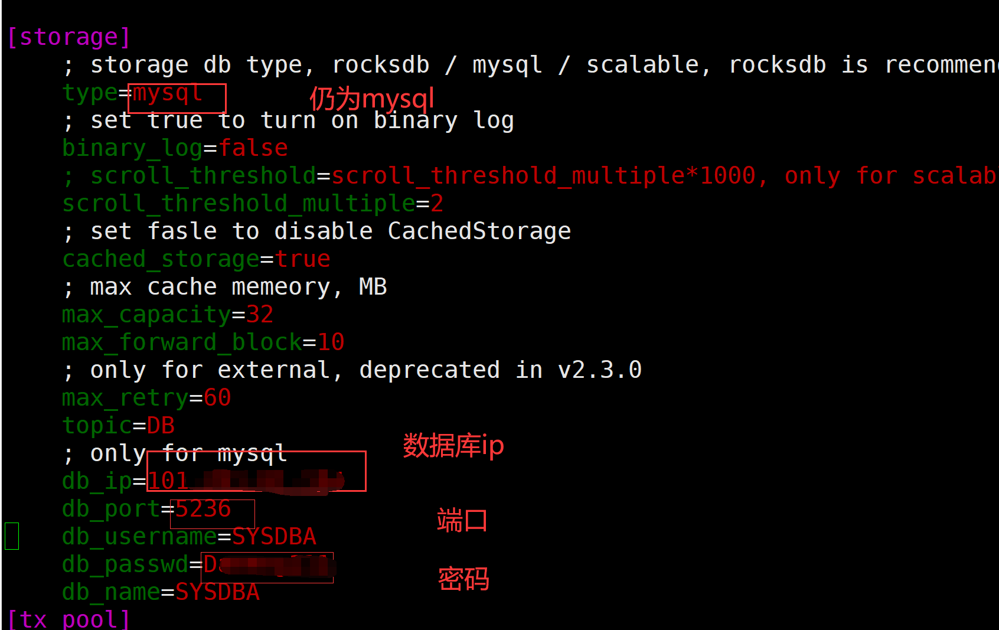

目前仅支持SYSDBA的写入，请确保您的用户具备`DBA`的权限

启动节点后，查询节点的运行日志，检查是否共识正常。同时可以登录达梦数据库的命令行，查询相关的表格信息。如下图所示：

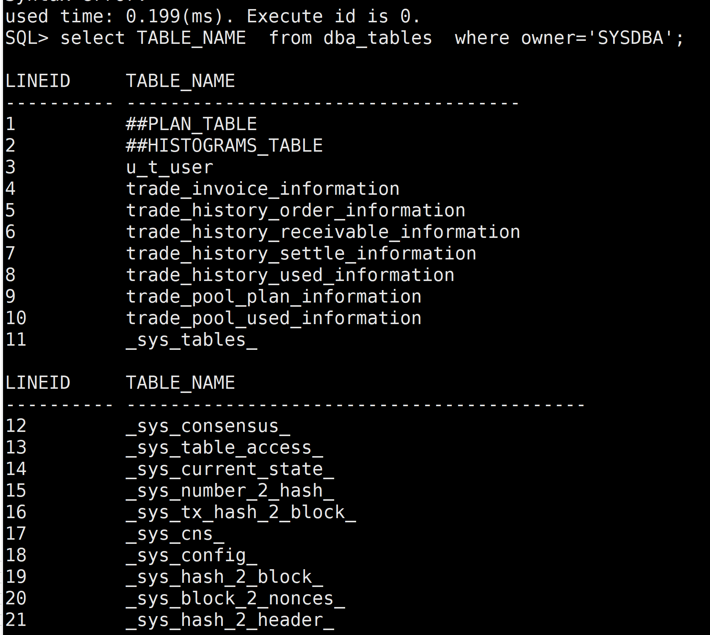

### 软件包链接

链接：https://pan.baidu.com/s/13VLvYNdrdloMZFMjzWQsrQ?pwd=dm10
提取码：dm10

fisco-dm的PR链接为：https://github.com/FISCO-BCOS/FISCO-BCOS/pull/3969

这里可以看到关于fisco-dm对于底层文件的改动情况

如有更多问题，可联系我们：2497213126@qq.com

可以进行指导部署安装达梦区块链节点