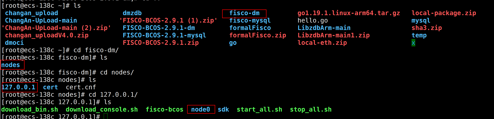
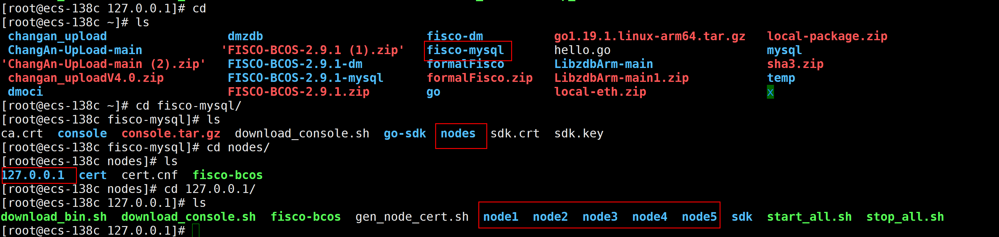

本文档为fisco适配达梦数据库全套使用教程，实现fisco底层存储替换为国产数据库达梦数据库
相关驱动和编译后程序均由百度网盘给出
链接：https://pan.baidu.com/s/13VLvYNdrdloMZFMjzWQsrQ?pwd=dm10
提取码：dm10
### 整体改造过程

fisco-bcos支持的数据库有：mysql、rocksdb，不支持国产数据库达梦数据库，本次改造在fisco-bcos2.9.1版本的源代码基础上进行改造，对其中mysql的源码zdbStorage部分进行修改，相关sql语句进行改造以适配达梦数据库。所以改造后原先mysql数据将不再支持。

libzdb是一款开源的，提供线程安全的数据库接口，支持mysql、oracle等数据库。fisco在实现mysql数据库的存储时使用到了libzdb这款插件。但是libzdb本身不支持达梦数据库，所以为了使用达梦数据库，我们需要先实现达梦数据库与libzdb的适配，再实现libzdb与fisco的适配。

### 版本信息和必要依赖

#### fisco-bcos

`源码版本`:2.9.1

#### 达梦数据库

`数据库版本`:DM8

`驱动包`:oci驱动

### fisco-dm使用

#### libzdb适配教程

由于开发周期较短，所以libzdb适配达梦数据库的一键配置的脚本并没有完成，所以需要进行人工手动适配。

1. 请准备一台装有mysql的电脑/服务器，将libzdb-dm达梦拉取到本地，代码仓库地址：https://github.com/dyy8888/LibzdbForDM.git 此仓库提供的就是改造好的libzdb代码

2. 在libzdbForDM文件夹中，执行自动检测脚本，这一步会自动检测所拥有的数据库

   ```shell
   ./configure
   ```

   

   可以发现检测到了Mysql的环境，同时会生成MakeFile文件

3. 编辑MakeFile文件，修改其中的配置信息。

   修改前：

   

   修改后：

   

   修改前：

   

   修改后：

   

   修改前：

   

   修改后：

   

   其中：/root/dmoci/include其中包含DCI.h头文件，此路径需根据实际情况进行修改

   dmoci为驱动，需要将达梦提供的oci驱动包中的libdmoci文件复制到系统目录下，这个目录可以参考359行前面给出路径。比如此图片中，需要将dmoci复制到/usr/lib64中

   保存退出MakeFile文件

4. 进入src文件夹，修改其中的xconfig.h文件

   修改前：

   

   修改后：

   

5. 返回与Makefile同级目录中，执行编译安装步骤

   ```shell
   make -j4
   sudo make install
   ```

6. 安装成功后说明适配成功，执行清除指令

   ```shell
   sudo make clean
   ```

7. 将上述适配好的代码上传到个人的仓库中，这一步的目的是fisco在源码编译的时候需要根据依赖的地址去下载，所以请将此代码上传一个可以进行拉取下载的仓库中

   

#### fisco适配

##### **源码编译**

修改后的fisco代码仓库位于：https://github.com/dyy8888/FISCO-BCOS-2.9.1.git

请先拉取代码到本地。

```shell
#进入cmake目录下，修改ProjectLibzdb.cmake
将下载地址设置为上一步中适配好的libzdb代码地址
```


```shell
#返回上一级目录，新建文件夹build
mkdir build
#执行cmake指令
cmake ..
#如果是arm64架构
cmake -DARCH_NATIVE=on ..
#进行编译
make -j4
```

在编译过程中，会自动将依赖拉取到deps目录下


```shell
#需要手动复制rt和oci驱动至deps/libs文件夹中，如下图所示，其余的依赖会在编译中自动放入
```


最后，可在build/bin目录下得到fisco-bcos可执行程序

##### 使用教程

以5个mysql节点+一个达梦节点为例

首先根据官网文档教程搭建本地四节点的fisco-bcos链，将其中的一个节点单独复制出来，得到的目录结构如下图所示



其中的fisco-bcos可执行程序需要替换为手动编译的支持达梦的fisco-bcos

mysql类型节点目录如下图所示



##### 修改达梦数据库节点配置

修改达梦节点下，conf/group.1.ini


目前仅支持SYSDBA的写入

启动节点后即可正常运行

