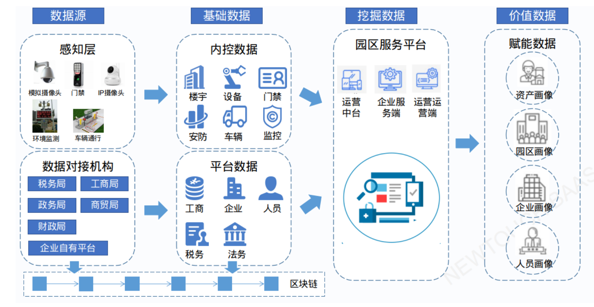
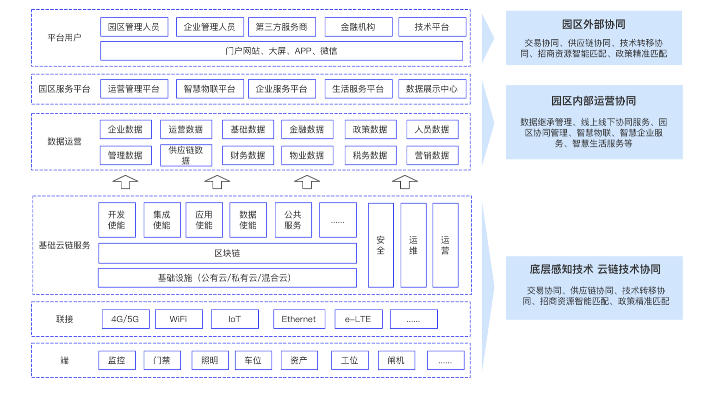

## 新致区块链 - 数字智慧园区的可信基石
作者：刘靖毅 ｜ 上海新致软件 -- 项目总监  

### 智慧园区发展的现状分析
&emsp;&emsp;智慧园区的信息化建设是个系统化工程，区块链技术需要从实际需求来考虑应用方案，利用创新方式来完成技术进阶。
因此，挖掘区块链优势与特点，将区块链技术应用到智慧园区建设中就至关重要。  
&emsp;&emsp;数字智慧园区发展多年，各式各样的园区越来越多。数字园区发展迅猛主要得益于以下因素：从经济因素看，下游行业发展迅猛，促进园区快速发展；政治因素来看，“十三五规划”中智慧园区被提出，最近几年获得政策支持，因此得以快速发展。从技术来看，大数据、 AI、 5G等前沿技术已经从一线城市慢慢渗透到二、三线甚至四线城市的园区建设中，所以数字智慧园区建设整体发展势头还是比较迅猛。  
&emsp;&emsp;面对如此迅速的发展，国内的数字智慧园区发展仍然存在一些痛点，主要体现在：
- 首先，各大园区地域上比较分散，信息孤岛问题比较严重。此外，过去建设中堆积大量的应用系统，包括硬件系统、物联网软件等，有传统的也有新建的，各种系统下，运维效率却不见得高。
- 其次，园区建设同质化。所谓同质化，就是最早一批智慧园区在发展时，被作为当地标杆，其他园区就开始模仿标杆建设，因此建设出来的园区非常相似，没有太多创新。
- 再次，没有构建园区生态，难以形成闭环。最早的智慧园区建设还没提及生态，只是将整体设计更智能。
- 最后，需要更前瞻规划，对外扩展性低。

### 链上园区解决方案
&emsp;&emsp;数据产生价值是智慧园区建设的核心，在这个过程中，如何保证数据的可信度和真实可靠性，区块链技术的可追溯、不可篡改等特点在这里就可以发挥它的作用。

&emsp;&emsp;智慧园区建设的整体数据架构图，最左边是大家比较熟悉的数据源、基础数据、平台数据，园区的数据从感知层开始，将基础数据收集起来，包括政府数据和企业自有数据，上传到新致链上去，通过验证数据真实，上传存证后可以保证数据不可篡改。在这种前提下，我们再进行数据挖掘，进而产生有价值的数据。最右边我们看到是数据挖掘之后推导出的资产画像、园区画像、企业画像、人员画像，以便相关机构给用户提供更好服务。

&emsp;&emsp;园区建设的整体系统架构如上图所示，整个架构大体可以分为园区外部协同、园区内部运营协同以及底层感知技术/云链技术协同三大部分，我们可以看到，区块链其实是在云端服务这层架构里，最底层是感知技术，跟物联网相关，会收集基础数据再进行上链，保证数据的不可篡改且可追溯。再往上一层就是在园区内部的运营协同，将业务内容串连起来，包括线上线下的业务数据，最外部就是平台的用户系统。

### 区块链在实施过程中的应用
&emsp;&emsp;首先，整个底层其实是区块链BaaS平台，包括网络节点，还有链的管理。最关键的，就是园区的联盟链，不仅是把园区作为一个认证节点，而且要把企业甚至是一些政府机构，也纳入到认证节点里，加入到整个区块链生态里，这样才能确保真正建立出一个完整的区块链园区生态。
&emsp;&emsp;在底层上我们选用了FISCO BCOS，主要是以联盟链的业务场景进行选型比较，经过对比，我们发现FISCO BCOS具有以下几大优势：  
- 节点扩展性高，可以方便进行节点的增和删。
- 智能合约支持EVM，可使用当前流行语言Solidity编写智能合约，易上手。
- 支持分布式数据库，支持KV数据库，可方便查询数据，保留历史可追溯。
- 支持国密，对国内监管需求友好。
- 支持节点准入控制，有灵活的权限控制，实现全面的安全保障。
- 支持监管和审计机构作为观察节点加入联盟链，获取实时数据进行监管审计。
- 社区成熟，项目迭代速度快，对应生态工具多，社区有超40000名成员和超2000家企业参与。

&emsp;&emsp;链上园区效果与前景
&emsp;&emsp;经过几年的发展，数字智慧园区1.0阶段基本已完成，这个阶段主要进行了数字化建设，加入5G、物联网技术，未来，区块链会渗入到园区建设中，从而实现从1.0向2.0建设方向迈进。  
&emsp;&emsp;作为基础设施，区块链一定要与实际应用场景相结合，与各项前沿技术融合，真正解决园区建设中的痛点问题。现在大多数园区的云建设已经比较成熟，如何通过区块链与现有云技术结合，在这个过程中发挥更大价值，将是2.0阶段探索的重要命题
&emsp;&emsp;就区块链技术而言，未来的想象空间还是比较大的，根据不同类型的园区，收集不同类型的数据，挖掘不同的潜在价值，为需求方提供更具参考意义的信息价值。
