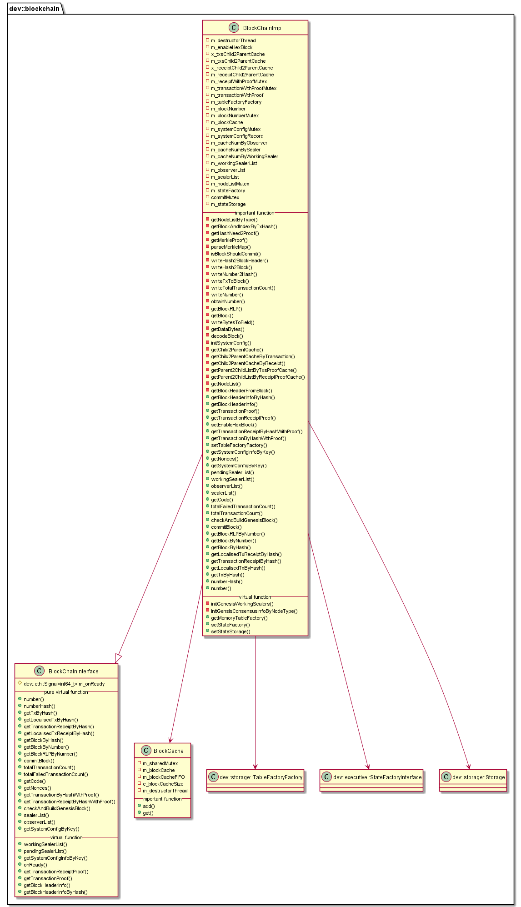

#  libblockchain 模块
作者：TrustChain [微信公众号]

libblockchain：管理区块、交易、区块链状态等信息的读写。


## 主要内容有：

+ 管理区块、交易、区块链状态等信息的读写。




## 涉及知识点：
+ 区块缓存数据结构：
```
mutable std::map<dev::h256, std::shared_ptr<dev::eth::Block>> m_blockCache;
mutable std::deque<dev::h256> m_blockCacheFIFO;  // insert queue log for m_blockCache
```
+ getBlockHeaderInfoByHash：先查缓存m_blockCache，查不到再查询系统表;

+ SYS_HASH_2_BLOCKHEADER，如果查询不到，再getBlock函数获取区块；

+ getBlock函数：先查缓存m_blockCache，查不到再查询系统表SYS_HASH_2_BLOCK；

+ getBlockRLP函数：访问SYS_NUMBER_2_HASH、SYS_HASH_2_BLOCK获取区块的RLP编码数据；

+ initGenesisWorkingSealers：用于共识算法rpbft,初始化共识节点队列，在sealerList随机选择共识节点workingSealers；

+ commitBlock函数
```
tbb::parallel_invoke([this, block, context]() { writeHash2Block(*block, context); },
                [this, block, context]() { writeNumber2Hash(*block, context); },
                [this, block, context]() { writeNumber(*block, context); },
                [this, block, context]() { writeTotalTransactionCount(*block, context); },
                [this, block, context]() { writeTxToBlock(*block, context); },
                [this, block, context]() { writeHash2BlockHeader(*block, context); });
```
+ 计算区块的交易或者回执的默克尔根
```

std::pair<dev::eth::BlockNumber, std::shared_ptr<Child2ParentMap>> m_receiptChild2ParentCache;
 std::pair<dev::eth::BlockNumber, std::shared_ptr<Child2ParentMap>> m_txsChild2ParentCache;
//获取默克尔根
void BlockChainImp::getMerkleProof(dev::bytes const& _txHash,
    const std::map<std::string, std::vector<std::string>>& parent2ChildList,
    const Child2ParentMap& child2Parent,
    std::vector<std::pair<std::vector<std::string>, std::vector<std::string>>>& merkleProof)
{
    std::string merkleNode = toHex(_txHash);
    //得到merkleNode的自身节点itChild2Parent，设为A
    auto itChild2Parent = child2Parent.find(merkleNode);
    while (itChild2Parent != child2Parent.end())
    {
        //itChild2Parent->second，即A的父节点B，itParent2ChildList=<B,[merkleNode,merkleNode兄弟节点]>
        auto itParent2ChildList = parent2ChildList.find(itChild2Parent->second);
        if (itParent2ChildList == parent2ChildList.end())
        {
            break;
        }
        // get index from itParent2ChildList->second by merkleNode
       //<B,[merkleNode,merkleNode兄弟节点]>，itChildlist= merkleNode
        auto itChildlist = std::find(
            itParent2ChildList->second.begin(), itParent2ChildList->second.end(), merkleNode);
        if (itChildlist == itParent2ChildList->second.end())
        {
            break;
        }
        // copy to merkle proof path
        std::vector<std::string> leftpath;
        std::vector<std::string> rightpath;
        leftpath.insert(leftpath.end(), itParent2ChildList->second.begin(), itChildlist);
        rightpath.insert(rightpath.end(), std::next(itChildlist), itParent2ChildList->second.end());
        merkleProof.push_back(std::make_pair(std::move(leftpath), std::move(rightpath)));
        //itChild2Parent->second，即A的父节点B，merkleNode指向父节点B
        merkleNode = itChild2Parent->second;
        //从下往上计算默克尔树根
        itChild2Parent = child2Parent.find(merkleNode);
    }
}
```
参考文献：

[1] https://github.com/FISCO-BCOS/FISCO-BCOS/releases/tag/v2.7.2

[2] https://fisco-bcos-documentation.readthedocs.io/zh_CN/latest/
