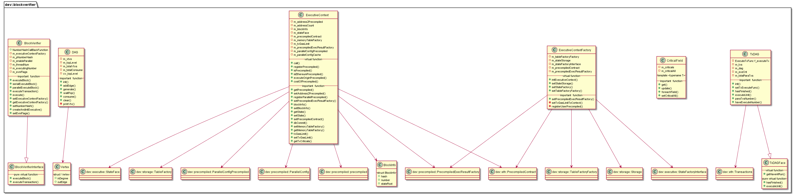

# libblockverifier 模块

作者：TrustChain [微信公众号]

libblockverifier：一个区块的执行逻辑，包括DAG并行实现。


## 主要内容有：

+ 数据结构：顶点（Vertex）、DAG、TxDAG。

+ 区块的串行执行、并行执行等。




## 涉及知识点：

+ DAG.cpp
```
//顶点数据结构
struct Vertex
{
    std::atomic<ID> inDegree;
    std::vector<ID> outEdge;
};
//DAG数据结构
class DAG
{
private:
    std::vector<std::shared_ptr<Vertex>> m_vtxs;
    //初始化时，先存放入度为0的顶点，接着会存放入度为1的顶点等
    tbb::concurrent_queue<ID> m_topLevel;
    ID m_totalVtxs = 0;
    std::atomic<ID> m_totalConsume;
}
//为两个顶点添加一条边
void DAG::addEdge(ID _f, ID _t)
{
    if (_f >= m_vtxs.size() && _t >= m_vtxs.size())
        return;
    m_vtxs[_f]->outEdge.emplace_back(_t);
    //边的终点的入度+1
    m_vtxs[_t]->inDegree += 1;
}
//从入度为0的_id出发进行消费与_id相接的顶点集合
ID DAG::consume(ID _id)
{
    ID producedNum = 0;
    ID nextId = INVALID_ID;
    ID lastDegree = INVALID_ID;
    for (ID id : m_vtxs[_id]->outEdge)
    {
        //获取与_id相接的顶点vtx
        auto vtx = m_vtxs[id];
        { 
            //vtx入度-1
            lastDegree = vtx->inDegree.fetch_sub(1);
        }
        //顶点vtx还有一条边的情况
        if (lastDegree == 1)
        {
            ++producedNum;
            //记录第一次遇到的下个待处理的顶点nextId
            if (producedNum == 1)
            {
                nextId = id;
            }
            else
            { 
                //将入度为1的顶点入队列
                m_topLevel.push(id);
                cv_topLevel.notify_one();
            }
        }
    }

    if (m_totalConsume.fetch_add(1) + 1 == m_totalVtxs)
    {
        cv_topLevel.notify_all();
    }
    return nextId;
}
```

+ TxDAG.cpp
```
/**重要的数据结构
//临界域
template <typename T>
class CriticalField
{
private:
    std::map<T, ID> m_criticals;
}

using ExecuteTxFunc =
    std::function<bool(dev::eth::Transaction::Ptr, ID, dev::executive::Executive::Ptr)>;

class TxDAG : public TxDAGFace
{
private:
    ExecuteTxFunc f_executeTx;
    std::shared_ptr<dev::eth::Transactions const> m_txs;
    DAG m_dag;
    ID m_exeCnt = 0;
    ID m_totalParaTxs = 0;
    mutable std::mutex x_exeCnt;
}
*/

//可并行执行的单元
int TxDAG::executeUnit(Executive::Ptr _executive)
{
    int exeCnt = 0;
    ID id = m_dag.waitPop();
    while (id != INVALID_ID)
    {
        do
        {
            exeCnt += 1;
            f_executeTx((*m_txs)[id], id, _executive);
            //主要是减边操作
            id = m_dag.consume(id);
        } while (id != INVALID_ID);
        //从队列 m_topLevel取出下一个待处理的节点
        id = m_dag.waitPop();
    }
    if (exeCnt > 0)
    {
        Guard l(x_exeCnt);
        m_exeCnt += exeCnt;
    }
    return exeCnt;
}
```

+ ExecutiveContext.cpp
```
//调用对应预编译合约的call函数，并返回结果execResult
dev::precompiled::PrecompiledExecResult::Ptr ExecutiveContext::call(
    Address const& address, bytesConstRef param, Address const& origin, Address const& sender)
{
auto p = getPrecompiled(address);
if (p)
{
    auto execResult = p->call(shared_from_this(), param, origin, sender);
    return execResult;
}
}

//注册预编译合约，插入m_address2Precompiled
Address ExecutiveContext::registerPrecompiled(std::shared_ptr<precompiled::Precompiled> p)
{
    auto count = ++m_addressCount;
    Address address(count);
    if (!p->precompiledExecResultFactory())
    {
        p->setPrecompiledExecResultFactory(m_precompiledExecResultFactory);
    }
    m_address2Precompiled.insert(std::make_pair(address, p));

    return address;
}

//执行预编译合约
std::pair<bool, bytes> ExecutiveContext::executeOriginPrecompiled(
    Address const& _a, bytesConstRef _in) const
{
    return m_precompiledContract.at(_a).execute(_in);
}
//得到临界域的值：用户账户
std::shared_ptr<std::vector<std::string>> ExecutiveContext::getTxCriticals(const Transaction& _tx)
{
auto p = getPrecompiled(_tx.receiveAddress());
if (p)
{
    // Precompile transaction
    if (p->isParallelPrecompiled())
    {
       //获取交易中的用户账号，并存入vector
        auto ret = make_shared<vector<string>>(p->getParallelTag(ref(_tx.data())));
        for (string& critical : *ret)
        {
            critical += _tx.receiveAddress().hex();
        }
        return ret;
    }
    else
    {
        return nullptr;
    }
}
else
{
//要嘛从缓存或者配置中获取
}
}
```

+ BlockVerifier.cpp
```
//串行执行区块逻辑
ExecutiveContext::Ptr BlockVerifier::serialExecuteBlock(
    Block& block, BlockInfo const& parentBlockInfo)
{
//第一步：初始化executiveContext
ExecutiveContext::Ptr executiveContext = std::make_shared<ExecutiveContext>();
m_executiveContextFactory->initExecutiveContext(
            parentBlockInfo, parentBlockInfo.stateRoot, executiveContext);

//第二步：执行区块的交易并回执
EnvInfo envInfo(block.blockHeader(), m_pNumberHash, 0);
envInfo.setPrecompiledEngine(executiveContext);
auto executive = createAndInitExecutive(executiveContext->getState(), envInfo);
for (size_t i = 0; i < block.transactions()->size(); i++)
{
    auto& tx = (*block.transactions())[i];
    TransactionReceipt::Ptr resultReceipt = execute(tx, executiveContext, executive);
    block.setTransactionReceipt(i, resultReceipt);
    executiveContext->getState()->commit();
}
//第三步：设置状态根
h256 stateRoot = executiveContext->getState()->rootHash();
block.header().setStateRoot(stateRoot);
block.header().setDBhash(stateRoot);
block.header().setDBhash(executiveContext->getMemoryTableFactory()->hash());
}
```

```
//并行执行区块
ExecutiveContext::Ptr BlockVerifier::parallelExecuteBlock(
    Block& block, BlockInfo const& parentBlockInfo)
{
//第一步：初始化executiveContext、
ExecutiveContext::Ptr executiveContext = std::make_shared<ExecutiveContext>();
m_executiveContextFactory->initExecutiveContext(
parentBlockInfo, parentBlockInfo.stateRoot, executiveContext);

//第二步：初始化交易的txDag，并设置每个交易的执行函数
shared_ptr<TxDAG> txDag = make_shared<TxDAG>();
txDag->init(executiveContext, block.transactions(), block.blockHeader().number());
txDag->setTxExecuteFunc([&](Transaction::Ptr _tr, ID _txId, Executive::Ptr _executive) {
    auto resultReceipt = execute(_tr, executiveContext, _executive);
    block.setTransactionReceipt(_txId, resultReceipt);
    executiveContext->getState()->commit();
    return true;
});

//第三步：并行执行交易
try
{
tbb::atomic<bool> isWarnedTimeout(false);
tbb::parallel_for(tbb::blocked_range<unsigned int>(0, m_threadNum),
    [&](const tbb::blocked_range<unsigned int>& _r) {
        (void)_r;
        EnvInfo envInfo(block.blockHeader(), m_pNumberHash, 0);
        envInfo.setPrecompiledEngine(executiveContext);
        auto executive = createAndInitExecutive(executiveContext->getState(), envInfo);

        while (!txDag->hasFinished())
        {
            if (!isWarnedTimeout.load() && utcSteadyTime() >= parallelTimeOut)
            {
                isWarnedTimeout.store(true);                    }

            txDag->executeUnit(executive);
        }
    });
}
catch (exception& e)
{

}

//第四步：设置状态根
h256 stateRoot = executiveContext->getState()->rootHash();
block.header().setStateRoot(stateRoot);
block.header().setDBhash(stateRoot);
block.header().setDBhash(executiveContext->getMemoryTableFactory()->hash());

}
```

```
TransactionReceipt::Ptr BlockVerifier::executeTransaction(
    const BlockHeader& blockHeader, dev::eth::Transaction::Ptr _t)
{
ExecutiveContext::Ptr executiveContext = std::make_shared<ExecutiveContext>();
BlockInfo blockInfo{blockHeader.hash(), blockHeader.number(), blockHeader.stateRoot()};
try
{
    m_executiveContextFactory->initExecutiveContext(
        blockInfo, blockHeader.stateRoot(), executiveContext);
}
catch (exception& e)
{
   
}
EnvInfo envInfo(blockHeader, m_pNumberHash, 0);
envInfo.setPrecompiledEngine(executiveContext);
auto executive = createAndInitExecutive(executiveContext->getState(), envInfo);
// only Rpc::call will use executeTransaction, RPC do catch exception
return execute(_t, executiveContext, executive);
}
```

参考文献：

[1] https://github.com/FISCO-BCOS/FISCO-BCOS/releases/tag/v2.7.2

[2] https://fisco-bcos-documentation.readthedocs.io/zh_CN/latest/