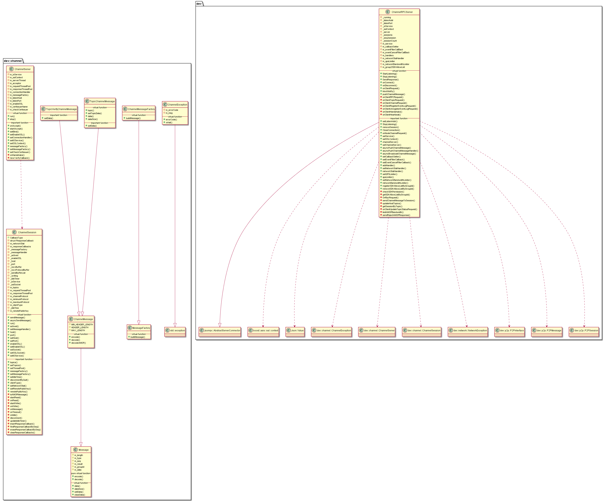

#  libchannelserver 模块
作者：TrustChain [微信公众号]

libchannelserver：交互式控制台和客户端SDK连接Channel端口。

## 主要内容有：

+ 交互式控制台和客户端SDK连接Channel端口：证书认证、TCP长连接、支持AMOP协议的点对点通信等；

+ ChannelMessage格式：节点与SDK间通信的数据包为ChannelMessage格式；



## 涉及知识点：
+ ChannelMessage.h

```
//ChannelMessage消息类型
enum ChannelMessageType
{
    CHANNEL_RPC_REQUEST = 0x12,           // type for rpc request
    CLIENT_HEARTBEAT = 0x13,              // type for heart beat for sdk
    CLIENT_HANDSHAKE = 0x14,              // type for hand shake
    CLIENT_REGISTER_EVENT_LOG = 0x15,     // type for event log filter register request and response
    CLIENT_UNREGISTER_EVENT_LOG = 0x16,   // type for event log filter unregister request and
                                          // response
    AMOP_REQUEST = 0x30,                  // type for request from sdk
    AMOP_RESPONSE = 0x31,                 // type for response to sdk
    AMOP_CLIENT_SUBSCRIBE_TOPICS = 0x32,  // type for topic request
    AMOP_MULBROADCAST = 0x35,             // type for mult broadcast
    REQUEST_TOPICCERT = 0x37,             // type request verify
    UPDATE_TOPIICSTATUS = 0x38,           // type for update status
    TRANSACTION_NOTIFY = 0x1000,          // type for  transaction notify
    BLOCK_NOTIFY = 0x1001,                // type for  block notify
    EVENT_LOG_PUSH = 0x1002               // type for event log push
};

/**ChannelMessage格式
m_length  4B
m_type    2B
m_seq   32B
m_result  2B
m_data 100MB
*/
const static size_t MIN_HEADER_LENGTH = 4;
const static size_t HEADER_LENGTH = 4 + 2 + 32 + 4;
const static size_t MAX_LENGTH = 100 * 1024 * 1024;  // max 100MB

//TopicChannelMessage函数，用户用于topic消息的pub-sub订阅模式点对点通信，格式为ChannelMessage格式。
//TopicVerifyChannelMessage函数，用户修改TopicChannelMessage内容
```

+ ChannelRPCServer.cpp
```
bool ChannelRPCServer::StartListening()
{
if (!_running)
{
CHANNEL_LOG(TRACE) << "Start ChannelRPCServer" << LOG_KV("Host", _listenAddr) << ":"<< _listenPort;
//节点监听channel_listen_port，负责处理客户端ChannelMessage请求
//dev::channel::ChannelSession
//ChannelRPCServer::onConnect
std::function<void(dev::channel::ChannelException, dev::channel::ChannelSession::Ptr)> fp =
    std::bind(&ChannelRPCServer::onConnect, shared_from_this(), std::placeholders::_1, std::placeholders::_2);
_server->setConnectionHandler(fp);
_server->run();

//节点与其他节点AMOP类型的P2PMessage点对点通信
//dev::p2p::P2PSession
//ChannelRPCServer::onNodeChannelRequest
//dev::eth::ProtocolID::AMOP

std::function<void(dev::network::NetworkException, std::shared_ptr<dev::p2p::P2PSession>,p2p::P2PMessage::Ptr)>
channelHandler = std::bind(&ChannelRPCServer::onNodeChannelRequest, shared_from_this(),std::placeholders::_1, std::placeholders::_2, std::placeholders::_3);
m_service->registerHandlerByProtoclID(dev::eth::ProtocolID::AMOP, channelHandler);
}

void ChannelRPCServer::onConnect(
    dev::channel::ChannelException e, dev::channel::ChannelSession::Ptr session)
{
std::function<void(dev::channel::ChannelSession::Ptr, dev::channel::ChannelException,
dev::channel::Message::Ptr)>
fp = std::bind(&dev::ChannelRPCServer::onClientRequest, this, std::placeholders::_1,
    std::placeholders::_2, std::placeholders::_3);
session->setMessageHandler(fp);
}
```

```
//节点处理与客户端RPC连接的ChannelMessage请求
void dev::ChannelRPCServer::onClientRequest(dev::channel::ChannelSession::Ptr session,
dev::channel::ChannelException e, dev::channel::Message::Ptr message)
{
if (e.errorCode() == 0)
{
    CHANNEL_LOG(TRACE) << "receive sdk message" << LOG_KV("length", message->length())
                       << LOG_KV("type", message->type())
                       << LOG_KV("seq", message->seq().substr(0, c_seqAbridgedLen));

    switch (message->type())
    {
    case CHANNEL_RPC_REQUEST:
        onClientRPCRequest(session, message);
        break;
    case CLIENT_HEARTBEAT:
        onClientHeartbeat(session, message);
        break;
    case CLIENT_HANDSHAKE:
        onClientHandshake(session, message);
        break;
    case CLIENT_REGISTER_EVENT_LOG:
        onClientRegisterEventLogRequest(session, message);
        break;
    case CLIENT_UNREGISTER_EVENT_LOG:
        onClientUnregisterEventLogRequest(session, message);
        break;
    case AMOP_REQUEST:
    case AMOP_RESPONSE:
    case AMOP_MULBROADCAST:
        onClientChannelRequest(session, message);
        break;
    case AMOP_CLIENT_SUBSCRIBE_TOPICS:
        onClientTopicRequest(session, message);
        break;
    case UPDATE_TOPIICSTATUS:
        onClientUpdateTopicStatusRequest(message);
        break;
    default:
        CHANNEL_LOG(ERROR) << "unknown client message" << LOG_KV("type", message->type());
        break;
    }
}
else
{
    CHANNEL_LOG(WARNING) << "onClientRequest" << LOG_KV("errorCode", e.errorCode())
                         << LOG_KV("what", e.what());

    onDisconnect(dev::channel::ChannelException(), session);
}
}

```

```
//节点与其他节点AMOP类型的P2PMessage点对点通信:涉及onNodeChannelRequest、onClientChannelRequest
//Node  request,  Node <--> Node AMOPMessage
void dev::ChannelRPCServer::onNodeChannelRequest(
    dev::network::NetworkException, std::shared_ptr<p2p::P2PSession> s, p2p::P2PMessage::Ptr msg)
{
//channelMessage->type() == AMOP_REQUEST
asyncPushChannelMessage(topic, channelMessage,
[nodeID, channelMessage, service, p2pMessage](dev::channel::ChannelException e,
dev::channel::Message::Ptr response, dev::channel::ChannelSession::Ptr) {
}

//channelMessage->type() == AMOP_MULBROADCAST
asyncBroadcastChannelMessage(topic, channelMessage);
}
//SDK channel2 request,  sdk --> Node AMOPMessage
void dev::ChannelRPCServer::onClientChannelRequest(
    dev::channel::ChannelSession::Ptr session, dev::channel::Message::Ptr message)
{
//channelMessage->type() == AMOP_REQUEST
m_service->asyncSendMessageByTopic(
topic, p2pMessage,
[session, message](dev::network::NetworkException e,
std::shared_ptr<dev::p2p::P2PSession>, dev::p2p::P2PMessage::Ptr response) {
}
//message->type() == AMOP_MULBROADCAST
bool sended = m_service->asyncMulticastMessageByTopic(
                topic, p2pMessage, m_networkBandwidthLimiter);

}
```

+ ChannelServer.cpp

```
void dev::channel::ChannelServer::run()
{
m_requestThreadPool = std::make_shared<ThreadPool>("ChannelReq", 16);
m_responseThreadPool = std::make_shared<ThreadPool>("ChannelResp", 8);
m_serverThread = std::make_shared<std::thread>([=]() {
startAccept();
m_ioService->run();
}
}

void dev::channel::ChannelServer::startAccept()
{
//调用ChannelServer::onAccept
m_acceptor->async_accept(session->sslSocket()->lowest_layer(),
boost::bind(&ChannelServer::onAccept, shared_from_this(),
    boost::asio::placeholders::error, session));

}

void dev::channel::ChannelServer::onAccept(
    const boost::system::error_code& error, ChannelSession::Ptr session)
{
session->sslSocket()->async_handshake(boost::asio::ssl::stream_base::server,
boost::bind(&ChannelServer::onHandshake, shared_from_this(),
    boost::asio::placeholders::error, sdkPublicKey, session));
 m_connectionHandler(ChannelException(), session);
startAccept();
}

```

+ ChannelSession.cpp
```
//发送消息--写操作
//sendMessage()--》asyncSendMessage()--》writeBuffer()-->startWrite()-->onWrite()
```

```
//接收消息--读操作
//run()--》startRead()--》onRead()-->onMessage()

void ChannelSession::onMessage(ChannelException e, Message::Ptr message)
{
//情况1：处理返回消息
m_responseThreadPool->enqueue([=]() {
response_callback->callback(e, message);
eraseResponseCallbackBySeq(message->seq());
});
//情况2：处理请求消息
m_requestThreadPool->enqueue([session, message]() {
auto s = session.lock();
if (s && s->_messageHandler)
{
    s->_messageHandler(s, ChannelException(0, ""), message);
}
});
}
```

参考文献：

[1] https://github.com/FISCO-BCOS/FISCO-BCOS/releases/tag/v2.7.2

[2] https://fisco-bcos-documentation.readthedocs.io/zh_CN/latest/