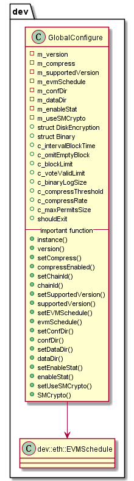

#  libconfig 模块
作者：TrustChain [微信公众号]

libconfig：配置文件。

## 主要内容有：

+ 网络固定配置文件config.genesis;

+ 网络可改配置文件config.ini;

+ 群组配置文件：群组固定配置文件group.N.genesis、群组可改配置文件group.N.ini;



## 涉及知识点：
+ 单例模式

1. 饿汉模式：由于要进行线程同步，所以在访问量比较大，或者可能访问的线程比较多时，采用饿汉实现，可以实现更好的性能。这是以空间换时间。libconfig源码里使用的是此模式；
```
class GlobalConfigure
{
public:
    static GlobalConfigure& instance()
    {
        static GlobalConfigure ins;
        return ins;
    }
}
```
2.懒汉模式：在访问量较小时，采用懒汉实现。这是以时间换空间。
```

class GlobalConfigure   {   
private:       
  static GlobalConfigure* m_instance;      
  GlobalConfigure(){}   
public:       
  static GlobalConfigure* getInstance(); 
}
```

参考文献：

[1] https://github.com/FISCO-BCOS/FISCO-BCOS/releases/tag/v2.7.2

[2] https://fisco-bcos-documentation.readthedocs.io/zh_CN/latest/

