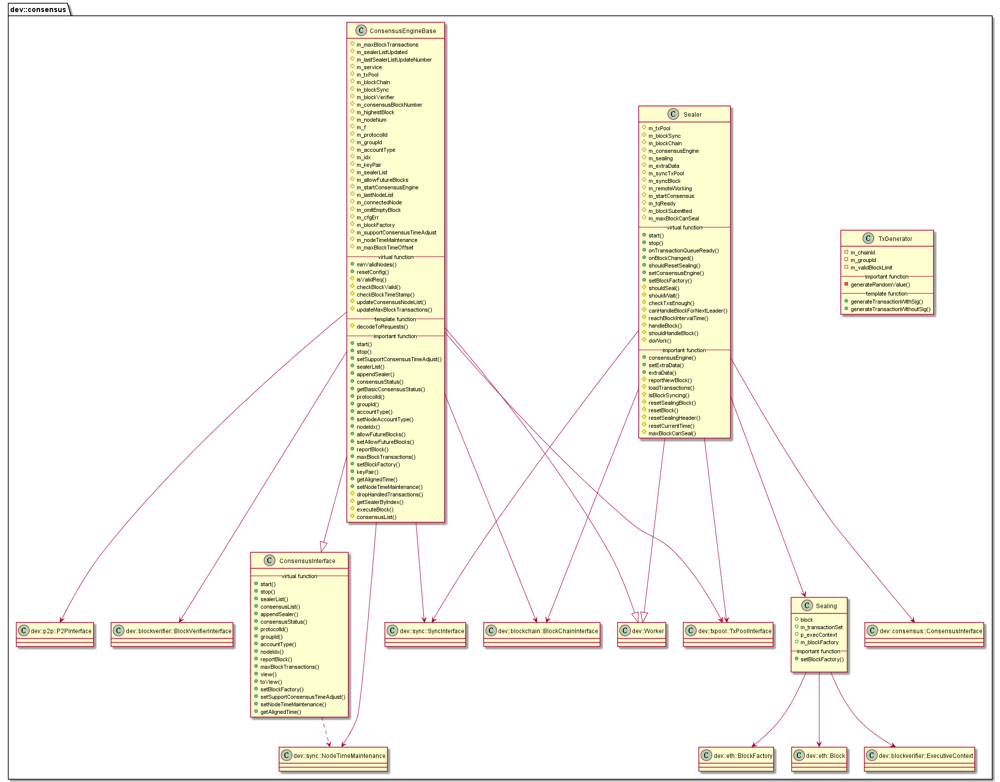

# libconsensus 模块

作者：TrustChain [微信公众号]

libconsensus：实现区块链的共识机制。

## 主要内容有：

+ 插件化共识框架，Sealer封装打包流程，ConsensusEngineBase封装共识框架；

+ Sealer线程：RaftSealer、PbftSealer、rPbftSealer；

+ Engine线程：RaftEngine、PbftEngine、rPbftEngine。

+ 容错类算法CFT：当系统出现网络、磁盘故障，服务器宕机等普通故障时，仍能针对某个提议达成共识；这类算法性能较好、处理速度较快、可以容忍不超过一半的故障节点；不能防止节点作恶，可达到一致性。如Paxos算法、Raft算法。

+ 拜占庭容错类算法BFT：除了容忍系统共识过程中出现的普通故障外，还可容忍部分节点故意欺骗(如伪造交易执行结果)等拜占庭错误；这类算法性能较差，能容忍不超过三分之一的故障节点和作恶节点，可达到最终一致性。如：PBFT算法、rPBFT算法。



## 涉及知识点：
+ Sealer.cpp

```
//重要数据结构
/// transaction pool handler
std::shared_ptr<dev::txpool::TxPoolInterface> m_txPool;
/// handler of the block-sync module
std::shared_ptr<dev::sync::SyncInterface> m_blockSync;
/// handler of the block chain module
std::shared_ptr<dev::blockchain::BlockChainInterface> m_blockChain;
std::shared_ptr<dev::consensus::ConsensusInterface> m_consensusEngine;
/// current sealing block(include block, transaction set of block and execute context)
Sealing m_sealing;

/// start the Sealer module
void Sealer::start()
{
    if (m_startConsensus)
    {
        return;
    }
     //reset the sealing block before loadTransactions
    resetSealingBlock();
    m_consensusEngine->reportBlock(*(m_blockChain->getBlockByNumber(m_blockChain->number())));
    m_maxBlockCanSeal = m_consensusEngine->maxBlockTransactions();
    m_syncBlock = false;
    /// start  a thread to execute doWork()&&workLoop()
    startWorking();
    m_startConsensus = true;
}

void Sealer::doWork(bool wait)
{
loadTransactions();
handleBlock();
}

/**
 * @brief: load transactions from the transaction pool
 * @param transToFetch: max transactions to fetch
 */
void Sealer::loadTransactions(uint64_t const& transToFetch)
{
    /// fetch transactions and update m_transactionSet
    m_sealing.block->appendTransactions(
        m_txPool->topTransactions(transToFetch, m_sealing.m_transactionSet, true));
}

```

+ ConsensusEngineBase.cpp
```
/**涉及的主要数据结构
/// p2p service handler
std::shared_ptr<dev::p2p::P2PInterface> m_service;
/// transaction pool handler
std::shared_ptr<dev::txpool::TxPoolInterface> m_txPool;
/// handler of the block chain module
std::shared_ptr<dev::blockchain::BlockChainInterface> m_blockChain;
/// handler of the block-sync module
std::shared_ptr<dev::sync::SyncInterface> m_blockSync;
/// handler of the block-verifier module
std::shared_ptr<dev::blockverifier::BlockVerifierInterface> m_blockVerifier;
*/
/// update m_sealing and receiptRoot
dev::blockverifier::ExecutiveContext::Ptr ConsensusEngineBase::executeBlock(Block& block)
{
    auto parentBlock = m_blockChain->getBlockByNumber(m_blockChain->number());
    BlockInfo parentBlockInfo{parentBlock->header().hash(), parentBlock->header().number(),
        parentBlock->header().stateRoot()};
    /// reset execute context
    return m_blockVerifier->executeBlock(block, parentBlockInfo);
}
```

参考文献：

[1] https://github.com/FISCO-BCOS/FISCO-BCOS/releases/tag/v2.7.2

[2] https://fisco-bcos-documentation.readthedocs.io/zh_CN/latest/


