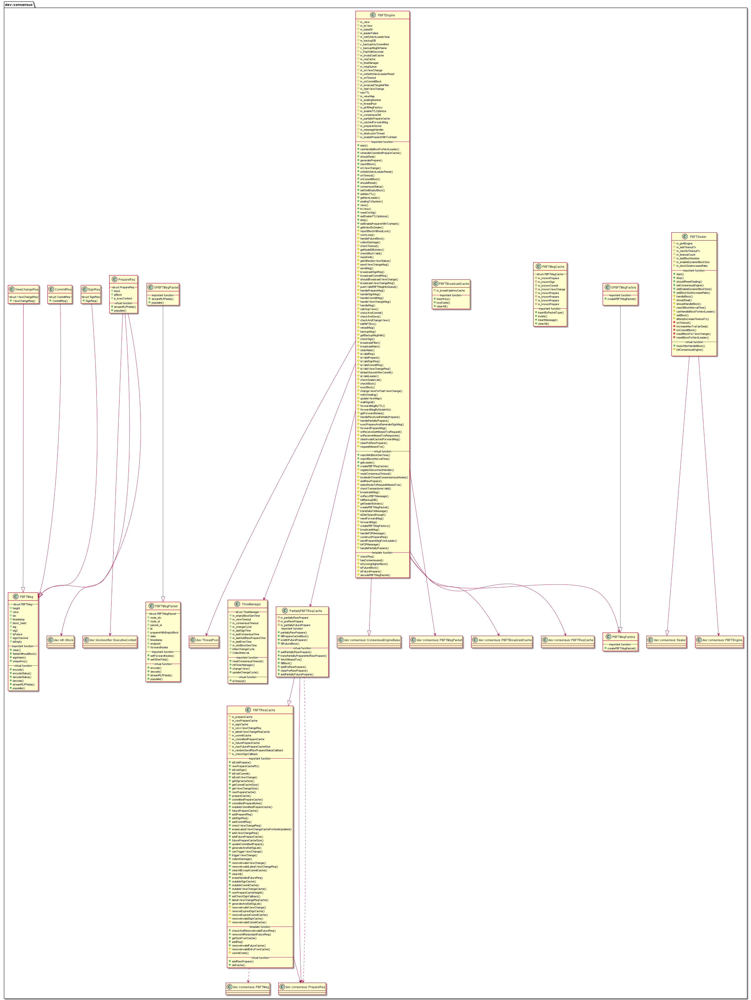

# libconsensus_pbft 子模块

作者：TrustChain [微信公众号]

libconsensus_pbft：实现PBFT算法。

## 主要内容有：

+ 采用签名、签名验证、哈希等密码学算法确保消息传递过程中的防篡改性、防伪造性、不可抵赖性；在一个由(3*f+1)个节点构成的系统中，只要有不少于(2*f+1)个非恶意节点正常工作，f为作恶节点数；CP强一致性算法。

+ 节点类型：共识节点（Leader节点和Replica节点）及Observer节点；

+ 节点ID和节点索引：公私秘钥对、签名和验签等；

+ 视图：leader每一轮共识都会切换；若leader为拜占庭节点，则会发送视图切换，其他共识节点会触发重新选择leader。若收到的区块为空块，也会发生视图切换；

+ 共识消息：PrepareReq（包含区块的请求包）、SignReq（带有区块执行结果的签名请求）、CommitReq（用于确认区块执行结果的提交请求）和ViewChangeReq（视图切换请求）；

+ 核心流程：客户端向主节点发生请求、Pre-prepare（区块执行|签名区块|广播区块）、Prepare（收集签名包|广播commit包）、Commit（收集Commit包|缓存的区块上链）、主节点reply；

+ 优化机制：消息转发机制：PBFT消息包中加入了forwardNodes字段记录了可达节点信息；优化Prepare包的结构：区块仅包含交易哈希。



## 涉及知识点：
+ Common.h

```
// for bip152: packetType for partiallyBlock
enum P2PPacketType : uint32_t
{
    // PartiallyPreparePacket
    // note: the forwarded prepare messages include all the transaction data
    PartiallyPreparePacket = 0x1,
    // represent that the node should response the missed transaction data
    GetMissedTxsPacket = 0x2,
    // represent that the node receives the missed transaction data
    MissedTxsPacket = 0x3,
    // status of RawPrepareReq
    P2PRawPrepareStatusPacket = 0x4,
    // represent that the node should response the RawPrepareReq to the requested node
    RequestRawPreparePacket = 0x5,
    RawPrepareResponse = 0x6,
};

// for pbft
enum PBFTPacketType : byte
{
    PrepareReqPacket = 0x00,
    SignReqPacket = 0x01,
    CommitReqPacket = 0x02,
    ViewChangeReqPacket = 0x03,
    PBFTPacketCount
};

/// PBFT message
struct PBFTMsgPacket
{
/// the index of the node that sends this pbft message
IDXTYPE node_idx;
/// the node id of the node that sends this pbft message
h512 node_id;
/// type of the packet(maybe prepare, sign or commit)
/// (receive from the network or send to the network)
byte packet_id;
/// ttl, extend the 8th bit to represent the inner prepareReq with empty block or not
mutable uint8_t ttl;
bool prepareWithEmptyBlock = false;
/// the data of concrete request(receive from or send to the network)
bytes data;
/// timestamp of receive this pbft message
u256 timestamp;
/// endpoint
std::string endpoint;
// the node that disconnected from this node, but the packet should reach
std::shared_ptr<dev::h512s> forwardNodes;

}

/// the base class of PBFT message
struct PBFTMsg
{
}
```

+ PBFTReqCache.cpp

```
/**PBFTReqCache.h 缓存PBFTReq请求消息
/// cache for prepare request
PrepareReq::Ptr m_prepareCache;
/// cache for raw prepare request
PrepareReq::Ptr m_rawPrepareCache;
/// cache for signReq(maps between hash and sign requests)
std::unordered_map<h256, std::unordered_map<std::string, SignReq::Ptr>> m_signCache;

/// cache for received-viewChange requests(maps between view and view change requests)
std::unordered_map<VIEWTYPE, std::unordered_map<IDXTYPE, ViewChangeReq::Ptr>>
    m_recvViewChangeReq;
// only record the latest view of all the nodes
std::shared_ptr<std::unordered_map<IDXTYPE, ViewChangeReq::Ptr>> m_latestViewChangeReqCache;

/// cache for commited requests(maps between hash and commited requests)
std::unordered_map<h256, std::unordered_map<std::string, CommitReq::Ptr>> m_commitCache;
/// cache for prepare request need to be backup and saved
PrepareReq m_committedPrepareCache;
mutable SharedMutex x_committedPrepareCache;
/// cache for the future prepare cache
/// key: block hash, value: the cached future prepeare
std::unordered_map<uint64_t, std::shared_ptr<PrepareReq>> m_futurePrepareCache;
const unsigned m_maxFuturePrepareCacheSize = 10;

mutable SharedMutex x_rawPrepareCache;

std::function<void(PBFTMsg::Ptr)> m_randomSendRawPrepareStatusCallback;
std::function<bool(PBFTMsg const&)> m_checkSignCallback;
*/
```

+ PBFTMsgCache.h

```
/**
struct PBFTMsgCache
{
private:
/// mutex for m_knownPrepare
mutable SharedMutex x_knownPrepare;
/// cache for the prepare packet
QueueSet<std::string> m_knownPrepare;
/// mutex for m_knownSign
mutable SharedMutex x_knownSign;
/// cache for the sign packet
QueueSet<std::string> m_knownSign;
/// mutex for m_knownCommit
mutable SharedMutex x_knownCommit;
/// cache for the commit packet
QueueSet<std::string> m_knownCommit;
/// mutex for m_knownViewChange
mutable SharedMutex x_knownViewChange;
/// cache for the viewchange packet
QueueSet<std::string> m_knownViewChange;

/// the limit size for prepare packet cache
static const unsigned c_knownPrepare = 1024;
/// the limit size for sign packet cache
static const unsigned c_knownSign = 1024;
/// the limit size for commit packet cache
static const unsigned c_knownCommit = 1024;
/// the limit size for viewchange packet cache
static const unsigned c_knownViewChange = 1024;
}
*/
//class PBFTBroadcastCache 的私有变量，主要存储最近节点广播各种消息的key
/// maps between node id and its broadcast cache
std::unordered_map<h512, std::shared_ptr<PBFTMsgCache>> m_broadCastKeyCache;
```

+ PartiallyPBFTReqCache

```
/**class PartiallyPBFTReqCache 的私有变量，主要负责处理bip 152改进；可以从其他节点取回本节点缺失的交易集等
PrepareReq::Ptr m_partiallyRawPrepare;
// add the prepareReq into m_preRawPrepare once leader generate the prepareReq
// this cache is used to response txs to the request-sealers after generate prepareReq while
// before addRawPrepareReq clear this cache when addRawPrepare
PrepareReq::Ptr m_preRawPrepare;
mutable SharedMutex x_preRawPrepare;
PrepareReq::Ptr m_partiallyFuturePrepare;
*/
```

+ PBFTSealer.cpp: leader节点打包区块;

```
/**主要的参数值
/// the minimum number of transactions that caused timeout;允许超时的交易最小数量，提高此参数值，则会increase maxBlockCanSeal
uint64_t m_lastTimeoutTx = 0;
/// the maximum number of transactions that has been consensused without timeout
uint64_t m_maxNoTimeoutTx = 0;
/// timeout counter
int64_t m_timeoutCount = 0;
std::shared_ptr<PBFTEngine> m_pbftEngine;
*/
//
void PBFTSealer::start()
{
    if (m_enableDynamicBlockSize)
    {
     /// onTimeout():decrease maxBlockCanSeal to half when timeout
        m_pbftEngine->onTimeout(boost::bind(&PBFTSealer::onTimeout, this, boost::placeholders::_1));
///onCommitBlock(): increase maxBlockCanSeal when commitBlock with no-timeout
        m_pbftEngine->onCommitBlock(boost::bind(&PBFTSealer::onCommitBlock, this,
            boost::placeholders::_1, boost::placeholders::_2, boost::placeholders::_3));
        m_lastBlockNumber = m_blockChain->number();
    }
    //启动共识引擎服务
    m_pbftEngine->start();
    //调用父类的start()函数
    Sealer::start();
}

/**
 * @brief: this node can generate block or not
 * @return true: this node can generate block
 * @return false: this node can't generate block
 */
bool PBFTSealer::shouldSeal()
{
    return Sealer::shouldSeal() && m_pbftEngine->shouldSeal();
}

//打包区块
void PBFTSealer::handleBlock()
{
resetSealingBlock();
setBlock();
/// sealing the generated block into prepareReq and push its to msgQueue
m_pbftEngine->generatePrepare(m_sealing.block);

}
```

+ PBFTEngine.cpp
```
/**重要数据结构
//m_reqCache根据参数enablePrepareWithTxsHash初始化不同的缓存类型：PartiallyPBFTReqCache、PBFTReqCache；
std::shared_ptr<PBFTReqCache> m_reqCache;
std::shared_ptr<PBFTBroadcastCache> m_broadCastCache;
TimeManager m_timeManager;
PBFTMsgQueue m_msgQueue;

// bip 152 related logic：只传交易哈希值的包，减少带宽
PartiallyPBFTReqCache::Ptr m_partiallyPrepareCache = nullptr;
std::shared_ptr<std::map<dev::h256, std::pair<int64_t, PBFTMsgPacket::Ptr>>> m_cachedForwardMsg;
dev::ThreadPool::Ptr m_prepareWorker;
dev::ThreadPool::Ptr m_messageHandler;

*/

void PBFTEngine::start()
{
    // create PBFTMsgFactory
    createPBFTMsgFactory();
    //初始化m_reqCache
    createPBFTReqCache();
    assert(m_reqCache);
    // PBFTEngine::checkSign()：set checkSignCallback for reqCache
    m_reqCache->setCheckSignCallback(boost::bind(&PBFTEngine::checkSign, this, boost::placeholders::_1));

    // PBFTEngine::handleP2PMessage():register P2P callback after create PBFTMsgFactory
    m_service->registerHandlerByProtoclID(
        m_protocolId, boost::bind(&PBFTEngine::handleP2PMessage, this, boost::placeholders::_1, boost::placeholders::_2, boost::placeholders::_3));
    registerDisconnectHandler();
    //调用父类的start()
    ConsensusEngineBase::start();
    initPBFTEnv(3 * getEmptyBlockGenTime());
    PBFTENGINE_LOG(INFO) << "[Start PBFTEngine...]";
}
/**
 PBFTMsg(KeyPair const& _keyPair, int64_t const& _height, VIEWTYPE const& _view,
        IDXTYPE const& _idx, h256 const _blockHash)
    {
        height = _height;
        view = _view;
        idx = _idx;
        timestamp = u256(utcTime());
        block_hash = _blockHash;
        sig = signHash(block_hash, _keyPair);
        sig2 = signHash(fieldsWithoutBlock(), _keyPair);
    }
*/
//验证签名
bool PBFTEngine::checkSign(PBFTMsg const& req) const
{
    h512 node_id;
    if (getNodeIDByIndex(node_id, req.idx))
    {
return dev::crypto::Verify(node_id, dev::crypto::SignatureFromBytes(req.sig), req.block_hash) &&
dev::crypto::Verify(node_id, dev::crypto::SignatureFromBytes(req.sig2), req.fieldsWithoutBlock());
    }
    return false;
}

//handleP2PMessage()-->onRecvPBFTMessage()、handlePartiallyPrepare()、onReceiveGetMissedTxsRequest()、onReceiveMissedTxsResponse()
void PBFTEngine::handleP2PMessage(
    NetworkException _exception, std::shared_ptr<P2PSession> _session, P2PMessage::Ptr _message)
{
//pushValidPBFTMsgIntoQueue
onRecvPBFTMessage(_exception, _session, _message);

//PartiallyPreparePacket:handlePartiallyPrepare()补充稀疏区块的交易，即PrepareReq请求中的区块；处理完后，调用execPrepareAndGenerateSignMsg()
m_prepareWorker->enqueue([self, _session, _message]() {
pbftEngine->handlePartiallyPrepare(_session, _message);
});

//GetMissedTxsPacket:receive getMissedPacket request, response missed transactions
m_messageHandler->enqueue([self, _session, _message]() {
pbftEngine->onReceiveGetMissedTxsRequest(_session, _message);
});


// MissedTxsPacket:receive missed transactions, fill block
m_messageHandler->enqueue([self, _session, _message]() {
pbftEngine->onReceiveMissedTxsResponse(_session, _message);

});
}

void PBFTEngine::initPBFTEnv(unsigned view_timeout)
{
    m_consensusBlockNumber = 0;
    m_view = m_toView = 0;
    m_leaderFailed = false;
    auto block = m_blockChain->getBlockByNumber(m_blockChain->number());
    if (!block)
    {
        PBFTENGINE_LOG(FATAL) << "can't find latest block";
    }
    m_timeManager.initTimerManager(view_timeout);
    reportBlock(*block);
    initBackupDB();
    PBFTENGINE_LOG(INFO) << "[PBFT init env successfully]";
}
```

```
/// start a new thread to handle the network-receivied message
void PBFTEngine::workLoop()
{
std::pair<bool, PBFTMsgPacket::Ptr> ret = m_msgQueue.tryPop(c_PopWaitSeconds);
handleMsg(ret.second);
/// timeout not triggered by fast view change
checkTimeout();

}

//workLoop()-->handleMsg()
//主要实现从队列PBFTMsgPacket取出调用pbftMsg，然后调用handleMsg()进行处理
void PBFTEngine::handleMsg(PBFTMsgPacket::Ptr pbftMsg)
{
    Guard l(m_mutex);
    std::shared_ptr<PBFTMsg> pbft_msg;
    bool succ = false;
    switch (pbftMsg->packet_id)
    {
    case PrepareReqPacket:
    {
        PrepareReq::Ptr prepare_req = std::make_shared<PrepareReq>();
        succ = handlePrepareMsg(prepare_req, *pbftMsg);
        pbft_msg = prepare_req;
        break;
    }
    case SignReqPacket:
    {
        SignReq::Ptr req = std::make_shared<SignReq>();
        succ = handleSignMsg(req, *pbftMsg);
        pbft_msg = req;
        break;
    }
    case CommitReqPacket:
    {
        CommitReq::Ptr req = std::make_shared<CommitReq>();
        succ = handleCommitMsg(req, *pbftMsg);
        pbft_msg = req;
        break;
    }
    case ViewChangeReqPacket:
    {
        std::shared_ptr<ViewChangeReq> req = std::make_shared<ViewChangeReq>();
        succ = handleViewChangeMsg(req, *pbftMsg);
        pbft_msg = req;
        break;
    }
    default:
    {
        PBFTENGINE_LOG(DEBUG) << LOG_DESC("handleMsg:  Err pbft message")
                              << LOG_KV("from", pbftMsg->node_idx) << LOG_KV("nodeIdx", nodeIdx())
                              << LOG_KV("myNode", m_keyPair.pub().abridged());
        return;
    }
    }

    if (!needForwardMsg(succ, pbftMsg, *pbft_msg))
    {
        return;
    }
    forwardMsg(pbftMsg, *pbft_msg);
}

bool PBFTEngine::handlePrepareMsg(PrepareReq::Ptr prepare_req, PBFTMsgPacket const& pbftMsg)
{
}
bool PBFTEngine::handlePrepareMsg(PrepareReq::Ptr prepareReq, std::string const& endpoint)
{
}

/**
 * @brief: 1. decode the network-received PBFTMsgPacket to signReq
 *         2. check the validation of the signReq
 *         3. submit the block into blockchain if the size of collected signReq and
 *            commitReq is over 2/3
 * @param sign_req: return value, the decoded signReq
 * @param pbftMsg: the network-received PBFTMsgPacket
 */
bool PBFTEngine::handleSignMsg(SignReq::Ptr sign_req, PBFTMsgPacket const& pbftMsg)
{
}

/**
 * @brief : 1. decode the network-received message into commitReq
 *          2. check the validation of the commitReq
 *          3. add the valid commitReq into the cache
 *          4. submit to blockchain if the size of collected commitReq is over 2/3
 * @param commit_req: return value, the decoded commitReq
 * @param pbftMsg: the network-received PBFTMsgPacket
 */
bool PBFTEngine::handleCommitMsg(CommitReq::Ptr commit_req, PBFTMsgPacket const& pbftMsg)
{
}

bool PBFTEngine::handleViewChangeMsg(
    ViewChangeReq::Ptr viewChange_req, PBFTMsgPacket const& pbftMsg)
{
}
```

```
/** 数据结构
PBFTMsgQueue m_msgQueue;
*/
//onRecvPBFTMessage()-->pushValidPBFTMsgIntoQueue()
void PBFTEngine::pushValidPBFTMsgIntoQueue(NetworkException, std::shared_ptr<P2PSession> session,
    P2PMessage::Ptr message, std::function<void(PBFTMsgPacket::Ptr)> const& _f)
{
PBFTMsgPacket::Ptr pbft_msg = m_pbftMsgFactory->createPBFTMsgPacket();
bool valid = decodePBFTMsgPacket(pbft_msg, message, session);
//将pbft_msg放入队列m_msgQueue
m_msgQueue.push(pbft_msg);
}
```

```
/** 
// bip 152 related logic
PartiallyPBFTReqCache::Ptr m_partiallyPrepareCache = nullptr;
*/

//补充稀疏区块的交易，即PrepareReq请求中的区块；处理完后，调用execPrepareAndGenerateSignMsg()
bool PBFTEngine::handlePartiallyPrepare(PrepareReq::Ptr _prepareReq)
{
// check the PartiallyPrepare
auto ret = isValidPrepare(*_prepareReq, oss);
/// update the view for given idx
updateViewMap(_prepareReq->idx, _prepareReq->view);
_prepareReq->pBlock = m_blockFactory->createBlock();
   //未来待处理的PrepareReq
   if (ret == CheckResult::FUTURE)
    {
        // decode the partiallyBlock
        _prepareReq->pBlock->decodeProposal(ref(*_prepareReq->block), true);
        bool allHit = m_txPool->initPartiallyBlock(_prepareReq->pBlock);
        // hit all the transactions
        if (allHit)
        {
            // re-encode the block into the completed block(for pbft-backup consideration),先存缓存m_partiallyPrepareCache
            _prepareReq->pBlock->encode(*_prepareReq->block);
            m_partiallyPrepareCache->addFuturePrepareCache(_prepareReq);
            return true;
        }
        // request missed txs for the future prepare
        else
        {
            m_partiallyPrepareCache->addPartiallyFuturePrepare(_prepareReq);
            return requestMissedTxs(_prepareReq);
        }
    }
//未命中缓存时，return true
if (!m_partiallyPrepareCache->addPartiallyRawPrepare(_prepareReq))
{
    return false;
}
// decode the partiallyBlock
_prepareReq->pBlock->decodeProposal(ref(*_prepareReq->block), true);
bool allHit = m_txPool->initPartiallyBlock(_prepareReq->pBlock);
// hit all transactions
if (allHit)
{
    m_partiallyPrepareCache->transPartiallyPrepareIntoRawPrepare();
    // begin to handlePrepare
    return execPrepareAndGenerateSignMsg(_prepareReq, oss);
}
return requestMissedTxs(_prepareReq);

}
```

```
// receive the GetMissedTxsPacket request and response the requested-transactions
void PBFTEngine::onReceiveGetMissedTxsRequest(
    std::shared_ptr<P2PSession> _session, P2PMessage::Ptr _message)
{
    try
    {
        std::shared_ptr<bytes> _encodedBytes = std::make_shared<bytes>();
        if (!m_partiallyPrepareCache->fetchMissedTxs(_encodedBytes, ref(*(_message->buffer()))))
        {
            return;
        }
        // response the transaction to the request node
        auto p2pMsg = toP2PMessage(_encodedBytes, MissedTxsPacket);
        p2pMsg->setPacketType(MissedTxsPacket);

        m_service->asyncSendMessageByNodeID(_session->nodeID(), p2pMsg, nullptr);
    }
    catch (std::exception const& _e)
    {     
    }
}
```

```
// MissedTxsPacket:receive missed transactions, fill block
void PBFTEngine::onReceiveMissedTxsResponse(
    std::shared_ptr<P2PSession> _session, P2PMessage::Ptr _message)
{
    try
    {
        Guard l(m_mutex);
        RLP blockRLP(ref(*(_message->buffer())));
        // get blockHash of the response
        auto blockHash = blockRLP[1].toHash<h256>(RLP::VeryStrict);
        // the response is for the future prepare,
        // fill the future prepare and add it to the futurePrepareCache
        if (m_partiallyPrepareCache->existInFuturePrepare(blockHash))
        {
            m_partiallyPrepareCache->fillFutureBlock(blockRLP);
            return;
        }
        if (!m_partiallyPrepareCache->fillPrepareCacheBlock(blockRLP))
        {
            return;
        }
        // handlePrepare
        auto prepareReq = m_partiallyPrepareCache->partiallyRawPrepare();
        // re-encode the block into the completed block(for pbft-backup consideration)
        prepareReq->pBlock->encode(*prepareReq->block);
        bool ret = handlePrepareMsg(prepareReq);
        // forward the completed prepare message
        if (ret && m_cachedForwardMsg->count(prepareReq->block_hash))
        {
            auto pbftMsg = (*m_cachedForwardMsg)[prepareReq->block_hash].second;
            // forward the message
            forwardPrepareMsg(pbftMsg, prepareReq);
        }
        m_cachedForwardMsg->erase(prepareReq->block_hash);
    }
}
```

```
//该函数内主要的函数调用链有：execBlock()-->broadcastSignReq()-->checkAndCommit()
bool PBFTEngine::execPrepareAndGenerateSignMsg(
    PrepareReq::Ptr _prepareReq, std::ostringstream& _oss)
{
    Timer t;
    Sealing workingSealing(m_blockFactory);
    try
    {
        // update the latest time of receiving the rawPrepare and ready to execute the block
        m_timeManager.m_lastAddRawPrepareTime = utcSteadyTime();

        execBlock(workingSealing, _prepareReq, _oss);

        // update the latest execution time when processed the block execution
        m_timeManager.m_lastExecTime = utcSteadyTime();

        // old block (has already executed correctly by block sync)
        if (workingSealing.p_execContext == nullptr &&
            workingSealing.block->getTransactionSize() > 0)
        {
            return false;
        }
    }
    catch (std::exception& e)
    {
        return true;
    }
    /// whether to omit empty block;空块会触发视图转换，选举leader
    if (needOmit(workingSealing))
    {
        changeViewForFastViewChange();
        m_timeManager.m_changeCycle = 0;
        return true;
    }

    /// generate prepare request with signature of this node to broadcast
    /// (can't change prepareReq since it may be broadcasted-forwarded to other nodes)
    auto startT = utcTime();
    PrepareReq::Ptr sign_prepare =
        std::make_shared<PrepareReq>(*_prepareReq, workingSealing, m_keyPair);

    // destroy ExecutiveContext in m_destructorThread
    auto execContext = m_reqCache->prepareCache().p_execContext;
    HolderForDestructor<dev::blockverifier::ExecutiveContext> holder(std::move(execContext));
    m_destructorThread->enqueue(std::move(holder));

    m_reqCache->addPrepareReq(sign_prepare);
    /// broadcast the re-generated signReq(add the signReq to cache)
    broadcastSignReq(*sign_prepare);
    checkAndCommit();
    return true;
}
```

```
/**
 * @brief : 1. generate and broadcast signReq according to given prepareReq,
 *          2. add the generated signReq into the cache
 * @param req: specified PrepareReq used to generate signReq
 */
bool PBFTEngine::broadcastSignReq(PrepareReq const& req)
{
    SignReq::Ptr sign_req = std::make_shared<SignReq>(req, m_keyPair, nodeIdx());
    bytes sign_req_data;
    sign_req->encode(sign_req_data);
    bool succ = broadcastMsg(SignReqPacket, *sign_req, ref(sign_req_data));
    m_reqCache->addSignReq(sign_req);
    return succ;
}
```

```
void PBFTEngine::checkAndCommit()
{
    auto minValidNodeSize = minValidNodes();
    size_t sign_size =
        m_reqCache->getSigCacheSize(m_reqCache->prepareCache().block_hash, minValidNodeSize);
    /// must be equal to minValidNodes:in case of callback checkAndCommit repeatly in a round of
    /// PBFT consensus
    if (sign_size == minValidNodeSize)
    { 
     //判断一些条件后，执行checkAndSave保存区块数据
     checkAndSave();
     }
}
```

```
/// if collect >= 2/3 SignReq and CommitReq, then callback this function to commit block
/// check whether view and height is valid, if valid, then commit the block and clear the context
void PBFTEngine::checkAndSave()
{
    auto start_commit_time = utcTime();
    auto record_time = utcTime();
    auto minValidNodeSize = minValidNodes();
    size_t sign_size =
        m_reqCache->getSigCacheSize(m_reqCache->prepareCache().block_hash, minValidNodeSize);
    size_t commit_size =
        m_reqCache->getCommitCacheSize(m_reqCache->prepareCache().block_hash, minValidNodeSize);
    if (sign_size >= minValidNodeSize && commit_size >= minValidNodeSize)
    {
  /// Block block(m_reqCache->prepareCache().block);
    std::shared_ptr<dev::eth::Block> p_block = m_reqCache->prepareCache().pBlock;
    m_reqCache->generateAndSetSigList(*p_block, minValidNodes());
    /// callback block chain to commit block
    CommitResult ret = m_blockChain->commitBlock(p_block,
        std::shared_ptr<ExecutiveContext>(m_reqCache->prepareCache().p_execContext));
    auto commitBlock_time_cost = utcTime() - record_time;

    }
}
```

```
//PBFTSealer::handleBlock()调用m_pbftEngine->generatePrepare(m_sealing.block);
/// sealing the generated block into prepareReq and push its to msgQueue
bool PBFTEngine::generatePrepare(dev::eth::Block::Ptr _block)
{
    // fix the deadlock cases below
    // 1. the sealer has sealed enough txs and is handling the block, but stucked at the
    // generatePrepare for the PBFTEngine is checking timeout and ready to change view
    // 2. the PBFTEngine trigger view change and release the m_mutex, the leader has been changed
    // 3. the PBFTEngine calls handlePrepare for receive the PBFT prepare message from the leader,
    // and handle the block
    // 4. the next leader is the node-self, the PBFTEngine tries to notify the node to seal the next
    // block
    // 5. since the x_sealing is stucked at step 1, the PBFTEngine has been stucked at notifySeal
    // Solution:
    // if the sealer execute step1 (m_generatePrepare is equal to true), won't trigger notifySeal
    m_generatePrepare = true;
    Guard l(m_mutex);
    // the leader has been changed
    if (!getLeader().first || getLeader().second != nodeIdx())
    {
        m_generatePrepare = false;
        return true;
    }
    m_notifyNextLeaderSeal = false;
    auto prepareReq = constructPrepareReq(_block);

    if (prepareReq->pBlock->getTransactionSize() == 0 && m_omitEmptyBlock)
    {
        m_leaderFailed = true;
        changeViewForFastViewChange();
        m_timeManager.m_changeCycle = 0;
        return true;
    }
    handlePrepareMsg(prepareReq);

    /// reset the block according to broadcast result
    PBFTENGINE_LOG(INFO) << LOG_DESC("generateLocalPrepare")
                         << LOG_KV("hash", prepareReq->block_hash.abridged())
                         << LOG_KV("H", prepareReq->height) << LOG_KV("nodeIdx", nodeIdx())
                         << LOG_KV("myNode", m_keyPair.pub().abridged());
    m_signalled.notify_all();
    m_generatePrepare = false;
    return true;
}
```

```
//generatePrepare()-->constructPrepareReq()
PrepareReq::Ptr PBFTEngine::constructPrepareReq(dev::eth::Block::Ptr _block)
{
    dev::eth::Block::Ptr engineBlock = m_blockFactory->createBlock();
    *engineBlock = std::move(*_block);
    PrepareReq::Ptr prepareReq = std::make_shared<PrepareReq>(
        engineBlock, m_keyPair, m_view, nodeIdx(), m_enablePrepareWithTxsHash);
    if (prepareReq->pBlock->transactions()->size() == 0)
    {
        prepareReq->isEmpty = true;
    }
    // the non-empty block only broadcast hash when enable-prepare-with-txs-hash
    if (m_enablePrepareWithTxsHash && prepareReq->pBlock->transactions()->size() > 0)
    {
        // addPreRawPrepare to response to the request-sealers
        m_partiallyPrepareCache->addPreRawPrepare(prepareReq);
        // encode prepareReq with uncompleted transactions into sendedData
        std::shared_ptr<bytes> sendedData = std::make_shared<bytes>();
        prepareReq->encode(*sendedData);
        auto self = std::weak_ptr<PBFTEngine>(shared_from_this());
        m_threadPool->enqueue([self, prepareReq, sendedData]() {
            try
            {
                auto pbftEngine = self.lock();
                if (!pbftEngine)
                {
                    return;
                }
                pbftEngine->sendPrepareMsgFromLeader(
                    prepareReq, ref(*sendedData), PartiallyPreparePacket);
            }
            catch (std::exception const& e)
            {
                PBFTENGINE_LOG(ERROR) << LOG_DESC("broadcastPrepare exceptioned")
                                      << LOG_KV("errorInfo", boost::diagnostic_information(e));
            }
        });
        // re-encode the block with completed transactions
        prepareReq->pBlock->encode(*prepareReq->block);
    }
    // not enable-prepare-with-txs-hash or the empty block
    else
    {
        auto self = std::weak_ptr<PBFTEngine>(shared_from_this());
        m_threadPool->enqueue([self, prepareReq, engineBlock]() {
            try
            {
                auto pbftEngine = self.lock();
                if (!pbftEngine)
                {
                    return;
                }
                std::shared_ptr<bytes> prepare_data = std::make_shared<bytes>();
                prepareReq->encode(*prepare_data);
                pbftEngine->sendPrepareMsgFromLeader(prepareReq, ref(*prepare_data));
            }
            catch (std::exception const& e)
            {
                PBFTENGINE_LOG(ERROR) << LOG_DESC("broadcastPrepare exceptioned")
                                      << LOG_KV("errorInfo", boost::diagnostic_information(e));
            }
        });
    }
    return prepareReq;
}
```

```
/**转发消息的三种函数调用链
//第一种：处理共识引擎的各种包类型：
PrepareReq（包含区块的请求包）、SignReq（带有区块执行结果的签名请求）、CommitReq（用于确认区块执行结果的提交请求）和ViewChangeReq（视图切换请求）；

handleMsg()-->forwardMsg()--》forwardMsgByTTL()、forwardMsgByNodeInfo()

//第二种：针对bip 152改进，转发含交易哈希的区块，减少通信带宽
handlePartiallyPrepare
()-->handleReceivedPartiallyPrepare
()-->forwardPrepareMsg()--》forwardMsgByTTL()、forwardMsgByNodeInfo
()

//第三种：处理节点p2p通信，并选择节点进行转发
handleP2PMessage
()-->onReceiveMissedTxsResponse()--》forwardMsgByTTL()、forwardMsgByNodeInfo
*/


void PBFTEngine::forwardMsgByNodeInfo(
    std::string const& _key, PBFTMsgPacket::Ptr _pbftMsgPacket, bytesConstRef _data)
{
//选择未连接节点
for (auto const& session : sessions)
    {
        if (remainingForwardNodes->count(session.nodeID()))
        {
            remainingForwardNodes->erase(session.nodeID());
        }
    }
}

// update ttl and forward the message
//转发经过每一跳，ttl减少1
void PBFTEngine::forwardMsgByTTL(
    PBFTMsgPacket::Ptr _pbftMsgPacket, PBFTMsg const& _pbftMsg, bytesConstRef _data)
{
    std::unordered_set<h512> filter;
    filter.insert(_pbftMsgPacket->node_id);
    /// get the origin gen node id of the request
    h512 genNodeId = getSealerByIndex(_pbftMsg.idx);
    if (genNodeId != h512())
    {
        filter.insert(genNodeId);
    }
    unsigned current_ttl = _pbftMsgPacket->ttl - 1;
    broadcastMsg(_pbftMsgPacket->packet_id, _pbftMsg, _data, 0, filter, current_ttl);
}
```

参考文献：

[1] https://github.com/FISCO-BCOS/FISCO-BCOS/releases/tag/v2.7.2

[2] https://fisco-bcos-documentation.readthedocs.io/zh_CN/latest/