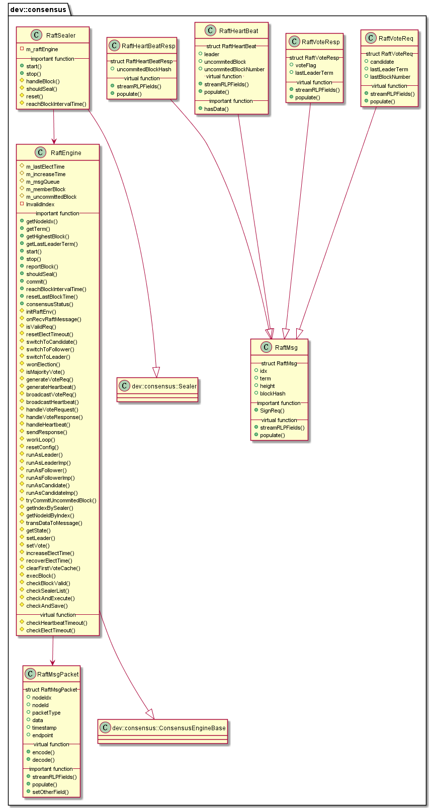

# libconsensus_raft 子模块

作者：TrustChain [微信公众号]

libconsensus_raft：实现RAFT算法。


## 主要内容有：

+ Raft（Replication and Fault Tolerant）是一个允许网络分区（Partition Tolerant）的一致性协议，它保证了在一个由N个节点构成的系统中有(N+1)/2（向上取整）个节点正常工作的情况下的系统的一致性；CP强一致性算法。

+ 节点类型：Leader、Follower以及Candidate；每个 Follower 都设置了一个随机的竞选超时时间；

+ 任期：将时间划分为不定长度的任期Terms，Terms为连续的数字；

+ 消息类型：VoteReq、VoteResp、Heartbeat、HeartbeatResp。Heartbeat用于维护Leader节点身份和区块数据复制。

+ 日志复制：leader服务器保留客户端指令到日志--》发送AppendEntries RPC给从节点--》收到从节点确认后再commit日志--》状态机执行日志，返回结果给客户端。



## 涉及知识点：

+ Common.h
```
enum RaftPacketType : byte
{
    RaftVoteReqPacket = 0x00,
    RaftVoteRespPacket = 0x01,
    RaftHeartBeatPacket = 0x02,
    RaftHeartBeatRespPacket = 0x03,
    RaftPacketCount
};

enum RaftRole : byte
{
    EN_STATE_LEADER = 1,
    EN_STATE_FOLLOWER = 2,
    EN_STATE_CANDIDATE = 3
};

enum VoteRespFlag : byte
{
    VOTE_RESP_REJECT = 0,
    VOTE_RESP_LEADER_REJECT = 1,
    VOTE_RESP_LASTTERM_ERROR = 2,
    VOTE_RESP_OUTDATED = 3,
    VOTE_RESP_FIRST_VOTE = 4,
    VOTE_RESP_DISCARD = 5,
    VOTE_RESP_GRANTED = 6
};

enum HandleVoteResult : byte
{
    TO_LEADER,
    TO_FOLLOWER,
    NONE
};

struct RaftMsgPacket
{
    /// the index of the node that send this raft message
    raft::NodeIndex nodeIdx;
    /// the node id of the node that sends this raft message
    Public nodeId;
    /// type of the packet
    RaftPacketType packetType;
    /// the data of concrete request
    bytes data;
    /// timestamp of receive this raft message
    uint64_t timestamp;
    /// endpoint
    std::string endpoint;
}
//
struct RaftMsg
{
}
```

+ RaftEngine.cpp
```
RaftMsgQueue m_msgQueue;

void RaftEngine::start()
{
    initRaftEnv();
    ConsensusEngineBase::start();
}

void RaftEngine::workLoop()
{
    while (isWorking())
    {
        auto isSyncing = m_blockSync->isSyncing();
        if (isSyncing)
        {            std::this_thread::sleep_for(std::chrono::milliseconds(100));
            continue;
        }

        resetConfig();

        if (m_cfgErr || m_accountType != NodeAccountType::SealerAccount)
        {       std::this_thread::sleep_for(std::chrono::milliseconds(1000));
            continue;
        }

        switch (getState())
        {
        case RaftRole::EN_STATE_LEADER:
        {
            runAsLeader();
            break;
        }
        case RaftRole::EN_STATE_FOLLOWER:
        {
            runAsFollower();
            break;
        }
        case RaftRole::EN_STATE_CANDIDATE:
        {
            runAsCandidate();
            break;
        }
        default:
        {
            RAFTENGINE_LOG(WARNING)
                << LOG_DESC("[#workLoop]Unknown work state") << LOG_KV("state", m_state);
            break;
        }
        }
    }
}
```

```
//runAsLeader()-->runAsLeaderImp()
void RaftEngine::runAsLeader()
{
std::unordered_map<h512, unsigned> memberHeartbeatLog;
runAsLeaderImp(memberHeartbeatLog)
}

bool RaftEngine::runAsLeaderImp(std::unordered_map<h512, unsigned>& memberHeartbeatLog)
{
//第一步：heartbeat timeout, change role to candidate
switchToCandidate();

//第二步：广播心跳包，并从队列取出RaftMsgPacket进行处理
 broadcastHeartbeat();
std::pair<bool, RaftMsgPacket> ret = m_msgQueue.tryPop(c_PopWaitSeconds);
//各种类型的消息
RaftVoteReqPacket--》handleVoteRequest()
RaftVoteRespPacket-->do nothing
RaftHeartBeatPacket-->handleHeartbeat()
RaftHeartBeatRespPacket-->判断从其他节点收到的心跳包是否超过一半

//第三步：提交未commited区块
tryCommitUncommitedBlock(resp);
}
```

```
//runAsCandidate()-->runAsCandidateImp()
void RaftEngine::runAsCandidate()
{
//第一步：广播votereq
 broadcastVoteReq();
//第二步：投自己一票
/// vote self
voteState.vote += 1;
//赢得选举则转为leader
 if (wonElection(voteState.vote))
    {
        switchToLeader();
        return;
    }
while (isWorking())
    {
        if (!runAsCandidateImp(voteState))
        {
            break;
        }
}
}

bool RaftEngine::runAsCandidateImp(VoteState& _voteState)
{
//如果选举超时：
if (checkElectTimeout())
{
  if (isMajorityVote(_voteState.totalVoteCount()))
        {    //虽然超时，但是选举超过大多数票
            switchToCandidate();
        }
        else
        {
            /// not receive enough vote
            increaseElectTime();
            /// recover to previous term
            m_term--;
            switchToFollower(InvalidIndex);
        }
        return false;
   }
//没超时，则从队列取出消息进行处理
std::pair<bool, RaftMsgPacket> ret = m_msgQueue.tryPop(5);

/**
case RaftPacketType::RaftVoteReqPacket:
if (handleVoteRequest(ret.second.nodeIdx, ret.second.nodeId, req))
{
    switchToFollower(InvalidIndex);
    return false;
}
*/

/**
case RaftVoteRespPacket:
HandleVoteResult handleRet =
handleVoteResponse(ret.second.nodeIdx, ret.second.nodeId, resp, _voteState);
if (handleRet == TO_LEADER)
{
    switchToLeader();
    return false;
}
else if (handleRet == TO_FOLLOWER)
{
    switchToFollower(InvalidIndex);
    return false;
}
return true;
*/


/**
case RaftHeartBeatPacket:
if (handleHeartbeat(ret.second.nodeIdx, ret.second.nodeId, hb))
{
    switchToFollower(hb.leader);
    return false;
}

*/
}
```

```
//runAsFollower()-->runAsFollowerImp()
void RaftEngine::runAsFollower()
{
 while (isWorking())
    {
        auto isSyncing = m_blockSync->isSyncing();
        if (isSyncing)
        {
            break;
        }

        if (!runAsFollowerImp())
        {
            break;
        }      std::this_thread::sleep_for(std::chrono::milliseconds(1));
    }
}

bool RaftEngine::runAsFollowerImp()
{
//判断选举超时，则转为候选者角色
 if (checkElectTimeout())
{
    switchToCandidate();
    return false;
}
//若不超时，则从队列取出消息进行处理
std::pair<bool, RaftMsgPacket> ret = m_msgQueue.tryPop(5);

/**
RaftVoteReqPacket-->handleVoteRequest()
RaftVoteRespPacket--> do nothing
RaftHeartBeatPacket--> handleHeartbeat（）
*/
}
```

```
//处理RaftVoteReqPacket
bool RaftEngine::handleVoteRequest(u256 const& _from, h512 const& _node, RaftVoteReq const& _req)
{
    RAFTENGINE_LOG(DEBUG) << LOG_DESC("[#handleVoteRequest]") << LOG_KV("from", _from)
                          << LOG_KV("node", _node.hex().substr(0, 5)) << LOG_KV("term", _req.term)
                          << LOG_KV("candidate", _req.candidate);

    RaftVoteResp resp;
    resp.idx = m_idx;
    resp.term = m_term;
    resp.height = m_highestBlock.number();
    resp.blockHash = m_highestBlock.hash();

    resp.voteFlag = VOTE_RESP_REJECT;
    resp.lastLeaderTerm = m_lastLeaderTerm;

    if (_req.term <= m_term)
    {
        if (m_state == EN_STATE_LEADER)
        {
            // include _req.term < m_term and _req.term == m_term
            resp.voteFlag = VOTE_RESP_LEADER_REJECT;
            RAFTENGINE_LOG(DEBUG)
                << LOG_DESC("[#handleVoteRequest]Discard vreq for I'm the bigger leader")
                << LOG_KV("myTerm", m_term);
        }
        else
        {
            if (_req.term == m_term)
            {
                // _req.term == m_term for follower and candidate
                resp.voteFlag = VOTE_RESP_DISCARD;
                RAFTENGINE_LOG(DEBUG)
                    << LOG_DESC("[#handleVoteRequest]Discard vreq for I'm already in this term")
                    << LOG_KV("myTerm", m_term);
            }
            else
            {
                // _req.term < m_term for follower and candidate
                resp.voteFlag = VOTE_RESP_REJECT;
                RAFTENGINE_LOG(DEBUG)
                    << LOG_DESC("[#handleVoteRequest]Discard vreq for smaller term")
                    << LOG_KV("myTerm", m_term);
            }
            sendResponse(_from, _node, RaftVoteRespPacket, resp);
            return false;
        }
    }

    // handle lastLeaderTerm error
    if (_req.lastLeaderTerm < m_lastLeaderTerm)
    {
        RAFTENGINE_LOG(DEBUG)
            << LOG_DESC("[#handleVoteRequest]Discard vreq for smaller last leader term")
            << LOG_KV("myLastLeaderTerm", m_lastLeaderTerm)
            << LOG_KV("reqLastLeaderTerm", _req.lastLeaderTerm);

        resp.voteFlag = VOTE_RESP_LASTTERM_ERROR;
        sendResponse(_from, _node, RaftVoteRespPacket, resp);
        return false;
    }

    auto currentBlockNumber = m_blockChain->number();
    {
        Guard guard(m_commitMutex);
        if (bool(m_uncommittedBlock))
        {
            currentBlockNumber++;
        }
    }

    if (_req.lastBlockNumber < currentBlockNumber)
    {
        RAFTENGINE_LOG(DEBUG)
            << LOG_DESC("[#handleVoteRequest]Discard vreq for peer's data is older than me")
            << LOG_KV("myBlockNumber", currentBlockNumber)
            << LOG_KV("reqBlockNumber", _req.lastBlockNumber);

        resp.voteFlag = VOTE_RESP_OUTDATED;
        sendResponse(_from, _node, RaftVoteRespPacket, resp);
        return false;
    }

    // first vote, not change term
    if (m_firstVote == InvalidIndex)
    {
        RAFTENGINE_LOG(DEBUG) << LOG_DESC(
            "[#handleVoteRequest]Discard vreq for I'm the first time to vote");

        m_firstVote = _req.candidate;
        resp.voteFlag = VOTE_RESP_FIRST_VOTE;
        sendResponse(_from, _node, RaftVoteRespPacket, resp);
        return false;
    }

    RAFTENGINE_LOG(DEBUG) << LOG_DESC("[#handleVoteRequest]Grant vreq");

    m_term = _req.term;
    m_leader = InvalidIndex;
    m_vote = InvalidIndex;

    m_firstVote = _req.candidate;
    setVote(_req.candidate);

    resp.term = m_term;
    resp.voteFlag = VOTE_RESP_GRANTED;
    sendResponse(_from, _node, RaftVoteRespPacket, resp);

    resetElectTimeout();

    return true;
}
```

```
//处理心跳包
bool RaftEngine::handleHeartbeat(u256 const& _from, h512 const& _node, RaftHeartBeat const& _hb)
{
    RAFTENGINE_LOG(DEBUG) << LOG_DESC("[#handleHeartbeat]") << LOG_KV("fromIdx", _from)
                          << LOG_KV("fromId", _node.hex().substr(0, 5))
                          << LOG_KV("hbTerm", _hb.term) << LOG_KV("hbLeader", _hb.leader);

    if (_hb.term < m_term && _hb.term <= m_lastLeaderTerm)
    {
        RAFTENGINE_LOG(DEBUG) << LOG_DESC("[#handleHeartbeat]Discard hb for smaller term")
                              << LOG_KV("myTerm", m_term) << LOG_KV("hbTerm", _hb.term)
                              << LOG_KV("myLastLeaderTerm", m_lastLeaderTerm);
        return false;
    }

    RaftHeartBeatResp resp;
    resp.idx = m_idx;
    resp.term = m_term;
    resp.height = m_highestBlock.number();
    resp.blockHash = m_highestBlock.hash();
    resp.uncommitedBlockHash = h256(0);

    if (_hb.hasData())
    {
        if (_hb.uncommitedBlockNumber - 1 == m_highestBlock.number())
        {
            Guard guard(m_commitMutex);
            m_uncommittedBlock = Block(_hb.uncommitedBlock);
            m_uncommittedBlockNumber = _hb.uncommitedBlockNumber;
            resp.uncommitedBlockHash = m_uncommittedBlock.header().hash();
        }
        else
        {
            RAFTENGINE_LOG(WARNING)
                << LOG_DESC("[#handleHeartbeat]Leader's height is not equal to mine")
                << LOG_KV("leaderNextHeight", _hb.uncommitedBlockNumber)
                << LOG_KV("myHeight", m_highestBlock.number());

            return false;
        }
    }
    sendResponse(_from, _node, RaftPacketType::RaftHeartBeatRespPacket, resp);

    bool stepDown = false;
    /// _hb.term >= m_term || _hb.lastLeaderTerm > m_lastLeaderTerm
    /// receive larger lastLeaderTerm, recover my term to hb term, set self to next step (follower)
    if (_hb.term > m_lastLeaderTerm)
    {
        RAFTENGINE_LOG(DEBUG)
            << LOG_DESC(
                   "[#handleHeartbeat]Prepare to switch to follower due to last leader term error")
            << LOG_KV("lastLeaderTerm", m_lastLeaderTerm) << LOG_KV("hbLastLeader", _hb.term);

        m_term = _hb.term;
        m_vote = InvalidIndex;
        stepDown = true;
    }

    if (_hb.term > m_term)
    {
        RAFTENGINE_LOG(DEBUG)
            << LOG_DESC(
                   "[#handleHeartbeat]Prepare to switch to follower due to receive higher term")
            << LOG_KV("term", m_term) << LOG_KV("hbTerm", _hb.term);

        m_term = _hb.term;
        m_vote = InvalidIndex;
        stepDown = true;
    }

    if (m_state == EN_STATE_CANDIDATE && _hb.term >= m_term)
    {
        RAFTENGINE_LOG(DEBUG)
            << LOG_DESC(
                   "[#handleHeartbeat]Prepare to switch to follower due to receive "
                   "higher or equal term in candidate state")
            << LOG_KV("myTerm", m_term) << LOG_KV("hbTerm", _hb.term);

        m_term = _hb.term;
        m_vote = InvalidIndex;
        stepDown = true;
    }

    clearFirstVoteCache();
    // see the leader last time
    m_lastLeaderTerm = _hb.term;

    resetElectTimeout();

    return stepDown;
}
```

+ RaftSealer.cpp
```
void RaftSealer::start()
{
    m_raftEngine->start();
    Sealer::start();
}
//处理区块
void RaftSealer::handleBlock()
{
    resetSealingHeader(m_sealing.block->header());
    m_sealing.block->calTransactionRoot();
    if (m_sealing.block->getTransactionSize() == 0)
    {
        reset();
        m_raftEngine->resetLastBlockTime();
        return;
    }
    //提交区块
    bool succ = m_raftEngine->commit(*(m_sealing.block));
    if (!succ)
    {
        reset();
    }
}
```
参考文献：

[1] https://github.com/FISCO-BCOS/FISCO-BCOS/releases/tag/v2.7.2

[2] https://fisco-bcos-documentation.readthedocs.io/zh_CN/latest/