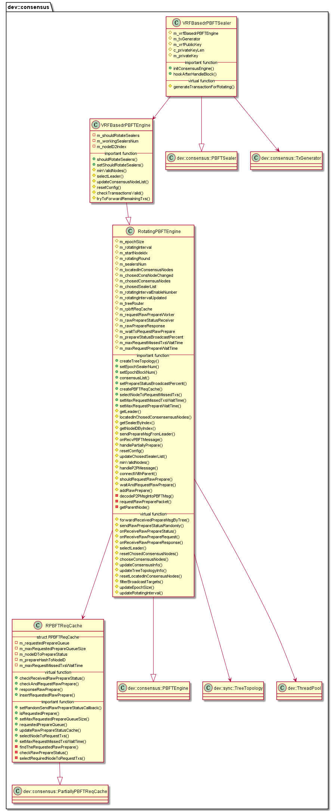

# libconsensus_rotating_pbft 子模块

作者：TrustChain [微信公众号]

libconsensus_rotating_pbft：实现rPBFT算法。

## 主要内容有：

+ 节点类型：共识委员节点&验证节点；

+ epoch_sealer_num：参与共识的节点数目；epoch_block_num：共识节点替换周期；

+ Prepare包广播优化：根据共识节点索引，构成完全n叉树，Leader产生Prepare包后，沿着树状拓扑将Prepare包转发给其所有下属子节点；Prepare包缺失的容错策略和流量均衡策略。



## 涉及知识点：

+ RPBFTReqCache.cpp
```
// record the requested rawPrepareReq
std::shared_ptr<QueueSet<dev::h256>> m_requestedPrepareQueue;
// maps between nodeID and prepare status
std::shared_ptr<std::map<dev::h512, PBFTMsg::Ptr>> m_nodeIDToPrepareStatus;
// maps between block hash and nodeID set
std::shared_ptr<std::map<dev::h256, std::shared_ptr<std::set<dev::h512>>>>
m_prepareHashToNodeID;

void RPBFTReqCache::insertRequestedRawPrepare(dev::h256 const& _hash)
{
    WriteGuard requestedPrepareHashLock(x_requestedPrepareQueue);
    if (m_requestedPrepareQueue->size() >= m_maxRequestedPrepareQueueSize)
    {
        m_requestedPrepareQueue->pop();
    }
    m_requestedPrepareQueue->push(_hash);
}


// select required node to request txs
dev::h512 RPBFTReqCache::selectRequiredNodeToRequestTxs(
    dev::h512 const& _expectedNodeID, PBFTMsg::Ptr _receivedRawPrepareStatus)
{
    ReadGuard l(x_nodeIDToPrepareStatus);
    auto blockHash = _receivedRawPrepareStatus->block_hash;
    if (!m_prepareHashToNodeID->count(blockHash) ||
        (*m_prepareHashToNodeID)[blockHash]->size() == 0)
    {
        return dev::h512();
    }
    // try to find the expected node
    if ((*m_prepareHashToNodeID)[blockHash]->count(_expectedNodeID))
    {
        return _expectedNodeID;
    }
    std::srand(utcTime());
    auto iterator = (*m_prepareHashToNodeID)[blockHash]->begin();
    //迭代器iterator偏移n，其中n为整数。
    std::advance(iterator, std::rand() % (*m_prepareHashToNodeID)[blockHash]->size());
    return *iterator;
}
```

+ RotatingPBFTEngine.cpp
```
/**重要数据结构
// configured epoch size
std::atomic<int64_t> m_epochSize = {-1};
// the interval(measured by block number) to adjust the sealers
std::atomic<int64_t> m_rotatingInterval = {-1};

// used to record the rotatingIntervalEnableNumber changed or not
dev::eth::BlockNumber m_rotatingIntervalEnableNumber = {-1};

std::shared_ptr<dev::sync::TreeTopology> m_treeRouter;
std::shared_ptr<RPBFTReqCache> m_rpbftReqCache;
dev::ThreadPool::Ptr m_requestRawPrepareWorker;
dev::ThreadPool::Ptr m_rawPrepareStatusReceiver;
dev::ThreadPool::Ptr m_rawPrepareResponse;
dev::ThreadPool::Ptr m_waitToRequestRawPrepare;
*/

typedef uint16_t IDXTYPE;

//选择leader
IDXTYPE RotatingPBFTEngine::selectLeader() const
{
    size_t index = (m_view + m_highestBlock.number()) % m_epochSize;
    return (IDXTYPE)((m_startNodeIdx.load() + index) % m_sealersNum);
}

//重置相关配置
void RotatingPBFTEngine::resetConfig()
{
    PBFTEngine::resetConfig();
    // update the epochBlockNum
    m_rotatingIntervalUpdated = updateRotatingInterval();
    if (m_rotatingIntervalUpdated)
    {
       //轮数m_rotatingRound
        m_rotatingRound =
            (m_blockChain->number() - m_rotatingIntervalEnableNumber) / m_rotatingInterval;
    }

    // if the whole consensus node list has been changed, reset the chosen consensus node list
    resetChosedConsensusNodes();
    // update fault tolerance
    m_f = std::min((m_epochSize - 1) / 3, (m_sealersNum - 1) / 3);
    // when reach the m_rotatingInterval, update the chosen consensus node list
    chooseConsensusNodes();
    // update consensusInfo when send block status by tree-topology
    updateConsensusInfo();

    resetLocatedInConsensusNodes();
}

//重置共识节点
void RotatingPBFTEngine::resetChosedConsensusNodes()
{
// first set up
auto blockNumber = m_blockChain->number();
if (m_startNodeIdx == -1)
{
    m_rotatingRound = (blockNumber - m_rotatingIntervalEnableNumber) / m_rotatingInterval;
}
m_startNodeIdx = m_rotatingRound % m_sealersNum;
int64_t idx = m_startNodeIdx;
std::set<dev::h512> chosedConsensusNodes;

ReadGuard l(m_sealerListMutex);
for (auto i = 0; i < m_epochSize; i++)
{
    chosedConsensusNodes.insert(m_sealerList[idx]);
    idx = (idx + 1) % m_sealersNum;
}
}

//选择共识节点
void RotatingPBFTEngine::chooseConsensusNodes()
{
// the rotatingInterval or E hasn't been set
if (m_rotatingInterval == -1 || m_epochSize == -1)
{
    return;
}
auto blockNumber = m_blockChain->number();
// don't need to switch the consensus node for not reach the rotatingInterval
int64_t consensusRound =
    blockNumber - m_rotatingIntervalEnableNumber - m_rotatingRound * m_rotatingInterval;
if (consensusRound < m_rotatingInterval)
{
    return;
}
// remove one consensus Node
auto chosedOutIdx = m_rotatingRound % m_sealersNum;
NodeID chosedOutNodeId = getNodeIDByIndex(chosedOutIdx);
//删除一个旧的共识节点
{
WriteGuard l(x_chosedConsensusNodes);
m_chosedConsensusNodes->erase(chosedOutNodeId);
}

//插入新共识节点
m_chosedConsNodeChanged = true;
// update the startIndex
m_rotatingRound += 1;
m_startNodeIdx = m_rotatingRound % m_sealersNum;
auto epochSize = std::min(m_epochSize.load(), m_sealersNum.load());
IDXTYPE chosedInNodeIdx = (m_startNodeIdx.load() + epochSize - 1) % m_sealersNum;
NodeID chosedInNodeId = getNodeIDByIndex(chosedInNodeIdx);
size_t chosedConsensusNodesSize = 0;
{
    WriteGuard l(x_chosedConsensusNodes);
    m_chosedConsensusNodes->insert(chosedInNodeId);
    chosedConsensusNodesSize = m_chosedConsensusNodes->size();
}

}
```

```
/**
//status of RawPrepareReq
P2PRawPrepareStatusPacket:工作线程m_rawPrepareStatusReceive调用函数onReceiveRawPrepareStatus()

// receive raw prepare request from other node
RequestRawPreparePacket:工作线程m_requestRawPrepareWorker
调用函数onReceiveRawPrepareRequest()

// receive raw prepare response from the other node
RawPrepareResponse:工作线程m_rawPrepareResponse
调用函数onReceiveRawPrepareResponse()

default:
PBFTEngine::handleP2PMessage(_exception, _session, _message);

*/
void RotatingPBFTEngine::handleP2PMessage(dev::p2p::NetworkException _exception,
    std::shared_ptr<dev::p2p::P2PSession> _session, dev::p2p::P2PMessage::Ptr _message)
{
    try
    {
        // disable broadcast prepare by tree
        if (!m_treeRouter)
        {
            return PBFTEngine::handleP2PMessage(_exception, _session, _message);
        }
        // enable broadcast prepare by tree
        switch (_message->packetType())
        {
        // status of RawPrepareReq
        case P2PRawPrepareStatusPacket:
            m_rawPrepareStatusReceiver->enqueue([this, _session, _message]() {
                this->onReceiveRawPrepareStatus(_session, _message);
            });
            break;
        // receive raw prepare request from other node
        case RequestRawPreparePacket:
            m_requestRawPrepareWorker->enqueue([this, _session, _message]() {
                this->onReceiveRawPrepareRequest(_session, _message);
            });
            break;
        // receive raw prepare response from the other node
        case RawPrepareResponse:
            m_rawPrepareResponse->enqueue([this, _exception, _session, _message]() {
                try
                {
                    this->onReceiveRawPrepareResponse(_session, _message);
                }
                catch (std::exception const& _e)
                {
                   
                }
            });

            break;
        default:
            PBFTEngine::handleP2PMessage(_exception, _session, _message);
            break;
        }
    }
    catch (std::exception const& _e)
    {
    }
}

```

```
//P2PRawPrepareStatusPacket:工作线程m_rawPrepareStatusReceive调用函数onReceiveRawPrepareStatus()-->工作线程m_waitToRequestRawPrepare调用waitAndRequestRawPrepare()

// receive the rawPrepareReqStatus packet and update the cachedRawPrepareStatus
void RotatingPBFTEngine::onReceiveRawPrepareStatus(
    std::shared_ptr<P2PSession> _session, P2PMessage::Ptr _message)
{
    try
    {
        auto pbftMsg = decodeP2PMsgIntoPBFTMsg(_session, _message);
        if (!pbftMsg)
        {
            return;
        }
        if (!m_rpbftReqCache->checkReceivedRawPrepareStatus(
                pbftMsg, m_view, m_blockChain->number()))
        {
            return;
        }
        m_rpbftReqCache->updateRawPrepareStatusCache(_session->nodeID(), pbftMsg);
        // request rawPreparePacket to the selectedNode
        auto parentNodeList = getParentNode(pbftMsg);
        // the root node of the tree-topology
        if (!parentNodeList || parentNodeList->size() == 0)
        {
            return;
        }
        // the node disconnected with the parent node
        if (!connectWithParent(parentNodeList))
        {
            if (!m_rpbftReqCache->checkAndRequestRawPrepare(pbftMsg))
            {
                return;
            }
            requestRawPreparePacket(_session->nodeID(), pbftMsg);
        }
        else
        {
            // wait for at most m_maxRequestPrepareWaitTime before request the rawPrepare
            m_waitToRequestRawPrepare->enqueue([this, pbftMsg, _session, parentNodeList] {
                this->waitAndRequestRawPrepare(pbftMsg, _session->nodeID(), parentNodeList);
            });
        }
    }
    catch (std::exception const& _e)
    {
    }
}
```

```
/**
receive raw prepare request from other node
RequestRawPreparePacket:工作线程m_requestRawPrepareWorker
调用函数onReceiveRawPrepareRequest()-->m_service->asyncSendMessageByNodeID()返回responseRawPrepare消息
*/
void RotatingPBFTEngine::onReceiveRawPrepareRequest(
    std::shared_ptr<P2PSession> _session, P2PMessage::Ptr _message)
{
    try
    {
        PBFTMsg::Ptr pbftMsg = decodeP2PMsgIntoPBFTMsg(_session, _message);
        if (!pbftMsg)
        {
            return;
        }
        auto key = pbftMsg->block_hash.hex();
        if (broadcastFilter(_session->nodeID(), PrepareReqPacket, key))
        {
            return;
        }
        // the node doesn't connect with the targetNode
        if (!m_service->getP2PSessionByNodeId(_session->nodeID()))
        {
            return;
        }
        std::shared_ptr<bytes> encodedRawPrepare = std::make_shared<bytes>();
        m_rpbftReqCache->responseRawPrepare(encodedRawPrepare, pbftMsg);
        // response the rawPrepare
        auto p2pMessage = transDataToMessage(ref(*encodedRawPrepare), PrepareReqPacket, 0);
        p2pMessage->setPacketType(RawPrepareResponse);
        m_service->asyncSendMessageByNodeID(_session->nodeID(), p2pMessage, nullptr);
        broadcastMark(_session->nodeID(), PrepareReqPacket, key);
    
    }
    catch (std::exception const& _e)
    {
  
    }
}
```

```
/**
// receive raw prepare response from the other node
RawPrepareResponse:工作线程m_rawPrepareResponse
调用函数onReceiveRawPrepareResponse()-->PBFTEngine
::handlePrepareMsg()

*/
void RotatingPBFTEngine::onReceiveRawPrepareResponse(
    std::shared_ptr<dev::p2p::P2PSession> _session, dev::p2p::P2PMessage::Ptr _message)
{
    PBFTMsgPacket::Ptr pbftMsgPacket = m_pbftMsgFactory->createPBFTMsgPacket();
    // invalid pbftMsgPacket
    if (!decodePBFTMsgPacket(pbftMsgPacket, _message, _session))
    {
        return;
    }
    PrepareReq::Ptr prepareReq = std::make_shared<PrepareReq>();
    prepareReq->decode(ref(pbftMsgPacket->data));
    Guard l(m_mutex);
    handlePrepareMsg(prepareReq, pbftMsgPacket->endpoint);
}
```

+ VRFBasedrPBFTEngine.cpp
```
//重置配置
void VRFBasedrPBFTEngine::resetConfig()
{
    PBFTEngine::resetConfig();
    // Reach consensus on new blocks, update m_shouldRotateSealers to false
    if (true == m_shouldRotateSealers.load())
    {
        m_shouldRotateSealers.store(false);
    }
    // update m_f
    m_f = (m_workingSealersNum - 1) / 3;
    // update according to epoch_block_num
    updateRotatingInterval();
    // update according to epoch_sealer_num
    bool epochUpdated = updateEpochSize();
    // first setup
    if (m_blockChain->number() == 0)
    {
        return;
    }
    // The previous leader forged an illegal rotating-tx, resulting in a failed
    // verification And the INTERNAL_SYSTEM_KEY_NOTIFY_ROTATE flag was set to true, the current
    // leader needs to rotate workingsealers
    auto notifyRotateFlagInfo =
        m_blockChain->getSystemConfigByKey(dev::precompiled::INTERNAL_SYSTEM_KEY_NOTIFY_ROTATE);
    bool notifyRotateFlag = false;
    if (notifyRotateFlagInfo != "")
    {
        notifyRotateFlag = (bool)(boost::lexical_cast<int64_t>(notifyRotateFlagInfo));
    }
    if (notifyRotateFlag)
    {
        m_shouldRotateSealers.store(true);
   
    }
    // the number of workingSealers is smaller than epochSize,
    // trigger rotate in case of the number of working sealers has been decreased to 0
    auto maxWorkingSealerNum = std::min(m_epochSize.load(), m_sealersNum.load());
    if (m_workingSealersNum.load() < maxWorkingSealerNum)
    {
        m_shouldRotateSealers.store(true);
    }
    // After the last batch of workingsealers agreed on m_rotatingInterval blocks,
    // set m_shouldRotateSealers to true to notify VRFBasedrPBFTSealer to update workingSealer
    if (epochUpdated ||
        (0 == (m_blockChain->number() - m_rotatingIntervalEnableNumber) % m_rotatingInterval))
    {
        m_shouldRotateSealers.store(true);
    }
  }

// Working sealer is elected as leader in turn
IDXTYPE VRFBasedrPBFTEngine::selectLeader() const
{
    // the m_chosedSealerList has not been initialized yet
    if (m_chosedSealerList->size() == 0)
    {
        return MAXIDX;
    }
    //被选中的节点idx
    int64_t selectedIdx = ((m_view + m_highestBlock.number()) % m_chosedSealerList->size());
    dev::h512 selectedNodeId;
    {
        ReadGuard l(x_chosedSealerList);
        selectedNodeId = (*m_chosedSealerList)[selectedIdx];
    }
    {
        ReadGuard l(x_nodeID2Index);
        return (*m_nodeID2Index)[selectedNodeId];
    }
}
```

+ VRFBasedrPBFTSealer.cpp
```
/** 重要数据结构
VRFBasedrPBFTEngine::Ptr m_vrfBasedrPBFTEngine;
TxGenerator::Ptr m_txGenerator;
// VRF public key
std::string m_vrfPublicKey;
unsigned const c_privateKeyLen = 32;
std::string m_privateKey;
*/

// 初始化 VRFBasedrPBFTSealer
void VRFBasedrPBFTSealer::initConsensusEngine()
{
    PBFTSealer::initConsensusEngine();
    std::string threadName = "rPBFTSeal-" + std::to_string(m_pbftEngine->groupId());
    setName(threadName);
    // convert PBFTEngine into VRFBasedrPBFTEngine
    m_vrfBasedrPBFTEngine = std::dynamic_pointer_cast<VRFBasedrPBFTEngine>(m_pbftEngine);
    // create txGenerator
    m_txGenerator = std::make_shared<TxGenerator>(
        m_pbftEngine->groupId(), g_BCOSConfig.chainId(), m_txPool->maxBlockLimit() / 2);
    // get private key and generate vrf-public-key
    m_privateKey =
        toHex(bytesConstRef{m_vrfBasedrPBFTEngine->keyPair().secret().data(), c_privateKeyLen});
    auto vrfPublicKey = curve25519_vrf_generate_key_pair(m_privateKey.c_str());
    if (vrfPublicKey == nullptr)
    {
     }
    m_vrfPublicKey = vrfPublicKey;
}

//生成vrf交易并追加在区块的第一个交易位置上，待预编译合约dev::precompiled::WORKING_SEALER_MGR_ADDRESS进行执行验证交易签名等；
bool VRFBasedrPBFTSealer::generateTransactionForRotating()
{
    try
    {
        // get VRF proof
        auto blockNumber = m_blockChain->number();
        auto blockHash = m_blockChain->numberHash(blockNumber);
        auto blockHashStr = toHex(blockHash);
        auto vrfProofPtr = curve25519_vrf_proof(m_privateKey.c_str(), blockHashStr.c_str());
        if (!vrfProofPtr)
        {
            return false;
        }
        std::string vrfProof = vrfProofPtr;
        // generate "rotateWorkingSealer" transaction
        std::string interface = dev::precompiled::WSM_METHOD_ROTATE_STR;
        auto generatedTx =
            m_txGenerator->generateTransactionWithSig(interface, m_blockChain->number(),
                dev::precompiled::WORKING_SEALER_MGR_ADDRESS, m_vrfBasedrPBFTEngine->keyPair(),
                dev::eth::Transaction::Type::MessageCall, m_vrfPublicKey, blockHashStr, vrfProof);

        // put the generated transaction into the 0th position of the block transactions
        // Note: must set generatedTx into the first transaction for other transactions may change
        //       the _sys_config_ and _sys_consensus_
        //       here must use noteChange for this function will notify updating the txsCache
        if (m_sealing.block->transactions()->size() > 0)
        {
            (*(m_sealing.block->transactions()))[0] = generatedTx;
            m_sealing.block->noteChange();
        }
        else
        {
            m_sealing.block->appendTransaction(generatedTx);
        }
    }
    catch (const std::exception& _e)
    {
        return false;
    }
    return true;
}

```

参考文献：

[1] https://github.com/FISCO-BCOS/FISCO-BCOS/releases/tag/v2.7.2

[2] https://fisco-bcos-documentation.readthedocs.io/zh_CN/latest/