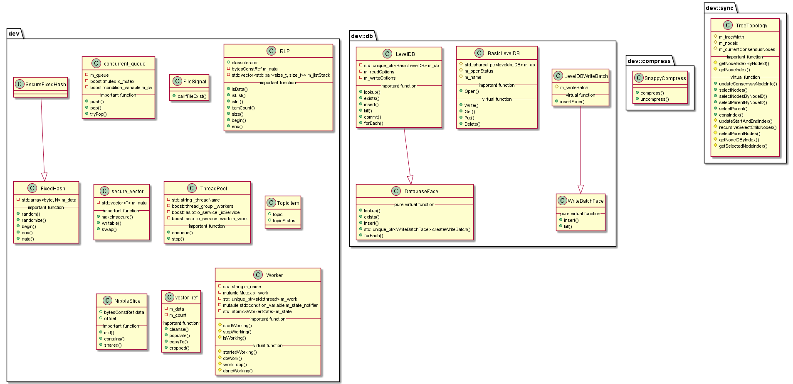

#  libdevcore 模块
作者：TrustChain [微信公众号]

libdevcore：提供数据编解码、Snappy解压缩、数据库、文件系统、线程池等常用工具库。

## 主要内容有：

+ 编解码：Base64编解码、RLP编解码、Snappy解压缩；

+ 数据库：leveldb数据库的增删改查等；

+ 文件系统：基于boost::filesystem实现的一些文件操作；

+ 线程池：提供系统用的线程池和工作线程；

## 涉及知识点：

+ Base64.cpp：base64编解码，即3个字节24bit--》每6bit 按照字符对照表找到对应字符--》将该字符的ASCII编码(8bit)为一个字节，即24bit/6bit =4;

+ RLP.cpp：RLP编解码；

+ SnappyCompress.cpp：调用第三方库实现Snappy压缩和解压缩。备注：https://github.com/google/snappy

+ BasicLevelDB.cpp、LevelDB.cpp：主要实现针对leveldb数据库增删改查的操作等；

+ FileSystem.cpp：主要实现系统常用目录的创建等。

+ TreeTopology.cpp：主要用于区块同步、交易同步的树状广播；

+ TrieCommon.cpp、TrieHash.cpp、TrieHash2.cpp：主要实现trie数据结构，获取默克尔树根等；

+ Worker.cpp、ThreadPool.h：实现线程池、工作线程等；

参考文献：

[1] https://github.com/FISCO-BCOS/FISCO-BCOS/releases/tag/v2.7.2

[2] https://fisco-bcos-documentation.readthedocs.io/zh_CN/latest/

