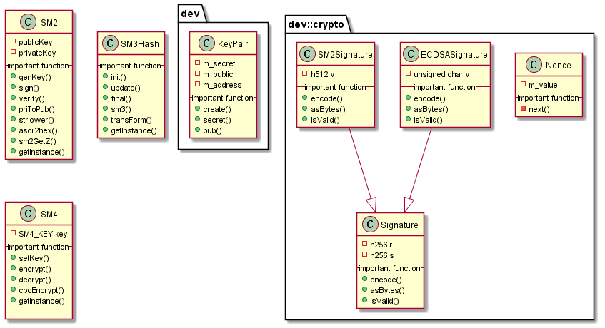

# libdevcrypto 模块
作者：TrustChain [微信公众号]

libdevcrypto：提供国密和非国密的哈希算法、对称算法、非对称算法。
## 主要内容有：

| 密码算法 | 分类 | 国密| 非国密 |
| :-----  | ----: | :----: |:----: |
| 对称算法 | 分组加密/块加密 | SM1、SM4、SM7 | DES、AES |
| 对称算法 | 序列加密/流加密 |  |  |
| 非对称算法 | 大数分解 |  | RSA |
| 非对称算法 | 离散对数 |  SM2、SM9|  |
| 哈希算法| 密码杂凑、散列 | SM3 | BLAKE2、MD5、SHA-1、SHA-2 |
| 签名算法 | 私钥签名 |  SM2|  ECDSA |



## 涉及知识点：
+ 椭圆曲线密码体制：


+ sm2.cpp

```
# 签名
bool SM2::sign(const char* originalData, int originalDataLen, const string& privateKey,
    unsigned char* r, unsigned char* s)
{
    bool lresult = false;
    SM3_CTX sm3Ctx;
    EC_KEY* sm2Key = NULL;
    unsigned char zValue[SM3_DIGEST_LENGTH];

    size_t zValueLen;
    ECDSA_SIG* signData = NULL;
    string str = "";   // big int data
    string _str = "";  // big int swap data
    BIGNUM* res = NULL;
    BN_CTX* ctx = NULL;
    int len = 0;
    int i = 0;
    ctx = BN_CTX_new();

    res = BN_new();
    if (res == NULL)
    {
        CRYPTO_LOG(ERROR) << "[SM2::sign] malloc BigNumber failed";
        goto err;
    }
    BN_hex2bn(&res, (const char*)privateKey.c_str());
    sm2Key = EC_KEY_new_by_curve_name(NID_sm2);
    EC_KEY_set_private_key(sm2Key, res);

    zValueLen = sizeof(zValue);
    if (!sm2GetZ(privateKey, (const EC_KEY*)sm2Key, zValue, zValueLen))
    {
        CRYPTO_LOG(ERROR) << "[SM2::sign] Error Of Compute Z";
        goto err;
    }
    // SM3 Degist
    SM3_Init(&sm3Ctx);
    SM3_Update(&sm3Ctx, zValue, zValueLen);
    SM3_Update(&sm3Ctx, originalData, originalDataLen);
    SM3_Final(zValue, &sm3Ctx);

    signData = ECDSA_do_sign_ex(zValue, zValueLen, NULL, NULL, sm2Key);
    if (signData == NULL)
    {
        CRYPTO_LOG(ERROR) << "[SM2::sign] Error Of SM2 Signature";
        goto err;
    }
    len = BN_bn2bin(signData->r, r);
    for (i = 31; len > 0 && len != 32; --len, --i)
    {
        r[i] = r[len - 1];
    }
    for (; i >= 0 && len != 32; --i)
    {
        r[i] = 0;
    }
    len = BN_bn2bin(signData->s, s);
    for (i = 31; len > 0 && len != 32; --len, --i)
    {
        s[i] = s[len - 1];
    }
    for (; i >= 0 && len != 32; --i)
    {
        s[i] = 0;
    }
    lresult = true;
    // LOG(DEBUG)<<"r:"<<r<<" rLen:"<<r.length()<<" s:"<<s<<" sLen:"<<s.length();
err:
    if (res)
    {
        BN_free(res);
    }
    if (ctx)
        BN_CTX_free(ctx);
    if (sm2Key)
        EC_KEY_free(sm2Key);
    if (signData)
        ECDSA_SIG_free(signData);
    return lresult;
}

```

```
# 验签
int SM2::verify(const unsigned char* _signData, size_t, const unsigned char* _originalData,
    size_t _originalLength, const unsigned char* _publicKey)
{  // _publicKey length must 64, start with 4
    bool lresult = false;
    SM3_CTX sm3Ctx;
    EC_KEY* sm2Key = NULL;
    EC_POINT* pubPoint = NULL;
    EC_GROUP* sm2Group = NULL;
    ECDSA_SIG* signData = NULL;
    unsigned char zValue[SM3_DIGEST_LENGTH];
    size_t zValueLen = SM3_DIGEST_LENGTH;
    auto pubHex = toHex(_publicKey, _publicKey + 64, "04");
    sm2Group = EC_GROUP_new_by_curve_name(NID_sm2);
    auto rHex = toHex(_signData, _signData + 32, "");
    auto sHex = toHex(_signData + 32, _signData + 64, "");
    if (sm2Group == NULL)
    {
        CRYPTO_LOG(ERROR) << "[SM2::veify] ERROR of Verify EC_GROUP_new_by_curve_name"
                          << LOG_KV("pubKey", pubHex);
        goto err;
    }

    if ((pubPoint = EC_POINT_new(sm2Group)) == NULL)
    {
        CRYPTO_LOG(ERROR) << "[SM2::veify] ERROR of Verify EC_POINT_new"
                          << LOG_KV("pubKey", pubHex);
        goto err;
    }

    if (!EC_POINT_hex2point(sm2Group, (const char*)pubHex.c_str(), pubPoint, NULL))
    {
        CRYPTO_LOG(ERROR) << "[SM2::veify] ERROR of Verify EC_POINT_hex2point"
                          << LOG_KV("pubKey", pubHex);
        goto err;
    }

    sm2Key = EC_KEY_new_by_curve_name(NID_sm2);

    if (sm2Key == NULL)
    {
        CRYPTO_LOG(ERROR) << "[SM2::veify] ERROR of Verify EC_KEY_new_by_curve_name"
                          << LOG_KV("pubKey", pubHex);
        goto err;
    }

    if (!EC_KEY_set_public_key(sm2Key, pubPoint))
    {
        CRYPTO_LOG(ERROR) << "[SM2::veify] ERROR of Verify EC_KEY_set_public_key"
                          << LOG_KV("pubKey", pubHex);
        goto err;
    }

    if (!ECDSA_sm2_get_Z((const EC_KEY*)sm2Key, NULL, NULL, 0, zValue, &zValueLen))
    {
        CRYPTO_LOG(ERROR) << "[SM2::veify] Error Of Compute Z" << LOG_KV("pubKey", pubHex);
        goto err;
    }
    // SM3 Degist
    SM3_Init(&sm3Ctx);
    SM3_Update(&sm3Ctx, zValue, zValueLen);
    SM3_Update(&sm3Ctx, _originalData, _originalLength);
    SM3_Final(zValue, &sm3Ctx);

    /*Now Verify it*/
    signData = ECDSA_SIG_new();
    BN_bin2bn(_signData, 32, signData->r);
    if (!signData->r)
    {
        CRYPTO_LOG(ERROR) << "[SM2::veify] ERROR of BN_bin2bn r" << LOG_KV("pubKey", pubHex);
        goto err;
    }
    BN_bin2bn(_signData + 32, 32, signData->s);
    if (!signData->s)
    {
        CRYPTO_LOG(ERROR) << "[SM2::veify] ERROR BN_bin2bn s" << LOG_KV("pubKey", pubHex);
        goto err;
    }

    if (ECDSA_do_verify(zValue, zValueLen, signData, sm2Key) != 1)
    {
        CRYPTO_LOG(ERROR) << "[SM2::veify] Error Of SM2 Verify" << LOG_KV("pubKey", pubHex);
        goto err;
    }
    lresult = true;
err:
    if (sm2Key)
        EC_KEY_free(sm2Key);
    if (pubPoint)
        EC_POINT_free(pubPoint);
    if (signData)
        ECDSA_SIG_free(signData);
    if (sm2Group)
        EC_GROUP_free(sm2Group);
    return lresult;
}

```
+ sm3.cpp

```
int SM3Hash::init(SM3_CTX* c)
{
    return ::SM3_Init(c);
}

int SM3Hash::update(SM3_CTX* c, const void* data, size_t len)
{
    return ::SM3_Update(c, data, len);
}

int SM3Hash::final(unsigned char* md, SM3_CTX* c)
{
    return ::SM3_Final(md, c);
}

unsigned char* SM3Hash::sm3(const unsigned char* d, size_t n, unsigned char* md)
{
    return ::SM3(d, n, md);
}

void SM3Hash::transForm(SM3_CTX* c, const unsigned char* data)
{
    ::SM3_Transform(c, data);
}

SM3Hash& SM3Hash::getInstance()
{
    static SM3Hash sm3;
    return sm3;
}

```

+ sm4.cpp

```

int SM4::setKey(const unsigned char* userKey, size_t length)
{
    return ::SM4_set_key(userKey, length, &key);
}

void SM4::encrypt(const unsigned char* in, unsigned char* out)
{
    ::SM4_encrypt(in, out, &key);
}

void SM4::decrypt(const unsigned char* in, unsigned char* out)
{
    ::SM4_decrypt(in, out, &key);
}

void SM4::cbcEncrypt(
    const unsigned char* in, unsigned char* out, size_t length, unsigned char* ivec, const int enc)
{
    unsigned char* iv = (unsigned char*)malloc(16);
    std::memcpy(iv, ivec, 16);
    ::SM4_cbc_encrypt(in, out, length, &key, iv, enc);
    free(iv);
}

SM4& SM4::getInstance()
{
    static SM4 sm4;
    return sm4;
}

```

参考文献：

[1] https://github.com/FISCO-BCOS/FISCO-BCOS/releases/tag/v2.7.2

[2] https://fisco-bcos-documentation.readthedocs.io/zh_CN/latest/

