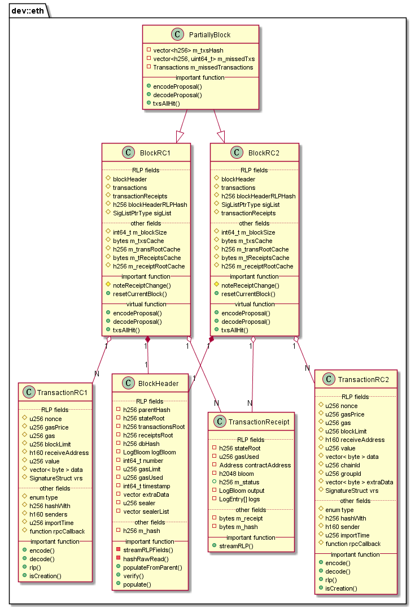

# libethcore 模块
作者：TrustChain [微信公众号]

libethcore：提供基本的交易、回执和区块定义，以及公共基础类等。

## 主要内容有：

+ 交易数据结构及RLP编码
+ 区块数据结构及RLP编码
+ 交易收据数据结构及RLP编码

## 涉及知识点：
+ RLP：递归前缀长度编码，两种类型编码：byte数组、byte数组的数组（列表）。
1. 对于值在[0, 127]之间的单字节X，编码结果是:单字节X本身；
2. 如果byte数组X的长度||X||<=55，编码结果是:128+||X||、数组X；
3. 如果byte数组长度||X||>55，编码结果是:183（128+55）+ ||BE(||X||)||、数组长度的编码BE(||X||)、byte数组X；编码一个长度为 256（2828=0x100）的字符串时，因 256 需要至少 2 个字节存储，其高位字节为 0x10，因此RLP 编码输出为 [ 0xb7+ 2, 0x01,0x00,字节内容…]。
4. 如果列表长度||s(X)||<=55，编码结果是：192+列表长度||s(X)||、各个子列表的编码s(X)；s(X)=RLP(X0).RLP(X1)....
5. 如果列表长度s(X)>55，编码结果是：247(192 + 55)+列表长度||BE(||s(X)||)||、列表本身的编码BE(||s(X)||)、各子列表的编码s(X)。

+ ABI接口：ABI是Application Binary Interface的缩写，合约的接口说明。ABI有点类似于程序中的接口文档，描述了字段名称、字段类型、方法名称、参数名称、参数类型、方法返回值类型等。编写合约代码->编译合约->部署合约->执行合约。ABI参数含义如下：
1. name：函数名称；
2. type：方法类型，包括function（默认方法）, constructor, fallback(缺省方法)；
3. constant：布尔值，如果为true，指明方法不会修改合约字段的状态变量；
4. payable：布尔值，标明方法是否可以接收ether；
5. stateMutability：状态类型，包括pure (不读取区块链状态)，view (和constant类型，只能查看，不会修改合约字段)，nonpayable（和payable含义一样），payable（和payable含义一样）。其实保留payable和constant是为了向后兼容；
6. inputs：数组，描述参数的名称和类型；
7. name：参数名称；
8. type：参数类型；
9. outputs：和inputs一样，如果没有返回值，缺省是一个空数组。

参考文献：

[1] https://github.com/FISCO-BCOS/FISCO-BCOS/releases/tag/v2.7.2

[2] https://fisco-bcos-documentation.readthedocs.io/zh_CN/latest/
