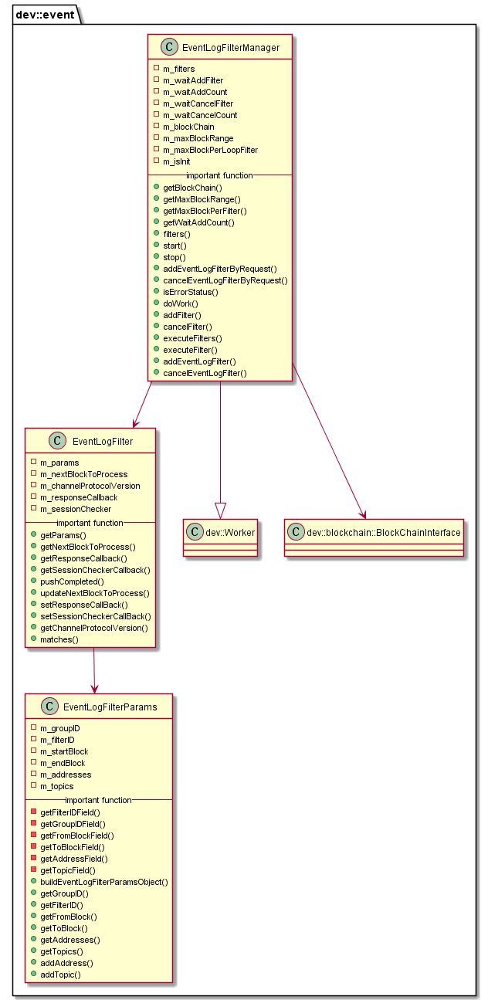

#  libeventfilter 模块
作者：TrustChain [微信公众号]

libeventfilter：事件日志过滤。


## 主要内容有：

+ 区块链执行事件日志过滤


## 涉及知识点：

+ 过滤参数：filterID、groupID、startBlock、endBlock、addresses、topics；

+ 事件过滤：启停一个线程，处理客户端发来的增删过滤规则请求，处理filter进行处理，有两个回调函数：
```

std::function<bool(const std::string& _filterID, int32_t _result, const Json::Value& _logs,GROUP_ID const& _groupId)> _respCallback
std::function<int(GROUP_ID _groupId)> _sessionCheckerCallback
```
参考文献：

[1] https://github.com/FISCO-BCOS/FISCO-BCOS/releases/tag/v2.7.2

[2] https://fisco-bcos-documentation.readthedocs.io/zh_CN/latest/