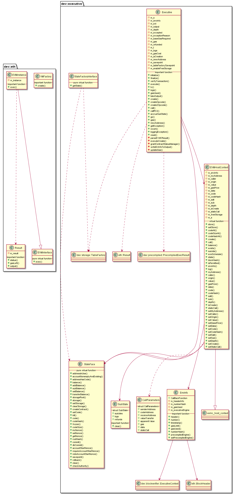

# libexecutive 模块

作者：TrustChain [微信公众号]

libexecutive：一笔交易的执行逻辑，包括合约部署。


## 主要内容有：

+ 交易的执行；

+ 合约部署。




## 涉及知识点：

+ Common.h
```
/** 重要数据结构
/// set parameters and functions for the evm call
struct CallParameters
{
   Address senderAddress;   /// address of the transaction sender
    Address codeAddress;     /// address of the contract
    Address receiveAddress;  /// address of the transaction receiver
    u256 valueTransfer;      /// transferred wei between the sender and receiver
    u256 apparentValue;
    u256 gas;
    bytesConstRef data;       /// transaction data
    bool staticCall = false;  /// only true when the transaction is a message call
};

/// the information related to the EVM
class EnvInfo
{
private:
    eth::BlockHeader m_headerInfo;
    CallBackFunction m_numberHash;
    u256 m_gasUsed;
    std::shared_ptr<dev::blockverifier::ExecutiveContext> m_executiveEngine;
}
*/
```

+ EVMHostContext.cpp
```
//创建合约的交易
//EVMHostContext::create-->调用Executive::createOpcode()
evmc_result EVMHostContext::create(
    u256 const& _endowment, u256& io_gas, bytesConstRef _code, evmc_opcode _op, u256 _salt)
{
    Executive e{m_s, envInfo(), m_freeStorage, depth() + 1};
    // Note: When create initializes Executive, the flags of evmc context must be passed in
    bool result = false;
    if (_op == evmc_opcode::OP_CREATE)
        result = e.createOpcode(myAddress(), _endowment, gasPrice(), io_gas, _code, origin());
    else
    {
        // TODO: when new CREATE opcode added, this logic maybe affected
        assert(_op == evmc_opcode::OP_CREATE2);
        result =
            e.create2Opcode(myAddress(), _endowment, gasPrice(), io_gas, _code, origin(), _salt);
    }

    if (!result)
    {
        go(depth(), e);
        e.accrueSubState(sub());
    }
    io_gas = e.gas();
    evmc_result evmcResult;
    generateCreateResult(&evmcResult, transactionExceptionToEvmcStatusCode(e.getException()),
        io_gas, e.takeOutput(), e.newAddress());
    return evmcResult;
}

//执行交易逻辑，调用go()
evmc_result EVMHostContext::call(CallParameters& _p)
{
    Executive e{m_s, envInfo(), m_freeStorage, depth() + 1};
    // Note: When create initializes Executive, the flags of evmc context must be passed in
    if (!e.call(_p, gasPrice(), origin()))
    {
        go(depth(), e);
        e.accrueSubState(sub());
    }
    _p.gas = e.gas();

    evmc_result evmcResult;
    generateCallResult(&evmcResult, transactionExceptionToEvmcStatusCode(e.getException()), _p.gas,
        e.takeOutput());
    return evmcResult;
}
```

+ EVMHostInterface.cpp
```
 /// function table
evmc_host_interface const fnTable = {
    accountExists,
    getStorage,
    setStorage,
    getBalance,
    getCodeSize,
    getCodeHash,
    copyCode,
    selfdestruct,
    call,
    getTxContext,
    getBlockHash,
    log,
};

}  // namespace

const evmc_host_interface* getHostInterface()
{
    return &fnTable;
}

 //evmc_host_interface()-->fnTable-->create()--》EVMHostContext::create()-->调用Executive::createOpcode()
evmc_result create(EVMHostContext& _env, evmc_message const* _msg) noexcept
{
    u256 gas = _msg->gas;
    u256 value = fromEvmC(_msg->value);
    bytesConstRef init = {_msg->input_data, _msg->input_size};
    u256 salt = fromEvmC(_msg->create2_salt);
    evmc_opcode opcode =
        _msg->kind == EVMC_CREATE ? evmc_opcode::OP_CREATE : evmc_opcode::OP_CREATE2;

    // EVMHostContext::create takes the sender address from .myAddress().
    assert(fromEvmC(_msg->sender) == _env.myAddress());
    //调用EVMHostContext::create()
    return _env.create(value, gas, init, opcode, salt);
}


//执行交易:call()
//执行创建合约的交易:create()
evmc_result call(evmc_host_context* _context, const evmc_message* _msg) noexcept
{
    // gas maybe smaller than 0 since outside gas is u256 and evmc_message is int64_t
    // so gas maybe smaller than 0 in some extreme cases
    // * origin code: assert(_msg->gas >= 0)
    if (_msg->gas < 0)
    {
        EXECUTIVE_LOG(ERROR) << LOG_DESC("Gas overflow") << LOG_KV("cur gas", _msg->gas);
        BOOST_THROW_EXCEPTION(eth::GasOverflow());
    }

    auto& env = static_cast<EVMHostContext&>(*_context);

    // Handle CREATE separately.
    if (_msg->kind == EVMC_CREATE || _msg->kind == EVMC_CREATE2)
        //创建合约的交易
        return create(env, _msg);

    CallParameters params;
    params.gas = _msg->gas;
    params.apparentValue = fromEvmC(_msg->value);
    params.valueTransfer = _msg->kind == EVMC_DELEGATECALL ? 0 : params.apparentValue;
    params.senderAddress = fromEvmC(_msg->sender);
    params.codeAddress = fromEvmC(_msg->destination);
    params.receiveAddress = _msg->kind == EVMC_CALL ? params.codeAddress : env.myAddress();
    params.data = {_msg->input_data, _msg->input_size};
    params.staticCall = (_msg->flags & EVMC_STATIC) != 0;
     //调用链：evmc_host_interface()-->fnTable-->call()--》EVMHostContext::call()--》Executive::call()
    return env.call(params);
}
```

+ EVMInstance.cpp
```
/// The VM instance created with EVMInstance-C <prefix>_create() function.
evmc_vm* m_instance = nullptr;

std::shared_ptr<Result> EVMInstance::exec(executive::EVMHostContext& _ext, evmc_revision _rev,
    evmc_message* _msg, const uint8_t* _code, size_t _code_size)
{
    auto result = std::make_shared<Result>(
        m_instance->execute(m_instance, _ext.interface, &_ext, _rev, _msg, _code, _code_size));
    return result;
}
```

+ StateFace.h
```
enum class StateType
{
    MptState,
    StorageState
};
//主要实现操作MptState或StorageState的相关函数操作
class StateFace
{
//其中两个提交状态的函数
/// Commit all changes waiting in the address cache to the DB.
/// @param _commitBehaviour whether or not to remove empty accounts during commit.
virtual void commit() = 0;

/// Commit levelDB data into hardisk or commit AMDB data into database (Called after commit())
/// @param _commitBehaviour whether or not to remove empty accounts during commit.
virtual void dbCommit(h256 const& _blockHash, int64_t _blockNumber) = 0;

}
```

+ VMFactory.cpp
```
//Hera、evmone、DLL、Interpreter类型
//https://github.com/ewasm/hera
//Hera是由C++实现的遵从EVMC接口的ewasm虚拟机。Hera内部包含了wasm VM，目前wasm的VM有多个实现版本，Hera计划支持Bineryen，WABT，WAVM（EOS也使用WAVM），目前可以完全支持Bineryen。
std::unique_ptr<EVMInterface> VMFactory::create(VMKind _kind)
{
    switch (_kind)
    {
#ifdef HERA
    case VMKind::Hera:
        return std::unique_ptr<EVMInterface>(new EVMInstance{evmc_create_hera()});
#endif
    case VMKind::evmone:
        return std::unique_ptr<EVMInterface>(new EVMInstance{evmc_create_evmone()});
    case VMKind::DLL:
        return std::unique_ptr<EVMInterface>(new EVMInstance{g_evmcCreateFn()});
#if 0
    case VMKind::Interpreter:
        return std::unique_ptr<EVMInterface>(new EVMInstance{evmc_create_interpreter()});
#endif
    default:
        return std::unique_ptr<EVMInterface>(new EVMInstance{evmc_create_evmone()});
    }
}
```

+ Executive.cpp
```
/** 重要数据结构
std::shared_ptr<StateFace> m_s; 
dev::executive::EnvInfo m_envInfo;    
std::shared_ptr<EVMHostContext> m_ext;  
unsigned m_depth = 0;  
dev::eth::Transaction::Ptr m_t; 
u256 m_refunded = 0;  ///< The amount of gas refunded.
*/

//调用EVMInstance::exec()
bool Executive::go()
{
if (m_ext)
{
#if ETH_TIMED_EXECUTIONS
Timer t;
#endif
try
{
    auto getEVMCMessage = [=]() -> shared_ptr<evmc_message> {
        // the block number will be larger than 0,
        // can be controlled by the programmers
        assert(m_ext->envInfo().number() >= 0);
        constexpr int64_t int64max = std::numeric_limits<int64_t>::max();
        if (m_gas > int64max || m_ext->envInfo().gasLimit() > int64max)
        {
            EXECUTIVE_LOG(ERROR) << LOG_DESC("Gas overflow") << LOG_KV("gas", m_gas)
                                 << LOG_KV("gasLimit", m_ext->envInfo().gasLimit())
                                 << LOG_KV("max gas/gasLimit", int64max);
            BOOST_THROW_EXCEPTION(GasOverflow());
        }
        assert(m_ext->depth() <= static_cast<size_t>(std::numeric_limits<int32_t>::max()));
        evmc_call_kind kind = m_ext->isCreate() ? EVMC_CREATE : EVMC_CALL;
        uint32_t flags = m_ext->staticCall() ? EVMC_STATIC : 0;
        // this is ensured by solidity compiler
        assert(flags != EVMC_STATIC || kind == EVMC_CALL);  // STATIC implies a CALL.
        auto leftGas = static_cast<int64_t>(m_gas);
        return shared_ptr<evmc_message>(
            new evmc_message{kind, flags, static_cast<int32_t>(m_ext->depth()), leftGas,
                toEvmC(m_ext->myAddress()), toEvmC(m_ext->caller()), m_ext->data().data(),
                m_ext->data().size(), toEvmC(m_ext->value()), toEvmC(0x0_cppui256)});
    };
    // Create VM instance.
    auto vm = VMFactory::create();
    if (m_isCreation)
    {
        m_s->clearStorage(m_ext->myAddress());
        auto mode = toRevision(m_ext->evmSchedule());
        auto emvcMessage = getEVMCMessage();
        //调用EVMInstance::exec()
        auto ret = vm->exec(
            *m_ext, mode, emvcMessage.get(), m_ext->code().data(), m_ext->code().size());
        parseEVMCResult(ret);
        auto outputRef = ret->output();
        if (outputRef.size() > m_ext->evmSchedule().maxCodeSize)
        {
            m_exceptionReason << LOG_KV("reason", "Code is too long")
                              << LOG_KV("size_limit", m_ext->evmSchedule().maxCodeSize)
                              << LOG_KV("size", outputRef.size());
            BOOST_THROW_EXCEPTION(OutOfGas());
        }
        else if (outputRef.size() * m_ext->evmSchedule().createDataGas <= m_gas)
        {
            // When FreeStorage VM is enabled,
            // the storage gas consumption of createData is not calculated additionally
            if (!m_enableFreeStorage)
            {
                m_gas -= outputRef.size() * m_ext->evmSchedule().createDataGas;
            }
        }
        else
        {
            if (m_ext->evmSchedule().exceptionalFailedCodeDeposit)
            {
                m_exceptionReason << LOG_KV("reason", "exceptionalFailedCodeDeposit");
                BOOST_THROW_EXCEPTION(OutOfGas());
            }
            else
            {
                outputRef = {};
            }
        }
        m_s->setCode(m_ext->myAddress(),
            bytes(outputRef.data(), outputRef.data() + outputRef.size()));
    }
    else
    {
        auto mode = toRevision(m_ext->evmSchedule());
        auto emvcMessage = getEVMCMessage();
        //虚拟机执行指令
        auto ret = vm->exec(
            *m_ext, mode, emvcMessage.get(), m_ext->code().data(), m_ext->code().size());
        parseEVMCResult(ret);
    }
}
catch (RevertInstruction& _e)
{
    revert();
    m_output = _e.output();
    m_excepted = TransactionException::RevertInstruction;
}
catch (OutOfGas& _e)
{
    revert();
    m_excepted = TransactionException::OutOfGas;
}
catch (GasOverflow const& _e)
{
    revert();
    m_excepted = TransactionException::GasOverflow;
}
catch (VMException const& _e)
{
    EXECUTIVE_LOG(TRACE) << "Safe VM Exception. " << diagnostic_information(_e);
    m_gas = 0;
    m_excepted = toTransactionException(_e);
    revert();
}
catch (PermissionDenied const& _e)
{
    revert();
    if (g_BCOSConfig.version() >= V2_6_0)
    {
        m_excepted = TransactionException::PermissionDenied;
    }
    else
    {
        m_gas = 0;
        m_excepted = TransactionException::RevertInstruction;
    }
}
catch (NotEnoughCash const& _e)
{
    revert();
    m_excepted = TransactionException::NotEnoughCash;
}
catch (PrecompiledError const& _e)
{
    revert();
    m_excepted = TransactionException::PrecompiledError;
}
catch (InternalVMError const& _e)
{
    using errinfo_evmcStatusCode =
        boost::error_info<struct tag_evmcStatusCode, evmc_status_code>;
    EXECUTIVE_LOG(WARNING) << "Internal VM Error ("
                           << *boost::get_error_info<errinfo_evmcStatusCode>(_e) << ")\n"
                           << diagnostic_information(_e);
    revert();
    exit(1);
}
catch (Exception const& _e)
{
    // TODO: AUDIT: check that this can never reasonably happen. Consider what to do if it
    // does.
    EXECUTIVE_LOG(ERROR)
        << "Unexpected exception in VM. There may be a bug in this implementation. "
        << diagnostic_information(_e);
    exit(1);
    // Another solution would be to reject this transaction, but that also
    // has drawbacks. Essentially, the amount of ram has to be increased here.
}
catch (std::exception const& _e)
{
    // TODO: AUDIT: check that this can never reasonably happen. Consider what to do if it
    // does.
    EXECUTIVE_LOG(ERROR) << "Unexpected std::exception in VM. Not enough RAM? "
                         << _e.what();
    exit(1);
    // Another solution would be to reject this transaction, but that also
    // has drawbacks. Essentially, the amount of ram has to be increased here.
}

#if ETH_TIMED_EXECUTIONS
cnote << "VM took:" << t.elapsed() << "; gas used: " << (sgas - m_endGas);
#endif
}
return true;
}
```

参考文献：

[1] https://github.com/FISCO-BCOS/FISCO-BCOS/releases/tag/v2.7.2

[2] https://fisco-bcos-documentation.readthedocs.io/zh_CN/latest/