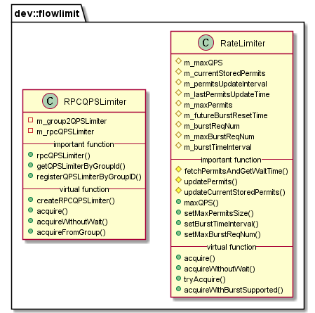

# libflowlimit 模块

作者：TrustChain [微信公众号]

libflowlimit：网络流量控制。

## 主要内容有：

+ 负责节点p2p网络流量控制；



## 涉及知识点：
+ 常见流量控制算法：计数器、漏桶(Leaky Bucket)、令牌桶(Token Bucket)。

1. 基于计数器的流量控制算法：该算法使用计数器统计一段时间内的请求数目，并在计数器超过指定阈值时，拒绝剩余请求，计数器周期性清零。

2. 漏桶算法：请求进入漏桶→漏桶以一定速率出水→漏桶满后，直接拒绝后续请求。

3. 令牌桶算法：向一定容量的令牌桶中加入令牌；如果令牌桶满，则无法添加新令牌；新请求到来时，先尝试获取令牌，若没有拿到令牌，则阻塞或直接返回；若拿到令牌，则取出令牌，系统处理请求；支持动态变更令牌添加速率以实时控制处理速率。


+ 节点和群组两个维度对流量进行控制。

1. 节点级别请求速率限制：限制业务到节点的总请求速率，当请求速率超过指定阈值后，节点会拒绝业务请求，避免节点过载，防止过多的请求导致节点异常；控制节点资源使用量，降低区块链节点之间的资源竞争；
2. 节点级别的流量控制：限制节点的平均出带宽，当节点平均出带宽超过设置阈值后，节点收到区块同步请求后会暂缓发送区块、拒绝收到的AMOP请求，避免区块同步、AMOP消息包发送对节点共识的影响；
3. 群组级别请求速率限制：限制业务到群组的请求速率，当请求速率超过阈值后，群组会拒绝业务请求，该功能可在大数据量突发请求的场景下保护区块链节点，控制群组资源使用量，降低群组间的资源竞争；
4. 群组级别的流量控制：限制每个群组的平均出带宽，当群组平均出带宽流量超过设置阈值后，该群组会暂停区块发送和AMOP请求包转发逻辑，优先将网络流量提供给共识模块使用。

+ RateLimiter.cpp：选择令牌桶算法来实现流量控制功能；
```
//流量控制配置分别位于config.ini和group.i.ini配置文件的[flow_control]
//令牌更新的时间间隔
m_permitsUpdateInterval = (double)1000000 / (double)m_maxQPS;
//当前时间大于上次令牌更新时间是，更新令牌数
void RateLimiter::updatePermits(int64_t const& _now)
{
if (_now <= m_lastPermitsUpdateTime)
{
    return;
}
int64_t increasedPermits = (double)(_now - m_lastPermitsUpdateTime) / m_permitsUpdateInterval;
m_currentStoredPermits = std::min(m_maxPermits, m_currentStoredPermits + increasedPermits);
// update last permits update time
if (m_currentStoredPermits == m_maxPermits)
{
    m_lastPermitsUpdateTime = _now;
}
else
{
    m_lastPermitsUpdateTime += increasedPermits * m_permitsUpdateInterval;
}
}
```
+ RPCQPSLimiter.cpp
```
//每个群组有对应的RateLimiter
std::shared_ptr<std::map<dev::GROUP_ID, RateLimiter::Ptr>> m_group2QPSLimiter;
RateLimiter::Ptr m_rpcQPSLimiter;
```

参考文献：

[1] https://github.com/FISCO-BCOS/FISCO-BCOS/releases/tag/v2.7.2

[2] https://fisco-bcos-documentation.readthedocs.io/zh_CN/latest/

[3] https://mp.weixin.qq.com/s/-tYPsyvpmAIPiLG1gLX2vg