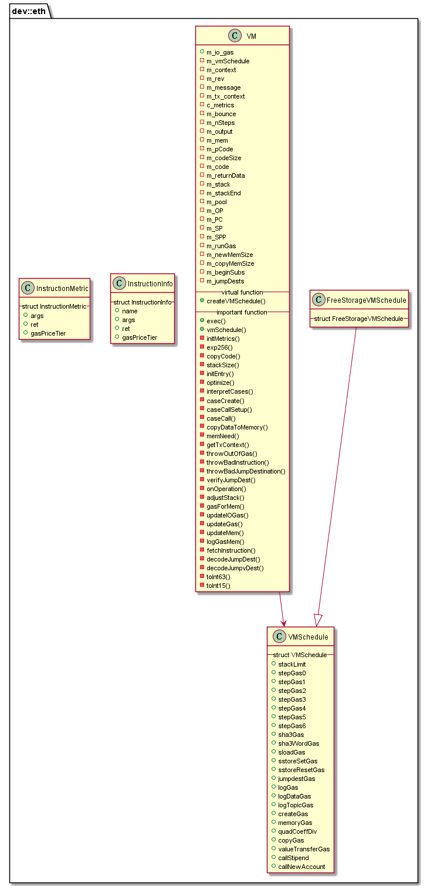

# libinterpreter 模块

作者：TrustChain [微信公众号]

libinterpreter：EVM虚拟机的解释执行版实现。


## 主要内容有：

+ Interpreter（EVM）*

1. Instance接口：节点调用EVM的接口；

2. Callback接口：EVM回调节点的接口；

3. 智能合约/交易被编译成二进制文件，即EVM指令的集合。

+ 其他虚拟机类型：WASM、JIT、JVM。



## 涉及知识点：

+ Instruction.cpp
```
static const std::map<Instruction, InstructionInfo> c_instructionInfo = {
{Instruction::STOP, {"STOP", 0, 0, Tier::Zero}},
...
}

/// Information structure for a particular instruction.
struct InstructionInfo
{
char const* const name;  ///< The name of the instruction.
int const args;  ///< Number of items required on the stack for this instruction (and, for the
                 ///< purposes of ret, the number taken from the stack).
int const ret;   ///< Number of items placed (back) on the stack by this instruction, assuming
                 ///< args items were removed.
Tier const gasPriceTier;  ///< Tier for gas pricing.
};
```
+ VMConfig.h
```
// interpreter configuration macros for development, optimizations and tracing
//
// EVM_OPTIMIZE           - all optimizations off when false (TO DO - MAKE DYNAMIC)
// EVM_SWITCH_DISPATCH    - dispatch via loop and switch
// EVM_JUMP_DISPATCH      - dispatch via a jump table - available only on GCC
// EVM_USE_CONSTANT_POOL  - constants unpacked and ready to assign to stack
// EVM_REPLACE_CONST_JUMP - pre-verified jumps to save runtime lookup
// EVM_TRACE              - provides various levels of tracing

```

+ VMCalls.cpp
```
int64_t VM::verifyJumpDest(u256 const& _dest, bool _throw)
{
    // check for overflow
    if (_dest <= 0x7FFFFFFFFFFFFFFF)
    {
        // check for within bounds and to a jump destination
        // use binary search of array because hashtable collisions are exploitable
        uint64_t pc = uint64_t(_dest);
        if (std::binary_search(m_jumpDests.begin(), m_jumpDests.end(), pc))
            return pc;
    }
    if (_throw)
        throwBadJumpDestination();
    return -1;
}

```

+ VM.cpp
```
/**
VMSchedule::Ptr m_vmSchedule = nullptr;
evmc_context* m_context = nullptr;
evmc_revision m_rev = EVMC_FRONTIER;
evmc_message const* m_message = nullptr;
boost::optional<evmc_tx_context> m_tx_context;

// interpreter state
Instruction m_OP;         // current operation
uint64_t m_PC = 0;        // program counter
u256* m_SP = m_stackEnd;  // stack pointer
u256* m_SPP = m_SP;       // stack pointer prime (next SP)

typedef void (VM::*MemFnPtr)();
MemFnPtr m_bounce = nullptr;

// space for code
bytes m_code;

*/

evmc_result execute(evmc_instance* _instance, evmc_context* _context, evmc_revision _rev,
    const evmc_message* _msg, uint8_t const* _code, size_t _codeSize) noexcept
{
    (void)_instance;
    std::unique_ptr<dev::eth::VM> vm{new dev::eth::VM};
    // create vm schedule according to evmc_context
    vm->createVMSchedule(_context);
    evmc_result result = {};
    dev::owning_bytes_ref output;

    try
    {
        output = vm->exec(_context, _rev, _msg, _code, _codeSize);
        result.status_code = EVMC_SUCCESS;
        result.gas_left = vm->m_io_gas;
    }
    catch (dev::eth::RevertInstruction& ex)
    {
    }
}

// interpreter entry point
owning_bytes_ref VM::exec(evmc_context* _context, evmc_revision _rev, const evmc_message* _msg,
    uint8_t const* _code, size_t _codeSize)
{
    m_context = _context;
    m_rev = _rev;
    m_message = _msg;
    m_io_gas = uint64_t(_msg->gas);
    m_PC = 0;
    m_pCode = _code;
    m_codeSize = _codeSize;

    // trampoline to minimize depth of call stack when calling out
    m_bounce = &VM::initEntry;
    //m_bounce函数指针
    do
        (this->*m_bounce)();
    while (m_bounce);

    return std::move(m_output);
}


//取到指令并调整栈空间
void VM::fetchInstruction()
{
    m_OP = Instruction(m_code[m_PC]);
    auto const metric = c_metrics[static_cast<size_t>(m_OP)];
    adjustStack(metric.num_stack_arguments, metric.num_stack_returned_items);

    // FEES...
    m_runGas = metric.gas_cost;
    m_newMemSize = m_mem.size();
    m_copyMemSize = 0;
}
```

```
// main interpreter loop and switch
//实现各种指令集的实现逻辑
void VM::interpretCases()
{
    INIT_CASES
    DO_CASES
    {
       CASE(CREATE2)
        {
            ON_OP();
            if (m_rev < EVMC_CONSTANTINOPLE)
                throwBadInstruction();
            if (m_message->flags & EVMC_STATIC)
                throwDisallowedStateChange();
            m_bounce = &VM::caseCreate;
        }
        BREAK

        CASE(CREATE)
        {
            ON_OP();
            if (m_message->flags & EVMC_STATIC)
                throwDisallowedStateChange();

            m_bounce = &VM::caseCreate;
        }
        BREAK

        CASE(DELEGATECALL)
        CASE(STATICCALL)
        CASE(CALL)
        CASE(CALLCODE)
        {
            ON_OP();
            if (m_OP == Instruction::DELEGATECALL && m_rev < EVMC_HOMESTEAD)
                throwBadInstruction();
            if (m_OP == Instruction::STATICCALL && m_rev < EVMC_BYZANTIUM)
                throwBadInstruction();
            if (m_OP == Instruction::CALL && m_message->flags & EVMC_STATIC && m_SP[2] != 0)
                throwDisallowedStateChange();
            m_bounce = &VM::caseCall;
        }
        BREAK
//还有各种指令集的实现逻辑
    }
    WHILE_CASES
}
```

参考文献：

[1] https://github.com/FISCO-BCOS/FISCO-BCOS/releases/tag/v2.7.2

[2] https://fisco-bcos-documentation.readthedocs.io/zh_CN/latest/

