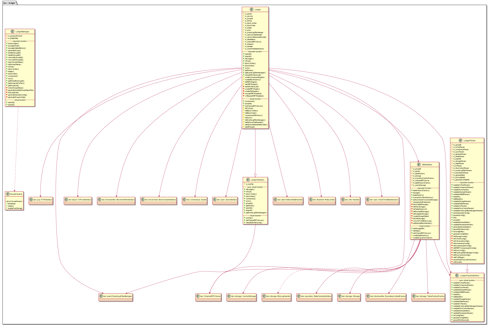

#  libledger 模块
作者：TrustChain [微信公众号]

libledger：账本管理。

## 主要内容有：

+ 负责区块链账本管理



## 涉及知识点：

+ DBInitializer.cpp：

1. 账本存储引擎：External（2.3.0版本以下支持）、LevelDB、MySQL、RocksDB、Scalable。

2. 落盘加密：
```
g_BCOSConfig.diskEncryption.cipherDataKey, 
g_BCOSConfig.diskEncryption.dataKey 
```
3. initLevelDBStorage：
```
std::shared_ptr<LevelDBStorage> leveldbStorage = std::make_shared<LevelDBStorage>();
std::shared_ptr<dev::db::BasicLevelDB> leveldb_handler =
            std::shared_ptr<dev::db::BasicLevelDB>(pleveldb);
leveldbStorage->setDB(leveldb_handler);
m_storage = leveldbStorage;
auto tableFactoryFactory = std::make_shared<dev::storage::MemoryTableFactoryFactory>();
        tableFactoryFactory->setStorage(m_storage);
m_tableFactoryFactory = tableFactoryFactory;
```
4. recoverFromBinaryLog函数：从区块链的binlog日志恢复区块数据；
```
//单个区块存储数据结构
std::vector<TableData::Ptr>& blockData
//恢复区块数据
 _storage->commit(num + i, blockData);
```

5. initTableFactory2函数：binaryLogStorage将区块进行binlog存储。
```
binaryLogStorage->setBinaryLogger(binaryLogger);
m_storage = binaryLogStorage;
```
6. initSQLStorage函数：用于External模式，通过RPCChannel通信和topic进行SQL查询；

7. initRocksDBStorage函数：用于RocksDB模式；

8. initScalableStorage函数：用于Scalable模式，包含RocksDB（stateStorage）、SQLStorage；

9. initZdbStorage函数：用于MySQL模式；

+ Ledger.cpp：

1. initLedger函数：初始化账本
```

bool Ledger::initLedger(std::shared_ptr<LedgerParamInterface> _ledgerParams)
{
    BOOST_LOG_SCOPED_THREAD_ATTR(
        "GroupId", boost::log::attributes::constant<std::string>(std::to_string(m_groupId)));
    if (!_ledgerParams)
    {
        return false;
    }
    m_param = _ledgerParams;
    /// init dbInitializer
    Ledger_LOG(INFO) << LOG_BADGE("initLedger") << LOG_BADGE("DBInitializer");
    m_dbInitializer = std::make_shared<dev::ledger::DBInitializer>(m_param, m_groupId);
    m_dbInitializer->setChannelRPCServer(m_channelRPCServer);

    setSDKAllowList(m_param->mutablePermissionParam().sdkAllowList);

    // m_dbInitializer
    if (!m_dbInitializer)
        return false;
    m_dbInitializer->initStorageDB();
    /// init the DB
    bool ret = initBlockChain();
    if (!ret)
        return false;
    dev::h256 genesisHash = m_blockChain->getBlockByNumber(0)->headerHash();
    m_dbInitializer->initState(genesisHash);
    if (!m_dbInitializer->stateFactory())
    {
        Ledger_LOG(ERROR) << LOG_BADGE("initLedger")
                          << LOG_DESC("initBlockChain Failed for init stateFactory failed");
        return false;
    }
    std::shared_ptr<BlockChainImp> blockChain =
        std::dynamic_pointer_cast<BlockChainImp>(m_blockChain);
    blockChain->setStateFactory(m_dbInitializer->stateFactory());
    // setSyncNum for cachedStorage
    m_dbInitializer->setSyncNumForCachedStorage(m_blockChain->number());

    // the network statistic has been enabled
    if (g_BCOSConfig.enableStat())
    {
        // init network statistic handler
        initNetworkStatHandler();
    }

    auto channelRPCServer = std::weak_ptr<dev::ChannelRPCServer>(m_channelRPCServer);
    m_handler = blockChain->onReady([this, channelRPCServer](int64_t number) {
        LOG(INFO) << "Push block notify: " << std::to_string(m_groupId) << "-" << number;
        auto channelRpcServer = channelRPCServer.lock();
        if (channelRpcServer)
        {
            channelRpcServer->blockNotify(m_groupId, number);
        }
    });

    initNetworkBandWidthLimiter();
    initQPSLimit();
    /// init blockVerifier, txPool, sync and consensus
    return (initBlockVerifier() && initTxPool() && initSync() && consensusInitFactory() &&
            initEventLogFilterManager());
}
```

+ LedgerManager.cpp
1. 根据groupid管理账本状态等，ledgerMap存储每个groupid的账本，会根据groupid把账本状态持久化到文件中。
```
// map used to store the mappings between groupId and created ledger objects
std::map<dev::GROUP_ID, std::shared_ptr<LedgerInterface>> m_ledgerMap;
```

+ LedgerParam.cpp
```
void LedgerParam::init(const std::string& _configFilePath, const std::string& _dataPath)
{
    /// The file group.X.genesis is required, otherwise the program terminates.
    /// load genesis config of group

    parseGenesisConfig(_configFilePath);
    // The file group.X.ini is available by default.
    std::string iniConfigFileName = _configFilePath;
    boost::replace_last(iniConfigFileName, "genesis", "ini");

    parseIniConfig(iniConfigFileName, _dataPath);
}
```

参考文献：

[1] https://github.com/FISCO-BCOS/FISCO-BCOS/releases/tag/v2.7.2

[2] https://fisco-bcos-documentation.readthedocs.io/zh_CN/latest/