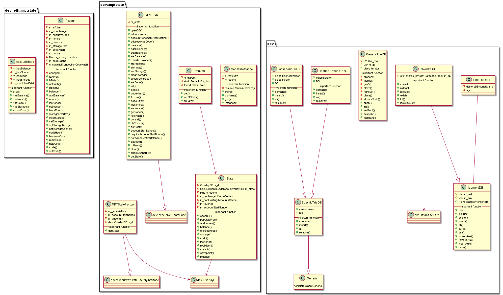

#  libmptstate 模块
作者：TrustChain [微信公众号]

libmptstate：当使用MPTState时，存储区块链的状态数据。

## 主要内容有：

+ 账户数据存储方式：MPT树，与以太坊一致，MPT(Merkle Patricia Trie)，是一种用hash索引数据的前缀树；

+ 分支结点（branch node）：包含16个分支，以及1个value；

+ 扩展结点（extension node）：只有1个子结点；[key，value]的一个键值对，但是这里的value是其他节点的hash值.

+ 叶子结点（leaf node）：没有子结点，包含一个value。




## 涉及知识点：

+ Account构造函数
```
 Account(u256 _nonce, u256 _balance, h256 _contractRoot, h256 _codeHash, Changedness _c)
      : m_isAlive(true),
        m_isUnchanged(_c == Unchanged),
        m_nonce(_nonce),
        m_balance(_balance),
        m_storageRoot(_contractRoot),
        m_codeHash(_codeHash)
    {
        assert(_contractRoot);
    }
```

+ MemoryDB.cpp：m_main和m_aux的内存查询等操作；
```

std::unordered_map<h256, std::pair<std::string, unsigned>> m_main;
std::unordered_map<h256, std::pair<bytes, bool>> m_aux;
```

+ OverlayDB.cpp：继承MemoryDB.cpp，并通过commit函数持久化到DB的接口m_db;
```

std::shared_ptr<db::DatabaseFace> m_db;
```
+ State.cpp：
```
OverlayDB m_db;
SecureTrieDB<Address, OverlayDB> m_state;  
mutable std::unordered_map<Address, Account> m_cache;
```

+ TrieDB.h：MPT数据结构
```

h256 m_root;
DB* m_db = nullptr; 
void forceInsertNode(h256 const& _h, bytesConstRef _v) { 
    m_db->insert(_h, _v); 
    }
```

参考文献：

[1] https://github.com/FISCO-BCOS/FISCO-BCOS/releases/tag/v2.7.2

[2] https://fisco-bcos-documentation.readthedocs.io/zh_CN/latest/