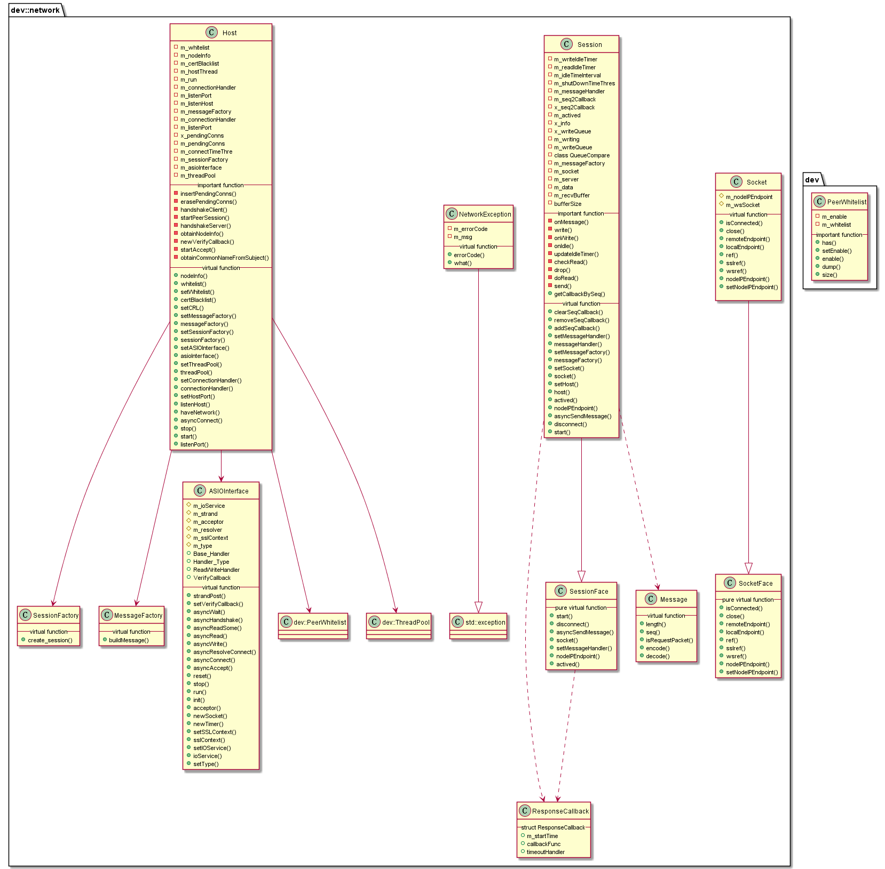

#  libnetwork 模块
作者：TrustChain [微信公众号]

libnetwork：网络框架，实现节点互联和消息收发逻辑，核心逻辑在Host。

## 主要内容有：

+ 节点网络互联;

+ 节点使用 SSL连接 ，保障了通信数据的机密性；

+ 引入CA黑名单机制，可及时与作恶节点断开网络连接；

+ 每个节点启用Host，包含server、client两部分分别与其他节点进行收发消息。



## 涉及知识点：
+ Socket.h
```
class Socket : public SocketFace, public std::enable_shared_from_this<Socket>
{
std::shared_ptr<boost::beast::websocket::stream<ba::ssl::stream<bi::tcp::socket>>> m_wsSocket;
m_wsSocket =            std::make_shared<boost::beast::websocket::stream<ba::ssl::stream<bi::tcp::socket>>>( _ioService, _sslContext);

//三层嵌套关系--TCP_ONLY类型
virtual bi::tcp::socket& ref() override { return m_wsSocket->next_layer().next_layer(); }

//三层嵌套关系--SSL类型
virtual ba::ssl::stream<bi::tcp::socket>& sslref() override { return m_wsSocket->next_layer(); }

//三层嵌套关系--WEBSOCKET类型：单次握手，全双工通信，二进制帧
virtual boost::beast::websocket::stream<ba::ssl::stream<bi::tcp::socket>>& wsref() override
{
  return *m_wsSocket;
}

}
```

+ Session.cpp
```
/**
Session 发送消息涉及写操作
*/
///< A call B, the function to call after the response is received by A.
mutable RecursiveMutex x_seq2Callback;
std::shared_ptr<std::unordered_map<uint32_t, ResponseCallback::Ptr>> m_seq2Callback;

//写对列
boost::heap::priority_queue<std::pair<std::shared_ptr<bytes>, u256>, boost::heap::compare<QueueCompare>,
boost::heap::stable<true>> m_writeQueue;

//A发送消息给B，A收到B的回应消息后，根据seq回调handler
void Session::asyncSendMessage(Message::Ptr message, Options options, CallbackFunc callback)
{
auto handler = std::make_shared<ResponseCallback>();
handler->callbackFunc = callback;
addSeqCallback(message->seq(), handler);
message->encode(*p_buffer);
send(p_buffer);
}

void Session::send(std::shared_ptr<bytes> _msg)
{
//发送消息是，先把msg放入写对列
m_writeQueue.push(make_pair(_msg, u256(utcTime())));
write();
}

void Session::write()
{
std::pair<std::shared_ptr<bytes>, u256> task;
task = m_writeQueue.top();
m_writeQueue.pop();
enter_time = task.second;
auto buffer = task.first;
auto session = shared_from_this();
// asio::buffer referecne buffer, so buffer need alive before asio::buffer be used
//调用asyncWrite涉及到Session::onWrite单轮写操作函数
server->asioInterface()->asyncWrite(m_socket, boost::asio::buffer(*buffer),boost::bind(&Session::onWrite, session, boost::asio::placeholders::error,                     boost::asio::placeholders::bytes_transferred, buffer));
}

void Session::onWrite(boost::system::error_code ec, std::size_t, std::shared_ptr<bytes>)
{
//判断状态后，再次调用write函数
write();
}
//===============================================//
/**
Session 接收消息涉及读操作
*/
void Session::doRead()
{
auto self = std::weak_ptr<Session>(shared_from_this());
auto asyncRead = [self](boost::system::error_code ec, std::size_t bytesTransferred) {
 s->m_data.insert(s->m_data.end(), s->m_recvBuffer.begin(),
    s->m_recvBuffer.begin() + bytesTransferred);
    while (true)
    {
    Message::Ptr message = s->m_messageFactory->buildMessage();
    ssize_t result = message->decode(s->m_data.data(), s->m_data.size());
        if (result > 0){
        /// SESSION_LOG(TRACE) << "Decode success: " << result;
        NetworkException e(P2PExceptionType::Success, "Success");
        //调用onMessage函数进行处理
        s->onMessage(e, message);
        s->m_data.erase(s->m_data.begin(), s->m_data.begin() + result);
        }
    }
}

}
/// call by doRead() to deal with mesage
void Session::onMessage(NetworkException const& e, Message::Ptr message)
{
ResponseCallback::Ptr callbackPtr = getCallbackBySeq(message->seq());
//消息非请求packet且回调函数非空
server->threadPool()->enqueue([e, callback, self, message]() {
callback(e, message);
s->removeSeqCallback(message->seq());
}
//其余情况调用默认
 server->threadPool()->enqueue([session, handler, e, message]() { handler(e, session, message); });
}
```

+ PeerWhitelist.cpp：存放节点ID白名单;
```
std::set<NodeID> m_whitelist;
```

+ Common.cpp
```
struct ec_key_st{
 EC_GROUP *group;
 EC_POINT *pub_key;
 BIGNUM *priv_key;
}/*EC_KEY*/

struct ecp_pkey_st{
int type;
int save_type;
int reference;
const EVP_PKEY_ASN1_METHOD *ameth;
ENGINE *engine;
union{
char *ptr;
#ifndef OPENSSL_NO_EC
    struct ec_key_st *ec;
#endif
}
}
//
/*
要序列化公钥:
将EVP_PKEY传递给EVP_PKEY_get1_EC_KEY()以获取EC_KEY.
将EC_KEY传递给EC_KEY_get0_public_key()以获取EC_POINT.
将EC_POINT传递给EC_POINT_point2oct()以获取八位字节,这只是无符号的char*.
*/
/*要反序列化公钥:
将八位字节传递给EC_POINT_oct2point()以获取EC_POINT.
将EC_POINT传递给EC_KEY_set_public_key()以获取EC_KEY.
将EC_KEY传递给EVP_PKEY_set1_EC_KEY以获取EVP_KEY.
*/
/*要序列化私钥:
将EVP_PKEY传递给EVP_PKEY_get1_EC_KEY()以获取EC_KEY.
将EC_KEY传递给EC_KEY_get0_private_key()以获取BIGNUM.
将BIGNUM传递给BN_bn2mpi()以获取mpi,这是一种写入unsigned char*的格式.
*/
/*要反序列化私钥:
将mpi传递给BN_mpi2bn()以获得BIGNUM.
将BIGNUM传递给EC_KEY_set_private_key()以获取EC_KEY.
将EC_KEY传递给EVP_PKEY_set1_EC_KEY以获取EVP_KEY.
*/
//从X509证书得到公钥
bool dev::network::getPublicKeyFromCert(std::shared_ptr<std::string> _nodeIDOut, X509* cert)
{
EVP_PKEY* evpPublicKey = X509_get_pubkey(cert);
ec_key_st* ecPublicKey = EVP_PKEY_get1_EC_KEY(evpPublicKey);
const EC_POINT* ecPoint = EC_KEY_get0_public_key(ecPublicKey);
std::shared_ptr<char> hex =     std::shared_ptr<char>(EC_POINT_point2hex(EC_KEY_get0_group(ecPublicKey), ecPoint,                          EC_KEY_get_conv_form(ecPublicKey), NULL),[](char* p) { OPENSSL_free(p); });
}
```

+ ASIOInterface.cpp
```
void ASIOInterface::asyncResolveConnect(std::shared_ptr<SocketFace> socket, Handler_Type handler)
{
m_resolver->async_resolve(protocol, socket->nodeIPEndpoint().address(),
        to_string(socket->nodeIPEndpoint().port()),
        [=](const boost::system::error_code& ec, bi::tcp::resolver::results_type results) {

}
}

 virtual void init(std::string listenHost, uint16_t listenPort)
    {
        m_strand = std::make_shared<boost::asio::io_service::strand>(*m_ioService);

//客户端
m_resolver =std::make_shared<bi::tcp::resolver>(*m_ioService);

//服务端 
m_acceptor = std::make_shared<bi::tcp::acceptor>(
*m_ioService, bi::tcp::endpoint(bi::make_address(listenHost), listenPort));
boost::asio::socket_base::reuse_address optionReuseAddress(true);
m_acceptor->set_option(optionReuseAddress);
```

+ Host.cpp:传输层-TCP协议-建立Socket、会话层-SSL Record Protocal【提供数据封装、压缩、加密】--建立Session、会话层--SSL HandShake Protocal--【身份认证、协商加密算法、交换加密密钥】。

```
//=============服务端的功能==============
void Host::startAccept(boost::system::error_code boost_error)
{
/**
//服务端异步监听，入参是socket和回调函数handler
//回调函数主要包含以下三个操作:
//1.验证节点证书是否过期等
m_asioInterface->setVerifyCallback(socket, newVerifyCallback(endpointPublicKey));
//2.ssl握手，并调用handshakeServer函数
m_asioInterface->asyncHandshake(socket, ba::ssl::stream_base::server,boost::bind(&Host::handshakeServer, shared_from_this(), ba::placeholders::error, endpointPublicKey, socket));

//循环调用startAccept进行监听
startAccept();
*/

m_asioInterface->asyncAccept()；
}

void Host::handshakeServer(const boost::system::error_code& error,
    std::shared_ptr<std::string>& endpointPublicKey, std::shared_ptr<SocketFace> socket)
{
//调用startPeerSession函数
startPeerSession(info, socket, m_connectionHandler);
}

void Host::start()
{
m_asioInterface->init(m_listenHost, m_listenPort);
m_hostThread = std::make_shared<std::thread>([&] {
//启动一个线程，循环监听消息
if (asioInterface()->acceptor())
{
    startAccept();
}
asioInterface()->run();
}
}
```

```

//客户端实现功能--》连接服务端
void Host::asyncConnect(NodeIPEndpoint const& _nodeIPEndpoint,
    std::function<void(NetworkException, NodeInfo const&, std::shared_ptr<SessionFace>)> callback)
{
std::shared_ptr<SocketFace> socket = m_asioInterface->newSocket(_nodeIPEndpoint);
/// if async connect timeout, close the socket directly
    auto connect_timer = std::make_shared<boost::asio::deadline_timer>(
        *(m_asioInterface->ioService()), boost::posix_time::milliseconds(m_connectTimeThre));
connect_timer->async_wait([=](const boost::system::error_code& error) {
//超时等情况关闭socket
}
/// callback async connect
 m_asioInterface->asyncResolveConnect(socket, [=](boost::system::error_code const& ec) {

insertPendingConns(_nodeIPEndpoint);

/// get the public key of the server during handshake
std::shared_ptr<std::string> endpointPublicKey = std::make_shared<std::string>();

m_asioInterface->setVerifyCallback(socket, newVerifyCallback(endpointPublicKey));

/// call handshakeClient after handshake succeed
//调用Host::handshakeClient函数
m_asioInterface->asyncHandshake(socket, ba::ssl::stream_base::client,
    boost::bind(&Host::handshakeClient, shared_from_this(), ba::placeholders::error,socket, endpointPublicKey, callback, _nodeIPEndpoint, connect_timer));

}
}
void Host::handshakeClient(const boost::system::error_code& error,
    std::shared_ptr<SocketFace> socket, std::shared_ptr<std::string>& endpointPublicKey,
    std::function<void(NetworkException, NodeInfo const&, std::shared_ptr<SessionFace>)> callback,
    NodeIPEndpoint _nodeIPEndpoint, std::shared_ptr<boost::asio::deadline_timer> timerPtr)
{
//调用startPeerSession函数
startPeerSession(info, socket, callback);
}
```

```
//公共调用函数startPeerSession（）
/**
 * @brief: start peer sessions after handshake succeed(called by RLPxHandshake),
 *         mainly include four functions:
 *         1. disconnect connecting host with invalid capability
 *         2. modify m_peers && disconnect already-connected session
 *         3. modify m_sessions and m_staticNodes
 *         4. start new session (session->start())
 * @param _pub: node id of the connecting client
 * @param _rlp: informations obtained from the client-peer during handshake
 *              now include protocolVersion, clientVersion, caps and listenPort
 * @param _s : connected socket(used to init session object)
 */
// TODO: asyncConnect pass handle to startPeerSession, make use of it
void Host::startPeerSession(NodeInfo const& nodeInfo, std::shared_ptr<SocketFace> const& socket,
    std::function<void(NetworkException, NodeInfo const&, std::shared_ptr<SessionFace>)>)
{
    auto weakHost = std::weak_ptr<Host>(shared_from_this());
    std::shared_ptr<SessionFace> ps =
        m_sessionFactory->create_session(weakHost, socket, m_messageFactory);

    auto connectionHandler = m_connectionHandler;
//启用线程池处理回调函数
    m_threadPool->enqueue([ps, connectionHandler, nodeInfo]() {
        if (connectionHandler)
        {
            connectionHandler(NetworkException(0, ""), nodeInfo, ps);
        }
        else
        {
            HOST_LOG(WARNING) << LOG_DESC("No connectionHandler, new connection may lost");
        }
    });
    HOST_LOG(INFO) << LOG_DESC("startPeerSession, Remote=") << socket->remoteEndpoint()
                   << LOG_KV("local endpoint", socket->localEndpoint())
                   << LOG_KV("nodeID", nodeInfo.nodeID.abridged());
}
```
参考文献：

[1] https://github.com/FISCO-BCOS/FISCO-BCOS/releases/tag/v2.7.2

[2] https://fisco-bcos-documentation.readthedocs.io/zh_CN/latest/
