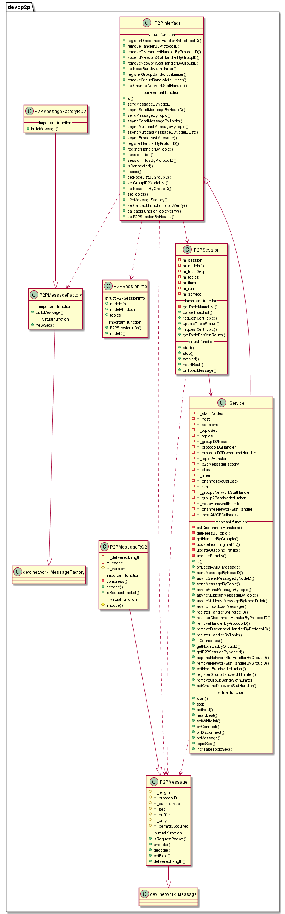

#  libp2p 模块
作者：TrustChain [微信公众号]

libp2p：p2p消息发送与处理的实现，P2P端口用于区块链节点之间的互联。


## 主要内容有：

+ 区块链节点共识、管理网络连接、消息收发（单播、组播、广播）、状态同步；

+ node.key 节点密钥，ECC格式；node.crt 节点证书，由CA颁发；ca.crt CA证书，CA机构提供；

+ P2PMessage/P2PMessageRC2格式：节点与节点间通信的数据包为P2PMessage格式。根据ProtocolID分类，现在有六种：AMOP【AMOPMessage】、Topic【TopicMessage】、PBFT、BlockSync、TxPool、Raft。

+ AMOPMessage类型：支持SDK和节点之间、节点和节点之间的消息传递；主要实现Service::onLocalAMOPMessage函数；

+ TopicMessage类型：该消息主要用于节点更新全局<nodeid,topicsList>；主要实现P2PSession::onTopicMessage函数；



## 涉及知识点：
+ P2PMessage.cpp
```
//AMOPMessage消息包类型枚举
enum AMOPPacketType
{
    SendTopicSeq = 1,
    RequestTopics = 2,
    SendTopics = 3,
};
/** P2PMessage Header域 共12字节
/// m_length: 4bytes
/// pid + gid: 2bytes
/// packetType: 2bytes
/// seq: 4 bytes
*/
/** 额外补充，因为在encode函数和decod函数有用到
if (1 != htonl(1)) 
{     //小端模式，作相应处理 }
 else 
 {     //大端模式，作相应处理 }
//大端是把字符串的尾端数据存在内存高地址处；
//小端是把字符串的尾端数据存在内存的低地址处
uint32_t htonl(uint32_t hostlong);//32位的主机字节序转换到网络字节序 
uint16_t htons(uint16_t hostshort);//16位的主机字节序转换到网络字节序 
uint32_t ntohl(uint32_t netlong);//32位的网络字节序转换到主机字节序 uint16_t ntohs(uint16_t netshort);//16位的网络字节序转换到主机字节序
*/
void P2PMessage::encode(bytes& buffer)
{}
ssize_t P2PMessage::decode(const byte* buffer, size_t size)
{}
```
+ P2PMessageRC2.cpp
```
/// m_length(4bytes) + m_version(2bytes) + m_protocolID(2bytes) + m_groupID(2bytes) +
/// m_packetType(2bytes) + m_seq(4bytes)
// P2PMessage Header域 共16字节
const static size_t HEADER_LENGTH = 16;
const static size_t MAX_LENGTH = 1024 * 1024;  ///< The maximum length of data is 1M.
//P2PMessageRC2消息格式有调用SnappyCompress::compress压缩功能，可根据全局配置进行开启
//encode:先压缩在encode;decode:先decode再uncompress
```

+ P2PMessageFactory.h

```
dev::network::Message::Ptr buildMessage() override
{
    auto message = std::make_shared<P2PMessage>();
    return message;
}
```

+ P2PSession.cpp
```
//重要数据结构
dev::network::SessionFace::Ptr m_session;
//维护本nodeId的topics
std::shared_ptr<std::set<dev::TopicItem>> m_topics;
//三种topic类型的前缀
const std::string topicNeedVerifyPrefix = "#!$TopicNeedVerify_";
const std::string verifyChannelPrefix = "#!$VerifyChannel_";
const std::string pushChannelPrefix = "#!$PushChannel_";


//心跳消息发送的是AMOPPacketType::SendTopicSeq类型
void P2PSession::heartBeat()
{
//心跳消息会自带seq号，如果对端节点收到的seq与本节点的seq不一致，则会发送AMOPPacketType::RequestTopics进行同步，这样能保证全局映射关系
auto message =std::dynamic_pointer_cast<P2PMessage>(service->p2pMessageFactory()->buildMessage());
message->setProtocolID(dev::eth::ProtocolID::Topic);
message->setPacketType(AMOPPacketType::SendTopicSeq);
std::shared_ptr<bytes> buffer = std::make_shared<bytes>();
std::string s = boost::lexical_cast<std::string>(service->topicSeq());
buffer->assign(s.begin(), s.end());
message->setBuffer(buffer);
m_session->asyncSendMessage(message);

}
void P2PSession::onTopicMessage(P2PMessage::Ptr message)
{
//处理SendTopicSeq消息类型，发送AMOPPacketType::RequestTopics
std::string s((const char*)message->buffer()->data(), message->buffer()->size());
auto topicSeq = boost::lexical_cast<uint32_t>(s);
//m_topicSeq 为本地seq
if (m_topicSeq != topicSeq)
{

auto requestTopics = std::dynamic_pointer_cast<P2PMessage>(
service->p2pMessageFactory()->buildMessage());
requestTopics->setPacketType(AMOPPacketType::RequestTopics);
std::shared_ptr<bytes> buffer = std::make_shared<bytes>();
requestTopics->setBuffer(buffer);
requestTopics->setSeq(service->p2pMessageFactory()->newSeq());
auto self = std::weak_ptr<P2PSession>(shared_from_this());
dev::network::Options option;
option.timeout = 5 * 1000;  // 5 seconds timeout
m_session->asyncSendMessage(requestTopics, option,
[self](NetworkException e, dev::network::Message::Ptr response) {
//处理response
auto p2pResponse = std::dynamic_pointer_cast<P2PMessage>(response);
uint32_t topicSeq = 0;
auto topicList = std::make_shared<std::set<dev::TopicItem>>();
//该节点原列表orignTopicList
auto orignTopicList = session->topics();
//从新的topics（vector）、原orignTopicList解析出topicList（set）、topicSeq
session->parseTopicList(
topics, orignTopicList, topicList, topicSeq);
//更新新的topicSeq和topicList
session->setTopics(topicSeq, topicList);
session->requestCertTopic(*topicList, topics);

}
}

//处理RequestTopics类型，返回AMOPPacketType::SendTopics
auto responseTopics = std::dynamic_pointer_cast<P2PMessage>(
service->p2pMessageFactory()->buildMessage());
responseTopics>setProtocolID(((PROTOCOL_ID)dev::eth::ProtocolID::Topic));
responseTopics->setPacketType(AMOPPacketType::SendTopics);
std::shared_ptr<bytes> buffer = std::make_shared<bytes>();
std::string s = boost::lexical_cast<std::string>(service->topicSeq());
for (auto& it : service->topics())
{
    s.append("\t");
    s.append(it);
}
buffer->assign(s.begin(), s.end());
responseTopics->setBuffer(buffer);
responseTopics->setSeq(message->seq());
m_session->asyncSendMessage(
    responseTopics, dev::network::Options(), CallbackFunc());
}
```

+ Service.cpp

```

//P2PMessage的协议ID
enum ProtocolID
{
    AMOP = 1,
    Topic = 2,
    PBFT = 8,
    BlockSync = 9,
    TxPool = 10,
    Raft = 11
};

message->isRequestPacket()//返回包为负数

void Service::onConnect(dev::network::NetworkException e, dev::network::NodeInfo const& nodeInfo,
    std::shared_ptr<dev::network::SessionFace> session)
{
//调用Service::onMessage
p2pSession->session()->setMessageHandler(std::bind(&Service::onMessage, shared_from_this(),std::placeholders::_1, std::placeholders::_2, std::placeholders::_3,p2pSessionWeakPtr));
p2pSession->start();

}
//主要是这个函数根据ProtocolID进行处理
void Service::onMessage(dev::network::NetworkException e, dev::network::SessionFace::Ptr session,
    dev::network::Message::Ptr message, std::weak_ptr<P2PSession> p2pSessionWeakPtr)
{
}

//dev::eth::ProtocolID::Topic 对应 [AMOP topic message]
p2pSession->onTopicMessage(p2pMessage);

//dev::eth::ProtocolID::AMOP 对应
 m_channelNetworkStatHandler->updateAMOPInTraffic(p2pMessage->length());
m_channelNetworkStatHandler->updateAMOPOutTraffic(message->length());
void Service::onLocalAMOPMessage(
    P2PMessage::Ptr message, CallbackFuncWithSession callback, dev::network::Options options)
{
}

//其余四种类型PBFT、BlockSync、TxPool、Raft调用各自的回调函数
updateIncomingTraffic(p2pMessage);
updateOutgoingTraffic(message);
//注册回调函数
void Service::registerHandlerByProtoclID(PROTOCOL_ID protocolID, CallbackFuncWithSession handler)
{
}  
//不同topic有不同的回调函数
void Service::registerHandlerByTopic(std::string topic, CallbackFuncWithSession handler)
{
}
//单播发给单个NodeId
//多播发给nodeIDsToSend里的NodeId
//广播发给session记录的NodeID
```

参考文献：

[1] https://github.com/FISCO-BCOS/FISCO-BCOS/releases/tag/v2.7.2

[2] https://fisco-bcos-documentation.readthedocs.io/zh_CN/latest/

