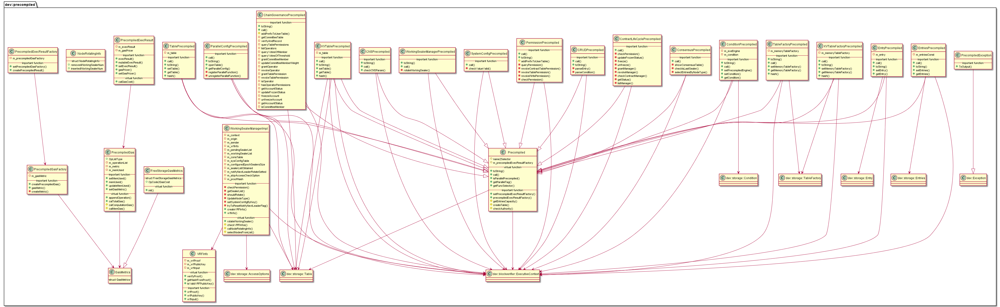
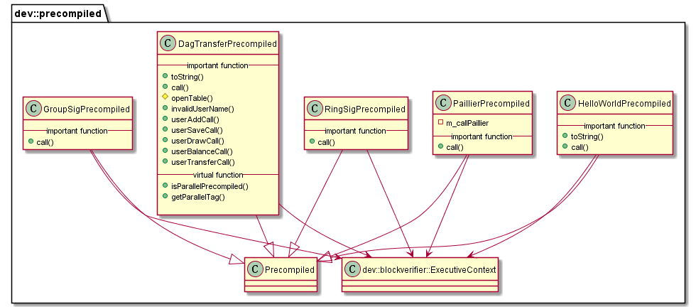

# libprecompiled 模块

作者：TrustChain [微信公众号]

libprecompiled：预编译合约。


## 主要内容有：

+ 执行预编译合约时首先需要根据合约地址获取到预编译合约的对象；

+ 每个预编译合约对象都会实现call接口，预编译合约的具体逻辑在该接口中实现；

+ call根据交易的abi编码，获取到Function Selector和参数，然后执行对应的逻辑；

+ PrecompiledGas计算方式

+ Precompiled合约Gas衡量标准参考了EVM，主要包括CPU、内存和存储三个维度；

+ 计算方式：运行时指令集合+运行时消耗的内存消耗的gas；

+ Free Storage的Gas衡量模式，提升CPU和内存在交易Gas消耗中的占比；

+ 在PrecopmiledGas的GasMetrics基础上引入了FreeStorageGasMetrics，并根据genesis文件的enable_free_storage配置项决定启用哪种Gas衡量模式。






## 涉及知识点：
+ libprecompiled-extension
```
/**
基于角色的权限控制：ChainGovernance预编译合约角色分类。
1) 联盟链委员会：由链管理员组成，新增链管理员需投票；
2) 链管理员(治理层权限)：节点管理、参数配置、运维账号设置、数据管理；
3) 运维人员（运维层权限）：部署合约、业务账号管理；
4) 业务用户（业务层权限）：写入数据、调用接口；
5) 监管（监管层权限）：读取数据、审计操作。
*/
PrecompiledExecResult::Ptr ChainGovernancePrecompiled::call(
    ExecutiveContext::Ptr _context, bytesConstRef _param, Address const& _origin, Address const&)
{
    // parse function name
    uint32_t func = getParamFunc(_param);
    bytesConstRef data = getParamData(_param);
    dev::eth::ContractABI abi;
    bytes out;
    auto callResult = m_precompiledExecResultFactory->createPrecompiledResult();
    int result = 0;
    if (func == name2Selector[CGP_METHOD_GRANT_CM])
    {  // grantCommitteeMember(address user) public returns (int256);
        Address user;
        abi.abiOut(data, user);
        /** 函数grantCommitteeMember()
        //grantTablePermission（）操作SYS_ACCESS_TABLE、SYS_CONFIG、SYS_CONSENSUS表
        //grantCommitteeMember()-->getCommitteeTable()操作CGP_COMMITTEE_TABLE
        //verifyAndRecord(Operation::GrantCommitteeMember)
        */
        result = grantCommitteeMember(_context, user.hexPrefixed(), _origin);
        getErrorCodeOut(callResult->mutableExecResult(), result);
    }
    else if (func == name2Selector[CGP_METHOD_REVOKE_CM])
    {  // revokeCommitteeMember(address user) public returns (int256);
        Address user;
        abi.abiOut(data, user);
        auto member = user.hexPrefixed();
        Table::Ptr acTable = openTable(_context, SYS_ACCESS_TABLE);
        do
        {
            auto condition = acTable->newCondition();
            condition->EQ(SYS_AC_ADDRESS, member);
            auto entries = acTable->select(SYS_ACCESS_TABLE, condition);
            if (entries->size() == 0u)
            {
                result = CODE_COMMITTEE_MEMBER_NOT_EXIST;
                CHAIN_GOVERNANCE_LOG(INFO)
                    << LOG_BADGE("ChainGovernance revokeMember") << LOG_DESC("member not exist")
                    << LOG_KV("member", member) << LOG_KV("return", result);
                break;
            }
            result = verifyAndRecord(
                _context, Operation::RevokeCommitteeMember, member, "", _origin.hexPrefixed());
            CHAIN_GOVERNANCE_LOG(INFO)
                << LOG_DESC("revokeMember") << LOG_KV("origin", _origin.hexPrefixed())
                << LOG_KV("member", member) << LOG_KV("return", result);
        } while (0);

        getErrorCodeOut(callResult->mutableExecResult(), result);
    }
    else if (func == name2Selector[CGP_METHOD_UPDATE_CM_WEIGHT])
    {  // updateCommitteeMemberWeight(address user, int256 weight)
        Address user;
        s256 weight = 0;
        abi.abiOut(data, user, weight);
        std::string weightStr = boost::lexical_cast<string>(weight);
        // check the weight, must be greater than 0
        if (g_BCOSConfig.version() >= V2_7_0 && weight <= 0)
        {
            CHAIN_GOVERNANCE_LOG(ERROR)
                << LOG_DESC("updateCommitteeMemberWeight: invalid weight, must be greater than 0")
                << LOG_KV("weight", weight);
            BOOST_THROW_EXCEPTION(
                PrecompiledException("updateCommitteeMemberWeight failed for invalid weight \"" +
                                     weightStr + "\", the weight must be greater than 0"));
        }
        /** 函数updateCommitteeMemberWeight()
        //openTable(_context, SYS_ACCESS_TABLE);
        //getCommitteeTable(_context);
        //verifyAndRecord()
        */
        int result = updateCommitteeMemberWeight(_context, user.hexPrefixed(), weightStr, _origin);
        getErrorCodeOut(callResult->mutableExecResult(), result);
    }
    else if (func == name2Selector[CGP_METHOD_UPDATE_CM_THRESHOLD])
    {  // function updateThreshold(int256 threshold) public returns (int256);
        s256 weight = 0;
        abi.abiOut(data, weight);
        do
        {
            if (weight > 99 || weight < 0)
            {
                result = CODE_INVALID_THRESHOLD;
                CHAIN_GOVERNANCE_LOG(INFO)
                    << LOG_BADGE("ChainGovernance updateThreshold") << LOG_DESC("invalid value")
                    << LOG_KV("threshold", weight) << LOG_KV("return", result);
                break;
            }
            double threshold = boost::lexical_cast<double>(weight) / 100;
            auto committeeTable = getCommitteeTable(_context);
            auto condition = committeeTable->newCondition();
            condition->EQ(CGP_COMMITTEE_TABLE_VALUE, to_string(threshold));
            auto entries = committeeTable->select(CGP_AUTH_THRESHOLD, condition);
            if (entries->size() != 0u)
            {
                CHAIN_GOVERNANCE_LOG(INFO)
                    << LOG_BADGE("ChainGovernance updateMemberWeight")
                    << LOG_DESC("new threshold same as current") << LOG_KV("threshold", threshold)
                    << LOG_KV("return", result);
                result = CODE_CURRENT_VALUE_IS_EXPECTED_VALUE;
                break;
            }
            result = verifyAndRecord(_context, Operation::UpdateThreshold,
                CGP_UPDATE_AUTH_THRESHOLD, to_string(threshold), _origin.hexPrefixed());
            CHAIN_GOVERNANCE_LOG(INFO)
                << LOG_DESC("updateThreshold") << LOG_KV("origin", _origin.hexPrefixed())
                << LOG_KV("threshold", to_string(threshold)) << LOG_KV("return", result);
        } while (0);
        getErrorCodeOut(callResult->mutableExecResult(), result);
    }
    else if (func == name2Selector[CGP_METHOD_QUERY_VOTES_OF_CM])
    {  // queryVotesOfMember(address);
        Address member;
        abi.abiOut(data, member);
        auto resultJson = queryVotesOfMember(_context, member);
        callResult->setExecResult(abi.abiIn("", resultJson));
    }
    else if (func == name2Selector[CGP_METHOD_QUERY_VOTES_OF_THRESHOLD])
    {  // queryVotesOfThreshold();
        auto resultJson = queryVotesOfThreshold(_context);
        callResult->setExecResult(abi.abiIn("", resultJson));
    }
    else if (func == name2Selector[CGP_METHOD_LIST_CM])
    {  // listCommitteeMembers();
        auto resultJson = queryTablePermissions(_context, SYS_ACCESS_TABLE);
        callResult->setExecResult(abi.abiIn("", resultJson));
    }
    else if (func == name2Selector[CGP_METHOD_GRANT_OP])
    {  // grantOperator(address)
        Address user;
        abi.abiOut(data, user);
        result = grantOperator(_context, user.hexPrefixed(), _origin);
        getErrorCodeOut(callResult->mutableExecResult(), result);
    }
    else if (func == name2Selector[CGP_METHOD_REVOKE_OP])
    {  // revokeOperator(address)
        Address user;
        abi.abiOut(data, user);
        result = revokeOperator(_context, user.hexPrefixed(), _origin);
        getErrorCodeOut(callResult->mutableExecResult(), result);
    }
    else if (func == name2Selector[CGP_METHOD_LIST_OP])
    {  // listOperators()
        auto resultJson = listOperators(_context);
        callResult->setExecResult(abi.abiIn("", resultJson));
    }
    else if (func == name2Selector[CGP_METHOD_QUERY_CM_THRESHOLD])
    {  // queryThreshold() public view returns (int256);
        auto committeeTable = getCommitteeTable(_context);
        auto entries = committeeTable->select(CGP_AUTH_THRESHOLD, committeeTable->newCondition());
        auto entry = entries->get(0);
        auto threshold =
            boost::lexical_cast<double>(entry->getField(CGP_COMMITTEE_TABLE_VALUE)) * 100;
        CHAIN_GOVERNANCE_LOG(INFO) << LOG_DESC("queryThreshold") << LOG_KV("return", threshold);
        callResult->setExecResult(abi.abiIn("", s256(threshold)));
    }
    else if (func == name2Selector[CGP_METHOD_QUERY_CM_WEIGHT])
    {  // queryCommitteeMemberWeight(address user) public view returns (int256);
        Address user;
        abi.abiOut(data, user);
        string member = user.hexPrefixed();
        auto committeeTable = getCommitteeTable(_context);
        auto entries =
            committeeTable->select(member + CGP_WEIGTH_SUFFIX, committeeTable->newCondition());
        do
        {
            if (entries->size() == 0)
            {
                CHAIN_GOVERNANCE_LOG(INFO)
                    << LOG_DESC("query member not exist") << LOG_KV("member", member);
                callResult->setExecResult(
                    abi.abiIn("", false, s256((int32_t)CODE_COMMITTEE_MEMBER_NOT_EXIST)));
                break;
            }
            auto entry = entries->get(0);
            s256 weight = boost::lexical_cast<int>(entry->getField(CGP_COMMITTEE_TABLE_VALUE));
            CHAIN_GOVERNANCE_LOG(INFO) << LOG_DESC("memberWeight") << LOG_KV("weight", weight);
            callResult->setExecResult(abi.abiIn("", true, weight));
        } while (0);
    }
    else if (func == name2Selector[CGP_FREEZE_ACCOUNT])
    {  // function freezeAccount(address account) public returns (int256);
        freezeAccount(_context, data, _origin, callResult);
    }
    else if (func == name2Selector[CGP_UNFREEZE_ACCOUNT])
    {  // function unfreezeAccount(address account) public returns (int256);
        unfreezeAccount(_context, data, _origin, callResult);
    }
    else if (func == name2Selector[CGP_GET_ACCOUNT_STATUS])
    {  // function getAccountStatus(address account) public view returns (string);
        getAccountStatus(_context, data, callResult);
    }
    else
    {
        CHAIN_GOVERNANCE_LOG(ERROR) << LOG_DESC("call undefined function") << LOG_KV("func", func);
    }
    return callResult;
}
```

+ CNSPrecompiled.cpp
```
/**
智能合约地址的CNS别名：SYS_CNS表
insert(name, version, address, abi)
*/
PrecompiledExecResult::Ptr CNSPrecompiled::call(
    ExecutiveContext::Ptr context, bytesConstRef param, Address const& origin, Address const&)
{
PRECOMPILED_LOG(TRACE) << LOG_BADGE("CNSPrecompiled") << LOG_DESC("call")
<< LOG_KV("param", toHex(param));

// parse function name
uint32_t func = getParamFunc(param);
bytesConstRef data = getParamData(param);

dev::eth::ContractABI abi;
auto callResult = m_precompiledExecResultFactory->createPrecompiledResult();

callResult->gasPricer()->setMemUsed(param.size());

if (func == name2Selector[CNS_METHOD_INS_STR4])
{  // FIXME: modify insert(string,string,string,string) ==> insert(string,string,address,string)
    // insert(name, version, address, abi), 4 fields in table, the key of table is name field
    std::string contractName, contractVersion, contractAddress, contractAbi;
abi.abiOut(data, contractName, contractVersion, contractAddress, contractAbi);
Table::Ptr table = openTable(context, SYS_CNS);
callResult->gasPricer()->appendOperation(InterfaceOpcode::OpenTable);

bool isValid = checkCNSParam(context, contractAddress, contractName, contractAbi);
// check exist or not
bool exist = false;
auto entries = table->select(contractName, table->newCondition());
// Note: The selection here is only used as an internal logical judgment,
// so only calculate the computation gas
callResult->gasPricer()->appendOperation(InterfaceOpcode::Select, entries->size());

if (entries.get())
{
    for (size_t i = 0; i < entries->size(); i++)
    {
        auto entry = entries->get(i);
        if (!entry)
            continue;
        if (entry->getField(SYS_CNS_FIELD_VERSION) == contractVersion)
        {
            exist = true;
            break;
        }
    }
}
int result = 0;
if (contractVersion.size() > CNS_VERSION_MAX_LENGTH)
{
    PRECOMPILED_LOG(ERROR)
        << LOG_BADGE("CNS") << LOG_DESC("version length overflow 128")
        << LOG_KV("contractName", contractName) << LOG_KV("address", contractAddress)
        << LOG_KV("version", contractVersion);
    result = CODE_VERSION_LENGTH_OVERFLOW;
}
else if (exist)
{
    PRECOMPILED_LOG(ERROR)
        << LOG_BADGE("CNSPrecompiled") << LOG_DESC("address and version exist")
        << LOG_KV("contractName", contractName) << LOG_KV("address", contractAddress)
        << LOG_KV("version", contractVersion);
    result = CODE_ADDRESS_AND_VERSION_EXIST;
}
else if (!isValid)
{
    PRECOMPILED_LOG(ERROR) << LOG_BADGE("CNSPrecompiled") << LOG_DESC("address invalid")
                           << LOG_KV("address", contractAddress);
    result = CODE_ADDRESS_INVALID;
}
else
{
    // do insert
    auto entry = table->newEntry();
    entry->setField(SYS_CNS_FIELD_NAME, contractName);
    entry->setField(SYS_CNS_FIELD_VERSION, contractVersion);
    entry->setField(SYS_CNS_FIELD_ADDRESS, contractAddress);
    entry->setField(SYS_CNS_FIELD_ABI, contractAbi);
    int count = table->insert(contractName, entry, std::make_shared<AccessOptions>(origin));
    if (count > 0)
    {
        callResult->gasPricer()->updateMemUsed(entry->size() * count);
        callResult->gasPricer()->appendOperation(InterfaceOpcode::Insert, count);
    }
    if (count == storage::CODE_NO_AUTHORIZED)
    {
        PRECOMPILED_LOG(DEBUG)
            << LOG_BADGE("CNSPrecompiled") << LOG_DESC("permission denied");
        result = storage::CODE_NO_AUTHORIZED;
    }
    else
    {
        PRECOMPILED_LOG(DEBUG)
            << LOG_BADGE("CNSPrecompiled") << LOG_DESC("insert successfully");
        result = count;
    }
}
getErrorCodeOut(callResult->mutableExecResult(), result);
}
else{
...
}

}
```

+ ConditionPrecompiled.cpp
```
/**
{
    "e44594b9": "EQ(string,int256)",
    "cd30a1d1": "EQ(string,string)",
    "42f8dd31": "GE(string,int256)",
    "08ad6333": "GT(string,int256)",
    "b6f23857": "LE(string,int256)",
    "c31c9b65": "LT(string,int256)",
    "39aef024": "NE(string,int256)",
    "2783acf5": "NE(string,string)",
    "2e0d738a": "limit(int256)",
    "7ec1cc65": "limit(int256,int256)"
}
主要实现数量关系的判断
*/
PrecompiledExecResult::Ptr ConditionPrecompiled::call(
    ExecutiveContext::Ptr, bytesConstRef param, Address const&, Address const&)
{
    // parse function name
    uint32_t func = getParamFunc(param);
    bytesConstRef data = getParamData(param);

    STORAGE_LOG(DEBUG) << "func:" << std::hex << func;

    dev::eth::ContractABI abi;

    auto callResult = m_precompiledExecResultFactory->createPrecompiledResult();
    callResult->gasPricer()->setMemUsed(param.size());
    // ensured by the logic of code
    assert(m_condition);
    if (func == name2Selector[CONDITION_METHOD_EQ_STR_INT])
    {
        // EQ(string,int256)
        std::string str;
        s256 num;
        abi.abiOut(data, str, num);

        m_condition->EQ(str, boost::lexical_cast<std::string>(num));
        callResult->gasPricer()->appendOperation(InterfaceOpcode::EQ);
    }
    else if(){
    
    }
}
```

+ ConsensusPrecompiled.cpp
```
/**
添加/删除共识节点、观察节点
涉及表SYS_CONSENSUS
*/
PrecompiledExecResult::Ptr ConsensusPrecompiled::call(
    ExecutiveContext::Ptr context, bytesConstRef param, Address const& origin, Address const&)
{
// parse function name
uint32_t func = getParamFunc(param);
bytesConstRef data = getParamData(param);

dev::eth::ContractABI abi;
auto callResult = m_precompiledExecResultFactory->createPrecompiledResult();
int count = 0;

showConsensusTable(context);

int result = 0;
if (func == name2Selector[CSS_METHOD_ADD_SEALER])
{
// addSealer(string)
std::string nodeID;
abi.abiOut(data, nodeID);
// Uniform lowercase nodeID
boost::to_lower(nodeID);

PRECOMPILED_LOG(DEBUG) << LOG_BADGE("ConsensusPrecompiled") << LOG_DESC("addSealer func")
                   << LOG_KV("nodeID", nodeID);
if (nodeID.size() != 128u)
{
PRECOMPILED_LOG(ERROR) << LOG_BADGE("ConsensusPrecompiled")
                       << LOG_DESC("nodeID length error") << LOG_KV("nodeID", nodeID);
result = CODE_INVALID_NODEID;
}
else
{
storage::Table::Ptr table = openTable(context, SYS_CONSENSUS);

auto condition = table->newCondition();
condition->EQ(NODE_KEY_NODEID, nodeID);
auto entries = table->select(PRI_KEY, condition);
auto entry = table->newEntry();
entry->setField(NODE_TYPE, NODE_TYPE_SEALER);
entry->setField(PRI_COLUMN, PRI_KEY);
entry->setField(NODE_KEY_ENABLENUM,
    boost::lexical_cast<std::string>(context->blockInfo().number + 1));

if (entries.get())
{
    if (entries->size() == 0u)
    {
        entry->setField(NODE_KEY_NODEID, nodeID);
        count = table->insert(PRI_KEY, entry, std::make_shared<AccessOptions>(origin));
        if (count == storage::CODE_NO_AUTHORIZED)
        {
            PRECOMPILED_LOG(DEBUG)
                << LOG_BADGE("ConsensusPrecompiled") << LOG_DESC("permission denied");
            result = storage::CODE_NO_AUTHORIZED;
        }
        else
        {
            result = count;
            PRECOMPILED_LOG(DEBUG)
                << LOG_BADGE("ConsensusPrecompiled")
                << LOG_DESC("addSealer successfully") << LOG_KV("result", result);
        }
    }
    else
    {
        count = table->update(
            PRI_KEY, entry, condition, std::make_shared<AccessOptions>(origin));
        if (count == storage::CODE_NO_AUTHORIZED)
        {
            PRECOMPILED_LOG(DEBUG)
                << LOG_BADGE("ConsensusPrecompiled") << LOG_DESC("permission denied");
            result = storage::CODE_NO_AUTHORIZED;
        }
        else
        {
            result = count;
            PRECOMPILED_LOG(DEBUG)
                << LOG_BADGE("ConsensusPrecompiled")
                << LOG_DESC("addSealer successfully") << LOG_KV("result", result);
        }
    }
}
}
}
else if (func == name2Selector[CSS_METHOD_ADD_SER])
{}
}
```

+ ContractLifeCyclePrecompiled.cpp
```
/**
合约生命周期管理
*/
PrecompiledExecResult::Ptr ContractLifeCyclePrecompiled::call(
ExecutiveContext::Ptr context, bytesConstRef param, Address const& origin, Address const&)
{
PRECOMPILED_LOG(DEBUG) << LOG_BADGE("ContractLifeCyclePrecompiled");

// parse function name
uint32_t func = getParamFunc(param);
bytesConstRef data = getParamData(param);

auto callResult = m_precompiledExecResultFactory->createPrecompiledResult();

if (func == name2Selector[METHOD_FREEZE_STR])
{
freeze(context, data, origin, callResult);
}
else if (func == name2Selector[METHOD_UNFREEZE_STR])
{
unfreeze(context, data, origin, callResult);
}
else if (func == name2Selector[METHOD_GRANT_STR])
{
grantManager(context, data, origin, callResult);
}
else if (func == name2Selector[METHOD_REVOKE_STR] && g_BCOSConfig.version() >= V2_7_0)
{
revokeManager(context, data, origin, callResult);
}
else if (func == name2Selector[METHOD_QUERY_STR])
{
getStatus(context, data, callResult);
}
else if (func == name2Selector[METHOD_QUERY_AUTHORITY])
{
listManager(context, data, callResult);
}
else
{
PRECOMPILED_LOG(ERROR) << LOG_BADGE("ContractLifeCyclePrecompiled")
                       << LOG_DESC("call undefined function") << LOG_KV("func", func);
}

return callResult;
}
```

+ CRUDPrecompiled.cpp
```
/** 
增删改查四种sql操作
*/
PrecompiledExecResult::Ptr CRUDPrecompiled::call(
    ExecutiveContext::Ptr context, bytesConstRef param, Address const& origin, Address const&)
{
    PRECOMPILED_LOG(TRACE) << LOG_BADGE("CRUDPrecompiled") << LOG_DESC("call")
                           << LOG_KV("param", toHex(param));
    // parse function name
    uint32_t func = getParamFunc(param);
    bytesConstRef data = getParamData(param);

    dev::eth::ContractABI abi;
    auto callResult = m_precompiledExecResultFactory->createPrecompiledResult();
    callResult->gasPricer()->setMemUsed(param.size());

    if (func == name2Selector[CRUD_METHOD_DESC_STR])
    {  // desc(string)
        std::string tableName;
        abi.abiOut(data, tableName);
        tableName = precompiled::getTableName(tableName);
        Table::Ptr table = openTable(context, storage::SYS_TABLES);
        callResult->gasPricer()->appendOperation(InterfaceOpcode::OpenTable);
        auto entries = table->select(tableName, table->newCondition());
        // Note: Because the selected data has been returned, the memory is not updated here
        callResult->gasPricer()->appendOperation(InterfaceOpcode::Select, entries->size());

        string keyField, valueFiled;
        if (entries->size() != 0)
        {
            auto entry = entries->get(0);
            keyField = entry->getField("key_field");
            valueFiled = entry->getField("value_field");
        }
        else
        {
            PRECOMPILED_LOG(ERROR) << LOG_BADGE("CRUDPrecompiled") << LOG_DESC("table not exist")
                                   << LOG_KV("tableName", tableName);
        }
        callResult->setExecResult(abi.abiIn("", keyField, valueFiled));
        return callResult;
    }
    else if (func == name2Selector[CRUD_METHOD_INSERT_STR])
   {}
}
```

+ EntriesPrecompiled.cpp

```
/**
{
    "846719e0": "get(int256)",
    "949d225d": "size()"
}
Table[{主key,Entries[]},{主key,Entries[]}]；
*/
PrecompiledExecResult::Ptr EntriesPrecompiled::call(
    ExecutiveContext::Ptr context, bytesConstRef param, Address const&, Address const&)
{
    uint32_t func = getParamFunc(param);
    bytesConstRef data = getParamData(param);

    dev::eth::ContractABI abi;

    auto callResult = m_precompiledExecResultFactory->createPrecompiledResult();
    callResult->gasPricer()->setMemUsed(param.size());

    if (func == name2Selector[ENTRIES_GET_INT])
    {  // get(int256)
        u256 num;
        abi.abiOut(data, num);

        Entry::Ptr entry = getEntries()->get(num.convert_to<size_t>());
        EntryPrecompiled::Ptr entryPrecompiled = std::make_shared<EntryPrecompiled>();
        entryPrecompiled->setEntry(entry);
        Address address = context->registerPrecompiled(entryPrecompiled);
        callResult->setExecResult(abi.abiIn("", address));
    }
    else if (func == name2Selector[ENTRIES_SIZE])
    {  // size()
        u256 c = getEntries()->size();
        callResult->setExecResult(abi.abiIn("", c));
    }
    else
    {
        STORAGE_LOG(ERROR) << LOG_BADGE("EntriesPrecompiled")
                           << LOG_DESC("call undefined function!");
    }
    return callResult;
}
```
+ EntryPrecompiled.cpp
```
/**
{
    "fda69fae": "getInt(string)",
    "d52decd4": "getBytes64(string)",
    "27314f79": "getBytes32(string)",
    "bf40fac1": "getAddress(string)"
    "2ef8ba74": "set(string,int256)",
    "e942b516": "set(string,string)",
}
针对表中 某行某个字段的处理
*/
PrecompiledExecResult::Ptr EntryPrecompiled::call(
    std::shared_ptr<ExecutiveContext>, bytesConstRef param, Address const&, Address const&)
{
    uint32_t func = getParamFunc(param);
    bytesConstRef data = getParamData(param);

    dev::eth::ContractABI abi;
    auto callResult = m_precompiledExecResultFactory->createPrecompiledResult();
    callResult->gasPricer()->setMemUsed(param.size());

    if (func == name2Selector[ENTRY_GET_INT])
    {  // getInt(string)
        std::string str;
        abi.abiOut(data, str);
        s256 num = boost::lexical_cast<s256>(m_entry->getField(str));
        callResult->gasPricer()->appendOperation(InterfaceOpcode::GetInt);
        callResult->setExecResult(abi.abiIn("", num));
    }
    else if (func == name2Selector[ENTRY_GET_UINT])
    {  // getUInt(string)
        std::string str;
        abi.abiOut(data, str);
        u256 num = boost::lexical_cast<u256>(m_entry->getField(str));
        callResult->gasPricer()->appendOperation(InterfaceOpcode::GetInt);
        callResult->setExecResult(abi.abiIn("", num));
    }
    else if (func == name2Selector[ENTRY_SET_STR_INT])
    {  // set(string,int256)
        std::string key;
        std::string value(setInt(data, key));
        m_entry->setField(key, value);
        callResult->gasPricer()->appendOperation(InterfaceOpcode::Set);
    }
    else if (func == name2Selector[ENTRY_SET_STR_UINT])
    {  // set(string,uint256)
        std::string key;
        std::string value(setInt(data, key, true));
        m_entry->setField(key, value);
        callResult->gasPricer()->appendOperation(InterfaceOpcode::Set);
    }
    else if (func == name2Selector[ENTRY_SET_STR_STR])
    {  // set(string,string)
        std::string str;
        std::string value;
        abi.abiOut(data, str, value);

        m_entry->setField(str, value);
        callResult->gasPricer()->appendOperation(InterfaceOpcode::Set);
    }
    else if (func == name2Selector[ENTRY_SET_STR_ADDR])
    {  // set(string,address)
        std::string str;
        Address value;
        abi.abiOut(data, str, value);

        m_entry->setField(str, toHex(value));
        callResult->gasPricer()->appendOperation(InterfaceOpcode::Set);
    }
    else if (func == name2Selector[ENTRY_GETA_STR])
    {  // getAddress(string)
        std::string str;
        abi.abiOut(data, str);

        std::string value = m_entry->getField(str);
        Address ret = Address(value);
        callResult->setExecResult(abi.abiIn("", ret));
        callResult->gasPricer()->appendOperation(InterfaceOpcode::GetAddr);
    }
    else if (func == name2Selector[ENTRY_GETB_STR])
    {  // getBytes64(string)
        std::string str;
        abi.abiOut(data, str);

        std::string value = m_entry->getField(str);

        string32 ret0;
        string32 ret1;

        for (unsigned i = 0; i < 32; ++i)
            ret0[i] = (i < value.size() ? value[i] : 0);

        for (unsigned i = 32; i < 64; ++i)
            ret1[i - 32] = (i < value.size() ? value[i] : 0);
        callResult->setExecResult(abi.abiIn("", ret0, ret1));
        callResult->gasPricer()->appendOperation(InterfaceOpcode::GetByte64);
    }
    else if (func == name2Selector[ENTRY_GETB_STR32])
    {  // getBytes32(string)
        std::string str;
        abi.abiOut(data, str);

        std::string value = m_entry->getField(str);
        dev::string32 s32 = dev::eth::toString32(value);
        callResult->setExecResult(abi.abiIn("", s32));
        callResult->gasPricer()->appendOperation(InterfaceOpcode::GetByte32);
    }
    else if (func == name2Selector[ENTRY_GET_STR])
    {  // getString(string)
        std::string str;
        abi.abiOut(data, str);

        std::string value = m_entry->getField(str);
        callResult->setExecResult(abi.abiIn("", value));
        callResult->gasPricer()->appendOperation(InterfaceOpcode::GetString);
    }
    else
    {
        STORAGE_LOG(ERROR) << LOG_BADGE("EntryPrecompiled") << LOG_DESC("call undefined function!");
    }
    return callResult;
}
```

+ KVTableFactoryPrecompiled.cpp
```
/**
function openTable(string) public constant returns (KVTable);
function createTable(string, string, string) public returns (bool,int);

*/
PrecompiledExecResult::Ptr KVTableFactoryPrecompiled::call(ExecutiveContext::Ptr context,
    bytesConstRef param, Address const& origin, Address const& sender)
{
    uint32_t func = getParamFunc(param);
    bytesConstRef data = getParamData(param);
    PRECOMPILED_LOG(DEBUG) << LOG_BADGE("KVTableFactory") << LOG_DESC("call")
                           << LOG_KV("func", func);

    dev::eth::ContractABI abi;
    auto callResult = m_precompiledExecResultFactory->createPrecompiledResult();
    callResult->gasPricer()->setMemUsed(param.size());

    if (func == name2Selector[KVTABLE_FACTORY_METHOD_OPEN_TABLE])
    {  // openTable(string)
        string tableName;
        abi.abiOut(data, tableName);
        tableName = precompiled::getTableName(tableName);
        PRECOMPILED_LOG(DEBUG) << LOG_BADGE("KVTableFactory") << LOG_KV("openTable", tableName);
        Address address;
        auto table = m_memoryTableFactory->openTable(tableName);
        callResult->gasPricer()->appendOperation(InterfaceOpcode::OpenTable);
        if (table)
        {
            auto kvTablePrecompiled = make_shared<KVTablePrecompiled>();
            kvTablePrecompiled->setTable(table);
            address = context->registerPrecompiled(kvTablePrecompiled);
        }
        else
        {
            PRECOMPILED_LOG(WARNING)
                << LOG_BADGE("KVTableFactoryPrecompiled") << LOG_DESC("Open new table failed")
                << LOG_KV("table name", tableName);
            BOOST_THROW_EXCEPTION(PrecompiledException(tableName + " does not exist"));
        }
        callResult->setExecResult(abi.abiIn("", address));
    }
    else if (func == name2Selector[KVTABLE_FACTORY_METHOD_CREATE_TABLE]){

}

}
```

+ KVTablePrecompiled.cpp
```
/**
function get(string) public constant returns(bool, Entry);
function set(string, Entry) public returns(bool, int);
function newEntry() public constant returns(Entry);
*/
PrecompiledExecResult::Ptr KVTablePrecompiled::call(ExecutiveContext::Ptr context,
    bytesConstRef param, Address const& origin, Address const& sender)
{
    uint32_t func = getParamFunc(param);
    bytesConstRef data = getParamData(param);
    PRECOMPILED_LOG(DEBUG) << LOG_BADGE("KVTable") << LOG_DESC("call") << LOG_KV("func", func);
    dev::eth::ContractABI abi;

    auto callResult = m_precompiledExecResultFactory->createPrecompiledResult();

    callResult->gasPricer()->setMemUsed(param.size());

    if (func == name2Selector[KVTABLE_METHOD_GET])
    {  // get(string)
        std::string key;
        abi.abiOut(data, key);
        PRECOMPILED_LOG(DEBUG) << LOG_BADGE("KVTable") << LOG_KV("get", key);

        auto entries = m_table->select(key, m_table->newCondition());

        callResult->gasPricer()->updateMemUsed(getEntriesCapacity(entries));
        callResult->gasPricer()->appendOperation(InterfaceOpcode::Select, entries->size());

        if (entries->size() == 0)
        {
            callResult->setExecResult(abi.abiIn("", false, Address()));
        }
        else
        {
            auto entryPrecompiled = std::make_shared<EntryPrecompiled>();
            // CachedStorage return entry use copy from
            entryPrecompiled->setEntry(
                std::const_pointer_cast<dev::storage::Entries>(entries)->get(0));
            auto newAddress = context->registerPrecompiled(entryPrecompiled);
            callResult->setExecResult(abi.abiIn("", true, newAddress));
        }
    }
    else if (func == name2Selector[KVTABLE_METHOD_SET])
    {  // set(string,address)
        if (!checkAuthority(context, origin, sender))
        {
            PRECOMPILED_LOG(ERROR)
                << LOG_BADGE("TablePrecompiled") << LOG_DESC("permission denied")
                << LOG_KV("origin", origin.hex()) << LOG_KV("contract", sender.hex());
            BOOST_THROW_EXCEPTION(PrecompiledException(
                "Permission denied. " + origin.hex() + " can't call contract " + sender.hex()));
        }
        std::string key;
        Address entryAddress;
        abi.abiOut(data, key, entryAddress);
        PRECOMPILED_LOG(DEBUG) << LOG_BADGE("KVTable") << LOG_KV("set", key);
        EntryPrecompiled::Ptr entryPrecompiled =
            std::dynamic_pointer_cast<EntryPrecompiled>(context->getPrecompiled(entryAddress));
        auto entry = entryPrecompiled->getEntry();
        checkLengthValidate(
            key, USER_TABLE_KEY_VALUE_MAX_LENGTH, CODE_TABLE_KEYVALUE_LENGTH_OVERFLOW, false);

        auto it = entry->begin();
        for (; it != entry->end(); ++it)
        {
            checkLengthValidate(it->second, USER_TABLE_FIELD_VALUE_MAX_LENGTH,
                CODE_TABLE_KEYVALUE_LENGTH_OVERFLOW, false);
        }
        auto entries = m_table->select(key, m_table->newCondition());

        callResult->gasPricer()->updateMemUsed(getEntriesCapacity(entries));
        callResult->gasPricer()->appendOperation(InterfaceOpcode::Select, entries->size());

        int count = 0;
        if (entries->size() == 0)
        {
            count = m_table->insert(key, entry, std::make_shared<AccessOptions>(origin));
            if (count > 0)
            {
                callResult->gasPricer()->setMemUsed(entry->capacity() * count);
                callResult->gasPricer()->appendOperation(InterfaceOpcode::Insert, count);
            }
        }
        else
        {
            count = m_table->update(
                key, entry, m_table->newCondition(), std::make_shared<AccessOptions>(origin));
            if (count > 0)
            {
                callResult->gasPricer()->setMemUsed(entry->capacity() * count);
                callResult->gasPricer()->appendOperation(InterfaceOpcode::Update, count);
            }
        }
        if (count == storage::CODE_NO_AUTHORIZED)
        {
            BOOST_THROW_EXCEPTION(
                PrecompiledException("Permission denied. " + origin.hex() + " can't write " +
                                     m_table->tableInfo()->name));
        }
        callResult->setExecResult(abi.abiIn("", s256(count)));
    }
    else if (func == name2Selector[KVTABLE_METHOD_NEWENT])
    {  // newEntry()
        auto entry = m_table->newEntry();
        entry->setForce(true);
        auto entryPrecompiled = std::make_shared<EntryPrecompiled>();
        entryPrecompiled->setEntry(entry);

        auto newAddress = context->registerPrecompiled(entryPrecompiled);
        callResult->setExecResult(abi.abiIn("", newAddress));
    }
    else
    {
        PRECOMPILED_LOG(ERROR) << LOG_BADGE("KVTablePrecompiled")
                               << LOG_DESC("call undefined function!");
    }
    return callResult;
}
```

+ ParallelConfigPrecompiled.cpp
```
//并行配置预编译合约
PrecompiledExecResult::Ptr ParallelConfigPrecompiled::call(
    dev::blockverifier::ExecutiveContext::Ptr context, bytesConstRef param, Address const& origin,
    Address const&)
{
    // parse function name
    uint32_t func = getParamFunc(param);
    bytesConstRef data = getParamData(param);

    ContractABI abi;
    auto callResult = m_precompiledExecResultFactory->createPrecompiledResult();

    if (func == name2Selector[PARA_CONFIG_REGISTER_METHOD_ADDR_STR_UINT])
    {
        registerParallelFunction(context, data, origin, callResult->mutableExecResult());
    }
    else if (func == name2Selector[PARA_CONFIG_UNREGISTER_METHOD_ADDR_STR])
    {
        unregisterParallelFunction(context, data, origin, callResult->mutableExecResult());
    }
    else
    {
        PRECOMPILED_LOG(ERROR) << LOG_BADGE("ParallelConfigPrecompiled")
                               << LOG_DESC("call undefined function") << LOG_KV("func", func);
    }
    return callResult;
}
```

+ PermissionPrecompiled.cpp
```
//权限预编译合约处理
PrecompiledExecResult::Ptr PermissionPrecompiled::call(
    ExecutiveContext::Ptr context, bytesConstRef param, Address const& origin, Address const&)
{
    // parse function name
    uint32_t func = getParamFunc(param);
    bytesConstRef data = getParamData(param);

    dev::eth::ContractABI abi;
    auto callResult = m_precompiledExecResultFactory->createPrecompiledResult();
    int result = 0;
    if (func == name2Selector[AUP_METHOD_INS])
    {  // FIXME: modify insert(string,string) ==> insert(string,address)
        // insert(string tableName,string addr)
    }else if (func == name2Selector[AUP_METHOD_REM])
    {  // remove(string tableName,string addr)
    }else if (func == name2Selector[AUP_METHOD_QUE])
    {  // queryByName(string table_name)
    }    else if (func == name2Selector[AUP_METHOD_GRANT_WRITE_CONTRACT])
    {  // grantWrite(address,address)
    }else if (func == name2Selector[AUP_METHOD_REVOKE_WRITE_CONTRACT])
    {  // revokeWrite(address,address)
    }    else if (func == name2Selector[AUP_METHOD_QUERY_CONTRACT])
    {  // queryPermission(address)
    }else
    {}
}
```

+ Precompiled.cpp
```
std::map<std::string, uint32_t> name2Selector;
// global function selector cache
static tbb::concurrent_unordered_map<std::string, uint32_t> s_name2SelectCache;

uint32_t Precompiled::getFuncSelector(std::string const& _functionName)
{
    // global function selector cache
    if (s_name2SelectCache.count(_functionName))
    {
        return s_name2SelectCache[_functionName];
    }
    auto selector = getFuncSelectorByFunctionName(_functionName);
    s_name2SelectCache.insert(std::make_pair(_functionName, selector));
    return selector;
}
```

+ PrecompiledGas.cpp
```
// Traverse m_operationList to calculate total gas cost
u256 PrecompiledGas::calComputationGas()
{
    u256 totalGas = 0;
    for (auto const& it : *m_operationList)
    {
        if (!m_metric->OpCode2GasCost.count(it.first))
        {
            PrecompiledGas_LOG(WARNING) << LOG_DESC("Invalid opType:") << it.first;
            continue;
        }
        totalGas += ((m_metric->OpCode2GasCost)[it.first]) * it.second;
    }
    return totalGas;
}

// Calculating gas consumed by memory
u256 PrecompiledGas::calMemGas()
{
    if (m_memUsed == 0)
    {
        return 0;
    }
    auto memSize = (m_memUsed + GasMetrics::MemUnitSize - 1) / GasMetrics::MemUnitSize;
    return (GasMetrics::MemGas * memSize) + (memSize * memSize) / 512;
}

```

+ SystemConfigPrecompiled.cpp
```
//系统配置预编译合约，操作SYS_CONFIG表
PrecompiledExecResult::Ptr SystemConfigPrecompiled::call(
    ExecutiveContext::Ptr context, bytesConstRef param, Address const& origin, Address const&)
{
    // parse function name
    uint32_t func = getParamFunc(param);
    bytesConstRef data = getParamData(param);

    dev::eth::ContractABI abi;
    auto callResult = m_precompiledExecResultFactory->createPrecompiledResult();
    int count = 0;
    int result = 0;
    if (func == name2Selector[SYSCONFIG_METHOD_SET_STR])
    {
        // setValueByKey(string,string)
        std::string configKey, configValue;
        abi.abiOut(data, configKey, configValue);
        // Uniform lowercase configKey
        boost::to_lower(configKey);
        PRECOMPILED_LOG(DEBUG) << LOG_BADGE("SystemConfigPrecompiled")
                               << LOG_DESC("setValueByKey func") << LOG_KV("configKey", configKey)
                               << LOG_KV("configValue", configValue);

        if (!checkValueValid(configKey, configValue))
        {
            PRECOMPILED_LOG(DEBUG)
                << LOG_BADGE("SystemConfigPrecompiled") << LOG_DESC("set invalid value")
                << LOG_KV("configKey", configKey) << LOG_KV("configValue", configValue);
            getErrorCodeOut(callResult->mutableExecResult(), CODE_INVALID_CONFIGURATION_VALUES);
            return callResult;
        }

        storage::Table::Ptr table = openTable(context, SYS_CONFIG);

        auto condition = table->newCondition();
        auto entries = table->select(configKey, condition);
        auto entry = table->newEntry();
        entry->setField(SYSTEM_CONFIG_KEY, configKey);
        entry->setField(SYSTEM_CONFIG_VALUE, configValue);
        entry->setField(SYSTEM_CONFIG_ENABLENUM,
            boost::lexical_cast<std::string>(context->blockInfo().number + 1));

        if (entries->size() == 0u)
        {
            count = table->insert(configKey, entry, std::make_shared<AccessOptions>(origin));
            if (count == storage::CODE_NO_AUTHORIZED)
            {
                PRECOMPILED_LOG(DEBUG)
                    << LOG_BADGE("SystemConfigPrecompiled") << LOG_DESC("permission denied");
                result = storage::CODE_NO_AUTHORIZED;
            }
            else
            {
                PRECOMPILED_LOG(DEBUG) << LOG_BADGE("SystemConfigPrecompiled")
                                       << LOG_DESC("setValueByKey successfully");
                result = count;
            }
        }
        else
        {
            count =
                table->update(configKey, entry, condition, std::make_shared<AccessOptions>(origin));
            if (count == storage::CODE_NO_AUTHORIZED)
            {
                PRECOMPILED_LOG(DEBUG)
                    << LOG_BADGE("SystemConfigPrecompiled") << LOG_DESC("permission denied");
                result = storage::CODE_NO_AUTHORIZED;
            }
            else
            {
                PRECOMPILED_LOG(DEBUG) << LOG_BADGE("SystemConfigPrecompiled")
                                       << LOG_DESC("update value by key successfully");
                result = count;
            }
        }
    }
    else
    {
        PRECOMPILED_LOG(ERROR) << LOG_BADGE("SystemConfigPrecompiled")
                               << LOG_DESC("call undefined function") << LOG_KV("func", func);
    }
    getErrorCodeOut(callResult->mutableExecResult(), result);
    return callResult;
}

```

+ TableFactoryPrecompiled.cpp
```
PrecompiledExecResult::Ptr TableFactoryPrecompiled::call(ExecutiveContext::Ptr context,
    bytesConstRef param, Address const& origin, Address const& sender)
{
    uint32_t func = getParamFunc(param);
    bytesConstRef data = getParamData(param);

    dev::eth::ContractABI abi;
    auto callResult = m_precompiledExecResultFactory->createPrecompiledResult();
    callResult->gasPricer()->setMemUsed(param.size());

    if (func == name2Selector[TABLE_METHOD_OPT_STR])
    {  // openTable(string)
    } else if (func == name2Selector[TABLE_METHOD_CRT_STR_STR])
    {  // createTable(string,string,string)
    }
}
```

+ TablePrecompiled.cpp
```
/**
{
    "31afac36": "insert(string,address)",
    "7857d7c9": "newCondition()",
    "13db9346": "newEntry()",
    "28bb2117": "remove(string,address)",
    "e8434e39": "select(string,address)",
    "bf2b70a1": "update(string,address,address)"
}

*/
PrecompiledExecResult::Ptr TablePrecompiled::call(ExecutiveContext::Ptr context,
    bytesConstRef param, Address const& origin, Address const& sender)
{
    uint32_t func = getParamFunc(param);
    bytesConstRef data = getParamData(param);

    dev::eth::ContractABI abi;
    auto callResult = m_precompiledExecResultFactory->createPrecompiledResult();
    callResult->gasPricer()->setMemUsed(param.size());

    if (func == name2Selector[TABLE_METHOD_SLT_STR_ADD])
    {  // select(string,address)
    }    else if (func == name2Selector[TABLE_METHOD_INS_STR_ADD])
    {  // insert(string,address)
    }    else if (func == name2Selector[TABLE_METHOD_NEWCOND])
    {  // newCondition()
    }    else if (func == name2Selector[TABLE_METHOD_NEWENT])
    {  // newEntry()
    }    else if (func == name2Selector[TABLE_METHOD_RE_STR_ADD])
    {  // remove(string,address)
    }    else if (func == name2Selector[TABLE_METHOD_UP_STR_2ADD])
    {  // update(string,address,address)
    }
}
```

+ WorkingSealerManagerPrecompiled.cpp
```
//rotateWorkingSealer()-->WorkingSealerManagerPrecompiled::rotateWorkingSealer()-->WorkingSealerManagerImpl::rotateWorkingSealer()

PrecompiledExecResult::Ptr WorkingSealerManagerPrecompiled::call(
    std::shared_ptr<dev::blockverifier::ExecutiveContext> _context, bytesConstRef _param,
    Address const& _origin, Address const& _sender)
{
    // get function selector
    auto funcSelector = getParamFunc(_param);
    auto paramData = getParamData(_param);
    dev::eth::ContractABI abi;
    auto callResult = m_precompiledExecResultFactory->createPrecompiledResult();
    // Call the corresponding function according to the selector
    if (funcSelector == name2Selector[WSM_METHOD_ROTATE_STR])
    {
        rotateWorkingSealer(_context, paramData, abi, _origin, _sender);
    }
    return callResult;
}
```

+ WorkingSealerManagerImpl.cpp
```
bool VRFInfo::verifyProof()
{
    return (
        curve25519_vrf_verify(m_vrfPublicKey.c_str(), m_vrfInput.c_str(), m_vrfProof.c_str()) == 0);
}

void WorkingSealerManagerImpl::rotateWorkingSealer()
{
    if (!shouldRotate())
    {
        return;
    }
    try
    {
        // check VRFInfos firstly
        checkVRFInfos();
    }
    catch (PrecompiledException& e)
    {
        throw;
    }
    // a valid transaction, reset the INTERNAL_SYSTEM_KEY_NOTIFY_ROTATE flag
    tryToResetNotifyNextLeaderFlag();
    int64_t sealersNum = m_workingSealerList->size() + m_pendingSealerList->size();
    if (sealersNum <= 1 ||
        (m_configuredEpochSealersSize == sealersNum && 0 == m_pendingSealerList->size()))
    {
        return;
    }
    // calculate the number of working sealers need to be removed and inserted
    auto nodeRotatingInfo = calNodeRotatingInfo();
    // get hash through VRF proof
    m_proofHash = m_vrfInfo->getHashFromProof();

    if (nodeRotatingInfo->removedWorkingSealerNum > 0)
    {
        // select working sealers to be removed
        // Note: Since m_workingSealerList will not be used afterwards,
        //       after updating the node type, it is not updated
        auto workingSealersToRemove =
            selectNodesFromList(m_workingSealerList, nodeRotatingInfo->removedWorkingSealerNum);
        // update node type from workingSealer to sealer
        for (auto const& node : *workingSealersToRemove)
        {
            UpdateNodeType(node, NODE_TYPE_SEALER);
        }
    }

    if (nodeRotatingInfo->insertedWorkingSealerNum > 0)
    {
 
        // select working sealers to be inserted
        auto workingSealersToInsert =
            selectNodesFromList(m_pendingSealerList, nodeRotatingInfo->insertedWorkingSealerNum);
        // Note: Since m_pendingSealerList will not be used afterwards,
        //       after updating the node type, it is not updated
        for (auto const& node : *workingSealersToInsert)
        {
            UpdateNodeType(node, NODE_TYPE_WORKING_SEALER);
        }
    }
}

```

+ CryptoPrecompiled.cpp
```
/**涉及加密的四个函数sm3()、keccak256Hash()、sm2Verify()、curve25519VRFVerify()
*/
PrecompiledExecResult::Ptr CryptoPrecompiled::call(
    std::shared_ptr<ExecutiveContext>, bytesConstRef _param, Address const&, Address const&)
{
    auto funcSelector = getParamFunc(_param);
    auto paramData = getParamData(_param);
    ContractABI abi;
    auto callResult = m_precompiledExecResultFactory->createPrecompiledResult();
    callResult->gasPricer()->setMemUsed(_param.size());
    do
    {
        if (funcSelector == name2Selector[CRYPTO_METHOD_SM3_STR])
        {
            bytes inputData;
            abi.abiOut(paramData, inputData);
            auto sm3Hash = sm3(inputData);
            PRECOMPILED_LOG(TRACE)
                << LOG_DESC("CryptoPrecompiled: sm3") << LOG_KV("input", toHex(inputData))
                << LOG_KV("result", toHex(sm3Hash));
            callResult->setExecResult(abi.abiIn("", dev::eth::toString32(sm3Hash)));
            break;
        }
        if (funcSelector == name2Selector[CRYPTO_METHOD_KECCAK256_STR])
        {
            bytes inputData;
            abi.abiOut(paramData, inputData);
            auto keccak256Hash = keccak256(inputData);
            PRECOMPILED_LOG(TRACE)
                << LOG_DESC("CryptoPrecompiled: keccak256") << LOG_KV("input", toHex(inputData))
                << LOG_KV("result", toHex(keccak256Hash));
            callResult->setExecResult(abi.abiIn("", dev::eth::toString32(keccak256Hash)));
            break;
        }
        if (funcSelector == name2Selector[CRYPTO_METHOD_SM2_VERIFY_STR])
        {
            sm2Verify(paramData, callResult);
            break;
        }
        if (funcSelector == name2Selector[CRYPTO_METHOD_CURVE25519_VRF_VERIFY_STR])
        {
            curve25519VRFVerify(paramData, callResult);
            break;
        }
        // no defined function
        callResult->setExecResult(abi.abiIn("", u256((uint32_t)CODE_UNKNOW_FUNCTION_CALL)));
    } while (0);
    return callResult;
}
```

+ DagTransferPrecompiled.cpp
```
PrecompiledExecResult::Ptr DagTransferPrecompiled::call(
    dev::blockverifier::ExecutiveContext::Ptr context, bytesConstRef param, Address const& origin,
    Address const&)
{
    // PRECOMPILED_LOG(TRACE) << LOG_BADGE("DagTransferPrecompiled") << LOG_DESC("call")
    //                       << LOG_KV("param", toHex(param));

    // parse function name
    uint32_t func = getParamFunc(param);
    bytesConstRef data = getParamData(param);
    auto callResult = m_precompiledExecResultFactory->createPrecompiledResult();
    // user_name user_balance 2 fields in table, the key of table is user_name field
    if (func == name2Selector[DAG_TRANSFER_METHOD_ADD_STR_UINT])
    {  // userAdd(string,uint256)
        userAddCall(context, data, origin, callResult->mutableExecResult());
    }
    else if (func == name2Selector[DAG_TRANSFER_METHOD_SAV_STR_UINT])
    {  // userSave(string,uint256)
        userSaveCall(context, data, origin, callResult->mutableExecResult());
    }
    else if (func == name2Selector[DAG_TRANSFER_METHOD_DRAW_STR_UINT])
    {  // userDraw(string,uint256)
        userDrawCall(context, data, origin, callResult->mutableExecResult());
    }
    else if (func == name2Selector[DAG_TRANSFER_METHOD_TRS_STR2_UINT])
    {  // userTransfer(string,string,uint256)
        userTransferCall(context, data, origin, callResult->mutableExecResult());
    }
    else if (func == name2Selector[DAG_TRANSFER_METHOD_BAL_STR])
    {  // userBalance(string user)
        userBalanceCall(context, data, origin, callResult->mutableExecResult());
    }
    else
    {
        // PRECOMPILED_LOG(ERROR) << LOG_BADGE("DagTransferPrecompiled") << LOG_DESC("error func")
        //                       << LOG_KV("func", func);
    }

    // PRECOMPILED_LOG(TRACE) << LOG_BADGE("DagTransferPrecompiled") << LOG_DESC("call")
    //                       << LOG_DESC("end");

    return callResult;
}
```

+ GroupSigPrecompiled.cpp
```
//群签名预编译合约
PrecompiledExecResult::Ptr GroupSigPrecompiled::call(
    ExecutiveContext::Ptr, bytesConstRef param, Address const&, Address const&)
{
    PRECOMPILED_LOG(TRACE) << LOG_BADGE("GroupSigPrecompiled") << LOG_DESC("call")
                           << LOG_KV("param", toHex(param));

    // parse function name
    uint32_t func = getParamFunc(param);
    bytesConstRef data = getParamData(param);

    dev::eth::ContractABI abi;
    auto callResult = m_precompiledExecResultFactory->createPrecompiledResult();

    callResult->gasPricer()->setMemUsed(param.size());
    if (func == name2Selector[GroupSig_METHOD_SET_STR])
    {
        // groupSigVerify(string)
        std::string signature, message, gpkInfo, paramInfo;
        abi.abiOut(data, signature, message, gpkInfo, paramInfo);
        bool result = false;

        try
        {
            result = GroupSigApi::group_verify(signature, message, gpkInfo, paramInfo);
            callResult->gasPricer()->appendOperation(InterfaceOpcode::GroupSigVerify);
        }
        catch (std::string& errorMsg)
        {
            PRECOMPILED_LOG(ERROR) << LOG_BADGE("GroupSigPrecompiled") << LOG_DESC(errorMsg)
                                   << LOG_KV("signature", signature) << LOG_KV("message", message)
                                   << LOG_KV("gpkInfo", gpkInfo) << LOG_KV("paramInfo", paramInfo);
            getErrorCodeOut(callResult->mutableExecResult(), VERIFY_GROUP_SIG_FAILED);
            return callResult;
        }
        callResult->setExecResult(abi.abiIn("", result));
    }
    else
    {
        PRECOMPILED_LOG(ERROR) << LOG_BADGE("GroupSigPrecompiled")
                               << LOG_DESC("call undefined function") << LOG_KV("func", func);
        getErrorCodeOut(callResult->mutableExecResult(), CODE_UNKNOW_FUNCTION_CALL);
    }
    return callResult;
}

```

+ PaillierPrecompiled.cpp
```
//Paillier是一个支持加法同态的公钥密码系统
PrecompiledExecResult::Ptr PaillierPrecompiled::call(
    ExecutiveContext::Ptr, bytesConstRef param, Address const&, Address const&)
{
    PRECOMPILED_LOG(TRACE) << LOG_BADGE("PaillierPrecompiled") << LOG_DESC("call")
                           << LOG_KV("param", toHex(param));

    // parse function name
    uint32_t func = getParamFunc(param);
    bytesConstRef data = getParamData(param);

    dev::eth::ContractABI abi;
    auto callResult = m_precompiledExecResultFactory->createPrecompiledResult();
    callResult->gasPricer()->setMemUsed(param.size());
    if (func == name2Selector[PAILLIER_METHOD_SET_STR])
    {
        // paillierAdd(string,string)
        std::string cipher1, cipher2;
        abi.abiOut(data, cipher1, cipher2);
        std::string result;
        try
        {
            result = m_callPaillier->paillierAdd(cipher1, cipher2);
            callResult->gasPricer()->appendOperation(InterfaceOpcode::PaillierAdd);
        }
        catch (CallException& e)
        {
            PRECOMPILED_LOG(ERROR)
                << LOG_BADGE("PaillierPrecompiled") << LOG_DESC(std::string(e.what()))
                << LOG_KV("cipher1", cipher1) << LOG_KV("cipher2", cipher2);
            getErrorCodeOut(callResult->mutableExecResult(), CODE_INVALID_CIPHERS);
            return callResult;
        }
        callResult->setExecResult(abi.abiIn("", result));
    }
    else
    {
        PRECOMPILED_LOG(ERROR) << LOG_BADGE("PaillierPrecompiled")
                               << LOG_DESC("call undefined function") << LOG_KV("func", func);
        getErrorCodeOut(callResult->mutableExecResult(), CODE_UNKNOW_FUNCTION_CALL);
    }
    return callResult;
}
```

+ RingSigPrecompiled.cpp
```
//环签名预编译合约
PrecompiledExecResult::Ptr RingSigPrecompiled::call(
    ExecutiveContext::Ptr, bytesConstRef param, Address const&, Address const&)
{
    PRECOMPILED_LOG(TRACE) << LOG_BADGE("RingSigPrecompiled") << LOG_DESC("call")
                           << LOG_KV("param", toHex(param));

    // parse function name
    uint32_t func = getParamFunc(param);
    bytesConstRef data = getParamData(param);

    dev::eth::ContractABI abi;
    auto callResult = m_precompiledExecResultFactory->createPrecompiledResult();
    callResult->gasPricer()->setMemUsed(param.size());

    if (func == name2Selector[RingSig_METHOD_SET_STR])
    {
        // ringSigVerify(string,string,string)
        std::string signature, message, paramInfo;
        abi.abiOut(data, signature, message, paramInfo);
        bool result = false;

        try
        {
            result = RingSigApi::LinkableRingSig::ring_verify(signature, message, paramInfo);
            callResult->gasPricer()->appendOperation(InterfaceOpcode::RingSigVerify);
        }
        catch (std::string& errorMsg)
        {
            PRECOMPILED_LOG(ERROR) << LOG_BADGE("RingSigPrecompiled") << LOG_DESC(errorMsg)
                                   << LOG_KV("signature", signature) << LOG_KV("message", message)
                                   << LOG_KV("paramInfo", paramInfo);
            getErrorCodeOut(callResult->mutableExecResult(), VERIFY_RING_SIG_FAILED);
            return callResult;
        }
        callResult->setExecResult(abi.abiIn("", result));
    }
    else
    {
        PRECOMPILED_LOG(ERROR) << LOG_BADGE("RingSigPrecompiled")
                               << LOG_DESC("call undefined function") << LOG_KV("func", func);
        getErrorCodeOut(callResult->mutableExecResult(), CODE_UNKNOW_FUNCTION_CALL);
    }
    return callResult;
}
```
参考文献：

[1] https://github.com/FISCO-BCOS/FISCO-BCOS/releases/tag/v2.7.2

[2] https://fisco-bcos-documentation.readthedocs.io/zh_CN/latest/

