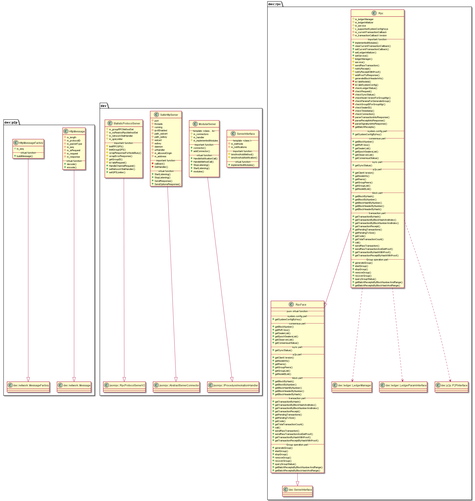

#  librpc 模块
作者：TrustChain [微信公众号]

librpc：客户端（如区块链浏览器）与区块链系统交互的一套协议和接口。


## 主要内容有：

+ 用户客户端通过RPC接口连接节点可查询区块链相关信息（如块高、区块、节点连接等）、发送交易；接受JSON-RPC格式的请求。



## 涉及知识点：

+ JsonHelper.cpp：从json解析出交易数据结构的字段；

+ StatisticProtocolServer.cpp：继承jsonrpc::RpcProtocolServerV2，m_groupRPCMethodSet存放可供客户端RPC调用的函数；

+ SafeHttpServer.cpp：继承jsonrpc::AbstractServerConnector，处理httpt json-rpc请求处理；支持POST、OPTIONS；

+ Rpc.cpp：实现JSON-RPC各个函数，供客户端调用；
```
//发送交易的rpc函数
std::string Rpc::sendRawTransaction(int _groupID, const std::string& _rlp,
    std::function<std::shared_ptr<Json::Value>(
        std::weak_ptr<dev::blockchain::BlockChainInterface> _blockChain,
        LocalisedTransactionReceipt::Ptr receipt, dev::bytesConstRef input,
        dev::eth::Block::Ptr _blockPtr)>
        _notifyCallback)
{
// Note: Since blockChain has a transaction cache, that is,
//       BlockChain holds transactions, in order to prevent circular references,
//       the callback of the transaction cannot hold the blockChain of shared_ptr,
//       must be weak_ptr
tx->setRpcCallback(
[weakedBlockChain, _notifyCallback, transactionCallback, clientProtocolversion,
    _groupID](LocalisedTransactionReceipt::Ptr receipt, dev::bytesConstRef input,
    dev::eth::Block::Ptr _blockPtr) {
}

//case ProtocolVersion::v1:
//case ProtocolVersion::v2:
ret = txPool->submitTransactions(tx);

//case ProtocolVersion::v3:
ret = txPool->submit(tx);

}
```
参考文献：

[1] https://github.com/FISCO-BCOS/FISCO-BCOS/releases/tag/v2.7.2

[2] https://fisco-bcos-documentation.readthedocs.io/zh_CN/latest/