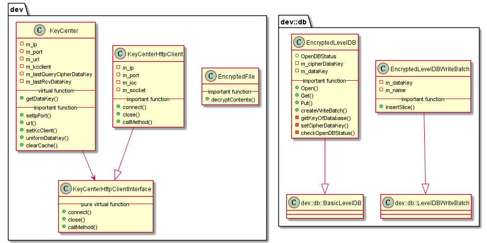

#  libsecurity 模块
作者：TrustChain [微信公众号]

libconfig：配置文件。

## 主要内容有：

+ 落盘加密：cipherDataKey、dataKey、superKey。

+ 节点用自己的dataKey，对自身加密的数据（Encrypted Space）进行加解密。

+ 节点本身不会在本地磁盘中存储dataKey，而是存储dataKey被加密后的cipherDataKey。

+ 节点启动时，拿cipherDataKey向Key Manager请求，获取dataKey。Key Manager持有全局的superKey，负责对所有节点启动时的授权请求进行响应，授权。

+ dataKey只在节点的内存中，当节点关闭后，dataKey自动丢弃。



## 涉及知识点：

+ EncryptedFile.cpp
```
//落盘文件内容解密--》dataKey
bytes EncryptedFile::decryptContents(const std::string& _filePath)
{
string encContextsStr = contentsString(_filePath);
encFileBytes = fromHex(encContextsStr);
auto dataKey = g_BCOSConfig.diskEncryption.dataKey;
string decFileBytesBase64 = crypto::SymmetricDecrypt((const unsigned char*)encFileBytes.data(), encFileBytes.size(), (const unsigned char*)dataKey.data(), dataKey.size(),
(const unsigned char*)dataKey.substr(0, 16).data());
decFileBytes = fromBase64(decFileBytesBase64);
}
```

+ EncryptedLevelDB.cpp
```
//存放leveldb的value的内容加密
leveldb::Status EncryptedLevelDB::Put(
    const leveldb::WriteOptions& _options, const leveldb::Slice& _key, const leveldb::Slice& _value)
{
enData = encryptValue(m_dataKey, _value);
m_db->Put(_options, _key, leveldb::Slice(enData));
}
//通过cipherDataKey获取datakey
string EncryptedLevelDB::getKeyOfDatabase()
{
    std::string key;
    leveldb::Status status = m_db->Get(leveldb::ReadOptions(), leveldb::Slice(c_cipherDataKeyName), &key);
    return key;
}
```

+ KeyCenter.cpp
```
//节点启动前需考虑是否落盘加密，一般不可变动状态，启动落盘加密时，会创建一个KeyCenterHttpClient连接部署在内网环境的Key Manager进行请求。一个keyCenter有一个superKey
Json::Value KeyCenterHttpClient::callMethod(const string& _method, Json::Value _params)
{
/*
 query is:
{"jsonrpc":"2.0","method":"encDataKey","params",["123456"],"id":83}
*/
}
```
参考文献：

[1] https://github.com/FISCO-BCOS/FISCO-BCOS/releases/tag/v2.7.2

[2] https://fisco-bcos-documentation.readthedocs.io/zh_CN/latest/